# Release Notes 18.0

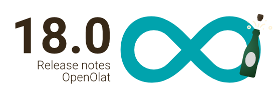

* * *

:material-calendar-month-outline: **Releasedatum: 12.07.2023 • Letztes Update: 03.08.2023**

* * *

Mit OpenOlat 18.0 (endlich volljährig! :fontawesome-solid-champagne-glasses:) geben wir unseren nächsten Major Release frei.

Im Fokus des Releases steht der neue Bereich **Projekte**, welcher OpenOlat Anwender:innen bei der Dokumentation von Projektarbeit unterstützt. Im neuen **blockbasierten Kursbaustein "Seite"** können mit dem **Content Editor** schnell und einfach strukturierte Kursinhalte zumsammengestellt werden. Die verwendeten Medienelemente wie Bilder, Videos und Dokumente sind im persönlichen Bereich zentral über das erweiterte **Medien Center** zugänglich, sie können dort verwaltet, versioniert und mit anderen Personen geteilt werden.

Neben vielen Usability-Anpassungen wurden für Kurse u.a. auch folgende Funktionen implementiert: ein Workflow zur **Kurs-Rezertifizierung** bei Ablauf von Zertifikaten, eine **Reportfunktion** über die Nutzung des Kursbausteins "Forum" sowie die Möglichkeit, Bewertungen mittels **Einstufungen/Noten auf Kursebene** im herkömmlichen Kurs zu vergeben.

Eine neue **Infrastruktur für "To-Dos"** kommt zum einen im Projekt-Tool zur Aufgabenverteilung zum Einsatz. Zum anderen können darüber notwendige **Massnahmen To-Dos** erstellt werden, die sich aus den Ergebnissen von Datenerhebungen im Qualitätsmanagement-Modul ergeben.

Mit der Integration des **OpenBadge**-Standards 2.0 können Badges manuell oder automatisch vergeben werden, wenn Teilnehmende zum Beispiel bestimmte Bedingungen in einem Kurs erfüllt haben. Für die Einbindung von Jupyter-Images wurde ein neuer **Kursbaustein "JupyterHub"** implementiert.

Der Release enthält ausserdem zahlreiche weitere Neuerungen wie eine eigene **E-Mail-Signatur** als Benutzerattribut sowie UX/Usability-Optimierungen für Wizards, Anzeigen und Aktionselemente.

Exkurs zum Schluss: Das Benutzerhandbuch wurde neu strukturiert.

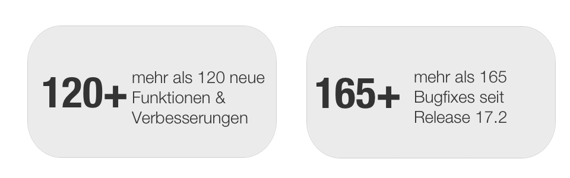

Seit Release 18.0 wurden über 120 neue Funktionen und Verbesserungen zu OpenOlat hinzugefügt. Hier finden Sie die wichtigsten Neuerungen zusammengefasst. Zusätzlich wurden mehr als 165 Bugs behoben. Die komplette Liste der Änderungen in 17.2 – 17.2.13 finden Sie [hier](Release_notes_17.2.de.md){:target="_blank”}.

* * *

## Projekt-Tool

Der neue Bereich "[Projekte](../manual_user/area_modules/Project_Overview.de.md)" bietet ein Werkzeug zur Unterstützung von Projektarbeit in OpenOlat. Der Schwerpunkt des Tools liegt auf der Dokumentation eines Projektes mit Hilfe von Dokumenten und Dateien, Terminen, Aufgabenmanagement und einer Timeline zur Visualisierung der Entscheidungen und Ereignisse während der Projektlaufzeit.

Die Zugriffsbeschränkungen - und somit auch die Verantwortlichkeiten im Projekt - können über die verschiedenen Rollen der Projektmitglieder gesteuert werden.

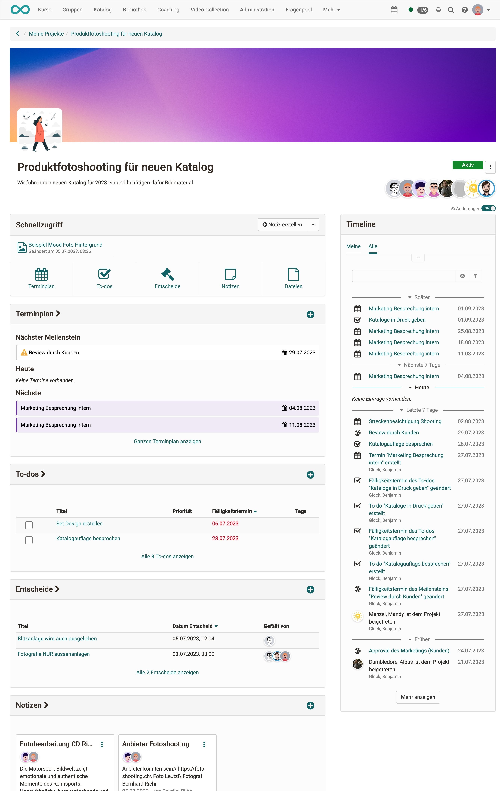{ class="shadow lightbox" title="Projekt im Überblick mit Schnellzugriff" }

### Verfügbare Tools im Projekt

* *Dateien* zur Ablage und Pflege verschiedener Dokumente und Medienelemente
* *Notizen* für Stichworte und kurze Memos
* *To-Dos* zur Verteilung der Aufgaben innerhalb des Pojektes
* *Termine* für Meetings und gemeinsamen Austausch
* *Timeline* für eine transparente und übersichtliche Darstellung aller Aktivitäten
* *Entscheide* zur Dokumentation wichtiger Entscheidungen und Ergebnisse im Projekt

Über ein Aktivitätslog werden Änderungen nachvollziehbar ausgewiesen.

Ein Projekt kann von den Projektbeteiligten abonniert werden, um bei neuen Einträgen und Änderungen enstprechend informiert zu werden.

Mit Hilfe von Projekt-Templates können beispielsweise für Lernende auch strukturierte Vorlagen für eigene Projekte bereitgestellt werden.

### "To-Dos" Infrastruktur

In OpenOlat wurde eine neue Infrastruktur aufgebaut zur Erfassung, Bearbeitung und Verwaltung von To-Dos. In Release 18.0 kommen sie im Projekt-Tool und zur Abbildung von [QM-Massnahmen](#actions) zum Tragen. To-Dos können priorisiert und an andere Personen delegiert werden. Überfällige To-Dos werden entsprechend gekennzeichnet. Der Einsatz der To-Dos soll noch ausgebaut und zukünftig z.B. auch in Kursen oder für persönliche Zwecke möglich sein.

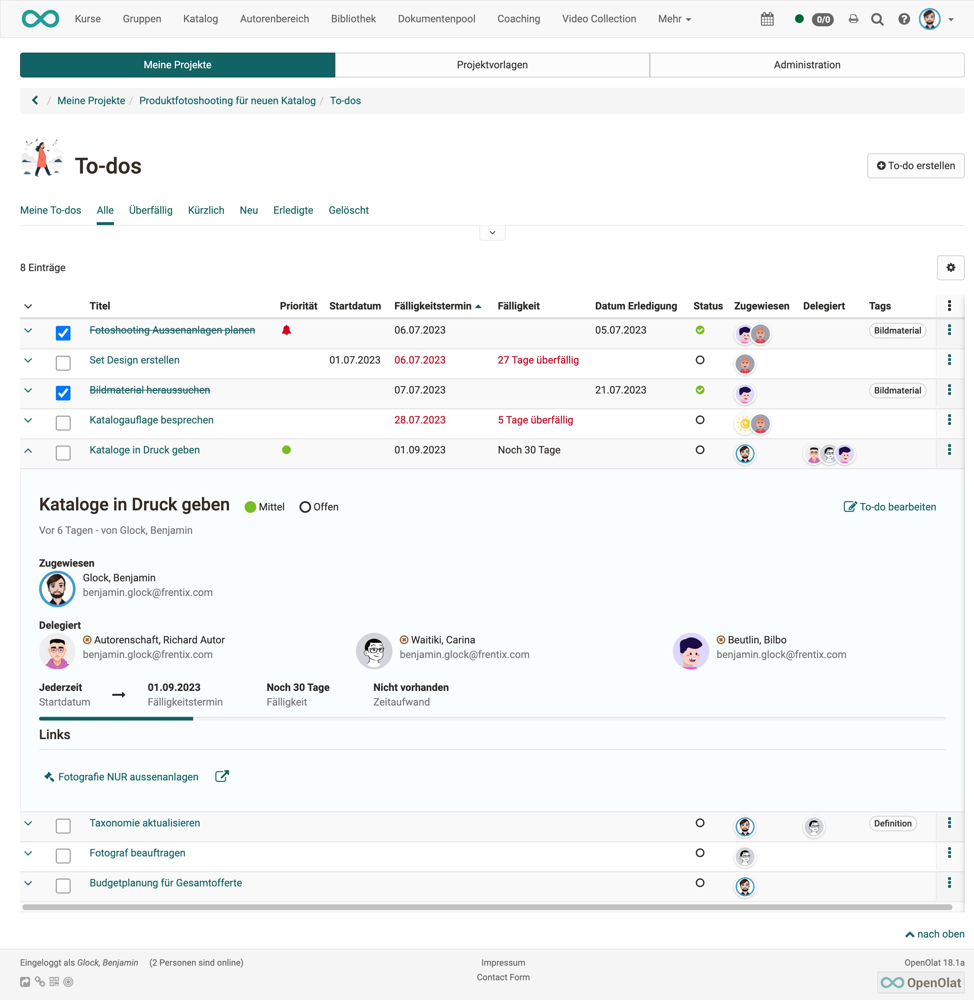{ class="shadow lightbox" title="To-Dos in einem Projekt" }

* * *

## Medien Center

Bei der Erstellung von Inhalten mit dem Content Editor (s. neue "Seite") ist eine strukturierte Verwaltung und einfache Freigabe von Dokumenten, Bildern und Medienelementen sehr wichtig. Als zentraler Ort zum Anlegen, Hochladen und Pflegen wiederverwendbarer Medienelemente dient das neue Medien Center, welches aus der bisherigen ePortfolio-Mediathek hervorgeht.

Neu ist eine Versionierung der Medienelemente möglich zur Nachverfolgung von Aktualisierungen. Es können eine Reihe relevanter Metadaten erfasst, eine Lizenz hinterlegt sowie individuelle Tags vergeben werden. Zudem wurde eine Infrastruktur geschaffen, die die Freigabe und das gezielte Teilen von Medienelementen mit anderen Personen auf dem OpenOlat-System unterstützt.

Die bereits erstellten Medienelemente werden in der Tabellen- oder Compact Card Ansicht angezeigt. Für jedes Element wird ausgewiesen, in welchem Kontext (Kurs, ePortfolio) dieses bereits verwendet wird und welche Freigaben an andere Personen (einzeln, Gruppen, kursweit, organisationsweit) bestehen.

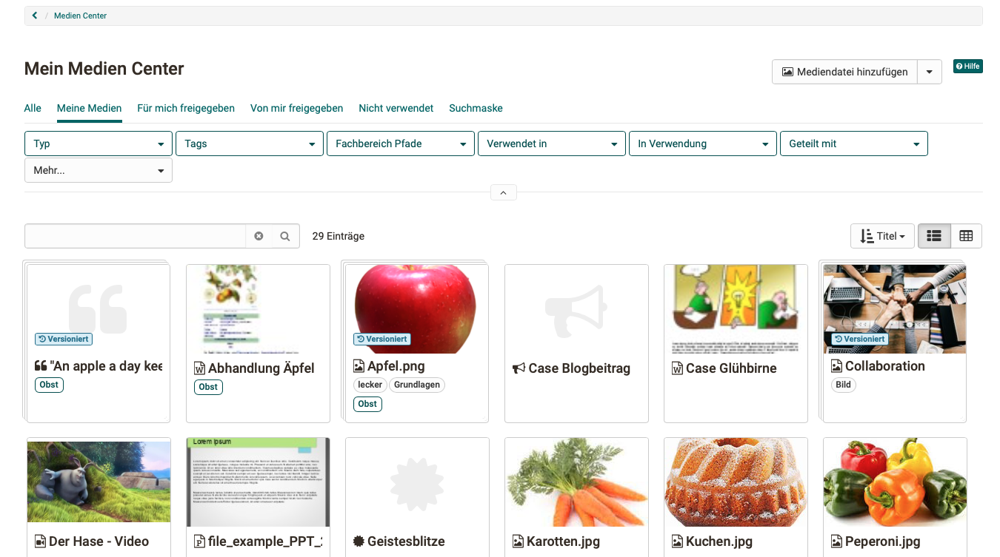{ class="shadow lightbox" title="Mein Medien Center" }

* * *

## OpenBadges (Beta)

!!! info "Beta-Stadium"

    Diese Funktion befindet sich im Beta-Stadium und wird in den Folge-Releases erweitert.

OpenOlat unterstützt ab Release 18.0 den OpenBadges-Standard 2.0 von IMS: <https://imsglobal.org/activity/openbadges>

Dieser ermöglicht die Konfiguration und Verwaltung von [Badges und Bagde-Vorlagen](../manual_admin/administration/e-Assessment_openBadges.de.md), welche systemweit (global) oder auf Kursebene zur Verfügung gestellt werden können.

Im Kurs erhalten Teilnehmende automatisch oder manuell einen Badge, sobald die definierten Bedingungen zur Austellung des Badges erfüllt sind (analog zur Austellung eines Kurszertifikats). Globale Badges können manuell vom Administrator ausgestellt werden.

Badges können mit einer Gültigkeitsdauer versehen werden. Abgelaufene Badges sind mit dem Status "Widerrufen" gekennzeichnet. Gültige Badges können auch manuell widerrufen werden.

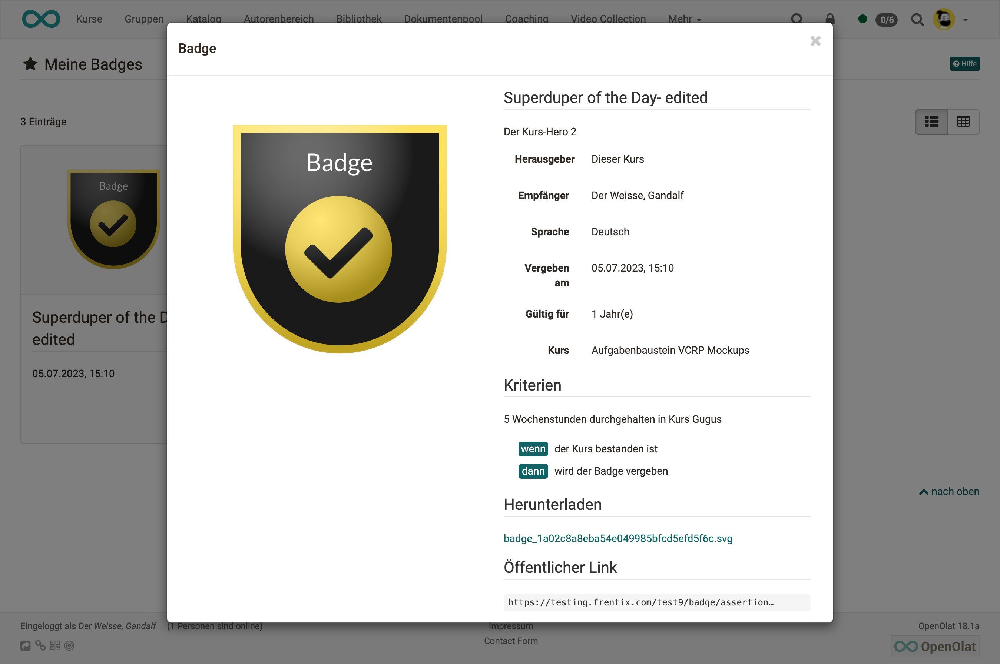{ class="shadow lightbox" title="Detailseite eines Badges" }

Erhaltene Badges sind im persönlichen Menü unter "Bagdes" zugänglich, sie können dort verwaltet, exportiert oder über einen öffentlichen Link geteilt werden.

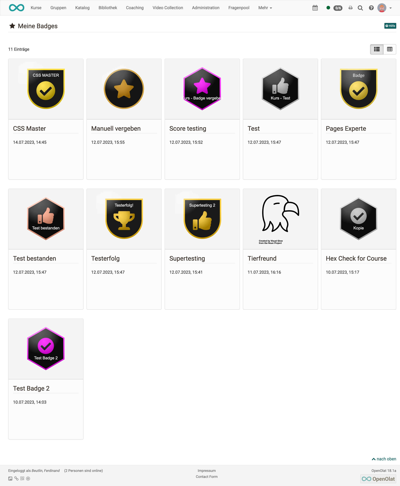{ class="shadow lightbox" title="Meine Badges" }

* * *

## Neues rund um Kurse

### Neuer Kursbaustein "Seite"

Der neue Kursbaustein "Seite" bietet neben der "HTML-Seite" (ehemals "Einzelseite") eine weitere Möglichkeit, auf einfache Art Inhalte in Kursen aufzubereiten und bereitzustellen.

Der blockbasierte Ansatz wird bereits für die Erstellung von Formular-Lernressourcen und Portfolio-Einträgen verwendet. Es stehen verschiedene Layout-Varianten zur Auswahl, in denen die gewünschten Elemente wie z.B. Bilder, Texte, Tabellen und Videos flexibel platziert und so die gesamte Seite gestaltet werden kann. Die Seite kann von Kurs-Besitzer:innen oder optional von Betreuenden bearbeitet werden.

Zur Verwaltung und Freigabe der integrierten Medienelemente im Kurs steht das Medien Center zur Verfügung.

=== "Bearbeitungsmodus"

    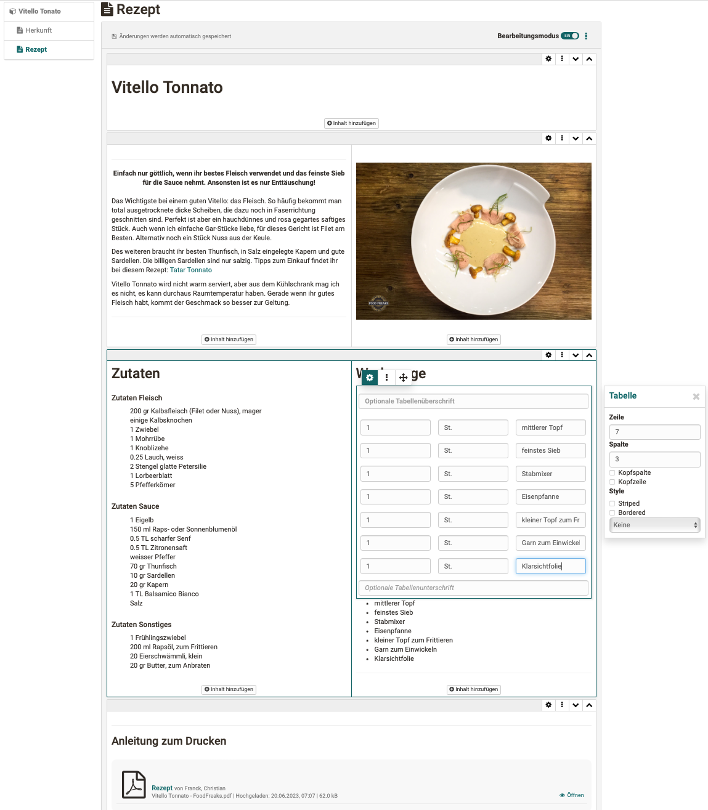{ class="shadow lightbox" }

=== "Ansicht im Kurs"

     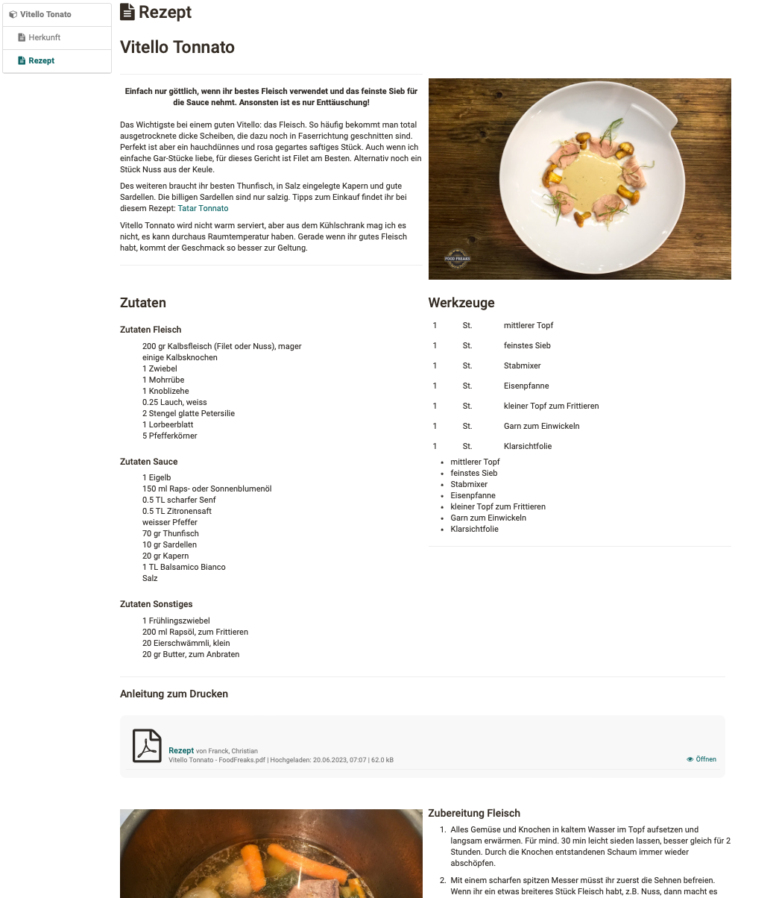{ class="shadow lightbox" }

### Neuer Kursbaustein "JupyterHub" (Beta)

!!! info "Beta-Stadium"

    Diese Funktion befindet sich im Beta-Stadium. Wir freuen uns auf den Austausch mit Interessierten zu allfälligen Anwendungsszenarien. Anfragen nehmen wir gerne unter [support@frentix.com](mailto:support@frentix.com) entgegen.

[JupyterHub](https://jupyter.org/hub) bietet zahlreiche Möglichkeiten für Online-Lernszenarien. Der neue Kursbaustein dient der Bereitstellung von Jupyter-Images für Lernende und bietet somit Gelegenheit für zusätzliche sowie sehr spezifische Arten von Aufgabenstellungen.

### Optimierung Kursbaustein "Dateidiskussion"

Der Kursbaustein "Dateidiskussion" wurde funktional und visuell überarbeitet für eine benutzerfreundliche und attraktive Verwendung.

Optimiert wurden:

* Wizard für Datei-Upload inkl. Erfassung ergänzender Metadaten
* Neue Compact Card View mit Datei-Vorschau für bestehende Dateidiskussionen
* Anzeige relevanter Metadaten sowie der Anzahl vorhandener Themen und Beiträge in der Compact Card View und innerhalb der einzelnen Dateidiskussion

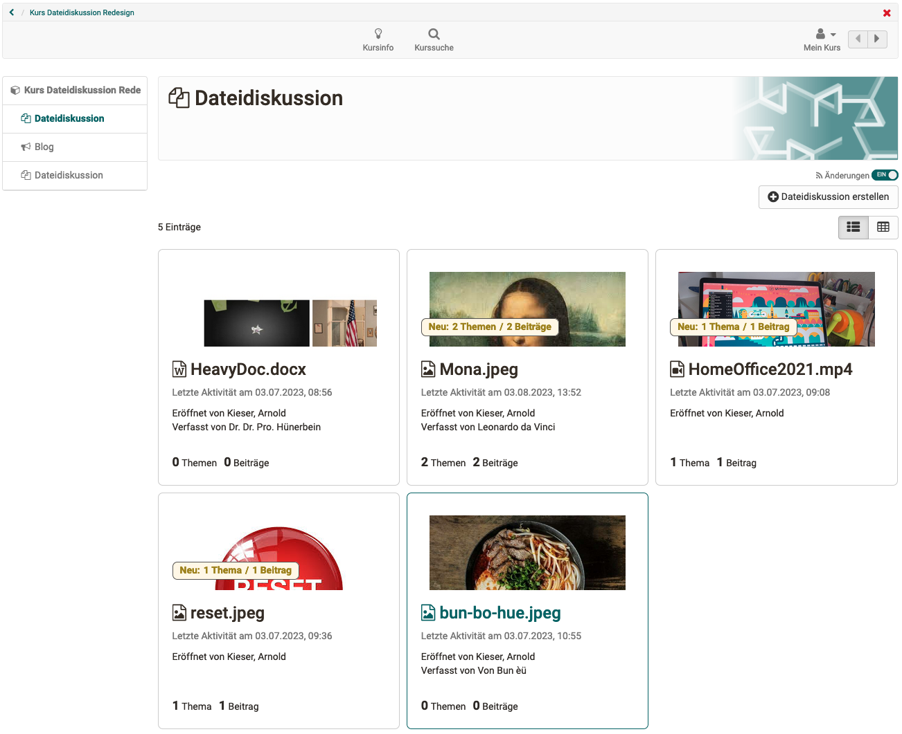{ class="shadow lightbox" title="Neues Design für Dateidiskussion" }

### Einstufung/Noten auf Kursebene (Herkömmlicher Kurs)

Die Umwandlung kursinterner Punkte in eine textuelle Einstufung (z.B. Niveau) oder Note konnte bisher nur direkt am bewertbaren Kursbaustein erfolgen. Mit Release 18.0 ist dies auch für den gesamten Kurs möglich. Dabei wird entweder die Gesamtpunktzahl oder der Punktedurchschnitt ausgewählter bewertbarer Kursbausteine anhand einer Bewertungsskala entsprechend überführt.

Ist die Bewertung mit Einstufung/Noten auf dem obersten Kursknoten aktiviert, so wird die Berechnung von "Bestanden / Nicht bestanden" am Kurs über die Bewertungsskala gesteuert. Die Umwandlung der Punkte auf Kursebene erfolgt im Bewertungswerkzeug für alle, ausgewählte oder einzelne Teilnehmende und kann nur manuell vorgenommen werden.

Die Einstufung/Note ist dann ensprechend in der Leistungsübersicht der Teilnehmenden und im Bewertungswerkzeug sichtbar.

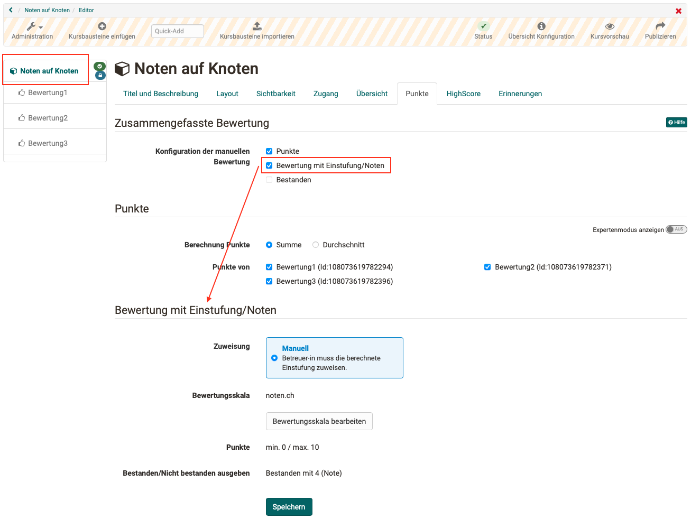{ class="shadow lightbox" title="Punkte auf Kursebene umwandeln" }

### Rezertifizierung

Für Kurse, die nach der Absolvierung ein Zertifikat für die Teilnehmenden bereitstellen, wurde ein Prozess zur Abwicklung der Rezertifizierung umgesetzt. Bei Ablauf der Gültigkeit eines erhaltenen Zertifikats kann der Kurs zurückgesetzt werden. Dadurch können Teilnehmende den Kurs erneut durchlaufen und das Zertifikat wird bei Abschluss des Kurses erneuert.

Teilnehmende werden vor Ablauf ihres bestehenden Zertifikates per E-Mail informiert, um rechtzeitig die Rezertifizierung anzustossen. Sie erhalten ebenfalls eine Erinnerungsmail an dem Tag, an dem das vorhandene Zertifikat abgeläuft.

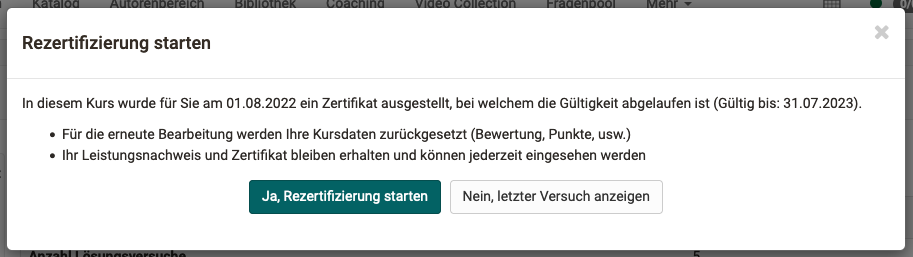{ class="shadow lightbox" title="Start der Kurs-Rezertifizierung" }

### Report zur Forennutzung

Für den Kursbaustein "Forum" wurde eine Reportfunktion zur Analyse der Forennutzung im Kurs umgesetzt. Die Funktion wird über die Datenarchivierung im Kurs aufgerufen. Der exportierte Bericht enthält neben dem Titel des Bausteins, der Foren-Threads und Beiträge auch Angaben zum Ersteller (Name, Organisationszugehörigkeit) sowie Erstell- und Änderungsdaten der Einträge. Ausserdem werden Wort- und Zeichenanzahl analog zum GUI ausgewiesen.

Filter ermöglichen vorab eine Einschränkung der Daten für den Export auf bestimmte Zeiträume oder auch Organisationen.

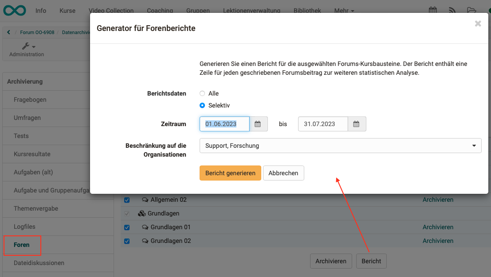{ class="shadow lightbox" title="Report zur Forennutzung starten" }

### Weitere Neuerungen im Kurs

* Mitteilungsbaustein: Planung von Mitteilungen durch Angabe eines Veröffentlichungsdatums inkl. Uhrzeit
* Lernpfadkurs: Aktion "Daten zurücksetzen" für Betreuende erlauben
* UX / Usability:
    * Kursbaustein "Übung": Anzeige- und Textoptimierungen, Hinweis bei wiederholten Fragen
    * Kursbaustein "Mitteilung": Optimierte Auswahl des Empfängerkreises für den Versand der Mitteilung per Abo / E-Mail
    * Optimierung der Einstellungen zur E-Mail-Benachrichtigung im Assistenten "Mitglieder hinzufügen"
    * Terminplanungsbaustein: Neues Filterkonzept für Termine sowie Ergänzung weiterer Filter wie Status, Freie Plätze und Vergangene Termine

### Weitere Neuerungen im Bereich eAssessment

* Exportfunktion für Quiz-Fragen aus dem Video-Editor in den Fragenpool
* Bewertungswerkzeug: Statusanzeige auf Kursknoten und Kursbaustein "Struktur" entfernt

* * *

## Massnahmen (To-Dos) im Qualitätsmanagement-Modul {: #actions}

Nach der Erfassung von Feedback im Qualitätsmanagement-Modul ist es wichtig, sich aktiv mit den Resultaten auseinanderzusetzen und anschliessend erforderliche Folgeaktionen festzusetzen.

Mit Hilfe der neuen To-Do Infrastruktur kann direkt mit entsprechenden Massnahmen auf die Ergebnisse von Datenerhebungen oder einer bestimmten Teilnehmerbefragung reagiert werden. Notwendige To-Dos können kontextbezogen angelegt und direkt an die betreffenden Personen delegiert werden. Diese werden per E-Mail über ein neues To-Do informiert. Alle To-Dos stehen im neuen Bereich "Massnahmen To-Dos" zur Verfügung.

* * *

## Rund um UX / Usability

* Bereich "Gruppen": Optimierung der Sammelaktionen und Ergänzung der Aktion "Reaktivieren"
* Konstistente Verwendung von Icons für Nutzungsbedingungen
* Anzeige der vier gängigsten Dateiformate zur Auswahl beim Erstellen neuer Dokumente

* * *

## Accessibility Initiative

* Refactoring des Radiobutton-Elements (neu: Toggle) und Optimierung für Tastatur-Interaktion

* * *

## Weiteres, kurz notiert

* E-Mail-Signatur als Benutzerattribut zur Verwendung bei Mails aus dem E-Mail-Baustein, der Teilnehmendenliste und der Kurs-Mitgliederverwaltung
* Löschen von Kursen und Gruppen: Bereinigung von Mitgliedschaften mit "Bestätigung ausstehend"
* QM-Modul: E-Mail an definierte Empfänger mit qualitativem Feedback aus Datenerhebungen (Antworten über Freitext- und Upload-Felder im Feedback-Formular)
* TinyMCE: Fortschrittsbalken bei Video-Upload
* Gemeinsame CSS-Klasse für das Element "Compact Card"
* Ereignisabwicklung beim Speichern mit dem Dokumenteditor (Versand von Multi-User-Ereignissen)

* * *

## Technisches

* Neue Struktur für das Benutzerhandbuch
* ImageViewer als Teil der DocEditor-Infrastruktur (Unterstützung von Mode.VIEW)
* Integration der JavaScript-Library "milkdown" zur Text-Bearbeitung mit Markdown (verfügbar im Projekte Notiz-Tool)

* * *

## Systemadministratoren: Neue Funktionen aktivieren / konfigurieren

!!! note "Checkliste nach Update auf 18.0"

    Folgende Funktionen müssen nach einem Update auf Release 18.0 in der `Administration` aktiviert bzw. konfiguriert werden:

    * [x] Modul "Projekte" (inkl. Konfiguration der Berechtigungen): `Module > Projekte` und `Customizing > Sites`
    * [x] Modul "OpenBadges": `e-Assessment > OpenBadges`
    * [x] Medien Center:
        * Einsatz von Lizenzen: `Core Konfiguration > Lizenzen`
        * Verknüpfung mit Taxonomie: `Module > Medien Center`
    * [x] Persönliche Werkzeuge: `Core Konfiguration > Badges` bzw. `Medien Center` aktivieren
    * [x] Massnahmen für Qualitätsmanagement: `Module > Qualitätsmanagement` - Abschnitt "Massnahmen To-Dos"
    * [x] Kursbaustein "JupyterHub": `Externe Werkzeuge > JupyterHub`

* * *

## Weitere Informationen

* [Jira Release Notes 18.0.3](https://jira.openolat.org/secure/ReleaseNote.jspa?projectId=10000&version=21301){:target="_blank”}
* [Jira Release Notes 18.0.2](https://jira.openolat.org/secure/ReleaseNote.jspa?projectId=10000&version=21201){:target="_blank”}
* [Jira Release Notes 18.0.1](https://jira.openolat.org/secure/ReleaseNote.jspa?projectId=10000&version=21002){:target="_blank”}
* [Jira Release Notes 18.0.0](https://jira.openolat.org/secure/ReleaseNote.jspa?projectId=10000&version=19500){:target="_blank”}
