# Release notes 18.0

* * *

:material-calendar-month-outline: **Release date: 07/12/2023 • Last update: 08/03/2023**

* * *

With OpenOlat 18.0 (finally of age! :fontawesome-solid-champagne-glasses:) we release our next major release.

The focus of the release is the new **Projects** area, which supports OpenOlat users in documenting project work. In the new **block-based course element "Page"**, structured course content can be compiled quickly and easily with the **Content Editor**. The media elements used, such as images, videos and documents, can be accessed centrally in the personal area via the extended **Media Center**, where they can be managed, versioned and shared with other people.

In addition to many usability adjustments, the following functions have also been implemented for courses: a workflow for **course recertification** when certificates expire, a **report function** on the use of the "Forum" course element, and the option of assigning gradings by means of **gradings/marks at course level** in the conventional course.

A new **infrastructure for "To-Dos"** is used on the one hand in the project tool for task distribution. On the other hand, it can be used to create necessary **action to-dos** resulting from the findings of data collections in the quality management module.

With the integration of the **OpenBadge** standard 2.0, badges can be awarded manually or automatically when participants have fulfilled certain conditions in a course, for example. For the integration of Jupyter images, a new **course module "JupyterHub "** has been implemented.

The release also includes numerous other new features such as a custom **email signature** as a user attribute as well as UX/usability optimizations for wizards, displays and action elements.

Last but not least: The user manual has been restructured.

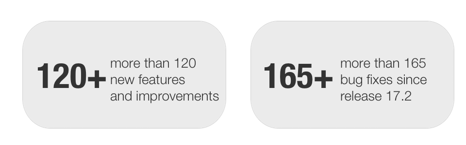

Since release 18.0, over 120 new features and improvements have been added to OpenOlat. Here you can find the most important new features and changes. In addition, more than 165 bugs have been fixed. The complete list of changes in 17.2 - 17.2.13 can be found [here](Release_notes_17.2.md){:target="_blank”}.

* * *

## Project-Tool

The new "Projects" module provides a tool to support project work in OpenOlat. The focus of the tool is on documenting a project using documents and files, appointments, task management and a timeline for visualizing decisions and events during the project.

The access restrictions - and therefore the responsibilities in the project - can be controlled by the different roles of the project members.

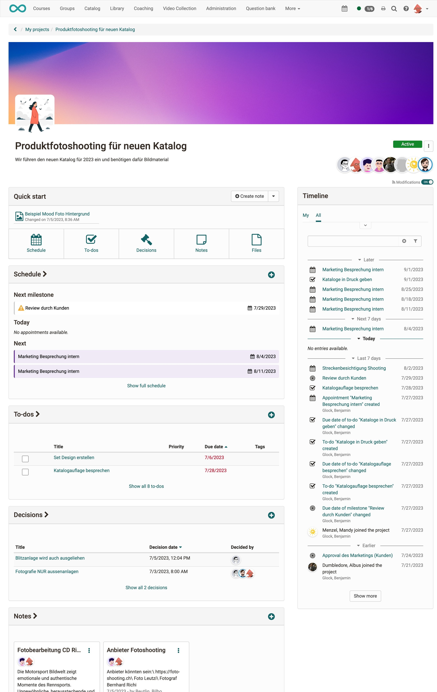{ { class="shadow lightbox" title="Project at a glance with quick start" }

### Available tools in the project

* *Files* for storing and maintaining various documents and media items
* *Notes* for keywords and short memos
* *To-Dos* for the distribution of tasks within the project
* *Appointments* for meetings and joint exchanges
* *Timeline* for a transparent and clear representation of all activities
* *Decisions* for documenting important decisions and results in the project

An activity log provides a traceable record of changes.

Project participants can subscribe to a project in order to be informed of new entries and changes.

With the help of project templates, structured samples for own projects can be provided for learners, for example.

### "To-Dos" Infrastructure

A new infrastructure has been built in OpenOlat for creating, editing and managing to-dos. In Release 18.0, they are used in the project tool and for tracking [QM actions](#actions). To-dos can be prioritized and delegated to other people. Overdue to-dos are marked accordingly. The use of the to-dos is to be further expanded and in the future will also be possible, for example, in courses or for personal purposes.

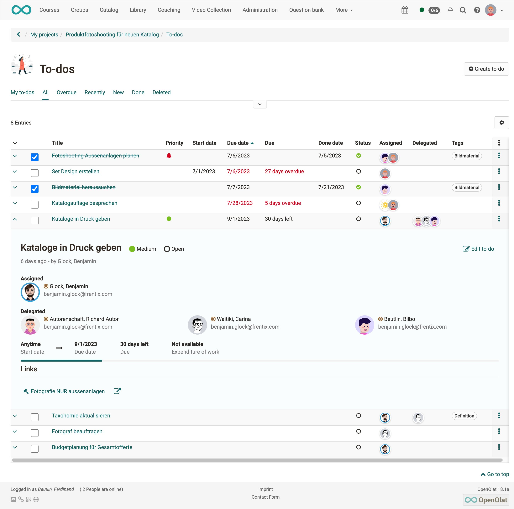{ class="shadow lightbox" title="To-dos in a project" }

* * *

## Media center

When creating content with the Content Editor (see new “Page"), structured management and easy sharing of documents, images and media elements is very important. As a central place to create, upload and maintain reusable media items serves the new Media Center, which emerges from the previous ePortfolio Media center.

Versioning of media items is now possible for tracking updates. A range of relevant metadata can be entered, a license can be stored, and individual tags can be assigned. In addition, an infrastructure has been created to support the release and targeted sharing of media items with others on the OpenOlat system.

The media elements already created are displayed in the table or compact card view. For each element it is shown in which context (course, ePortfolio) it is already used and which shares to other persons (individual, groups, course-wide, organization-wide) exist.

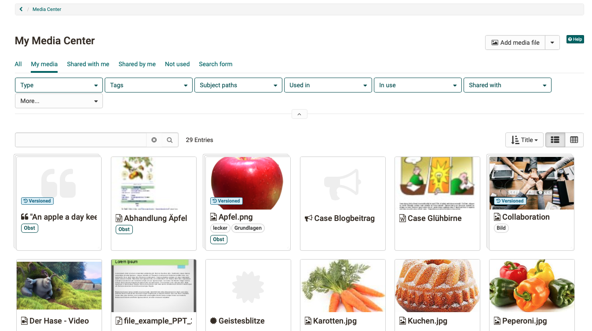{ class="shadow lightbox" title="My Media Center" }

* * *

## OpenBadges (Beta)

!!! info "beta stage"

    This feature is in beta stage and will be further developed in subsequent releases.

OpenOlat supports the OpenBadges standard 2.0 from IMS starting with release 18.0: <https://imsglobal.org/activity/openbadges>

This allows the configuration and management of badges and bagde templates, which can be made available system-wide (globally) or on course level.

In the course, participants receive a badge automatically or manually as soon as the defined conditions for issuing the badge are met (analogous to issuing a course certificate). Global badges can be assigned manually by the administrator.

Badges can be given a validity period. Expired badges are marked with the status "Revoked". Valid badges can also be revoked manually.

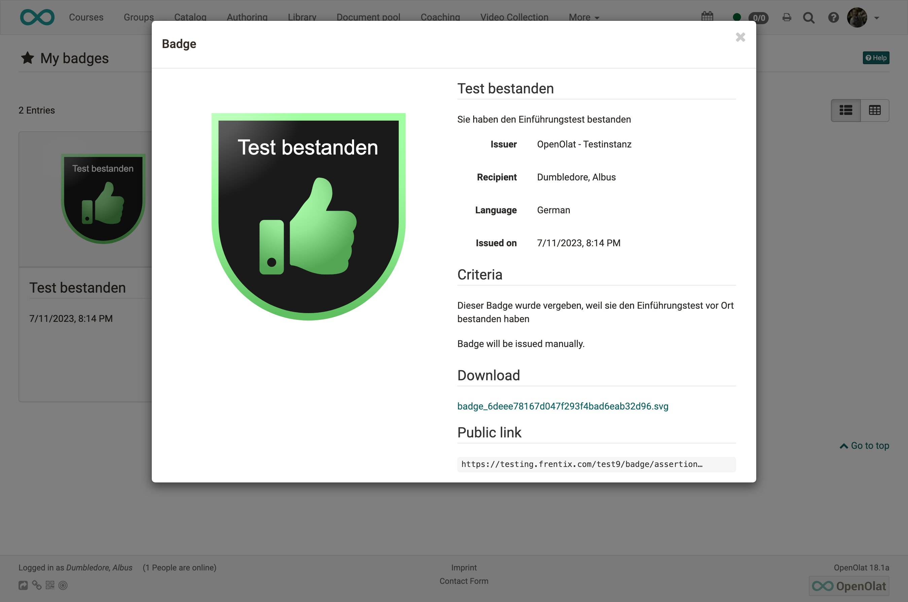{ class="shadow lightbox" title="Badge detail page" }

Received badges are accessible in the personal menu under "Bagdes", they can be managed there, exported or shared via a public link.

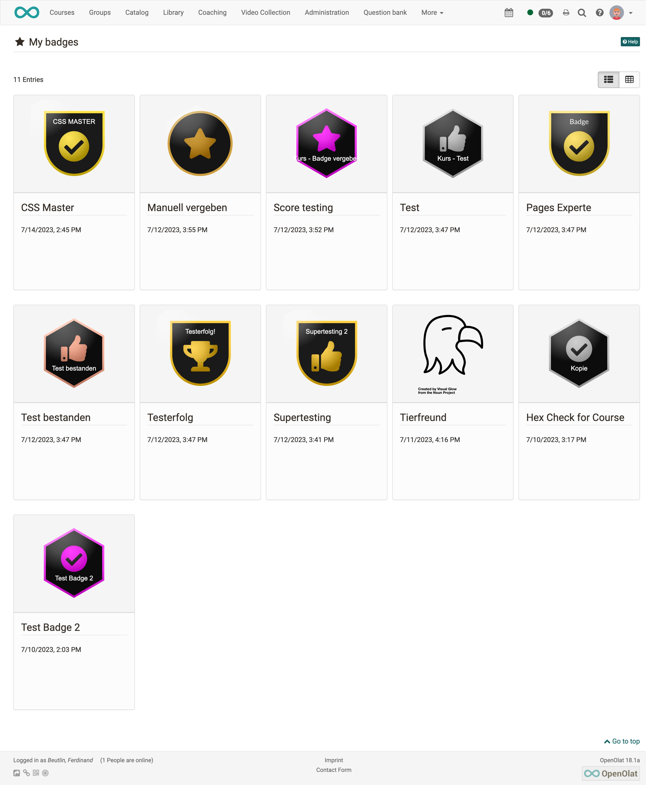{ class="shadow lightbox" title="My received badges" }

* * *

## New features in the course

### New course element "Page"

In addition to the "HTML page" (formerly "Single page"), the new course element "Page" offers another way to easily prepare and provide content in courses.

The block-based approach is already used for the creation of form learning resources and portfolio entries. Different layout variants are available in which the desired elements such as images, texts, tables and videos can be flexibly placed and thus the entire page can be designed. The page can be edited by course owners or optionally by coaches.

The Media Center is available for managing and sharing the integrated media elements in the course.

=== "Edit mode"

    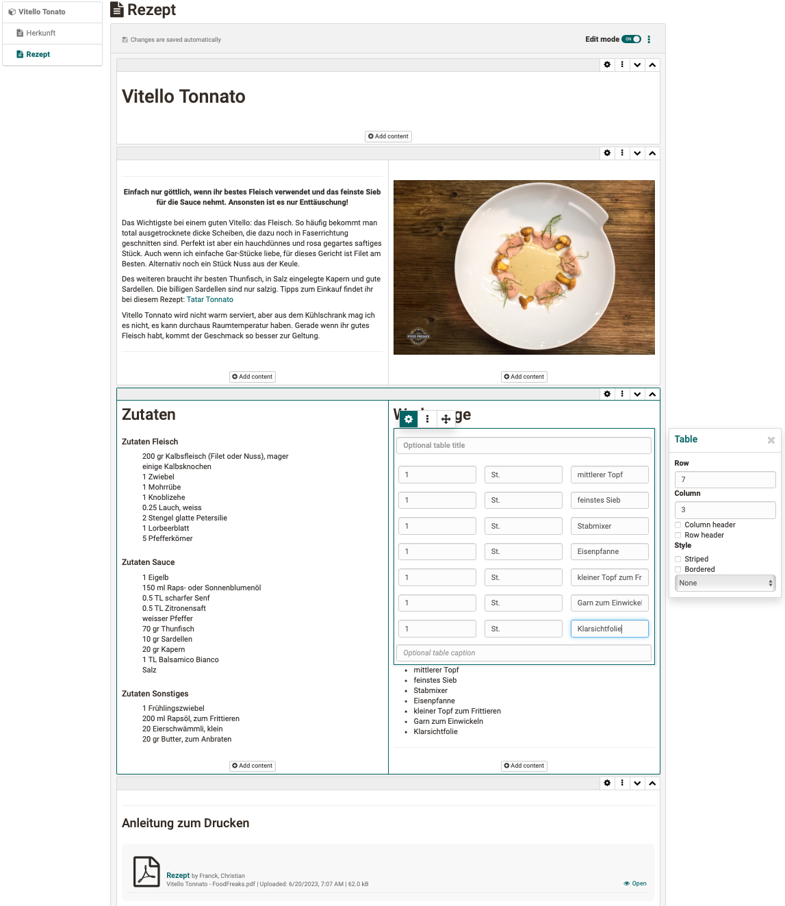{ class="shadow lightbox" }

=== "View in course"

    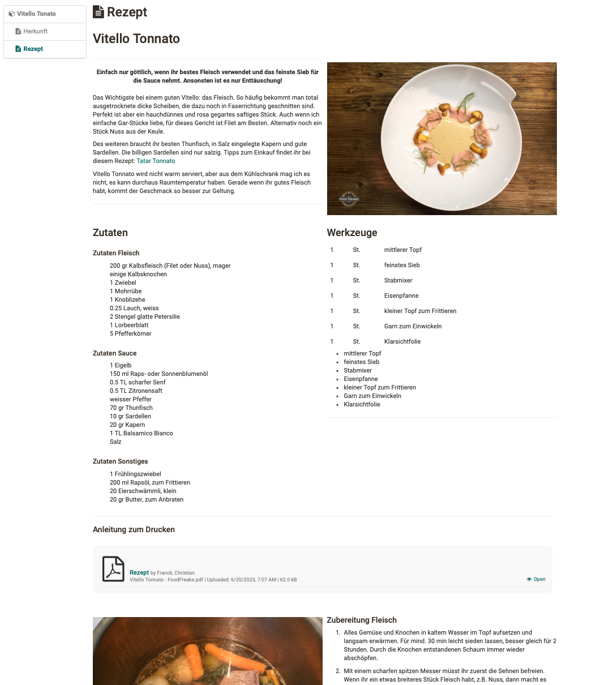{ class="shadow lightbox" }

### New course element "JupyterHub" (beta)

!!! info "beta stage"

    This feature is in beta stage. We look forward to exchanging ideas with interested parties on possible usage scenarios. We are happy to receive inquiries at [support@frentix.com](mailto:support@frentix.com).

[JupyterHub](https://jupyter.org/hub) offers numerous possibilities for online learning scenarios. The new course element serves to provide Jupyter images for learners and thus offers opportunities for additional as well as very specific types of assignments.

### Optimization of course element "File dialog"

The course element "File dialog" has been functionally and visually revised for a user-friendly and attractive use.

Optimized were:

* Wizard for file upload including collection of supplementary metadata
* New Compact Card View with file preview for existing file discussions
* Display of relevant metadata as well as the number of existing topics and posts in the Compact Card View and within the individual file dialog

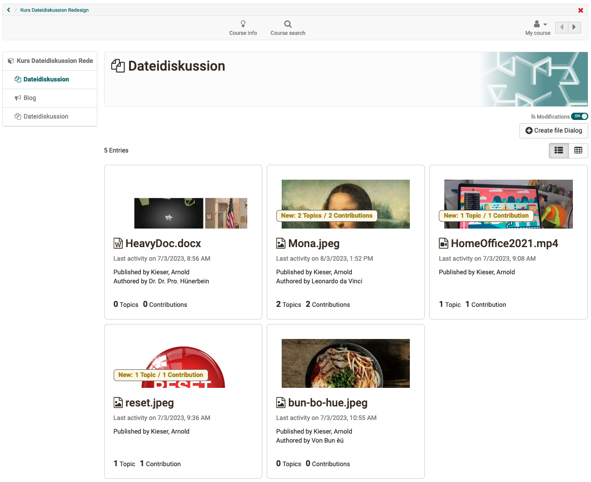{ class="shadow lightbox" title="New desgn for file dialog" }

### Conversion of points on course level (Traditional course)

The conversion of course-internal points into a textual classification (e.g. level) or grade could previously only be done directly on the assessable course element. With Release 18.0, this is also possible for the entire course. Either the total number of points or the average of points of selected assessable course elements is transferred accordingly on the basis of an assessment scale.

If the assessment with levels/gradings is activated on the top course node, the calculation of "Passed / Not passed" on the course is controlled by the assessment scale. The conversion of points on course level is done in the assessment tool for all, selected or individual participants and can only be done manually.

The classification/grade is then visible accordingly in the performance overview of the participants and in the assessment tool.

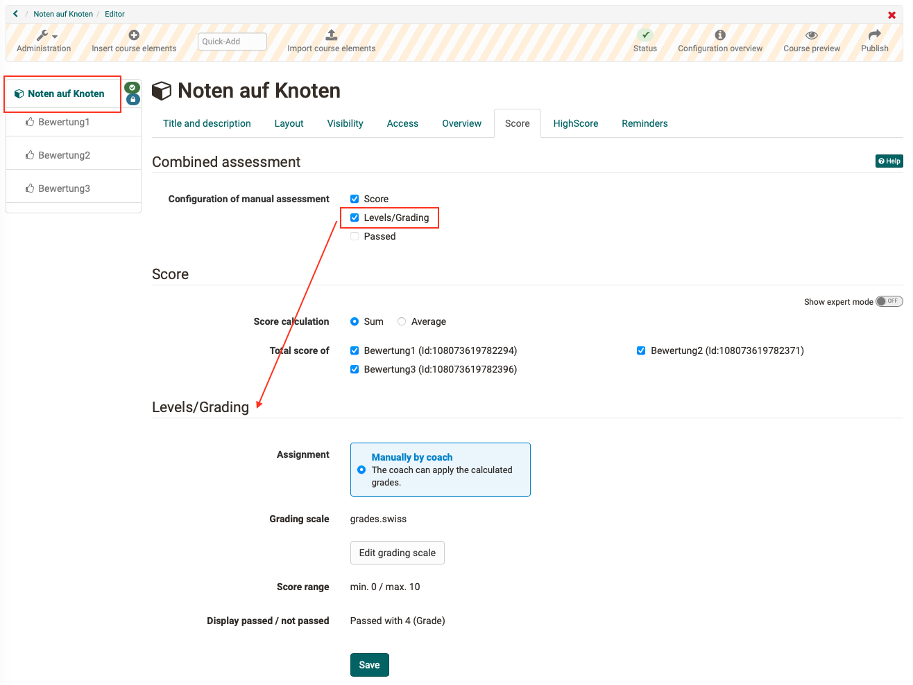{ class="shadow lightbox" title="Convert points on course level" }

### Recertification

For courses that provide a certificate for participants upon completion, a process for handling recertification has been implemented. When the validity of a certificate received expires, the course can be reset. This allows participants to go through the course again and the certificate will be renewed upon completion of the course.

Participants will be notified by email prior to the expiration of their existing certificate to initiate recertification in a timely manner. They will also receive a reminder email on the day the existing certificate expires.

{ class="shadow lightbox" title="Start of a course recertification" }

### Report on forum usage

For the course element "Forum" a report function has been implemented to analyze forum usage in the course. The function is called up via data archiving in the course. The exported report contains the title of the course element, the forum threads and posts as well as information on the creator (name, organizational affiliation) and the creation and modification dates of the entries. In addition, the number of words and characters is displayed in the same way as in the GUI.

Filters allow to limit the data for export to certain time periods or organizations.

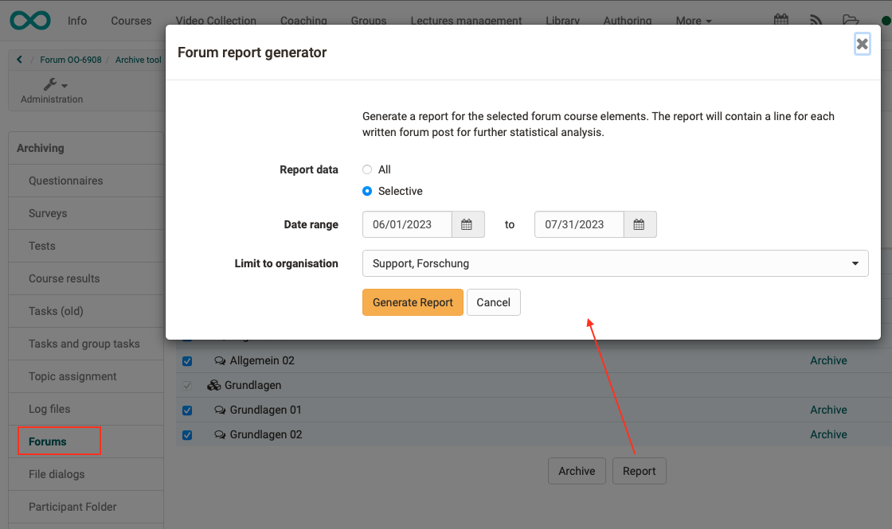{ class="shadow lightbox" title="Start report on forum usage" }

### Further improvements in the course

* Notification course element: Scheduling of notifications by specifying a publication date incl. time
* Learning path course: Allow action "Reset data" for coaches
* UX / Usability:
    * Course element "Practice": display and text optimizations, hint in case of repeated questions
    * Course element "Notification": Optimized selection of recipient group for sending the notification via subscription / e-mail
    * Optimization of settings for e-mail notification in the wizard "Add members"
    * Appointment scheduling element: New filter concept for appointments as well as addition of further filters such as status, free places and past appointments

### Further improvements in the area of eAssessment

* Export function for quiz questions from Video editor to question pool
* Assessment tool: status display on course nodes and course element "Structure" removed

* * *

## Actions (To-Dos) in the Quality Management Module {: #actions}

After collecting feedback in the quality management module, it is important to actively address the results and then determine necessary follow-up actions.

With the help of the new To-Do infrastructure, it is possible to react directly to the results of data collection or a specific participant survey with appropriate actions. Necessary to-dos can be created contextually and delegated directly to the relevant persons. They are informed about a new to-do by e-mail. All to-dos are available in the new "Actions To-Dos" area.

* * *

## All around UX / Usability

* "Groups" section: optimization of bulk actions and addition of the "Reactivate" action
* Constant use of icons for terms of use
* Display of the four most common file formats for selection when creating new documents

* * *

## Accessibility Initiative

* Refactoring of the radio button element (new: toggle) and optimization for keyboard interaction

* * *

## Further, briefly noted

* Email signature as user attribute to be used for mails from the email course element, the participant list and the course member management
* Deletion of courses and groups: Cleanup of memberships with “Acceptance pending"
* QM module: Email to defined recipients with qualitative feedback from data collections (responses via free text and upload fields in feedback form)
* TinyMCE: progress bar for video uploads
* Common CSS class for the "Compact Card" element
* Event handling when saving using the document editor (sending multi-user events)

* * *

## Technical

* New structure for the user manual
* ImageViewer as part of the DocEditor infrastructure (Mode.VIEW support)
* Integration of the JavaScript library "milkdown" for text editing with Markdown (available in the projects tool “Notes")

* * *

## System administrators: Activate / configure new functions

!!! note "Checklist after update to 18.0"

    The following functions have to be activated / configured in the `Administration` after an update to release 18.0:

    * [x] Module "Projects" (incl. configuration of permissions): `Modules > Projects` and `Customizing > Sites`
    * [x] Module "OpenBadges": `e-Assessment > OpenBadges`
    * [x] Media Center:
        * Use of licenses: `Core Configuration > Licenses`
        * Link to taxonomy: `Modules > Media Center`
    * [x] Activate personal tools: `Core Configuration > Badges` or `Media Center`
    * [x] Actions for Quality Management: `Modules > Quality Management` - section "Actions To-Dos"
    * [x] Course element "JupyterHub": `External Tools > JupyterHub`

* * *

## More information

* [Jira Release Notes 18.0.3](https://jira.openolat.org/secure/ReleaseNote.jspa?projectId=10000&version=21301){:target="_blank”}
* [Jira Release Notes 18.0.2](https://jira.openolat.org/secure/ReleaseNote.jspa?projectId=10000&version=21201){:target="_blank”}
* [Jira Release Notes 18.0.1](https://jira.openolat.org/secure/ReleaseNote.jspa?projectId=10000&version=21002){:target="_blank”}
* [Jira Release Notes 18.0.0](https://jira.openolat.org/secure/ReleaseNote.jspa?projectId=10000&version=19500){:target="_blank”}
