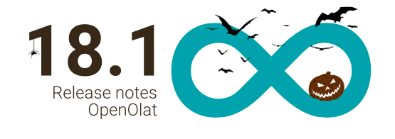
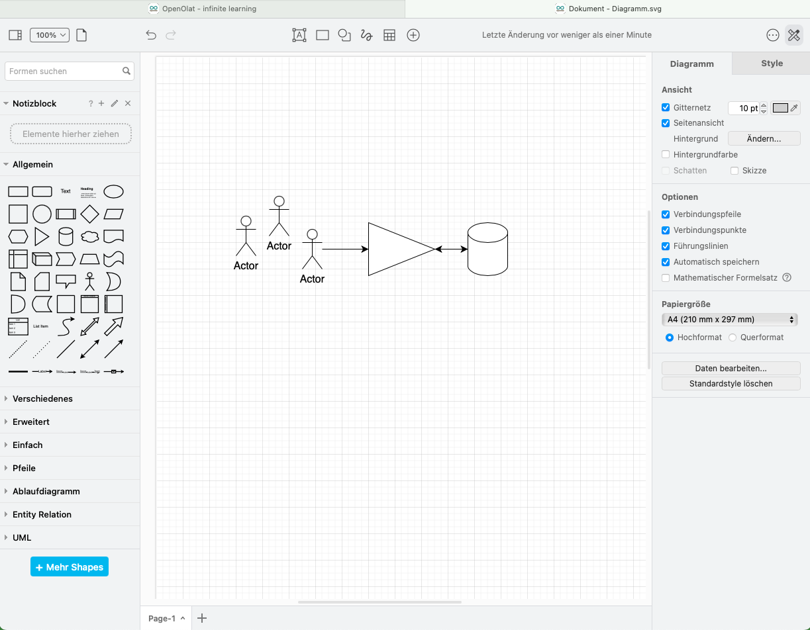

# Release Notes 18.1

* * *

:material-calendar-month-outline: **Releasedatum: 25.10.2023 • Letztes Update: 15.11.2023**

* * *

Mit OpenOlat 18.1 geben wir unseren nächsten Major Release frei.

Eine umfassende Neuerung stellt der **Login mit Passkey** dar und damit verbunden die Möglichkeit, ein **mehrstufiges Authentifizierungskonzept** für OpenOlat einzurichten. In diesem Zuge wurde auch ein **Redesign des Login-Screens** vorgenommen.

Im Projekt-Tool wurden zahlreiche Erweiterungen wie der **Projekt Report**, das **Whiteboard** und verschiedene Optimierungen rund um die Darstellung und das Handling der Projektdaten umgesetzt. Der zentrale Zugriff auf **persönliche To-dos** unterstützt Benutzer:innen dabei, den Überblick zu behalten. Die Integration von **draw.io** als **Diagramm- und Whiteboard-Tool** sowie der **Audio Recorder** bieten neue Möglichkeiten, um Informationen direkt in OpenOlat zu erstellen und festzuhalten.

Über die **Quota**-Einstellungen und **Freigabe-Berechtigungen** kann das **Medien Center** feingranular an die Bedürfnisse von Autor:innen und Benutzer:innen angepasst werden. Beim Einsatz von **Edubase** werden ab sofort auch **Multi-PAK Codes** unterstützt.

Im Bereich eAssessment kann mithilfe der **Teilpunkte-Berechnung** ein Negativpunktesystem für viele Fragetypen abgebildet werden. In Rubrik-Formularen sorgen die **Rubric-Beschreibungen** für mehr Transparenz bei der Bewertung, und das neue **formatierte Prüfungslog** unterstützt bei Rückfragen zu Testdurchläufen.

Systemweite visuelle Anpassungen wie **neue Icons** durch das FontAwesome Upgrade, eine neue Darstellung für Systemmeldungen sowie die Vorschau von Dateien in der **Lightbox** verleihen OpenOlat einen frischen Look.

Seit Release 18.0 wurden über 120 neue Funktionen und Verbesserungen zu OpenOlat hinzugefügt. Hier finden Sie die wichtigsten Neuerungen zusammengefasst. Zusätzlich wurden mehr als 130 Bugs behoben. Die komplette Liste der Änderungen in 18.0 – 18.0.8 finden Sie [hier](Release_notes_18.0.de.md){:target="_blank”}.

* * *

## Visuelle Neuerungen

### FontAwesome Upgrade: Neue Icons

Mit Release 18.1 wurde ein Upgrade auf FontAwesome 6 durchgeführt. Dadurch erstrahlen nun alle Icons in OpenOlat in frischem, modernen Design.

=== "Neue Icons"

    { class="shadow lightbox" title="Neue Kursbaustein-Icons" }

=== "Alte Icons"

    { class="shadow lightbox" title="Alte Kursbaustein-Icons" }

### Lightbox

Bisher wurden PDF-Dokumente, Bilder, Videos und Audios zur Vorschau und Anzeige etwas umständlich in einem neuen Browser-Tab geöffnet. Neu erfolgt die Anzeige in der Lightbox im gleichen Fenster.

=== "Lightbox mit Bild"

    { class="shadow lightbox" title="Bild-Anzeige in Lightbox" }

=== "Lightbox mit PDF"

    { class="shadow lightbox" title="PDF-Anzeige in Lightbox" }

=== "Lightbox mit Video"

    { class="shadow lightbox" title="Video-Anzeige in Lightbox" }

### Neues Layout der Meldungen

Die Meldungen für Hinweise, Warnungen, Fehler und ähnliches wurden optisch erneuert. Es wurde ausserdem eine zweite Variante mit zusätzlichem Icon eingeführt.

{ class="shadow lightbox" title="Neuer Look für Meldungen" }

* * *

## Passkey

Mit der Einführung von "Passkey" steht in OpenOlat eine vereinfachte Authentifizerungsmethode mit grösstmöglicher Sicherheit zur Verfügung. Ist diese entsprechende Sicherheitsstufe konfiguriert, so werden die Benutzer:innen bei der nächsten Anmeldung angehalten, einen Passkey zu erstellen und diesen zukünftig für die Anmeldung zu verwenden.

Passkey kann rollenbasiert konfiguriert werden und ist Teil eines dreistufigen Sicherheitskonzeptes in OpenOlat.

{ class="shadow lightbox" title="Sicherheitsstufen für Authentifizierung mit Passwort und Passkey" }

Für eine mühelose Umstellung kann bei Bedarf der Wechsel zur nächsten Sicherheitsstufe auch für die Benutzer:innen selbst ermöglicht werden.

{ class="shadow lightbox" title="Passkey - persönliche Einstellungen" }

Weitere Informationen zu "Passkey in OpenOlat" finden Sie in unserem  Blogartikel [Geschützt: Passkey – eine passwortlose Zukunft.](https://www.openolat.com/passkey-eine-passwortlose-zukunft/){:target="_blank”}

* * *

## Redesign Login

Mit der "Passkey"-Implementierung wurde auch ein Redesign der OpenOlat Login-Maske umgesetzt. Die bisherige Kachel-Darstellung aller aktivierten Authentifizerungsmöglichkeiten wurde in diesem Zuge aufgelöst und die optische Gestaltung verbessert. Verschiedene Login-Services sind dadurch nun auf einen Blick ersichtlich.

Mit :octicons-tag-24: Release 18.1.2 kann der lokale OpenOlat Login optional als einzelner Button dargestellt werden, beispielsweise wenn es als sekundäres Login-Verfahren genutzt wird und gegenüber der primären Login-Variante nicht so prominent erscheinen soll.

{ class="shadow lightbox" title="Neue OpenOlat Login-Maske" }

* * *

## Projekte

Im Bereich Projekte hat sich einiges getan.

### Whiteboard {: #whiteboard}

Um die Zusammenarbeit und den Austausch in Projekten zu unterstützen, steht ein zentrales Whiteboard zur Verfügung. Mehrere Projektbeteiligte können kollaborativ über das Whiteboard zusammenarbeiten. Der aktuelle Stand kann auch als Projektdatei abgelegt werden.

{ class="shadow lightbox" title="Projekt Whiteboard" }

### Projekt Report

Mit 18.1 steht der Projekt-Report zur Verfügung. Damit können die wichtigsten Projekt-Daten bei Bedarf heruntergeladen, für die Geschäftsleitung oder Meetings aufbereitet, und auch archiviert werden.

Der Report besteht aus einem Word-Dokument, in dem Angaben zum Projekt (Titel und Teaser), die Projektmitglieder sowie sämtliche Inhalte wie Timeline, Termine, Meilensteine, To-dos, Notizen des Projektes und der aktuelle Stand des Whiteboards enthalten sind. Zusätzlich sind in einem Ordner alle Dateien und Notizen separat abgelegt.

Der Report kann vom Zeitraum eingeschränkt werden, um beispielsweise wöchentliche oder monatliche Zusammenfassungen zu erstellen. Die Sortierung der Inhalte ist entweder chronologisch oder nach Objekttyp möglich.

### Weitere Projekt-Neuerungen

* Bereich "Dateien": Erstellung von Audio- und Video-Aufzeichnungen (:octicons-tag-24: ab Release 18.1.2)
* Visuelle Optimierung der "To-do" Detail-Seite und optimierte Darstellung des "Erledigt"-Button
* Sammelaktionen zum Download aller Dateien oder Löschen von Entscheiden, To-Dos und Notizen
* Neue Filter und optimierte Anzeige der verlinkten Dokumente
* Beteiligte Bearbeiter von Objekten werden automatisch als Mitglied hinzugefügt
* Gelöschte Projekte sind nicht editierbar
* Bereinigung der Markdown-Anzeige im Notiz-Tool

* * *

## Persönliche To-dos

Eine Zusammenfassung aller persönlichen und zugewiesenen To-dos finden Benutzer:innen ganz zentral unter den persönlichen Werkzeugen. So fällt es leicht, den Überblick zu behalten.

{ class="shadow lightbox" title="Persönliche To-dos" }

Damit Benutzer:innen keine E-Mail-Benachrichtigungen über neue To-dos verpassen, wurden diese inhaltlich und visuell aufgewertet.

Ab :octicons-tag-24: Release 18.1.1 kann in der Administration das Modul "To-do" aktiviert werden. Zudem ist eine rollenbasierte Konfiguration möglich hinsichtlich der Erstellung neuer persönlicher To-dos und deren Zuweisung / Delegierung.

* * *

## Medien Center

Mit der Verwendung des Content Editors im Kursbaustein "Seite" gewinnt das Medien Center immer mehr an Bedeutung.

Zur besseren Verwaltung der Medienelemente kann der verfügbare Speicherplatz im Medien Center konfiguriert werden. In der Regel haben Autoren einen höheren Speicherplatzberdarf, daher werden die Quota-Einstellungen separat für diese Poweruser (DEFAULT::POWERUSERS) und für Benutzer:innen ohne zusätzliche Systemrolle (DEFAULT::USERS) vorgenommen.

Die Erteilung von Freigaben im Medien Center ist eine mächtige Funktion. Die Freigabemöglichkeiten für Medienelemente im Rahmen von Kursen, Gruppen, Organisationen bzw. an andere Benutzer:innen können nun rollenbasiert und somit feingranularer konfiguriert werden.

{ class="shadow lightbox" title="Freigabe-Konfiguration für Medien Center" }

Administrative Benutzer:innen wie Lernressourcenverwalter:innen und Administrator:innen haben aufgrund ihrer höher berechtigten Rollen indirekt Zugriff auf Medienelemente ihrer Organisation, die im Kontext "Kurs" geteilt sind. Zur besseren Abgrenzung sind für diese Benutzer:innen neben dem Bereich "Mein Medien Center" auch eine "Medienverwaltung" verfügbar.

{ class="shadow lightbox" title="Medienverwaltung für administrative Benutzer:innen" }

* * *

## Integration "draw.io" Editor

Die Integration des freien Zeichen- und Diagrammwerkzeugs "draw.io" bietet neue Möglichkeiten zur Erstellung von Inhalten in OpenOlat.

Im Bereich "Projekte" kommt es als [Whiteboard](#whiteboard) zum Einsatz, welches auch kollaborativ von mehreren Projektmitgliedern genutzt werden kann. Im Kursbaustein "Seite" sowie im Medien Center können mithilfe des Editors direkt Diagramme erstellt und als .svg-Datei abgelegt werden.

=== "draw.io Whiteboard"

    { class="shadow lightbox" title="draw.io Whiteboard" }

=== "draw.io Diagramm Editor"

    { class="shadow lightbox" title="draw.io Diagramm Editor" }

Auch überall, wo Dokumente erstellt werden können (z.B. Aufgabenbaustein, Ordner), stehen die neuen Dokumenttypen für Diagramme oder das Whiteboard zur Auswahl.

{ class="shadow lightbox" title="Neues Dokument mit draw.io erstellen" }

* * *

## Audio Recorder

Analog zum Video Recorder ist ab sofort auch ein Audio Recorder implementiert. Dieser kann im Kursbaustein "Aufgabe" zur Erstellung von Aufgaben oder Lösungen aktiviert werden. Ab :octicons-tag-24: Release 18.1.1 ist der Audio Recorder auch im Medien Center und als blockbasiertes Element im Kursbaustein "Seite" verfügbar. Im Projekt im Bereich "Dateien" können ab :octicons-tag-24: Release 18.1.2 ebenfalls Audio- und Video-Aufzeichnungen erstellt werden.

{ class="shadow lightbox" title="Audio-Aufnahme im Aufgabenbaustein" }

* * *

## Neues rund um Kurse

* Konvertierung herkömmlicher Kurs: Auswahl der Lernpfad-Variante (mit Pfad oder ohne Reihenfolge) für den Zielkurs
* Aufgabenbaustein:
    * Upload mehrere Aufgabenstellungen via Zip-Datei
    * Text-Optimierung für die Konfiguration von "Rückgabe und Feedback"
    * Harmonisierung des Dokumenten-Handlings in Tabelle
* Hinweis am Kursbaustein, wenn die verlinkte Lernressource gelöscht wurde; betrifft die Bausteine Test, Selbsttest, Videoaufgabe, Umfrage, Formular, Blog, Podcast, Wiki, Scorm, CP, Portfolioaufgabe, Dokument, Übung
* Forum: Statistik-Report zu Forenbeiträgen und optimierte Aktionen am Baustein
* Neues Farbwahl-Konzept für Kurs-Layout
* Optimierung der Statuswarnungen im Kurs
* Optimierte Reihenfolge der Vor-Filter unter "Meine Kurse"
* Lernpfad:
    * Verbesserte Darstellung der "Bestätigung durch Benutzer⸱in" am Baustein
    * Ausnahmeregeln: Wildcard-Match für Benutzerattribute, z.B. für E-Mail-Domäne
* Bereinigung und Anpassung der Namen von Variablen für Zertifikate
* Kurserinnerungen: Ergänzung relevanter Variablen zur Verwendung in Benachrichtigungen
* LTI: Unterstützung von Deep Link

* * *

## Bereich eAssessment

### Teilpunkte-Berechnung für Fragetypen

Zur Bewertung von Prüfungsfragen wird zum Teil ein Negativpunktesystem verwendet, wobei die Punkte auf Basis der Antwort-Auswahl berechnet werden. Die neue Option "Teilpunkte" bildet diese Punkte-Berechnung für folgende Fragetypen ab: Multiple Choice, Hotspot, Hottext, Drag and Drop, Matrix, Lückentext (Text und numerisch), Lückentext mit Dropdown.

Bei der Berechnung wird für jede richtig ausgewählte Antwort eine gewichtete Punktzahl addiert, während für jede falsch ausgewählte Antwort eine gewichtete Punktzahl abgezogen wird.

{ class="shadow lightbox" title="Teilpunkte für Bewertung" }

### Formular: Rubrik-Beschreibung

Formulare mit Rubrics werden häufig im Kursbaustein "Bewertung" im Rahmen von praktischen Leistungen, und Präsentationen eingesetzt. Für die Rubrics kann neu eine Beschreibung hinterlegt werden, um zum einen den Teilnehmer:innen die einzelnen Bewertungskriterien transparent aufzuzeigen und zum anderen die Betreuenden bei der Bewertung zu unterstützen. Die farbige Ausgabe nach Ampel-System zeigt direkt an, welche Kriterien einer guten, neutralen oder ungenügenden Bewertung zugeordnet sind.

{ class="shadow lightbox" title="Rubrik-Beschreibung im Editor" }

{ class="shadow lightbox" title="Rubrik mit Beschreibung im Einsatz" }

### Weitere eAssessment-Neuerungen

* Optimierte Anzeige von richtigen/falschen Antworten
* Formatiertes Prüfungslog
* Kursbaustein "Bewertung": Optimiertes Änderungslog für Massenbewertung
* Prüfungsmodus: Optimierung der Teilnehmenden-Auswahl
* Archiv Kursresultate: Ergänzung der Daten zu Noten/Einstufungen, wenn aktiviert
* Safe Exam Browser: Anzeige des generierten Links zum Beenden des SEB

* * *

## Rund um UX / Usability

* Optimierter Dialog zur Erstellung neuer Dokumente (a11y)
* Verbesserte Anzeige der Meldung für Bereiche ohne Daten/Inhalte ("Empty state")

* * *

## Weiteres, kurz notiert

* Formular: Erweiterte Konfigurationsmöglichkeiten immer sichtbar
* Persönlicher Kalender:
    * Refactoring Termin-Erstellung und automatische Verlinkung zu Original-Kurs, -Gruppe, -Lektion
    * Optimierte Handhabung zur Auswahl aggregierter Kalender
* Ersetzen-Aktion für Scorm-Paket in der Lernressource
* Gruppen: Neuer Filter "Name"
* Abonnements: Anzeige des Kurselement-Titels für mehr Kontext-Informationen
* Edubase:
    * Unterstützung für Multi PAK
    * eBook in neuem Fenster öffnen
* Lebenszyklus "Konto": Optimierte Konfiguration von Mailbenachrichtigungen und Ergänzung der Variable für Reaktionsfrist
* Rollenbasierte Konfiguration für Massensuche nach Benutzer:innen
* Poster-Bild für Video-Recordings
* Refactoring Transcoding-Module inkl. Option zur Löschung der Master-Videodatei
* Integration von pdf.js als PDF-Viewer

* * *

## Technisches

* Aktualisierung der Bibliotheken von Drittanbietern
* Unterstützung PhantomJS entfernt
* REST API:
    * Optimierte Konfiguration für extern bzw. speziell verwaltete ("managed") Objekte
    * Spezieller API-Schlüssel für Zugriff auf die REST API
* Content Package: verbesserte Kompatibilität
* BBB verbesserte Unterstützung für 2.6+
* Prüfung der Festplattengröße für ActiveMQ Artemis unterbunden

* * *

## Systemadministratoren: Neue Funktionen aktivieren / konfigurieren

!!! note "Checkliste nach Update auf 18.1"

    Folgende Funktionen müssen nach einem Update auf Release 18.1 in der `Administration` aktiviert bzw. konfiguriert werden:

    * [x] Modul "Passkey" und Sicherheitsstufen für Authentifizierung: `Login > Password und Authentifizierung` - Tab "Authentifizierung"
    * [x] OpenOlat als einzelner Login-Button: `Login > Password und Authentifizierung` - Tab "Authentifizierung"
    * [x] Medien Center:
        * Rollenbasierte Freigabemöglichkeiten: `Module > Medien Center`
        * Quota-Konfiguration: `Core Konfiguration > Dateien und Ordner` - Tab "Quotas" (::DEFAULT::POWERUSERS & ::DEFAULT::USERS)
    * [x] Modul "draw.io" für Whiteboard und Diagramme: `Externe Werkzeuge > draw.io`
    * [x] Master-Videodatei nach Transkodierung löschen: `Module > Video` - Tab "Videokonfiguration" - Abschnitt "Transkodierung"
    * [x] Funktion "Audio Recorder": `Module > Audio/video recording`
    * [x] Benutzerwerkzeug "To-do":
        * Aktivierung: `Module > To-do` und `Core Konfiguration > Persönliche Werkzeuge`
        * Rollenbasierte Konfiguration: `Module > To-do` (:octicons-tag-24: ab Release 18.1.1)
    * [x] Rollenbasierte Massensuche: `olat.properties > usersearch.bulk.[role]=disabled`

* * *

## Weitere Informationen

* [YouTrack Release Notes 18.1](https://track.frentix.com/releaseNotes/OO?q=%2318.1.0%20&title=Release%20notes%2018.1)
* [YouTrack Release Notes 18.1 - 18.1.4](https://track.frentix.com/releaseNotes/OO?q=%2318.1.*&title=Release%20notes%2018.1.*)
