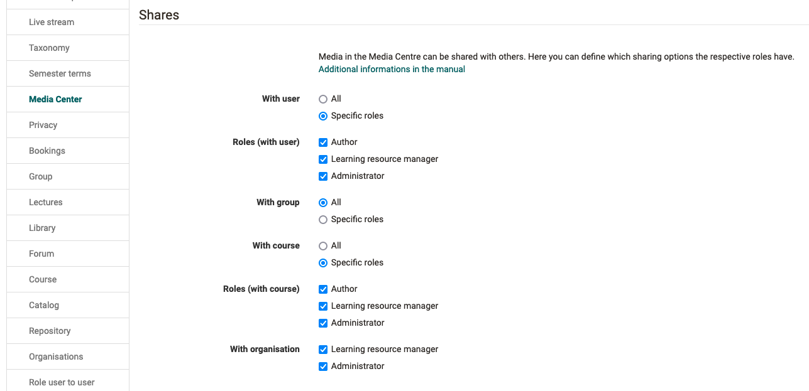

# Release notes 18.1

* * *

:material-calendar-month-outline: **Release date: 10/25/2023 • Last update: 11/01/2023**

* * *

With OpenOlat 18.1 we release our next major version.

A comprehensive innovation is the **login with Passkey** and the associated possibility to set up a **multi-level authentication concept** for OpenOlat. In addition, a **redesign of the login screen** has been carried out.

In the project tool, numerous enhancements such as the **project report**, the **whiteboard** and various optimizations around the display and handling of project data were implemented. The central access to **personal to-dos** supports users in maintaining an overview. The integration of **draw.io** as **diagram and whiteboard tool** as well as the **audio recorder** offer new possibilities to create and record information directly in OpenOlat.

The **quota** settings and **sharing permissions** allow the **Media Center** to be fine-tuned to the needs of authors and users. When using **Edubase**, **multi-PAK codes** are now also supported.

In the eAssessment area, a negative point system can be mapped for many question types with the help of **partial point calculation**. In rubric forms, **rubric descriptions** provide more transparency in assessment, and the new **formatted exam log** supports queries about test runs.

System-wide visual customizations such as **new icons** through the FontAwesome upgrade, a new display for system messages, and previewing files in the **Lightbox** give OpenOlat a fresh look.

Since release 18.0, over 120 new features and improvements have been added to OpenOlat. Here you can find the most important new features and changes. In addition, more than 130 bugs have been fixed. The complete list of changes in 18.0 - 18.0.8 can be found [here](Release_notes_18.0.md){:target="_blank”}.

* * *

## Visual novelties

### FontAwesome Upgrade: New Icons

With Release 18.1, an upgrade to FontAwesome 6 has been implemented. As a result, all icons in OpenOlat now shine in a fresh, modern design.

=== "New Icons"

    { class="shadow lightbox" title="New course element icons" }

=== "Old icons"

    { class="shadow lightbox" title="Old course element icons" }

### Lightbox

Previously, PDF documents, images, videos and audios were opened in a new browser tab for preview and display, which was somewhat cumbersome. Now the display in the Lightbox is done in the same window.

=== "Lightbox with image"

    { class="shadow lightbox" title="Image view in Lightbox" }

=== "Lightbox with PDF"

    { class="shadow lightbox" title="PDF view in Lightbox" }

=== "Lightbox with video"

    { class="shadow lightbox" title="Video view in Lightbox" }

### New layout of messages

The messages for notices, warnings, errors and the like have been visually renewed. A second variant with an additional icon has also been introduced.

{ class="shadow lightbox" title="New look for messages" }

* * *

## Passkey

With the introduction of "Passkey", a simplified authentication method with the greatest possible security is available in OpenOlat. If this appropriate security level is configured, users will be requested to create a passkey the next time they log in and use it for logging in in the future.

Passkey can be configured in a role-based manner and is part of a three-tier security concept in OpenOlat.

{ class="shadow lightbox" title="Security levels for authentication with password and passkey" }

For an effortless changeover, the switch to the next security level can also be made possible for the users themselves, if required.

{ class="shadow lightbox" title="Passkey - personal settings" }

* * *

## Redesign login mask

With the "Passkey" implementation, a redesign of the OpenOlat login screen was also implemented. The previous tile display of all activated authentication options was dissolved and the optical design was improved. Different login services are now visible at a glance.

{ class="shadow lightbox" title="New OpenOlat login mask" }

* * *

## Projects

A lot has happened in the projects section.

### Whiteboard {: #whiteboard}

To support collaboration and exchange in projects, a central whiteboard is available. Several project participants can work together collaboratively via the whiteboard. The current status can also be saved as a project file.

{ class="shadow lightbox" title="Project whiteboard" }

### Project report

With 18.1, the project report is available. This allows the most important project data to be downloaded as required, prepared for management or meetings, and also archived.

The report consists of a Word document containing details of the project (title and teaser), the project members and all content such as timeline, appointments, milestones, to-dos, project notes and the current status of the whiteboard. In addition, all files and individual notes are stored separately in a folder.

The report can be restricted by time period, for example to create weekly or monthly summaries. Sorting of the contents is possible either chronologically or by object type.

### Further project innovations

* Visual optimization of the "To-do" details page and optimized display of the "Done" button
* Bulk actions to download all files or delete decisions, to-dos and notes
* New filters and optimized display of linked documents
* Involved editors of objects are automatically added as a member
* Deleted projects are not editable
* Cleanup of the Markdown display in the note tool

* * *

## Personal To-dos

A summary of all personal and assigned to-dos can be found centrally under the personal tools. So it is easy to keep the overview.

{ class="shadow lightbox" title="Personal To-dos" }

To ensure that users don't miss any e-mail notifications about new to-dos, these have been upgraded both visually and in terms of content.

As of :octicons-tag-24: release 18.1.1, the "To-do" module can be activated in the administration. In addition, a role-based configuration is possible with regard to the creation of new personal to-dos and their assignment / delegation.

* * *

## Media Center

With the use of the content editor in the course element "Page", the Media Center becomes more and more important.

For better management of media elements, the available storage space can be configured in the Media Center. Usually authors have higher storage space requirements, therefore the quota settings are made separately for these power users (DEFAULT::POWERUSERS) and for users without additional system roles (DEFAULT::USERS).

Granting shares in the Media Center is a powerful feature. The release options for media elements in the context of courses, groups, organizations or to other users can now be configured role-based and thus more finely granular.

{ class="shadow lightbox" title="Share Configuration for Media Center" }

Administrative users such as learning resource managers and administrators have indirect access to their organization's media assets shared in the course context due to their higher permissioned roles. For a better demarcation, a "Media administration" is available for these users in addition to the "My Media Center" area.

{ class="shadow lightbox" title="Media management for administrative users" }

* * *

## Integration of "draw.io" editor

The integration of the free drawing and diagram tool "draw.io" offers new possibilities for creating content in OpenOlat.

In the area "Projects" it is used as a [whiteboard](#whiteboard), which can also be used collaboratively by several project members. In the course element "Page" as well as in the Media Center, diagrams can be created directly with the help of the editor and saved as .svg file.

=== "draw.io whiteboard"

    { class="shadow lightbox" title="draw.io whiteboard" }

=== "draw.io diagram editor"

    { class="shadow lightbox" title="draw.io diagram editor" }

Also, wherever documents can be created (e.g. task element, folder), the new document types for diagrams or the whiteboard are available for selection.

{ class="shadow lightbox" title="Create new document with draw.io" }

* * *

## Audio recorder

Analogous to the video recorder, an audio recorder is now also implemented. It can be activated in the course element "Task" to create tasks or solutions. As of :octicons-tag-24: release 18.1.1, the audio recorder is also available in the Media Center and as a block-based element in the course element "Page".

{ class="shadow lightbox" title="Audio recording in task element" }

* * *

## News around courses

* Conversion conventional course: selection of learning path variant (with path or without sequence) for the target course
* Task course element:
    * Upload multiple assignments via zip file
    * Text optimization for "Return and feedback" configuration
    * Harmonization of document handling in table
* Note at course element if linked learning resource has been deleted; affects course elements test, self-test, video task, survey, form, blog, podcast, wiki, scorm, CP, portfolio task, document, practice
* Forum: Statistics report on forum posts and optimized actions on the course element
* New color selection concept for course layout
* Optimization of status warnings in the course
* Optimized order of pre-filters under "My courses"
* Learning path:
    * Improved display of "Confirmation by user" at the course element
    * Exception rules: Wildcard match for user attributes, e.g. for email domain
* Cleanup and customization of variable names for certificates
* Course reminders: Addition of relevant variables for use in notifications
* LTI: support for deep link

* * *

## eAssessment area

### Partial score calculation for question types

A negative point system is used in part to evaluate exam questions, with points being calculated based on the answer selection. The new option "Partial score" maps this points calculation for the following question types: multiple choice, hotspot, hottext, drag and drop, matrix, gap (text and numeric), gap with dropdown.

In the calculation, a weighted score is added for each correctly selected answer, while a weighted score is subtracted for each incorrectly selected answer.

{ class="shadow lightbox" title="Partial score for evaluation" }

### Form: Rubric description

Forms with rubrics are often used in the course element "Assessment" in the context of practical performances and presentations. A description can now be stored for the rubrics in order to transparently show the individual assessment criteria to the participants and to support the coaches in the assessment. The colored output according to the traffic light system shows directly which criteria are assigned to a good, neutral or insufficient evaluation.

{ class="shadow lightbox" title="Rubric description in editor" }

{ class="shadow lightbox" title="Rubric with description in use" }

* * *

### Further eAssessment enhancements

* Optimized display of correct/wrong answers
* Formatted exam log
* Exam mode: Optimization of participant selection
* Archive course results: Addition of grades/grading data when enabled
* Safe Exam Browser: Display of generated link to exit SEB

* * *

## All around UX / Usability

* Optimized dialog for creating new documents (a11y)
* Improved display of message for areas without data / content ("Empty state")

* * *

## Further, briefly noted

* Form: Advanced configuration options always visible
* Personal calendar:
    * Refactoring appointment creation and automatic linking to original course, group, lesson
    * Optimized handling for selection of aggregated calendars
* Replace action for Scorm package in the learning resource
* Groups: New filter "Name"
* Subscriptions: display of course element title for more context information
* Edubase:
    * Support for multi-PAK
    * Open eBook in new window
* Life cycle "Account": Optimized configuration of mail notifications and addition of variable for reaction period
* Role based configuration for bulk search for users
* Refactoring transcoding modules incl. option to delete the master video file
* Integration of pdf.js as PDF viewer

* * *

## Technical

* Updating of third-party libraries
* PhantomJS support removed
* REST API:
    * Optimized configuration for externally or specially "managed" objects
    * Special API key for access to the REST API
* Content Package: improved compatibility
* Disk size check for ActiveMQ Artemis disabled

* * *

## System administrators: Activate / configure new functions

!!! note "Checklist after update to 18.1"

    The following functions have to be activated / configured in the `Administration` after an update to release 18.1:

    * [x] Module "Passkey" and security levels for authentication: `Login > Passkey`
    * [x] Media Center:
        * Role-based sharing options: `Module > Media Center`
        * Quota configuration: `Core Configuration > Files and Folders` - tab "Quotas" (::DEFAULT::POWERUSERS & ::DEFAULT::USERS)
    * [x] Module "draw.io" for whiteboard and diagrams: `External Tools > draw.io`
    * [x] Delete master video file after transcoding: `Modules > Video` - tab "Video Configuration" - section "Transcoding"
    * [x] Function "Audio Recorder": `Module > Audio/video recording`
    * [x] User tool "To-do":
        * Activation: `Modules > To-do` and `Core configuration > Personal tools`
        * Role-based configuration: `Module > To-do`(:octicons-tag-24: release 18.1.1)
    * [x] Role based bulk search: `olat.properties > usersearch.bulk.[role]=disabled`

* * *

## More information

* [Jira Release Notes 18.1.1](https://jira.openolat.org/secure/ReleaseNote.jspa?projectId=10000&version=21706){:target="_blank”}
* [Jira Release Notes 18.1.0](https://jira.openolat.org/secure/ReleaseNote.jspa?projectId=10000&version=21000){:target="_blank”}
