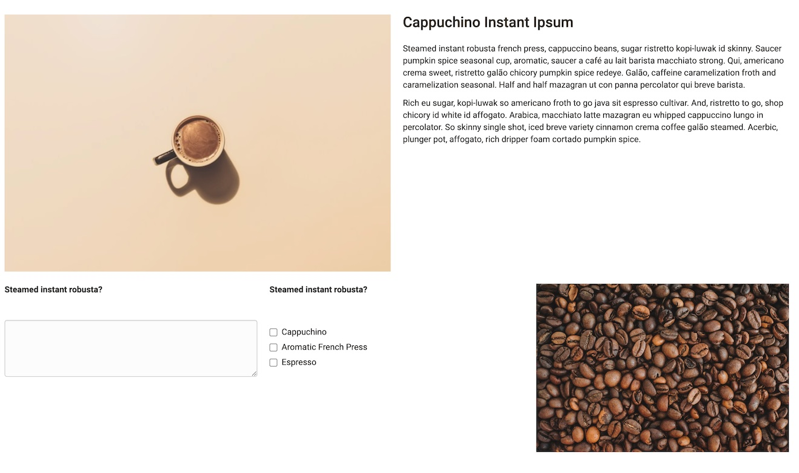
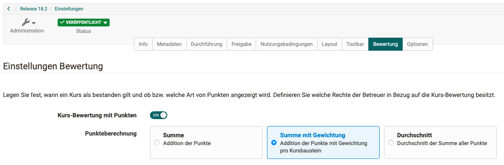

# Release Notes 18.2

* * *

:material-calendar-month-outline: **Releasedatum: 31.01.2024 • Letztes Update: 28.02.2024**

* * *

Mit OpenOlat 18.2 geben wir unseren nächsten Major Release frei.

Die **To-dos** wurden weiter ausgebaut und sind nun auch **in Kursen** zur direkten Zuteilung an Teilnehmende verfügbar, oder können aus dem **Aufgabenbaustein** heraus automatisch erzeugt werden.

Der **Content Editor** für den Baustein 'Seite' wurde um den **'Code'-Block** erweitert, im 'Video'-Block können auch **Videos per URL** eingebunden werden. Im Formular ist eine **Rubrik-Sternchenbewertung** möglich, Teilnehmende können ihre **Antworten kommentieren**, zudem wurden die Darstellung der Blöcke und das Handling der Layouts harmonisiert.

Im Bereich eAssessment ist eine **Punkte-Gewichtung** für bewertbare Bausteine im Lernpfadkurs möglich. Die neue **Prüfungseinsicht** bietet einen kontrollierten Zugriff einzelner Teilnehmer:innen auf ihre Test-Resultate. Durch die **Neugestaltung der Test-Startseite** und das **Redesign der Leistungsübersicht** mit passenden Icons werden relevante Informationen für die Teilnehmenden besser hervorgehoben. Für die Bewertung mit 'Note/Einstufung' stehen neue **Zertifikat-Variablen** zur Verfügung.

Der **Verwendungszweck für Lernressourcen** definiert klar, ob die Ressource in einen Kurs eingebunden oder direkt (standalone) mit eigener Mitglieder- und Zugriffsverwaltung eingesetzt wird. Es kann neu auf **externe Webseiten im Hauptmenü verlinkt** werden, ausserdem ist die systemweite Konfiguration bestimmter **Defaultwerte für Kursbausteine** möglich.

Im Bereich Qualitätsmanagement verschafft die **Datenerhebungsvorschau** einen Überblick über kommende Befragungen und ermöglicht die gezielte **Verschiebung** einzelner Erhebungen.

Auch **Usability und User-Experience** kommen nicht zu kurz: Die zentrale Platzierung der **Kurs-Konfigurationsübersicht** im Editor, **optimierte Texte** für Hinweise, Systemmeldungen und Benachrichtigungen sowie zahlreiche **harmonisierte** Darstellungen, Label, Icons und Dialoge runden den neuen OpenOlat Release ab.

Seit Release 18.1 wurden über 70 neue Funktionen und Verbesserungen zu OpenOlat hinzugefügt. Hier finden Sie die wichtigsten Neuerungen zusammengefasst. Zusätzlich wurden mehr als 90 Bugs behoben. Die komplette Liste der Änderungen in 18.1 – 18.1.6 finden Sie [hier](Release_notes_18.1.de.md){:target="_blank”}.

* * *

## Verwendungszweck für Lernressourcen

In der Regel werden Lernressourcen für eine optimale Verwendung in Kurse eingebunden. Aufgrund einer eigenen Mitgliederverwaltung, Zugriffssteuerung sowie individuellen Laufzeitfunktionen können alle Lernressourcen aber auch kursunabhängig eingesetzt werden. Dies ist jedoch selten gewünscht bzw. nur für bestimmte Szenarien (z.B. Blog, Podcast, Wiki) sinnvoll.

Daher ist ab Release 18.2.0 der Verwendungszweck für Lernressourcen transparent konfigurierbar:

* [x] Verwendungszweck für Lernressourcen: `Lernressource > Einstellungen > Tab 'Freigabe' > Abschnitt 'Verwendung' > Verwendungszweck`

Per default werden nur Kurse als 'Eigenständig' (standalone) mit umfassender Mitgliederverwaltung und Zugriffssteuerung behandelt. Alle anderen Lernressourcen sind standardmässig zur 'Einbindung in Kurse' ausgelegt, d.h. die Mitglieder- und Freigabeverwaltung sowie spezifischen Laufzeitfunktionen sind ausgeblendet oder nur reduziert verfügbar.

{ class="shadow lightbox" title="Verwendungszweck für Lernressourcen" }

Unter `Kurse > Meine Kurse` werden nur noch 'eigenständige' Ressourcen angezeigt.

* * *

## To-dos: Neue Einsatzbereiche

Die To-do-Infrastruktur ist nun in OpenOlat Kursen verfügbar und wurde funktional erweitert:

### To-dos für Kursteilnehmende

Spezifische oder zusätzliche Aufgaben für Kursteilnehmende können ab sofort ganz einfach über die neuen Kurs-To-dos verteilt werden. Der Bereich 'To-dos' ist über die Kurs-Administration aufrufbar. Kursbesitzer:innen und Betreuer:innen können darüber gezielt To-dos für alle oder ausgewählte Kursteilnehmende erstellen. Ein To-do, welches mehreren Teilnehmenden zugewiesen ist, muss von allen individuell bearbeitet und abgeschlossen werden.

{ class="shadow lightbox" title="Kurs-To-dos Übersicht" }

In der To-dos-Übersicht behalten die Kursbesitzer:innen und Betreuer:innen den Überblick über den Status der To-dos und können diese verwalten. Bei Bedarf kann in den Kurs-Einstellungen konfiguriert werden, dass die Betreuenden nur lesend auf die To-dos zugreifen können.

* [x] Kurs-To-dos bearbeiten für Betreuende: `Kurs-Eintellungen > Optionen > Abschnitt 'Einstellungen Betreuer:innen' > To-dos bearbeiten`

Kurs-To-dos sind auch im persönlichen Benutzerwerkzeug 'To-dos' verfügbar und mit dem Kontext 'Kurs' ausgewiesen.

### To-dos aus Aufgabenbaustein generieren

!!! info "Hinweis"

    Diese Funktion ist nur für Lernpfadkurse verfügbar.

Im Aufgabenbaustein können für die Schritte 'Aufgabe auswählen', 'Lösung abgeben' und 'Überarbeitete Lösung abgeben' automatisch To-dos erstellt werden, wenn für diese jeweils eine Frist gesetzt ist.

* [x] Aufgaben-To-dos aktivieren: `Kurs-Editor > Tab 'Erinnerungen & To-dos' > To-dos automatisch erstellen`

Betreuende können den Status der To-dos der Teilnehmenden verfolgen:

{ class="shadow lightbox" title="Aufgaben-To-dos - Übersicht für Betreuende" }

Die To-dos erscheinen im persönlichen Benutzerwerkzeug 'To-dos' der Teilnehmenden. So behalten sie stets den Überblick, bis wann bestimmte Aufgaben abgeholt sowie Lösungen oder Überarbeitungen eingereicht werden müssen.

Teilnehmende können die To-dos aus Aufgabenbausteinen nicht aktiv als 'Erledigt' markieren; dies erfolgt automatisch, z.B. nach der Auswahl einer Aufgabenstellung oder nach der endgültigen Abgabe von Lösungsdokumenten.

{ class="shadow lightbox" title="Aufgaben-To-dos - Übersicht für Teilnehmende" }

### Weiteres für To-dos

* Aktion 'Duplizieren' für To-dos
* Optimierte Sortierung von To-dos
* Projektvorlagen: Bei To-do-Zuweisung erfolgt kein Versand von E-Mails an Benutzer:innen

* * *

## Content Editor / Formular

Im Content Editor des Formulars / des Kursbausteins 'Seite' stehen neue bzw. erweiterte Inhaltsblöcke zur Verfügung.

### Neuer Block 'Video'

Im Block 'Video' können neu auch Videos per URL eingebunden werden. Dafür wurde das Medien Center um eine entsprechende Option erweitert. Unterstützt werden die Video-Formate MP4 und m3u8 sowie die Plattformen Youtube, Vimeo, Panopto und nanoo.tv.

### Neuer Block 'Code'

Der neue 'Code' Block ermöglicht die Textdarstellung in einer Schriftart mit festen Abständen und Nummerierung der Zeilen. Dies ist insbesondere bei technischen Lerninhalten wie Programmierbeispielen sehr hilfreich. Beim Anlegen des Code Blocks kann die verwendete Programmiersprache gewählt werden. Zur Weiterverarbeitung können Teilnehmende die Code-Vorlage direkt in die Zwischenablage kopieren.

{ class="shadow lightbox" title="Code Block im Content Editor" }

### Weiteres im Formular Editor

=== "Kleiner Abstand"

    { class="shadow lightbox" title="Kleiner Abstand" }

=== "Mittlerer Abstand"

    { class="shadow lightbox" title="Mittlerer Abstand" }

=== "Extra-grosser Abstand"

    { class="shadow lightbox" title="Extra-grosser Abstand" }

* Einheitliche Abstände für Inhaltsblöcke; Auswahl zwischen verschiedenen Layout-Optionen (z.B. mittlerer, benutzerdefinierter oder gar kein Abstand)
* Löschen eines Layout-Blockes: Inhalt in oberen Block verschieben oder ebenfalls löschen
* Lernressource 'Formular':
    * Neuer Rubrik-Typ 'Diskret mit Sternen' für Sternchenbewertung
    * Zusatzkommentare für Teilnehmende zur ausgewählten Rubrik-Antwort
    * Optimierte Cards-Darstellung der Rubriks
    * Harmonisierung der Layout-Block-Einstellungen

* * *

## Bereich eAssessment

### Prüfungseinsicht

Mit der neuen Prüfungseinsicht kann den Prüfungsteilnehmenden individuell und kontrolliert Zugriff auf ihre Testergebnisse gewährt werden. So sind z.B. gezielte Besprechungen der Prüfungen zwischen einzelnen Teilnehmenden und dem/der Dozierenden möglich.

#### Sicht Autoren / Autorinnen

Die Standard-Konfiguration einer Prüfungseinsicht im jeweiligen Kurs wird von den Kursautoren und -autorinnen angelegt. Dabei werden die Dauer der Einsicht und die Anzeigedetails für die Resultate definiert. Bei Bedarf können zusätzliche Einschränkungen zum IP-Adressraum oder die Verwendung des Safe Exam Browsers konfiguriert werden. Das Anlegen mehrerer verschiedener Einsicht-Varianten ist möglich.

* [x] Prüfungseinsicht anlegen: `Kurs-Administration > Prüfungsverwaltung > Tab 'Konfiguration Prüfungseinsicht'`

{ class="shadow lightbox" title="Prüfungseinsicht - Konfiguration" }

#### Sicht Betreuende

Über das neue Tab 'Prüfungseinsicht' am Baustein 'Test' oder über das Bewertungswerkzeug können Betreuende die Prüfungsteilnehmenden auswählen und Termine für die Einsichtnahme - bei Bedarf mit individuellem Zugangscode - anlegen. Dabei wählen sie eine der im Kurs hinterlegten Prüfungseinsicht-Konfigurationen aus. Die Teilnehmenden erhalten eine entsprechende E-Mail-Benachrichtigung.

{ class="shadow lightbox" title="Prüfungseinsicht - Überblick für Betreuende" }

#### Sicht Teilnehmende

Die Teilnehmenden können über ein Pop-up-Fenster - ggfs. nach Eingabe ihres Zugangscodes - die Prüfungseinsicht innerhalb der definierten Zeit starten und erhalten somit Zugriff auf ihre Testresultate.

{ class="shadow lightbox" title="Prüfungseinsicht - Start durch Teilnehmende" }

### Gewichtete Punkte

!!! info "Hinweis"

    Diese Funktion ist nur für Lernpfadkurse verfügbar.

Sind in einem Kurs mehrere Leistungen zu erbringen, fliessen diese zum Teil mit unterschiedlicher Gewichtung in die Gesamtbewertung des Kurses ein. Die neue Option 'Summe für Gewichtung' für die Kurs-Bewertung ermöglicht es, bei bewertbaren Bausteinen einen Skalierungsfaktor für die Punkte zu hinterlegen. Voraussetzung ist, dass diese bewertbaren Bausteine bei der Kurs-Bewertung berücksichtigt werden.

* [x] Gewichtung für Punkte aktivieren: `Kurs-Einstellungen > Bewertung > 'Kursbewertung mit Punkten' aktivieren > Option 'Summe mit Gewichtung'`

{ class="shadow lightbox" title="Kurs-Bewertung mit gewichteten Punkten aktivieren" }

In der Kurs-Konfigurationsübersicht kann die Skalierung für alle bewertbaren Bausteine geprüft und bei Bedarf direkt gesetzt bzw. editiert werden. Ein kompakte Ansicht über die bewertbaren Bausteine bietet der Vorfilter 'Bewertbar'.

{ class="shadow lightbox" title="Kurs-Konfiguration" }

Die gewichtete Punktzahl wird Betreuenden im Bewertungsformular angezeigt. Für Teilnehmende ist die gewichtete Punktzahl in der Leistungsübersicht des jeweiligen bewertbaren Bausteins sowie im Leistungsnachweis sichtbar.

### Redesign: Leistungsübersicht + Startseite 'Test'

Das bisherige tabellarische Format der Leistungsübersicht bei bewertbaren Kursbausteinen und Strukturelementen weicht einer attraktiveren und übersichtlicheren Darstellung. Sämtliche Leistungsdaten wie Erfolgsstatus, Bewertung (Einstufung/Benotung), Punkte, Lösungsversuche sowie Leistungsnachweis und Testquittung präsentieren sich den Teilnehmenden nun grafisch aufgefrischt mit passendem Icon.

Für den Kursbaustein 'Test' wurde die Anzeige wichtiger Informationen rund um die Testdurchführung neu gestaltet und ergänzt. In kompakter Form erhalten die Teilnehmenden einen Überblick über relevante Eckdaten wie Verfügbarkeit und Dauer des Tests, Maximalpunktzahl und Punkte-Gewichtung, Anzahl der Versuche und ab wann der Test als 'bestanden' gilt.

=== "Neue Darstellung"

    { class="shadow lightbox" title="Neugestaltung der Leistungsübersicht und Test-Startseite" }

=== "Alte Darstellung"

    { class="shadow lightbox" title="Alte Darstellung der Leistungsübersicht und Test-Startseite" }

### Optimierungen für Lernpfadkurse

* Bewertbare Bausteine: Änderung der Option 'Von Bewertung ausschliessen' zu 'Bei Kurs-Bewertung berücksichtigen'
* Lernpfad Konfigurationsübersicht:
    * Neue Spalte für (de)aktivierbare Option 'Bei Kurs-Bewertung berücksichtigen' für bewertbare Bausteine
    * Neue Option zur Eingabe bzw. Änderung des Skalierungsfaktors zur Punktegewichtung bei bewertbaren Bausteinen
* UI/UX: Konfiguration der Gesamtbewertung neu arrangiert und ergänzt

### Weiteres im Bereich eAssessment

* Kurs-Zertifikat: Ergänzung der Variablen für erreichte Note/Einstufung ($grade, $gradeLabel, $gradeCutValue)
* UI/UX: Harmonisierung der Darstellung und Anzeige von Bewertungsdokumenten im Bewertungsformular und in der Leistungsübersicht
* UI/UX: Neue Icons für 'Erfolgsstatus' und 'Badge' in der Leistungsübersicht
* UI/UX: Kursbaustein 'Test': Optimierung der Hinweistexte für die Aktionen 'Beendeten Testdurchlauf wieder öffnen' und 'Anzahl Versuche zurücksetzen'
* UI/UX: QTI Editor: Harmonisierung der Fragetypen 'Lückentext', 'Lückentext mit Dropdown' und 'Numerische Eingabe'

* * *

## Neues rund um Kurse

* UI/UX: Kurs-Editor: Prominentere Anzeige der Kurs-Konfigurationsübersicht in der linken Navigation
* UI/UX: Verbleib auf dem gewählten Kursbaustein nach Schließen des Editors
* UI/UX: Optimierung des Publizieren-Dialogs
* UI/UX: Speichern des Status 'aus-/eingeklappt' von Hinweisboxen (z.B. Übersicht Kurskonfiguration)
* UI/UX: Kursbaustein 'Liste der Teilnehmer:innen': Optimierte Auswahl der individuellen Mitglieder für Mailversand

* * *

## Neues im Autorenbereich

* Optimierte Unterscheidung der 'Importieren'-Aktionen für Lernressourcen in neu 'Datei importieren' und 'Per URL einbinden'
* Kurs-Erstellung: Administrative Freigabe für mehrere Organisationseinheiten zulassen
* Video Collection: Gezielte Veröffentlichung von Video-Lernressourcen (ohne Angebote und Buchung) in den 'Freigabe'-Einstellungen

* * *

## Qualitätsmanagement-Modul

### Datenerhebungsvorschau

Die Datenerhebungsvorschau bietet einen Überblick auf zukünftige Datenerhebungen, die manuell angelegt oder durch einen Datenerhebungsgenerator ausgelöst werden. Die anstehenden Erhebungen können durch Einschränkung auf einen bestimmten Zeitraum sowie über verschiedene Filter (z.B. Generator, Gegenstandsart, Status) weiter eingegrenzt werden.

{ class="shadow lightbox" title="Datenerhebungsvorschau" }

Nach Auswahl einer bestimmten Datenerhebung können administrative Rollen den Auslösezeitpunkt gezielt durch Anpassung der Start- und Enddaten übersteuern.

Die Datenerhebungsvorschau kann in verschiedenen OpenOlat-Bereichen von den genannten Rollen aufgerufen werden:

Bereich | Rolle
---------|----------
 Qualitätsmanagement | Qualitätsmanager:in
 Curriculum | Curriculumverwalter:in
 Kurs | Kursbesitzer:in, Lernressourcenverwalter:in

### Weiteres im QM-Modul

* Variable für 'Externe Referenz' des Kurses im Titel des Datenerfassungsgenerators
* Datenerhebungsgenerator-Typ 'Lektionen eines/einer Betreuer:in in einem Kurs (Nachbefragung)' gelöscht

* * *

## Weiteres, kurz notiert

* Link zu externer Website in Hauptnavigation einbinden
* Optimierung der E-Mail-Benachrichtigungen für den Konto-Lebenszyklus
* Aktualisierung der Optionen unter 'Link auf diese Seite teilen': LinkedIn, Facebook, X, E-Mail
* Badges: Integration der Markdown UI Bibliothek für einfache Formatierungen (Umbrüche, Listen) im Beschreibungstext (:octicons-tag-24: ab Release 18.2.1)
* UI/UX: Neues Filter-Element 'Scope' zur vordefinierten Eingrenzung von Daten
* UI/UX: Visuelle Optimierung der Datensatz-Details in Tabellen, z.B. bei To-dos und im Fragenpool
* UI/UX: Verbesserte Usability des Suchfeldes für Taxonomie und Organisation
* UI/UX: Optimierte Anzeige und Label für die Konfigurationsseite 'Passwort und Authentifizierung'
* UI/UX: Optimierte Systemmeldungen für nicht löschbare Konten
* Lektionsverwaltung: Zusätzliche Informationen zu Lektionen und dem entsprechenden Kurs in den Benutzerdetails (:octicons-tag-24: ab Release 18.2.2)
* Projekt:
    * 'Wiederherstellen' und 'Endgültig Löschen' für gelöscht markierte Dateien (:octicons-tag-24: ab Release 18.2.2)
    * Benachrichtigung an neue Projektmitglieder, wenn diese zum Projekt hinzugefügt werden (:octicons-tag-24: release 18.2.2)

* * *

## Administratives / Technisches

### Defaultwerte für Kurs & Kursbausteine

Verschiedene Optionen in Kursen bzw. Kursbausteinen werden zum Teil systemweit (z.B. durch die gewünschten Einsatz-Szenarien oder institutionelle Vorgaben) immer wieder abweichend von der Standardkonfiguration verwendet.

Ab :octicons-tag-24: Release 18.2.1 können in der `Administration` bestimmte Defaultwerte für folgende Bereiche vorkonfiguriert werden:

* Kurs: (De)Aktivierung des Leistungsnachweises
* Kursbaustein 'Aufgabe': Aktive Schritte des Aufgabenworkflows sowie Dokumenten-Verwaltung und Betreuung der Teilnehmenden
* Kursbaustein 'Test': Anzeige der Resultate
* Kursbaustein 'Teilnehmerordner': Konfiguration des Abgabeordners für Teilnehmende sowie des Rückgabeordners für Betreuende
* Kursbaustein 'Umfrage': Berechtigungen zur Teilnahme sowie Anzeige der Ergebnisse

### Weitere Neuerungen

* Optimierte Speicherung und Verwaltung individueller GUI-Einstellungen von Benutzer:innen (wie z.B. Tabellen- und Profilkonfigurationen) in separater Tabelle für bessere Handhabung und gezieltes Zurücksetzen einzelner Konfigurationen
* Aktualisierung der Bibliotheken von Drittanbietern

* * *

## Systemadministratoren: Neue Funktionen aktivieren / konfigurieren

!!! note "Checkliste nach Update auf 18.2"

    Folgende Funktionen müssen nach einem Update auf Release 18.2 in der `Administration` aktiviert bzw. konfiguriert werden:

    * [x] Prüfungseinsicht: `e-Assessment > Prüfungsverwaltung > Tab 'Prüfungsverwaltung'` (:octicons-tag-24: ab Release 18.2.2)
    * [x] Externe Website im Hauptnavigation einbinden: `Customizing > Sites > Tab 'External Site'`
    * [x] Datenerhebungsvorschau (de)aktivieren: `Modules > Qualitätsmanagement > Abschnitt 'Datenerhebungsvorschau'`
    * [x] Individuelle GUI-Einstellungen von Benutzer:innen:
        * Alle Benutzer:innen: `Core Konfiguration > GUI-Einstellungen`
        * Einzelne Benutzer:innen: `Benutzerveraltung > Benutzer:in auswählen > GUI-Einstellungen`

* * *

## Weitere Informationen

* [YouTrack Release Notes 18.2.2](https://track.frentix.com/releaseNotes/OO?q=Fix%20versions:%2018.2.2&title=Release%20Notes%2018.2.2){:target="_blank”}
* [YouTrack Release Notes 18.2.1](https://track.frentix.com/releaseNotes/OO?q=Fix%20versions:%2018.2.1&title=Release%20Notes%2018.2.1){:target="_blank”}
* [YouTrack Release Notes 18.2.0](https://track.frentix.com/releaseNotes/OO?q=fix%20version:%2018.2.0&title=Release%20Notes%2018.2.0){:target="_blank”}
