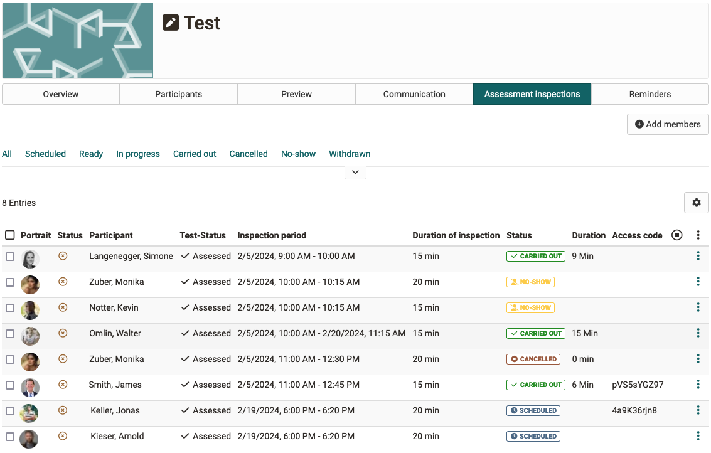
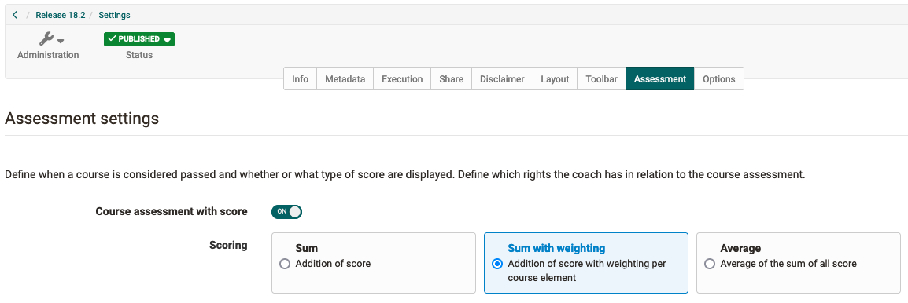
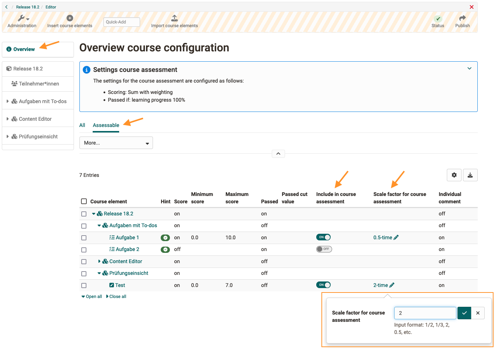

# Release notes 18.2

* * *

:material-calendar-month-outline: **Release date: 01/31/2024 • Last update: 06/12/2024**

* * *

With OpenOlat 18.2 we release our next major version.

The **To-dos** have been further expanded and are now also available **in courses** for direct assignment to participants, or can be generated automatically from the **Task course element**.

The **Content editor** for the 'Page' has been expanded to include the **'Code' block**, and in the 'Video' block **videos by URL** can also be integrated. A **rubric star rating** is possible in the form, participants can **comment on their answers**, and the display of the blocks and the handling of the layouts have been harmonized.

In the eAssessment area, **score weighting** is possible for assessable elements in the learning path course. The new **assessment inspection** offers individual participants controlled access to their test results. The **redesign of the test start page and the performance summary** with matching icons better highlight relevant information for participants. New **certificate variables** are available for the assessment with 'grade/level'.

The **Usage for learning resources** clearly defines whether the resource is integrated into a course or used directly (standalone) with its own member and access management. It is now possible to link to **external websites** in the main menu, and the system-wide configuration of certain **default values for course elements** is also possible.

For the quality management, the **data collection preview** provides an overview of upcoming surveys and enables the targeted **rescheduling** of individual surveys.

Usability and user experience** are not neglected either: The central placement of the **course configuration overview** in the editor, **optimized texts** for information, system messages and notifications as well as numerous **harmonized** displays, labels, icons and dialogs round off the new OpenOlat release.

Since release 18.1, over 70 new features and improvements have been added to OpenOlat. Here you can find the most important new features and changes. In addition, more than 90 bugs have been fixed. The complete list of changes in 18.1 - 18.1.6 can be found [here](Release_notes_18.1.md){:target="_blank”}.

* * *

## Usage of learning resources

Usually, learning resources are integrated into courses for optimal use. However, due to their own member administration, access control and individual runtime functions, all learning resources can also be used independently of courses. However, this is rarely desired or only makes sense for certain scenarios (e.g. blog, podcast, wiki).

Therefore, from release 18.2.0, the usage of learning resources can be configured transparently:

* [x] Usage of learning resources: `Learning resource > Settings > Tab 'Share' > Section 'Usage' > Usage`

By default, only courses are treated as 'Standalone' with comprehensive member management and access control. All other learning resources are designed by default for 'embedding in courses', i.e. member and release management as well as specific runtime functions are hidden or only available in reduced form.

{ class="shadow lightbox" title="Usage of learning resources" }

Under `Courses > My courses` only 'standalone' resources are displayed.

* * *

## To-dos: New areas of application

The to-do infrastructure is now available in OpenOlat courses and has been functionally expanded:

### To-dos for course participants

Specific or additional tasks for course participants can now be easily distributed via the new course to-dos. The 'To-dos' area can be accessed via the course administration. Course owners and coaches can use it to create specific to-dos for all or selected course participants. A to-do that is assigned to several participants must be processed and completed individually by all of them.

{ class="shadow lightbox" title="Course to-dos overview" }

In the to-dos overview, course owners and coaches can keep track of the status of the to-dos and manage them. If necessary, it can be configured in the course settings so that coaches only have read-only access to the to-dos.

* [x] Edit course to-dos for coaches: 'Course settings > Options > 'Coach settings' section > Edit to-dos'

Course to-dos are also available in the personal user tool 'To-dos' and are labeled with the context 'Course'.

### Generate to-dos from task

!!! info "Note"

    This function is only available for learning path courses.

To-dos can be created automatically in the task element for the steps ’Task assignment', 'Submission of the solution' and 'Submission of the revised solution' if a deadline is set for each of these.

* [x] Activate task to-dos: 'Course editor > 'Reminders & to-dos' tab > Create to-dos automatically'

Coaches can track the status of participants' to-dos:

{ class="shadow lightbox" title="Task to-dos - overview for coaches" }

The to-dos appear in the participants' personal user tool 'To-dos'. This means they always have an overview of when certain tasks have to be collected and when solutions or revisions have to be submitted.

Participants cannot actively mark the to-dos from task modules as 'Completed'; this is done automatically, e.g. after selecting a task or after the final submission of solution documents.

{ class="shadow lightbox" title="Task to-dos - overview for participants" }

### Further updates for to-dos

* Action 'Duplicate' for to-dos
* Optimized sorting of to-dos
* Project templates: No e-mails are sent to users when to-dos are assigned

* * *

## Content editor / form

New or extended content blocks are available in the content editor of the form / course element 'Page'.

### New 'Video' block

In the 'Video' block, videos can now also be integrated via URL. A corresponding option has been added to the media center for this purpose. The video formats MP4 and m3u8 as well as the platforms Youtube, Vimeo, Panopto and nanoo.tv are supported.

### New 'Code' block

The new 'Code' block enables text to be displayed in a font with fixed spacing and numbering of the lines. This is particularly useful for technical learning content such as programming examples. The programming language used can be selected when creating the code block. Participants can copy the code template directly to the clipboard for further processing.

{ class="shadow lightbox" title="Code block in the content editor" }

### New block style 'Alert'

As of :octicons-tag-24: Release 18.2.3, content blocks and layouts can be displayed as a formatted alert box if required. When selecting a predefined alert type, important information is clearly highlighted by a corresponding color of the box - if desired with a matching icon. A set of additional colors and icons for custom alert style of the box is also available.

{ class="shadow lightbox" title="Page with alert boxes" }

### Background color and spacing

To emphasize content a background color can be set for layouts from :octicons-tag-24: Release 18.2.5. With the optional display of the spaces between the individual content areas, these are also visually separated from each other.

{ class="shadow lightbox" title="Layout with background and spacing" }

### Further updates in the form editor

=== "Small spacing"

    { class="shadow lightbox" title="Small spacing" }

=== "Medium spacing"

    { class="shadow lightbox" title="Medium spacing" }

=== "Extra-large spacing"

    { class="shadow lightbox" title="Extra-large spacing" }

* Uniform spacing for content blocks; choice between different layout options (e.g. medium, user-defined or no spacing)
* Delete a layout block: move content to upper block or delete it as well
* Learning resource 'Form':
    * New rubric type 'Discrete with stars' for star rating
    * Additional comments for participants on the selected rubric answer
    * Optimized cards display of rubrics
    * Harmonization of layout block settings

* * *

## eAssessment area

### Assessment inspection

With the new assessment inspection, exam participants can be granted individual and controlled access to their test results. This makes it possible, for example, for individual participants and the lecturer to discuss the exams in detail.

#### Authors' view

The standard configuration of an assessment inspection in the respective course is created by the course authors. The duration of the inspection and the display details for the results are defined. If required, additional restrictions on the IP address space or the use of the Safe Exam Browser can be configured. It is possible to create several different inspection variants.

* [x] Create assessment inspection: 'Course administration > Assessment management > 'Configuration assessment inspection' tab

{ class="shadow lightbox" title="Assessment inspection - Configuration" }

#### Coach view

Via the new 'Assessment inspection' tab on the 'Test' element or via the assessment tool, coaches can select the test participants and create appointments for assessment inspection - with an individual access code if required. They select one of the assessment inspection configurations stored in the course. Participants will receive a corresponding e-mail notification.

{ class="shadow lightbox" title="Assessment inspection - overview for coaches" }

#### Participant view

Participants can start the assessment inspection within the defined time via a pop-up window - if necessary after entering their access code - and thus gain access to their test results.

{ class="shadow lightbox" title="Assessment inspection - start by participant" }

### Weighted score

!!! info "Note"

    This function is only available for learning path courses.

If there are several assessments to be completed in a course, these are sometimes included in the overall assessment of the course with different weightings. The new option 'Sum for weighting' for the course assessment makes it possible to enter a scaling factor for the points for assessable course elements. The prerequisite is that these assessable course elements are included in the course assessment.

* [x] Activate weighting for scores: 'Course settings > Assessment > Activate 'Course assessment with score' > 'Sum with weighting' option'.

{ class="shadow lightbox" title="Activate course assessment with weighted score" }

In the course configuration overview, the scaling for all assessable course elements can be checked and set or edited directly if necessary. The 'Assessable' pre-filter provides a compact view of the assessable course elements.

{ class="shadow lightbox" title="Course configuration" }

The weighted score is displayed to coaches in the assessment form. For participants, the weighted score is visible in the performance summary of the respective assessable course element and in the evidence of achievement.

### Redesign: Performance summary + start page 'Test'

The previous tabular format of the performance summary for assessable course elements and structural elements has been replaced by a more attractive and clearer presentation. All performance data such as success status, assessment (levels/grading), score, number of attempts, evidence of achievement and test receipt are now presented to participants in a graphically refreshed format with a matching icon.

For the 'Test' course element, the display of important information about taking the test has been redesigned and expanded. In compact form, participants are given an overview of relevant key data such as availability and duration of the test, maximum score and score weighting, number of attempts and when the test is considered 'passed'.

=== "New design"

    { class="shadow lightbox" title="Redesign of the performance summary and test start page" }

=== "Old design"

    { class="shadow lightbox" title="Old design of the performance summary and test start page" }

### Optimizations for learning path courses

* Assessable course elements: Changed the option 'Exclude from assessment' to 'Include in course assessment'
* Learning path configuration overview:
    * New column for (de)activatable option 'Include in course assessment' for assessable course elements
    * New option for entering or changing the scaling factor for score weighting for assessable course elements
* UI/UX: Configuration of the overall assessment rearranged and supplemented

### Further updates in the eAssessment area

* Course certificate: Addition of variables for achieved grade/level ($grade, $gradeLabel, $gradeCutValue)
* UI/UX: Harmonization of the presentation and display of assessment documents in the assessment form and in the performance summary
* UI/UX: New icons for 'success status' and 'badge' in the performance summary
* UI/UX: Course element 'Test': Optimization of the information texts for the actions 'Reopen finished test run' and 'Reset number of attempts'
* UI/UX: QTI Editor: Harmonization of the question types ‘Gap text', 'Gap with dropdown' and 'Numerical input'

* * *

## Further course updates

* UI/UX: Course editor: More prominent display of the course configuration overview in the left navigation
* UI/UX: Remaining on the selected course element after closing the editor
* UI/UX: Optimization of the publish dialog
* UI/UX: Saving the 'collapsed/uncollapsed' status of information boxes (e.g. course configuration overview)
* UI/UX: Course element ‘Participant list': Optimized selection of individual members for mail dispatch

* * *

## Updates in the authoring area

* Optimized differentiation of the 'Import' actions for learning resources in new 'Import file' and 'Embed via URL'
* Course creation: Allow administrative release for multiple organizational units
* Video Collection: Targeted publication of video learning resources (without offers and booking) in the 'Share' settings

* * *

## Quality management module

### Data collection preview

The data collection preview provides an overview of future data collections that are created manually or triggered by a data collection generator. The upcoming surveys can be further narrowed down by restricting them to a specific time period and using various filters (e.g. generator, topic type, status).

{ class="shadow lightbox" title="Data collection preview" }

After selecting a specific data collection, administrative roles can override the trigger time by adjusting the start and end dates.

The data collection preview can be called up in various OpenOlat areas by the roles mentioned:

Area | Role
---------|----------
 Quality management | Quality managers
 Curriculum | Curriculum administrators
 Course | Course owners, Learning resource managers

### Further updates in the QM module

* Variable for 'External reference' of the course in the title of the data collection generator
* Data collection generator type ‘Lectures of a coach in a course (follow-up survey)’ deleted

* * *

## Further, briefly noted

* Include link to external website in main navigation
* Optimized email notifications for the account lifecycle
* Updated options under 'Share link to this page': LinkedIn, Facebook, X, Email
* UI/UX: New filter element 'Scope' for predefined limitation of data
* UI/UX: Visual optimization of data details in tables, e.g. for to-dos and in the question pool
* UI/UX: Improved usability of the search field for taxonomy and organization
* UI/UX: Optimized display and label for the configuration page 'Password and authentication'
* UI/UX: Optimized system messages for non-deletable accounts
* Option for upload action in the Library module
* Badges: Integration of the Markdown UI library for simple formatting (breaks, lists) in the description text (:octicons-tag-24: release 18.2.1)
* Lectures management: Additional information on lectures and the corresponding course in the user details (:octicons-tag-24: release 18.2.2)
* Project:
    * 'Restore' and 'Delete permanently' for files marked as deleted (:octicons-tag-24: release 18.2.2)
    * Notification to new project members when they are added to the project (:octicons-tag-24: release 18.2.2)
* Quick search in user management (:octicons-tag-24: release 18.2.8)

* * *

## Administrative / Technical

### Default values for course & course elements

Various options in courses or course elements are sometimes used system-wide (e.g. due to the desired application scenarios or institutional specifications) differently from the standard configuration.

As of :octicons-tag-24: Release 18.2.1, certain default values can be preconfigured in 'Administration' for the following areas:

* Course: (De)activation of the evidence of achievement
* Course element 'Task': Active steps of the task workflow as well as document management and coaching of participants
* Course element 'Test': Display of the results
* Course element 'Participant folder': Configuration of the submission drop box for participants and the return box for coaches
* Course element 'Survey': Authorizations for participation and display of results

### Further updates

* Optimized storage and management of individual user GUI settings (such as table and profile configurations) in a separate table for better handling and targeted resetting of individual configurations
* Update of third-party libraries
* Support for new Keycloak versions (17+)
* EduSharing SOAP API calls replaced by corresponding REST API calls (:octicons-tag-24: release 18.2.2)
* Course import/export with linked resources by soft key (:octicons-tag-24: release 18.2.6)

* * *

## System administrators: Activate / configure new functions

!!! note "Checklist after update to 18.2"

    The following functions have to be activated / configured in the `Administration` after an update to release 18.2:

    * [x] Default values for evidence of achievement: `Modules > Course > 'Use evidence of achievement' option`
    * [x] Default values for course elements: `Modules > Course elements`
    * [x] Assessment inspection: `e-Assessment > Assessment management > Tab 'Assessment management'` (:octicons-tag-24: release 18.2.2)
    * [x] Include external website in the main navigation: `Customizing > Sites > Tab 'External Site'`
    * [x] (De)activate data collection preview: `Modules > Quality management > Section 'Data collection preview'`
    * [x] Individual GUI settings for users:
        * All users: `Core Configuration > GUI Settings`
        * Individual users: `User management > Select user > GUI settings`

* * *

## More information

* [YouTrack Release notes 18.2.9](https://track.frentix.com/releaseNotes/OO?q=Fix%20versions:%2018.2.9&title=Release%20Notes%2018.2.9){:target="_blank”}
* [YouTrack Release notes 18.2.8](https://track.frentix.com/releaseNotes/OO?q=Fix%20versions:%2018.2.8&title=Release%20Notes%2018.2.8){:target="_blank”}
* [YouTrack Release notes 18.2.7](https://track.frentix.com/releaseNotes/OO?q=Fix%20versions:%2018.2.7&title=Release%20Notes%2018.2.7){:target="_blank”}
* [YouTrack Release notes 18.2.6](https://track.frentix.com/releaseNotes/OO?q=Fix%20versions:%2018.2.6&title=Release%20Notes%2018.2.6){:target="_blank”}
* [YouTrack Release notes 18.2.5](https://track.frentix.com/releaseNotes/OO?q=Fix%20versions:%2018.2.5&title=Release%20Notes%2018.2.5){:target="_blank”}
* [YouTrack Release notes 18.2.4](https://track.frentix.com/releaseNotes/OO?q=Fix%20versions:%2018.2.4&title=Release%20Notes%2018.2.4){:target="_blank”}
* [YouTrack Release notes 18.2.3](https://track.frentix.com/releaseNotes/OO?q=Fix%20versions:%2018.2.3&title=Release%20Notes%2018.2.3){:target="_blank”}
* [YouTrack Release notes 18.2.2](https://track.frentix.com/releaseNotes/OO?q=Fix%20versions:%2018.2.2&title=Release%20Notes%2018.2.2){:target="_blank”}
* [YouTrack Release notes 18.2.1](https://track.frentix.com/releaseNotes/OO?q=Fix%20versions:%2018.2.1&title=Release%20Notes%2018.2.1){:target="_blank”}
* [YouTrack Release notes 18.2.0](https://track.frentix.com/releaseNotes/OO?q=fix%20version:%2018.2.0&title=Release%20Notes%2018.2.0){:target="_blank”}
