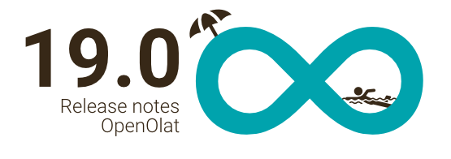

# Release Notes 19.0

* * *

:material-calendar-month-outline: **Releasedatum: 10.07.2024 • Letztes Update: 15.08.2024**

* * *

Mit OpenOlat 19.0 geben wir unseren nächsten Major Release frei.

Die **Ordner-Komponente** wurde komplett erneuert, der neue **File Hub** ist Drehscheibe für den Zugriff auf eigene Dateien, und die **SharePoint-Integration** ermöglicht einen Zugang zu externen Dateien.

Im Aufgabenbaustein wurde neben der **Rubric-Bewertung** und einer neuen **Workflow-Anzeige** auch das umfangreiche **Peer Review** für gegenseitiges Teilnehmenden-Feedback integriert. Der neue **Kursbaustein Themenbörse** bietet eine **faire Einschreibung** von Teilnehmenden in ausgewählte und priorisierte Themen.

Der **Content Creator** bietet mit den neuen Inhaltsblöcke **Bildvergleich**, **Bildergalerie** und **Quiz** weitere Elemente zur didaktischen Aufbereitung von Inhalten. Eine **Auffrischung** für **Blog und Podcast**, die **Portfolioaufgabe** sowie die Kommentar-Komponente sorgen für einen frischen Look.

Ausserdem wurden zusätzliche Regeln zur **Vergabe von Badges** ergänzt, die **Kursarchivierung** mit asynchronem Prozess neu aufgebaut und eine **KI-gestützte Generierung** von Multiple Choice Fragen implementiert.

Zahlreiche Optimierungen rund um **Usability und User Experience** runden diesen Release ab.

Seit Release 18.2 wurden über 115 neue Funktionen und Verbesserungen zu OpenOlat hinzugefügt. Hier finden Sie die wichtigsten Neuerungen zusammengefasst. Zusätzlich wurden mehr als 125 Bugs behoben. Die komplette Liste der Änderungen in 18.2 – 18.2.13 finden Sie [hier](Release_notes_18.2.de.md){:target="_blank”}.

* * *

## Ordner und Dateien

### Redesign Ordner-Komponente

Bye, bye 20 Jahre alte Codebasis: Die komplett [überarbeitete Ordner-Komponente](../manual_user/basic_concepts/Folder_Concept.de.md){:target="_blank”} mit neuem Look-and-feel bietet mehr als nur eine Dateiensammlung.

Per Drag-and-Drop-Unterstützung lassen sich einzelne oder mehrere Dateien gleichzeitig bequem hochladen, über die ordnerweite Suchfunktion wird eine gewünschte Datei schnell gefunden.

Die Ordnerinhalte können in hierarchischer Ordnerstruktur oder als flache Dateienliste angezeigt werden - entweder in der kompakten Tabellenansicht oder in der erweiterten Card View. Via Lightbox lassen sich Bilder, Videos und mehr in der Vorschau öffnen, neue Dateien werden explizit gekennzeichnet.

Im neuen Papierkorb (`Administration > Core Konfiguration > Dateien und Ordner > Tab Papierkorb`) werden alle gelöschten Dateien aufgelistet und nach einer definierten Zeitspanne automatisch gelöscht.

=== "Ansicht Dateien"

    { class="shadow lightbox" title="Ansicht Dateien" }

=== "Drag and Drop-Funktion"

    { class="shadow lightbox" title="Drag and Drop-Funktion" }

### File Hub

Der neue [File Hub](../manual_user/basic_concepts/File_Hub_Concept.de.md){:target="_blank”} ist als persönliches Werkzeug verfügbar und ersetzt den bisherigen 'Persönlichen Ordner'. Als zentraler Einstiegspunkt können Benutzer:innen alle ihre Dateien aus verschiedenene OpenOlat-Bereichen finden und diese durchsuchen. Die Dateien und Ordner sind analog zur WebDav-Ansicht gruppiert.

Der Zugriff auf die eigenen Dateien ist systemweit über die Aktion "Aus File Hub hinzufügen" möglich, um die Dateien an anderen Orten in OpenOlat zu verwenden.

Hinweis: Der Zugang zum Media Center ist unabhängig vom File Hub.

=== "File Hub Dashboard"

    { class="shadow lightbox" title="File Hub Dashboard" }

=== "File Hub Dialog"

    { class="shadow lightbox" title="Dialog 'Aus File Hub hinzufügen'" }

### Sharepoint-Integration

Die Integration des Sharepoint Online Drives der Organisation ist im Media Center und im File Hub realisiert. Anhand der entsprechenden Berechtigungen ist der direkte Zugriff auf Inhalte des eigenen OneDrives in OpenOlat möglich und es können Dateien von und nach Sharepoint Online kopiert werden.

{ class="shadow lightbox" title="SharePoint-Integration" }

* * *

## Content Creator

Der Content Editor des Kursbausteins 'Seite' wird zum [Content Creator](../manual_user/basic_concepts/Content_Editor.de.md){:target="_blank”} und bietet ab Release 19.0 weitere nützliche Blöcke zur didaktischen Aufbereitung von Inhalten.

Der Auswahldialog zum Hinzufügen von Inhalten im Content Creator und Formular-Editor wurde optimiert und bietet einen umfassenden Überblick über alle verfügbaren Objekte.

### Neuer Block 'Bildvergleich'

Der Vergleich zweier Bilder eignet sich nicht nur für Vorher-Nachher-Abbildungen, sondern beispielsweise auch, um die Aufnahmen zweier Objekte, Techniken, Orte und vieles mehr gegenüberzustellen.

{ class="shadow lightbox" title="Varianten des Bildvergleichs" }

### Neuer Block 'Bildergalerie'

Mit der Bildergalerie können mehrere Bilder auf attraktive Weise und in verschiedenen Anwendungsfällen auf der Seite platziert und dargestellt werden.

{ class="shadow lightbox" title="Varianten der Bildergalerie" }

### Neuer Block 'Quiz'

Mit der Einbindung von Quizfragen sind kleinere Wissensüberprüfungen möglich. Autoren können dabei die gewünschten Fragen direkt neu erstellen oder aus dem Fragenpool aus ihren bereits vorhandenen ausgewählen.

{ class="shadow lightbox" title="Verschiedene Ansichten integrierter Quizfragen" }

* * *

## Peer Review

Die Überprüfung und Bewertung von eingereichten Aufgaben von Teilnehmenden konnte bisher nur durch die jeweiligen Betreuenden erfolgen. Mit der Implementierung des [Peer Reviews](../manual_user/learningresources/Course_Element_Task.de.md#revisions){:target="_blank”} haben nun auch Teilnehmende die Möglichkeit, gegenseitig Feedback zu den gelösten Aufgaben abzugeben.

Das Peer Review ist als optionaler Workflow-Schritt im Kursbaustein 'Aufgabe' konzipiert. Für die Beurteilung und Bewertung kann ein entsprechender Rubrik-Fragebogen (Lernressource 'Formular') eingebunden werden.

Für die Durchführung bietet das Peer Review diverse Konfigurationsmöglichkeiten wie zum Beispiel verschiedene Review-Formen (Offen, Einfach-/Doppelblind) und die Auswahl der Review-Anzahl, ein optionales Qualitätsfeedback, die Übernahme der Review-Punkte in die Gesamtbwertung sowie ein zusätzliches Experten-Review durch den/die Betreuer:in.

{ class="shadow lightbox" title="Peer Review eines Teilnehmenden im Aufgabenbaustein" }

Die neue Workflow-Ansicht für Betreuende im Aufgabenbaustein bietet eine kompakte Gesamtschau zum Stand der Teilnehmenden in den einzelnen Aufgabenschritten, so auch für das Peer Review.

{ class="shadow lightbox" title="Workflowschritt 'Peer Review' im Überblick" }

* * *

## Rubrik-Bewertung

Bisher war eine kriterienbasierte Bewertung über den Baustein 'Manuelle Bewertung' möglich, im Aufgabenbaustein konnte jedoch ein detailliertes Feedback nur über ein externes Dokument abgegeben werden. Mit Release 19.0 wurde der Einsatz der Rubrik-Bewertung erweitert und verbessert:

* Optimierte Einbindung der Formular-Ressource zur Rubrik-Bewertung im Kursbaustein 'Manuelle Bewertung'
* Integration eines Rubrik-Formulars für die Bewertung im Kursbaustein 'Aufgabe'
* Redesign der Integration von Rubrik-Berwertungen im Bewertungswerkzeug inklusive Bewertungsworkflow

{ class="shadow lightbox" title="Integration Rubrik-Formular Aufgabenbaustein" }

* * *

## Neuer Kursbaustein 'Themenbörse'

Wer zuerst kommt, mahlt zuerst? Diese Problematik löst der neue Kursbaustein ['Themenbörse'](../manual_user/learningresources/Course_Element_Topic_Broker.de.md){:target="_blank”} mittels Stable matching Algorithmus, der eine faire Einschreibung der Teilnehmenden in angebotene Themen sicherstellt.

Am Baustein ist eine Liste der möglichen Themen und Projekte mit entsprechender Detail-Beschreibung verfügbar. Die Teilnehmenden wählen und priosieren ihre gewünschten Themen. Im Auswahlprozess werden die jeweiligen Prioritätenwünsche der Teilnehmenden berücksichtigt und die Zuweisung der Themen fixiert.

{ class="shadow lightbox" title="Kursbaustein Themenbörse - Sicht Teilnehmende" }

Optional werden die Teilnehmenden per E-Mail über die finale Einschreibung informiert.

Via Import-Funktion können mehrere Themen auf einmal erstellt werden, mit der Sammelaktion 'Löschen' werden überflüssige Themen im GUI wieder entfernt. Zur Weiterverarbeitung liefert der Excel-Export eine Übersicht aller angebotenen Themen sowie die Einschreibungen pro Thema.

* * *

## Auffrischung 'Blog' und 'Podcast'

Die Lernressourcen Blog und Podcast wurden visuell überarbeitet und um nützliche Funktionen erweitert.

Die Einzelvorschau der Beiträge wurde optisch modernisiert, Elemente und Aktionen neu positioniert sowie der Veröffentlichungsstatus hervorgehoben. In der kompakten Tabellenansicht ist eine Massenaktion zum Löschen mehrerer Beiträge verfügbar. Verschiedene Filter und die Suchfunktion unterstützen, einen bestimmten Beitrag schnell zu finden.

Eine zusätzliche thematische Verschlagwortung und Gruppierung der Beiträge ist durch die Vergabe von Tags möglich. Kommentare und Sternchen-Bewertung sind pro Blog/Podcast optional konfigurierbar. Bei Bedarf kann auch ein Abonnement zur Benachrichtigung über neue Beiträge aktiviert werden. Ab Release 19.0.2 kann ausserdem auf einzelne Beiträge direkt verlinkt werden.

Ergänzend wurden die Aktionen zur Erstellung eines internen oder externen Blogs/Podcasts optimaler im Autorenbereich platziert.

=== "Neue Ansicht Blog"

    { class="shadow lightbox" title="Neue Ansicht Blog" }

=== "Alte Ansicht Blog"

    { class="shadow lightbox" title="Alte Ansicht Blog" }

* * *

## Neugestaltung Kursbaustein 'Portfolioaufgabe'

Der Kursbaustein 'Portfolioaufgabe' wurde optisch überarbeitet. Teilnehmende erhalten mit der Vorschau auf die Portfoliomappe die wichtigsten Informationen und können von dort direkt zum Portfoliobereich springen. Ein Hinweis am Baustein zeigt an, wenn noch keine Zugriffsfreigabe für Gutachter:innen eingerichtet wurde. Dies kann mit wenigen Klicks direkt am Baustein erfolgen.

=== "Neue Ansicht für Teilnehmende"

    { class="shadow lightbox" title="Neue Ansicht Portfolioaufgabe für Teilnehmende" }

=== "Alte Ansicht für Teilnehmende"

    { class="shadow lightbox" title="Alte Ansicht Portfolioaufgabe für Teilnehmende" }

Gutachter:innen und Betreuende finden in der Teilnehmendenliste am Baustein einen Direktlink zur Portfoliomappe, wenn diese oder bestimmte Einträge entsprechend von den Teilnehmenden für Kommentare bzw. die Bewertung freigegeben wurden.

=== "Neue Ansicht für Betreuende"

    { class="shadow lightbox" title="Neue Ansicht Portfolioaufgabe für Teilnehmende" }

=== "Alte Ansicht für Betreuende"

    { class="shadow lightbox" title="Alte Ansicht Portfolioaufgabe für Teilnehmende" }

* * *

## Kursarchivierung und Reporting

Bisher konnten Kurs-Logfiles, Reports sowie Kursbaustein-Daten nur umständlich und jeweils einzeln archiviert werden. Der neue und überarbeitete Bereich ['Archivierung und Reporting'](../manual_user/learningresources/Course_Archiving.de.md){:target="_blank”} in der Kursadministration ermöglicht eine schnelle und einfache Teil- bzw. Gesamt-Archivierung eines Kurses.

Ein Wizard unterstützt bei der Auswahl der zu archivierenden Daten aller oder ausgewählter Kursbausteine sowie zusätzlicher Reports (Chatprotokoll, Kursresultate) und Logfiles. Die Archivierung selbst erfolgt anschliessend im Hintergrund als asynchroner Prozess. Fertige Archive stehen standardmässig 10 Tage zum Herunterladen zur Verfügung, danach werden sie automatisch gelöscht.

Über den Autorenbereich können auch mehrere Kurse gleichzeitig archiviert werden, ebenso ist eine Archivierung via Rest API möglich.

Abgrenzung: Im Gegensatz zu einem Backup dient das Archiv nicht dazu, den Kurs bzw. die Daten auf einem anderen System oder zu einem späteren Zeitpunkt wiederherstellen zu können!

{ class="shadow lightbox" title="Kursarchivierung mit vorhandenen Archiven" }

* * *

## Neues rund um Badges

Zur Abdeckung weiterer - auch gamifizierter - Szenarien wurden auf globaler sowie Kursebene zusätzliche Regeln zur Vergabe von Badges implementiert. So ist der Erhalt neuer Bagdes beispielsweise nach dem Bestehen von bewertbaren Kursbausteinen oder mehreren Kursen, nach Erreichen einer bestimmten Punktzahl oder eines bestimmten Lernfortschritts sowie nach dem Erwerb anderer definierter Badges möglich.

{ class="shadow lightbox" title="Regeln zur Vergabe von Badges" }

Weitere Optimierungen:

* Badge-Verlinkung und Anzeige im LinkedIn-Profil
* Kopie von Badges bei Kurs-Kopie
* Diverse Optimierungen für Anzeige und Handhabung

* * *

## AI Integration

Als Basis für KI-Funktionen wurde die OpenAI API integriert. Im ersten Ansatz ist im Fragenpool die automatische Generierung von Multiple Choice Fragen für Tests auf der Grundlage des GPT-Modells möglich. Dabei werden die Fragen mit Antwortmöglichkeiten erstellt sowie eine Reihe von Metadaten der einzelnen Frage-Items (Schlagworte, Thema und Taxonomie) vorausgefüllt.

=== "Fragen mit KI generieren"

    { class="shadow lightbox" title="Fragen mit KI generieren" }

=== "Resultat: KI-generierte Frage"

    { class="shadow lightbox" title="KI-generierte Frage" }

* * *

## UX und Usability

* Verbesserte Accessibility durch neuen HTML-Dialog und Optimierung von Farbkontrasten
* Optimierung der Hintergrund- und Rahmenfarben der verschiedenen Light/Basic-Theme-Komponenten
* Überarbeitung des Session-timeout-Dialogs

{ class="shadow lightbox" title="Session-timeout-Dialog" }

* Optimierter Dialog bei Entfernung einzelner oder mehrerer (Gruppen-)Mitglieder aus einem Kurs
* Optimierter E-Mail-Text bei Hinzufügen von Mitgliedern zu einem Kurs, Curriculum oder einer Gruppe
* Vereinheitlichung der Bezeichnungen für Suchfilter
* Infotext zur Sichtbarkeit von Kalendereinträgen
* Harmonisierung der Angaben zu letzter Aktivität und letzter Zugriff
* Überarbeitung des Krümelpfades für optimierte Navigation
* Überarbeitung des "Inhalt hinzufügen"-Dialoges im Content Creator

{ class="shadow lightbox" title="Neuer Dialog - Inhalte hinzufügen" }

* Gruppenverwaltung und -konfiguration:
    * Optimierte Label bei ausstehender Bestätigung der Mitgliedschaft
    * Informationen zur Anzahl der Teilnehmenden bei limitierten Plätzen bzw. Überbuchung
* Prüfungsmodus: Optimierung der Bezeichnungen für die verschiedenen Status, Labels, Aktionen sowie Hinweistexte
* Neugestaltung der Resultate-Übersicht im Leistungsnachweis**

{ class="shadow lightbox" title="Optimierte Übersicht - Leistungsnachweis" }

* Kursbaustein 'Test': Informationen auf der Test-Startseite zu automatischem Testeinzug sowie Aktualisierung der Testdauer und Verfügbarkeit bei Nachteilsausgleich (:octicons-tag-24: ab Release 19.0.3)
* Lernpfad: Optimierte Konfiguration, wann der Kurs bestanden ist (:octicons-tag-24: ab Release 19.0.3)
* Optimierte und modernisierte Gestaltung der Kommentar-Komponente (:octicons-tag-24: ab Release 19.0.3)

* * *

## Weiteres, kurz notiert

* Autorenbereich:
    * Aktivierung von Filtern mit nur einer Option (z.B. Favoriten, Meine Ressourcen) per Direktklick
    * Ergänzung des 'Kennzeichen'-Feldes bei Import einer externen Ressource via URL
* Kursbaustein 'Aufgabe': Aktualisieren der Frist für To-do bei Verlängerung
* Kursbaustein 'Formular': Erweitertung des Exports um hochgeladene Dateien
* Kurserinnerungen:
    * Kursstatus als neue Bedingung
    * Gezielter Versand an Betreuer:innen, Besitzer:innen oder Externe Personen anstelle der ursprünglichen Empfänger
* Projekttool:
    * Optimierung der Timeline
    * Harmonisierung des Dialogs für Einzel- und Massenaktion 'Löschen'
* Fragenpool: Ergänzung der Tabellenspalte 'Sprache'
* Kontoverwaltung: Optimierte Handhabung des Kontoablauf- bzw. Inaktivierungsdatums sowie Harmonisierung der Label
* Angabe Gültigkeitsdatum bei manuell oder per Rest API hinzugefügten Zertifikaten
* Aktualisierung der Konfiguration für Audio-/Videorecordings in der Administration
* Herkömmlicher Kurs: Auswahl, ob alle oder nur eine bestimmte Anzahl an Bausteinen bestanden werden müssen, um den Kurs zu bestehen (:octicons-tag-24: ab Release 19.0.3)
* Ergänzung des Kurs-Kennzeichens sowie der Ext. ID im Excel-Export des Zertifikate-Reports (:octicons-tag-24: ab Release 19.0.3)
* Ergänzung eines Platzhalters im mehrzeiligen und formatierten RichText-Eingabefeld (:octicons-tag-24: ab Release 19.0.3)

* * *

## Administratives / Technisches

* Aktualisierung der Bibliotheken von Drittanbietern
* Unterstützung Multi-File-Upload
* Unterstützung von Desktop Drag & Drop events
* MS Teams: Migration der API von Beta auf Graph 1.0 inklusive Delegate Permissions; dadurch vereinfachte Konfiguration im Azure Portal (nur noch ein Login auf Azure für sämtliche Berechtigungen notwendig)
* Update von PDFBox auf 3.0.1
* Unsafe-Eval
* Gatling Tests Update + Java Refactoring
* Neue Komponente zur Datumsauswahl: vanillajs-datepicker
* Migrationsroutine "Kursmitglieder bereinigen" für alte Releases entfernt
* End of live: Integration von Inhalten in Kursbaustein 'Externe Seite' wird nicht mehr unterstützt (nur noch iFrame)
* Safe Exam Browser Integration (SEB): Refactoring der JavaScript API (:octicons-tag-24: ab Release 19.0.3)

* * *

## Systemadministratoren: Neue Funktionen aktivieren / konfigurieren

!!! note "Checkliste nach Update auf 19.0"

    Folgende Funktionen müssen nach einem Update auf Release 19.0 in der `Administration` aktiviert bzw. konfiguriert werden:

    * [x] Zeitspanne für automatisches Löschen der Dateien im Papierkorb: `Administration > Core Konfiguration > Dateien und Ordner > Tab 'Konfiguration'`
    * [x] SharePoint-Integration: `Externe Werkzeuge > Microsoft SharePoint / OneDrive`
    * [x] OpenAI für KI-generierte Fragen: `Externe Werkzeuge > KI Modul`

* * *

## Weitere Informationen

* [YouTrack Release Notes 19.0.3](https://track.frentix.com/releaseNotes/OO?q=fix%20version:%2019.0.3&title=Release%20Notes%2019.0.3){:target="_blank”}
* [YouTrack Release Notes 19.0.2](https://track.frentix.com/releaseNotes/OO?q=fix%20version:%2019.0.2&title=Release%20Notes%2019.0.2){:target="_blank”}
* [YouTrack Release Notes 19.0.1](https://track.frentix.com/releaseNotes/OO?q=fix%20version:%2019.0.1&title=Release%20Notes%2019.0.1){:target="_blank”}
* [YouTrack Release Notes 19.0.0](https://track.frentix.com/releaseNotes/OO?q=fix%20version:%2019.0.0&title=Release%20Notes%2019.0.0){:target="_blank”}
