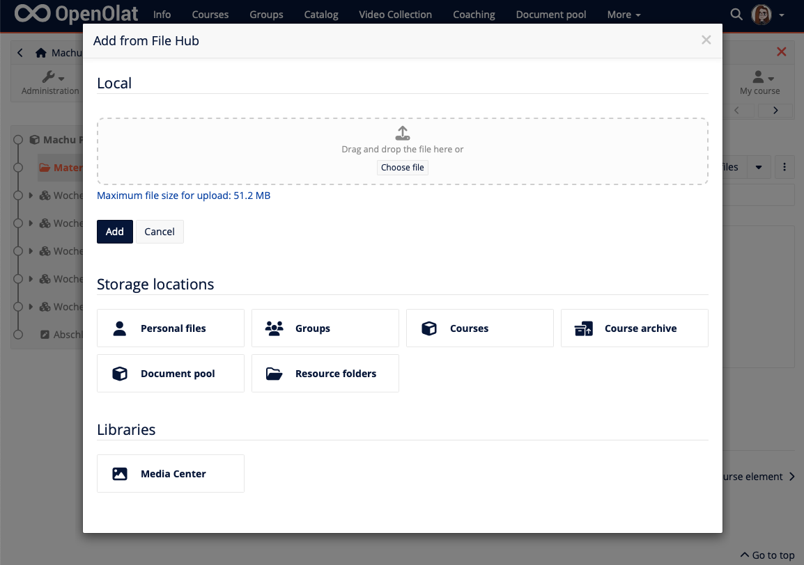

# Release notes 19.0

* * *

:material-calendar-month-outline: **Release date: 07/10/2024 • Last update: 09/27/2024**

* * *

With OpenOlat 19.0 we release our next major version.

The **Folder component** has been completely renewed, the new **File Hub** serves as a central point for accessing your own files, and the **SharePoint integration** enables access to external files.

In addition to the **Rubric assessment** and a new **Workflow display**, the comprehensive **Peer Review** for mutual participant feedback has also been integrated into the Task course element. The new **Topic broker** course element offers **fair enrolment** of participants in selected and prioritised topics.

The **Content Creator** offers further elements for the didactic preparation of content with the new content blocks **Image Comparison**, **Image Gallery** and **Quiz**. A **refresh** for **blog and podcast**, the **portfolio task** and the comment component provide a modernised look.

Furthermore, additional rules for **assigning badges** have been added, **course archiving** with an asynchronous process has been reorganised and **AI-supported generation** of multiple choice questions has been implemented.

Numerous optimisations relating to **usability and user experience** complete this release.

Since release 18.2, over 115 new features and improvements have been added to OpenOlat. Here you can find the most important new features and changes. In addition, more than 125 bugs have been fixed. The complete list of changes in 18.2 – 18.2.12 can be found [here](Release_notes_18.2.md){:target="_blank”}.

* * *

## Folders and files

### Redesign folder component

Bye, bye 20-year-old code base: the completely [redesigned folder component](../manual_user/basic_concepts/Folder_Concept.md){:target="_blank”} with a new look and feel offers more than just a file collection.

Drag-and-drop support makes it easy to upload single or multiple files at the same time, and the folder-wide search function allows you to quickly find the file you want.

The folder contents can be displayed in a hierarchical folder structure or as a flat file list - either in the compact table view or in the expanded card view. Images, videos and more can be opened in the preview via Lightbox, and new files are explicitly labelled.

All deleted files are listed in the new trash (`Administration > Core Configuration > Files and Folders > Trash tab`) and automatically deleted after a defined period of time.

=== "Display of files"

    { class="shadow lightbox" title="Display of files" }

=== "Drag and drop function"

    { class="shadow lightbox" title="Drag and drop function" }

### File Hub

The new [File Hub](../manual_user/basic_concepts/File_Hub_Concept.md){:target="_blank”} is available as a personal tool and replaces the previous 'Personal Folder'. As a central entry point, users can find and search all their files from different OpenOlat areas. The files and folders are grouped in the same way as the WebDav view.

Access to your own files is possible system-wide via the "Add from File Hub" action in order to use the files in other locations in OpenOlat.

Note: Access to the Media Centre is independent of the File Hub.

=== "File Hub dashboard"

    { class="shadow lightbox" title="File Hub Dashboard" }

=== "File Hub dialogue"

    { class="shadow lightbox" title="Add from File Hub dialogue" }

### Sharepoint integration

The integration of the organisation's Sharepoint Online drive is implemented in the Media Center and in the File Hub. With the appropriate authorisations, direct access to the content of your own OneDrive in OpenOlat is possible and files can be copied from and to Sharepoint Online.

{ class="shadow lightbox" title="SharePoint integration" }

* * *

## Content Creator

The Content Editor of the course element 'Page' becomes the [Content Creator](../manual_user/basic_concepts/Content_Editor.md){:target="_blank”} and offers further useful blocks for the didactic preparation of content from release 19.0.

The selection dialogue for adding content in the Content Creator and Form Editor has been optimised and offers a comprehensive overview of all available objects.

### New 'Image comparison' block

The comparison of two images is not only suitable for before and after images, but also, for example, to compare the images of two objects, techniques, locations and much more.

{ class="shadow lightbox" title="Variants of image comparison" }

### New 'Image gallery' block

With the image gallery, several images can be placed and displayed on the page in an attractive way and in different use cases.

{ class="shadow lightbox" title="Variants of the image gallery" }

### New block 'Quiz'

With the integration of quiz questions, smaller knowledge tests are possible. Authors can create the desired questions directly from scratch or select them from the existing question pool.

{ class="shadow lightbox" title="Different views of integrated quiz questions" }

* * *

## Peer review

The review and evaluation of tasks submitted by participants could previously only be carried out by the respective coaches. With the implementation of the [peer review](../manual_user/learningresources/Course_Element_Task.md#revisions){:target="_blank”}, participants now also have the opportunity to give each other feedback on the tasks they have completed.

The peer review is designed as an optional workflow step in the 'Task' course element. A corresponding rubric form (learning resource 'Form') can be integrated for assessment and evaluation.

The peer review offers various configuration options for implementation, such as different review forms (open, single/double-blind) and the selection of the number of reviews, optional quality feedback, inclusion of the review points in the overall assessment and an additional expert review by the coach.

{ class="shadow lightbox" title="Peer review of a participant in the task course element" }

The new workflow view for coaches in the task course element offers a compact overview of the participant's status in the individual task steps, including the peer review.

{ class="shadow lightbox" title="Workflow step 'Peer Review' at a glance" }

* * *

## Rubric assessment

Previously, criteria-based assessment was possible via the 'Manual assessment' course element, but in the ‘Task' course element detailed feedback could only be given via an external document. With Release 19.0, the use of rubric assessment has been expanded and improved:

* Optimised integration of the form resource for rubric assessment in the 'Manual assessment' course element
* Integration of a rubric form for assessment in the course element 'Task'
* Redesign of the integration of rubric assessments in the assessment tool including assessment workflow

{ class="shadow lightbox" title="Integration of rubric form in task course element" }

* * *

## New course element 'Topic broker'

First come, first served? The new ['Topic broker'](../manual_user/learningresources/Course_Element_Topic_Broker.md){:target="_blank”} course element solves this problem using a stable matching algorithm that ensures fair enrolment of participants in the topics offered.

The course element provides a list of possible topics and projects with a detailed description. Participants select and prioritise their desired topics. In the selection process, the participants' prioritisation wishes are taken into account and the allocation of topics is fixed.

{ class="shadow lightbox" title="Course element Topic broker - Participants' view" }

Optionally, participants are informed by e-mail about the final enrollment.

The import function can be used to create several topics at once, while the 'Delete' bulk action removes unneeded topics in the GUI. For further processing, the Excel export provides an overview of all topics offered as well as the enrollments per topic.

* * *

## Refresh 'Blog' and 'Podcast'

The blog and podcast learning resources have been given a visual overhaul and useful functions have been added.

The individual preview of posts has been visually modernised, elements and actions have been repositioned and the publication status has been highlighted. A bulk action for deleting multiple posts is available in the compact table view. Various filters and the search function help users to find a specific post quickly.

Additional thematic categorisation and grouping of posts is possible by assigning tags. Comments and star ratings can be optionally configured for each blog/podcast. If required, a subscription for notification of new posts can also be activated. From release 19.0.2, it is also possible to link directly to individual posts.

In addition, the actions for creating an internal or external blog/podcast have been placed more optimised in the author area.

=== "New blog view"

    { class="shadow lightbox" title="New blog view" }

=== "Old view blog"

    { class="shadow lightbox" title="Old blog view" }

* * *

## Redesign of the 'Portfolio task' course element

The 'Portfolio task' course element has been visually redesigned. Participants receive the most important information with the preview of the portfolio folder and can jump directly to the portfolio area from there. A note on the course element indicates if no access authorisation has yet been set up for reviewers. This can be done with just a few clicks directly on the course element.

=== "New view for participants"

    { class="shadow lightbox" title="New portfolio task view for participants" }

=== "Old view for participants"

    { class="shadow lightbox" title="Old portfolio task view for participants" }

Reviewers and coaches will find a direct link to the portfolio folder in the list of participants on the course element if these or certain entries have been approved by the participants for comments or assessment.

=== "New view for coaches"

    { class="shadow lightbox" title="New portfolio task view for coaches" }

=== "Old view for coaches"

    { class="shadow lightbox" title="Old portfolio task view for coaches" }

* * *

## Course archiving and reporting

Until now, course log files, reports and course element data could only be archived individually and cumbersomely. The new and revised ['Archiving and reporting'](../manual_user/learningresources/Course_Archiving.md){:target="_blank”} area in course administration enables quick and easy partial or complete archiving of a course.

A wizard supports the selection of the data to be archived for all or selected course elements as well as additional reports (chat protocol, course results) and log files. The archiving itself then takes place in the background as an asynchronous process. Finished archives are available for download for 10 days by default, after which they are automatically deleted.

Several courses can also be archived simultaneously via the authoring area, and archiving via Rest API is also possible.

Differentiation: In contrast to a backup, the archive is not used to restore the course or data on another system or at a later date!

{ class="shadow lightbox" title="Course archiving with existing archives" }

* * *

## News about badges

Additional rules for awarding badges have been implemented at global and course level to cover other scenarios, including game-based scenarios. For example, new badges can be awarded after passing assessable course elements or several courses, after achieving a certain number of points or a certain learning progress, and after acquiring other defined badges.

{ class="shadow lightbox" title="Rules for awarding badges" }

Further optimisations:

* Badge linking and display in LinkedIn profile
* Copy of badges when course is copied
* Various optimisations for display and handling

* * *

## AI integration

The OpenAI API was integrated as the basis for AI functions. In the first approach, the automatic generation of multiple choice questions for tests based on the GPT model is possible in the question pool. The questions are created with possible answers and a range of metadata for the individual question items (keywords, topic and taxonomy) is pre-filled.

=== "Generate questions with AI"

    { class="shadow lightbox" title="Generate questions with AI" }

=== "Result: AI-generated question"

    { class="shadow lightbox" title="AI-generated question" }

* * *

## UX and usability

* Improved accessibility through new HTML dialogue and optimisation of colour contrasts
* Optimisation of the background and frame colours of the various Light/Basic theme components
* Revision of the session timeout dialogue

{ class="shadow lightbox" title="Session-timeout-dialogue" }

* Optimised dialogue when individual or several (group) members are removed from a course
* Optimised email text when adding members to a course, curriculum or group
* Standardisation of the names for search filters
* Info text for the visibility of calendar entries
* Harmonisation of information on last activity and last access
* Revision of the breadcrumb path for optimised navigation
* Revision of the "Add content" dialogue in the Content Creator

{ class="shadow lightbox" title="Add content dialogue" }

* Group management and configuration:
    * Optimised label for pending confirmation of membership
    * Information on the number of participants in case of limited places or overbooking
* Assessment mode: Optimisation of the names for the various states, labels, actions and information texts
* Redesign of the results overview in the performance record**

{ class="shadow lightbox" title="Optimised overview of evidence of achievement" }

* Course element ‘Test’: Further information on the test start page on automatic test collection plus updating the test duration and availability in case of disadvantage compensation (:octicons-tag-24: release 19.0.3)
* Learning path: Optimised configuration when the course is passed (:octicons-tag-24: from release 19.0.3)
* Optimised and modernised look and feel of the comments component (:octicons-tag-24: from release 19.0.3)

* * *

## Further, briefly noted

* Authoring area:
    * Activation of filters with only one option (e.g. Favourites, My resources) via direct click
    * Addition of the ' Identifier' field when importing an external resource via URL
* Course element 'Task': Updating the deadline for to-do in case of extension
* Course element 'Form': Extension of the export to include uploaded files
* Course reminders:
    * Course status as new condition
    * Targeted sending to coaches, owners or external persons instead of the original recipients
* Project tool:
    * Optimisation of the timeline
    * Harmonisation of the dialogue for individual and bulk action 'Delete'
* Question pool: Addition of the 'Language' table column
* Account management: Optimised handling of the account expiry or inactivation date as well as harmonisation of the labels
* Specification of validity date for certificates added manually or via Rest API
* Update of the configuration for audio/video recordings in the administration
* Conventional course: Selection of whether all or only a certain number of course elements must be passed in order to pass the course (:octicons-tag-24: release 19.0.3)
* Added course reference and Ext. ID in the Excel export of the certificate report (:octicons-tag-24: from release 19.0.3)
* Addition of a placeholder in the multi-line and formatted RichText input field (:octicons-tag-24: release 19.0.3)

* * *

## Administrative / Technical

* Updating of third-party libraries
* Support multi-file upload
* Support for desktop drag & drop events
* MS Teams: Migration of the API from beta to Graph 1.0 including delegate permissions; this simplifies configuration in the Azure portal (only one login to Azure required for all authorisations)
* Update of PDFBox to 3.0.1
* Unsafe-Eval
* Gatling tests update + Java refactoring
* New component for date selection: vanillajs-datepicker
* Migration routine "Clean up course members" for old releases removed
* End of life: Option ‘Integrated completely (source hidden)’ for content in course element ‘External page’ is no longer supported
* Safe Exam Browser integration (SEB): Refactoring of the JavaScript API (:octicons-tag-24: release 19.0.3)
* Update pdf.js to version 4.6.82; fixes Firefox ESR 115 rendering issues (:octicons-tag-24: release 19.0.8)

* * *

## System administrators: Activate / configure new functions

!!! note "Checklist after update to 19.0"

    The following functions have to be activated / configured in the `Administration` after an update to release 19.0:

    * [x] Time period for automatic deletion of files in the trash: `Administration > Core configuration > Files and folders > Tab 'Configuration'`
    * [x] SharePoint integration: `External tools > Microsoft SharePoint / OneDrive`.
    * [x] OpenAI for AI-generated questions: `External tools > AI module`
    * [x] Apache configuration: Make sure that the (Apache) web server delivers *.mjs files with a suitable mimetype, as older distributions (especially RedHat) do not seem to contain the mjs mimetype.

* * *

## More information

* [YouTrack Release Notes 19.0.8](https://track.frentix.com/releaseNotes/OO?q=fix%20version:%2019.0.8&title=Release%20Notes%2019.0.8){:target="_blank”}
* [YouTrack Release Notes 19.0.7](https://track.frentix.com/releaseNotes/OO?q=fix%20version:%2019.0.7&title=Release%20Notes%2019.0.7){:target="_blank”}
* [YouTrack Release notes 19.0.6](https://track.frentix.com/releaseNotes/OO?q=fix%20version:%2019.0.6&title=Release%20Notes%2019.0.6){:target="_blank”}
* [YouTrack Release notes 19.0.5](https://track.frentix.com/releaseNotes/OO?q=fix%20version:%2019.0.5&title=Release%20Notes%2019.0.5){:target="_blank”}
* [YouTrack Release notes 19.0.4](https://track.frentix.com/releaseNotes/OO?q=fix%20version:%2019.0.4&title=Release%20Notes%2019.0.4){:target="_blank”}
* [YouTrack Release notes 19.0.3](https://track.frentix.com/releaseNotes/OO?q=fix%20version:%2019.0.3&title=Release%20Notes%2019.0.3){:target="_blank”}
* [YouTrack Release notes 19.0.2](https://track.frentix.com/releaseNotes/OO?q=fix%20version:%2019.0.2&title=Release%20Notes%2019.0.2){:target="_blank”}
* [YouTrack Release notes 19.0.1](https://track.frentix.com/releaseNotes/OO?q=fix%20version:%2019.0.1&title=Release%20Notes%2019.0.1){:target="_blank”}
* [YouTrack Release notes 19.0.0](https://track.frentix.com/releaseNotes/OO?q=fix%20version:%2019.0.0&title=Release%20Notes%2019.0.0){:target="_blank”}
