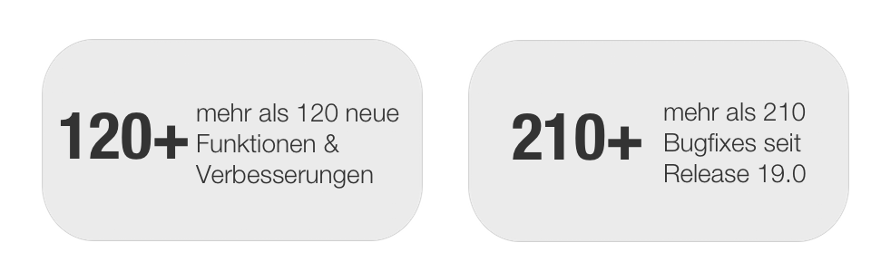
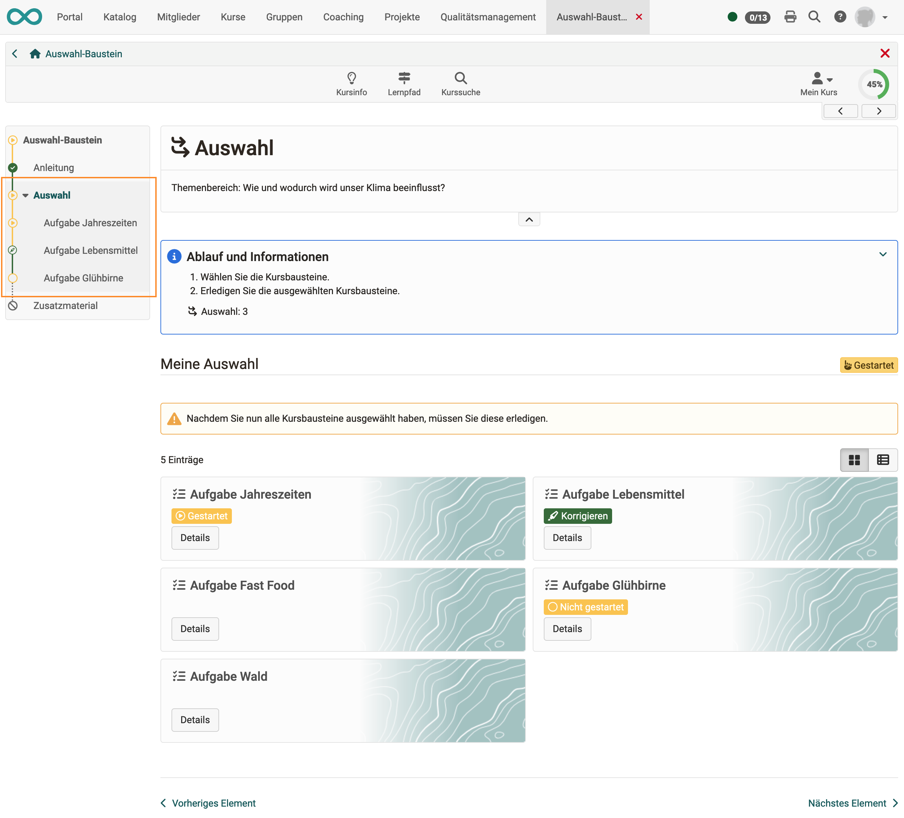
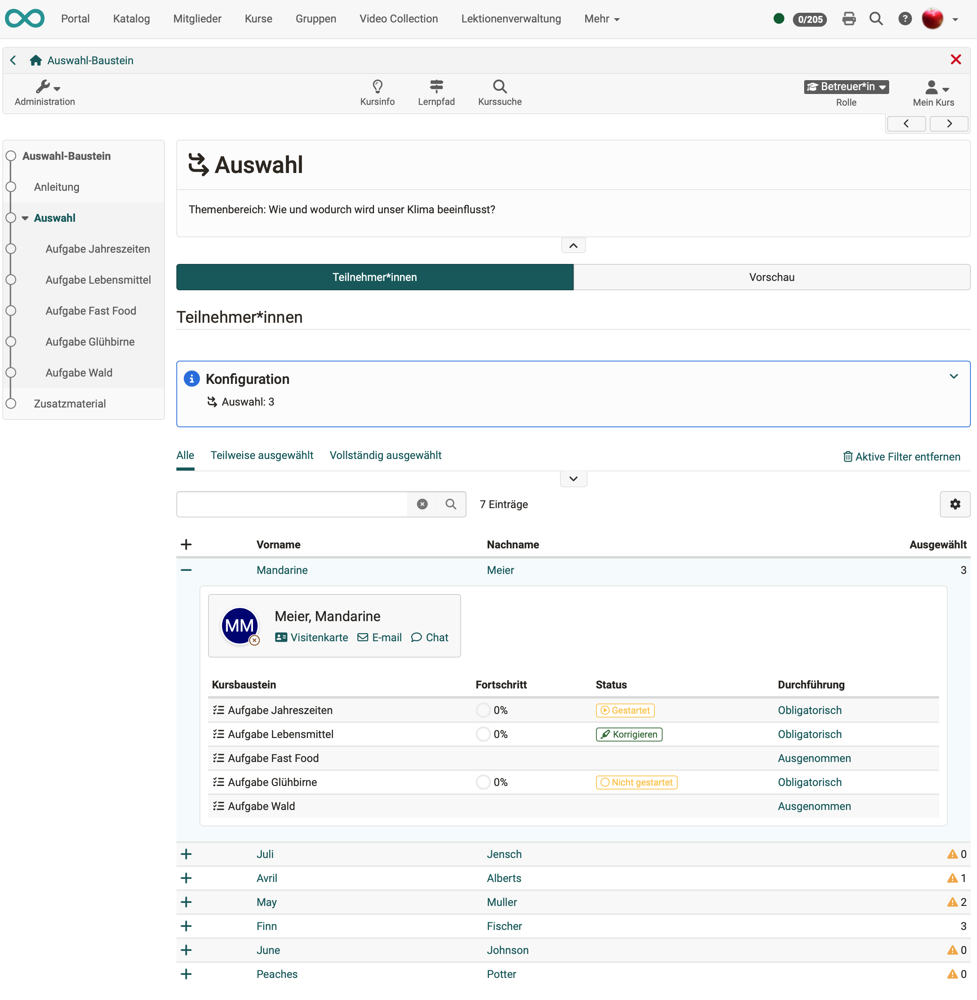
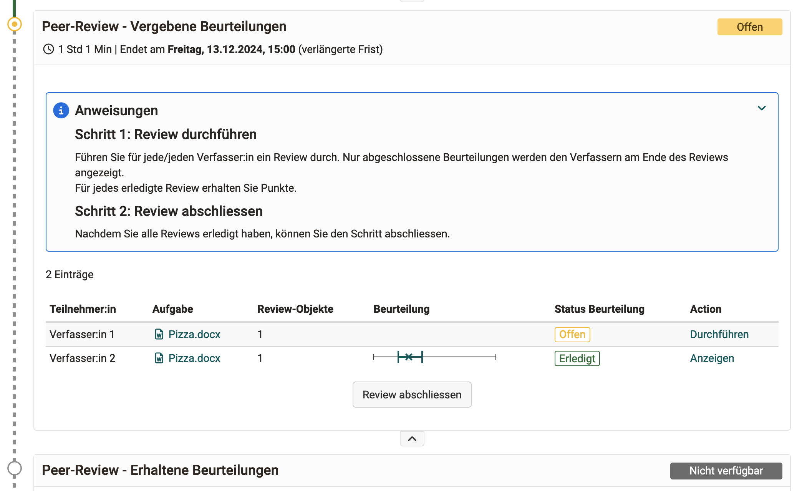
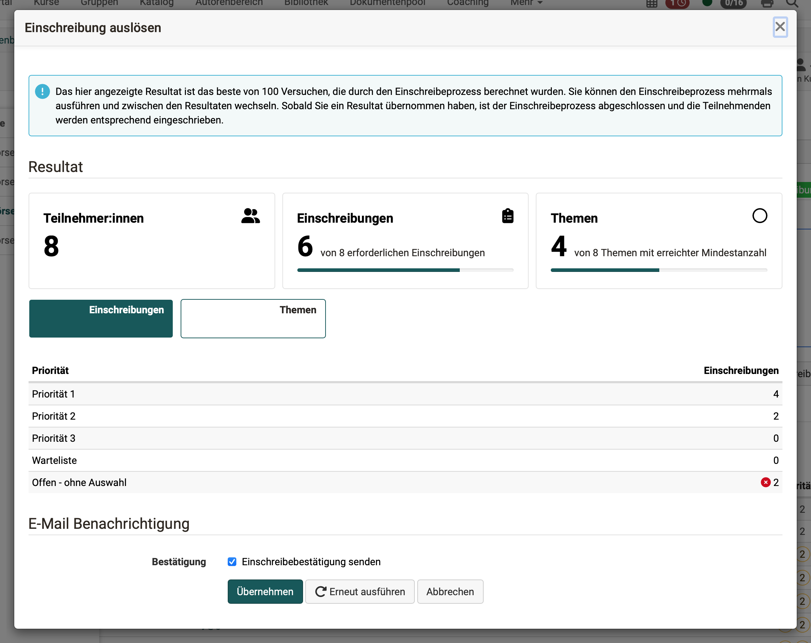
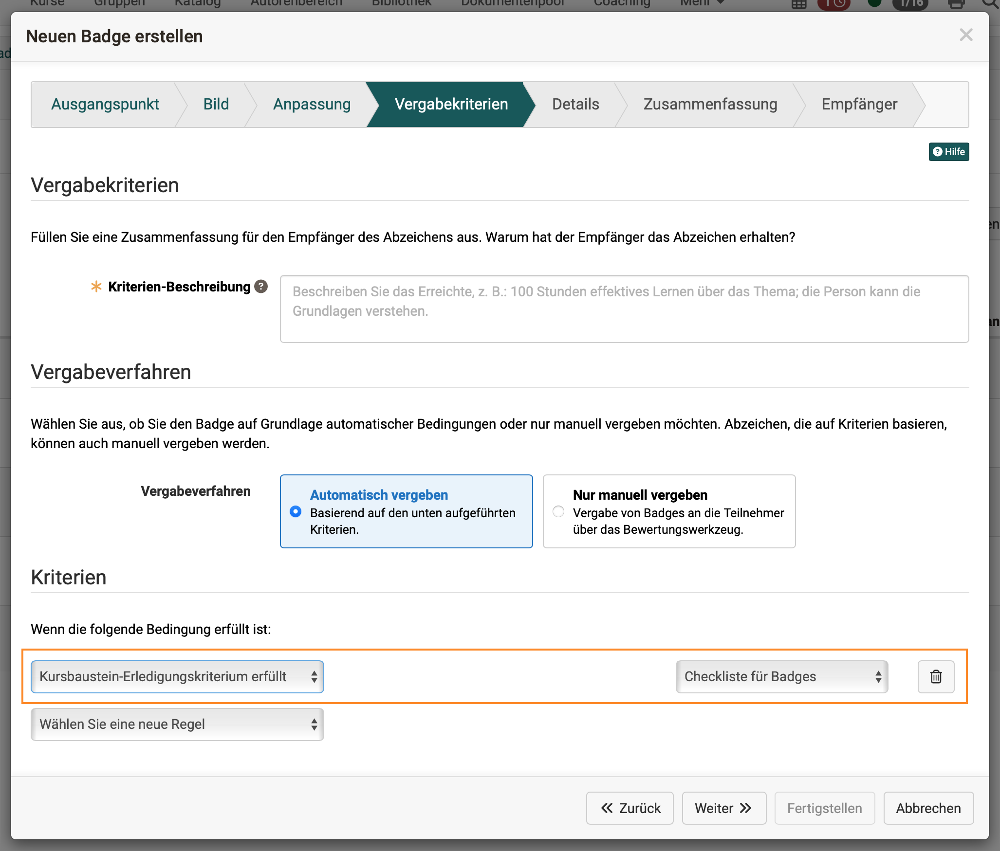
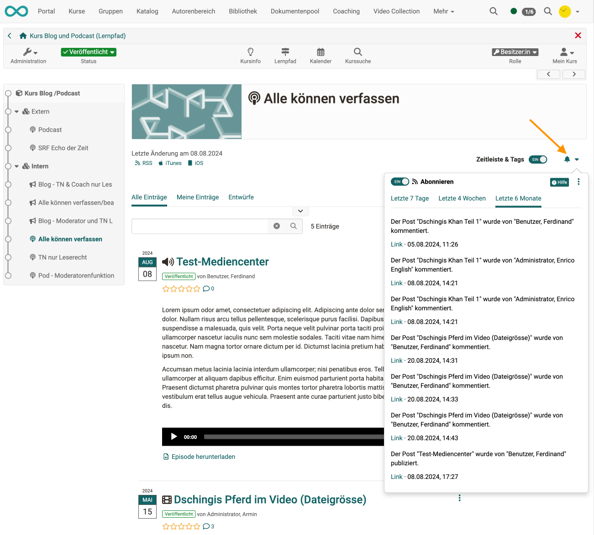

# Release Notes 19.1

* * *

:material-calendar-month-outline: **Releasedatum: 27.11.2024 • Letztes Update: 29.01.2024**

* * *

Mit OpenOlat 19.1 geben wir unseren nächsten Major Release frei.

Der **neue Kursbaustein "Auswahl"** für den Lernpfad ermöglicht die Bereitstellung mehrerer Arbeitsaufträge, von denen Teilnehmende eine bestimmte Anzahl verpflichtend bearbeiten müssen ("x aus y").

Verschiedene **Erweiterungen im Peer-Review-Prozess** am Kursbaustein "Aufgabe" unterstützen Teilnehmende und Betreuende noch besser bei der Durchführung und Administration von Reviews. Für den Kursbaustein **"Themenbörse"** wurde unter anderem die Ausführung der **Einschreibungen optimiert**. Die **Neugestaltung der Abonnement-Funktion** an Kursbausteinen und im Projekt-Tool sorgt für mehr Überblick.

Neu kann für die Vergabe von **OpenBadges** im Lernpfad auch das **Erledigungskriterium** von Kursbausteinen als Bedingung herangezogen werden. Der verbesserte Wizard führt Autoren bequem von der Erstellung bis zur finalen Konfiguration der Badges.

Insgesamt wurde ein starker Fokus auf **Security** sowie **verbesserte Accessibilty** gelegt, zahlreiche Anpassungen im Bereich von **"UX und Usability"** und Optimierungen, wie beispielsweise für File Hub, Media Center und Projekt-Tool, runden diesen Release ab.

Seit Release 19.0 wurden über 120 neue Funktionen und Verbesserungen zu OpenOlat hinzugefügt. Hier finden Sie die wichtigsten Neuerungen zusammengefasst. Zusätzlich wurden mehr als 210 Bugs behoben. Die komplette Liste der Änderungen in 19.0.x finden Sie [hier](Release_notes_19.0.de.md){:target="_blank”}.

* * *

## Neuer Kursbaustein "Auswahl"

!!! info "Hinweis"

    Diese Funktion ist nur für Lernpfadkurse verfügbar.

Mit dem neuen Auswahl-Kursbaustein ist es möglich, mehrere Arbeitsaufträge anzubieten, von denen die Teilnehmenden aber nur eine festgelegte Anzahl erledigen müssen ("x aus y").

Autor:innen können sämtliche Kursbausteine für die Arbeitsaufträge nutzen, diese dem Auswahl-Kursbaustein unterordnen und definieren, wie viele davon durch die Teilnehmenden bearbeitet und abgeschlossen werden müssen.

Die Teilnehmenden erhalten am Auswahl-Kursbaustein eine Übersicht über alle verfügbaren Arbeitsaufträge. Für jedes Thema können sie in der Vorschau weitere Details wie Beschreibung, Lernziele und Bearbeitungshinweise einsehen und schliesslich diejenigen auswählen, welche sie bearbeiten möchten.

Gewählte Arbeitsaufträge erscheinen in der Lernpfadnavigation unterhalb des Auswahl-Kursbausteins und sind für die Teilnehmenden obligatorisch. Die Ergebnisse der einzelnen Arbeitsaufträge fliessen in die Gesamtbewertung des Kurses ein.

{ class="shadow lightbox" title="Sicht für Teilnehmende" }

Der Bearbeitungsstand der Teilnehmenden ist für Betreuende in der Übersicht am Auswahl-Baustein ersichtlich.

{ class="shadow lightbox" title="Sicht für Betreuende" }

* * *

## Kursbaustein "Aufgabe" - Peer Review

Zur Unterstützung von Teilnehmenden und Betreuenden im Peer-Review-Prozess wurde insbesondere der Schritt "Vergebene Beurteilungen" überarbeitet:

* Optimierung des Erfassung von Frist-Verlängerungen für "Peer Review"
* Optimierte Aktionen basierend auf dem Bewertungsstatus
* Überarbeitete Detailansicht
* Erweiterte und detailliertere Informationen für Betreuende und Teilnehmende
* Konsistentere Farbgestaltung

{ class="shadow lightbox" title="Sicht Teilnehmende - Vergebene Beurteilungen" }

* * *

## Kursbaustein "Themenbörse"

Nach der Einführung der Themenbörse sind bereits erste Feedbacks in die weitere Gestaltung und den Ausbau des Kursbausteins geflossen:

* Ausführung des Einschreibeprozesses:
    * Automatisch mehrere Durchläufe (Standard: 100 Durchführungen; konfigurierbar)
    * Anzeige des besten Ergebnisses mit den meisten Einschreibungen (Gewichtung nach Priorität)
* Benachrichtigungen: neue Aktion, um Einschreibebestätigung manuell auszulösen
* Textverbesserungen

{ class="shadow lightbox" title="Optimierte Einschreibung für Themenbörse" }

* * *

## OpenBadges

Auch für die Vergabe von Badges in OpenOlat wurden eine Reihe von Erweiterungen implementiert:

* Lernpfad: Neue Bedingung "Erledigungskriterium für Kursbaustein erfüllt"
* Optimierung des Wizards zur Ausstellung von Bagdes:
    * Neu sortierte Schrittfolge
    * Überarbeitete Detailansicht
    * Ergänzung von Platzhalter- und Hinweistexten
    * Hilfe-Link
* Verbesserte Badge-Auswahl mit Suchfeld, Mehrfachauswahl-Liste und ergänzenden Informationen über verfügbare Badges
* Verbesserte Kursauswahl mit Suchfeld und Mehrfachauswahl-Liste für globale Badges

{ class="shadow lightbox" title="Vergabe eines Badges im Wizard konfigurieren" }

* * *

## Neue UX/UI für Abonnements

Der Bereich zur Aktivierung von "Änderungen (Ein / Aus)" bei abonnierbaren Bausteinen und im Projekt-Tool wurde komplett überarbeitet. Das neugestaltete Icon mit Dropdown-Menü enthält ergänzende Informationen:

* Änderungen sind auch ohne aktives Abonnement direkt am Baustein verfügbar
* Aktivierung/Deaktivierung des Abonnements
* Abonnementliste mit den letzten Einträgen
* Vordefinierte Filter zur Eingrenzung der Einträge
* Link zur persönlichen Abonnement-Übersicht
* Hilfe-Link zum Handbuch

{ class="shadow lightbox" title="Überarbeitete Abonnement-Funktion" }

* * *

## UX und Usability

* Lernpfad: Optimierung von Icon und Signalfarbe für optionale Kursbausteine
* Optimierung der HTML-Dialoge
* Optimierte Darstellung übereinanderliegender Dialoge
* Vermeidung doppelter Scrollbars bei Lightbox-Ansicht
* Verbesserung von Hinweistexten und Labeln

* * *

## Accessibilty

* Optimierte Navigation in der Seitenleiste für Screenreader
* Ergänzung von Text für Screenreader zur Kennzeichnung aktiver Elemente
* Optimierte Hierarchie der Seitenleistennavigation (Persönliches Menü) zur besseren Wahrnehmung durch Screenreader
* Verbesserte Unterstützung von Label Aria für TinyMCE-Felder
* Ergänzung fehlender Alt-Texte für Aktionen mit Symbolen und Links
* Entfernung von aria-hidden bei fokussierbaren Elementen
* Kennzeichnung von Pflichtfeldern als "aria-required"
* Optimierung verschiedener Bereiche mit niedrigem Kontrast

!!! info "Hinweis"

    Die vorgenommenen Kontrast-Anpassungen können Auswirkungen auf ihr OpenOlat-Theme haben! Weitere Informationen: [Youtrack OO-8090](https://track.frentix.com/issue/OO-8090){:target="_blank"}

* * *

## Weiteres, kurz notiert

* FileHub:
    * Unterstützung für Schreibzugriff bei SharePoint Online-Integration
    * Verbesserte Auswahl einzelner Dateien
* Media Center:
    * Neuer Upload-Dialog
    * Harmonisierung der Aktion „Hinzufügen“ für die Medienauswahl
* Projekt-Tool:
    * Neuer und erweiterter Upload-Dialog für Dateien
    * Benutzerverwaltung: Neues Tab "Projekte" listet die Projekte pro Benutzer:in auf
* Content Creator: Optimierungen für "Bildvergleich"
* Optimierte Validierung im Einschreibe-Baustein
* Videoaufgabe: Anzeige der jewweiligen Teilnehmenden pro Versuch (nur für Test-Modus)
* Neue "Download"-Klasse im HTML-Editor, um herunterladbare Inhalte mit einem entsprechenden Symbol hervorzuheben
* Einstufung/Noten: Ergänzung eines Wizards für die Massenaktion "Note anwenden" inklusive Anzeige der bestehenden und neuen Ergebnisse für die Teilnehmenden
* Prüfungsmodus nicht bei Kursbesitzer:innen ausführen
* Neue Abstufung für initiale Rolle bei Kursaufruf (Kursrollen werden höher gewichtet als administrative Systemrollen)
* Anpassung der Berechtigungen für die Rolle "Klassenlehrer:in"
* Fragenpool: (:octicons-tag-24: ab Release 19.1.3)
    * Umsetzung aktuelles Tabellen- und Filterkonzept
    * Anzeige der Maximalpunktzahl pro Frage-Item
    * Anzeige der Gesamtpunktzahl für einen Test im Wizard zur Test-Erstellung
    * Sortierung der einzelnen Tabellenspalten im Wizard zur Test-Erstellung
* Modul "Bibliothek": direkte Freigabe von Dokumenten nach Upload ohne Genehmigung (konfigurierbar) (:octicons-tag-24: ab Release 19.1.4)

* * *

## Administratives / Technisches

* Aktualisierung der Bibliotheken von Drittanbietern
* Update TinyMCE (HTML-Editor) auf Version 6.8.4
* draw.io: Standardmäßig deaktivierter "Collaboration mode" bei neuen Instanzen und Kennzeichnung als experimentelles Feature
* Strengere Mindestanforderungen für Passwörter gemäss gängiger Standards
* Standardmäßige Aktivierung des Schutzes vor Cross-Site Request Forgery (CSRF)
* Massenaktion für "Passwort zurücksetzen" entfernt
* Verbesserung des Cookie-Managements
* WebDAV: Unterstützung für BasicAuthentication entfernt
* Konfiguration zur Begrenzung von Domänen externer Medienressourcen
* OnlyOffice: im Lese-Modus erfolgt keine Aktualisierung des Inhaltes (= kein Live-View)
* Überprüfung von Configuration Key *und* Browser-Exam Key (BEK) - geliefert vom JavaScript-API des SEB - für den Zugang zu OpenOlat im Prüfungsmodus mit SEB (:octicons-tag-24: ab Release 19.1.3)

* * *

## Systemadministratoren: Neue Funktionen aktivieren / konfigurieren

!!! note "Checkliste nach Update auf 19.1"

    Folgende Funktionen müssen nach einem Update auf Release 19.1 in der `Administration` aktiviert bzw. konfiguriert werden:

    * [x] Mindeststandards für Passwörter: `Administration > Login > Password and Authentication > Password Syntax'`
    * [X] CSRF und Samesite cookie Konfiguration: `Administration > Login > Sicherheit > Konfiguration'`
    * [X] draw.io: `Administration > External tools > draw.io > Collaboration mode`
    * [X] Konfiguration externer Medienressourcen: `Administration > Login > Sicherheit > Medienserver`

* * *

## Weitere Informationen

* [YouTrack Release Notes 19.1.4](https://track.frentix.com/releaseNotes/OO?q=fix%20version:%2019.1.4&title=Release%20Notes%2019.1.4){:target="_blank"}
* [YouTrack Release Notes 19.1.3](https://track.frentix.com/releaseNotes/OO?q=fix%20version:%2019.1.3&title=Release%20Notes%2019.1.3){:target="_blank"}
* [YouTrack Release Notes 19.1.2](https://track.frentix.com/releaseNotes/OO?q=fix%20version:%2019.1.2&title=Release%20Notes%2019.1.2){:target="_blank"}
* [YouTrack Release Notes 19.1.1](https://track.frentix.com/releaseNotes/OO?q=fix%20version:%2019.1.1&title=Release%20Notes%2019.1.1){:target="_blank"}
* [YouTrack Release Notes 19.1.0](https://track.frentix.com/releaseNotes/OO?q=fix%20version:%2019.1.0&title=Release%20Notes%2019.1.0){:target="_blank"}
