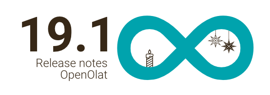
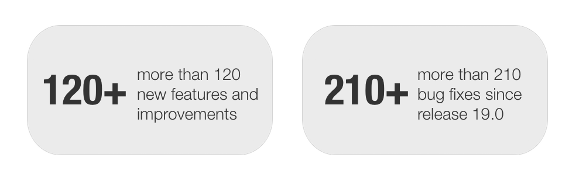
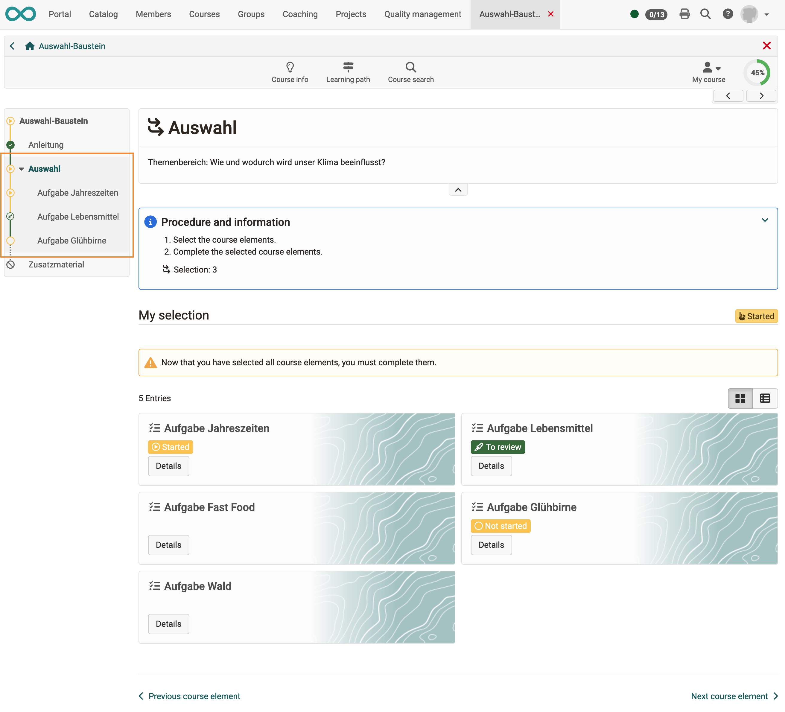
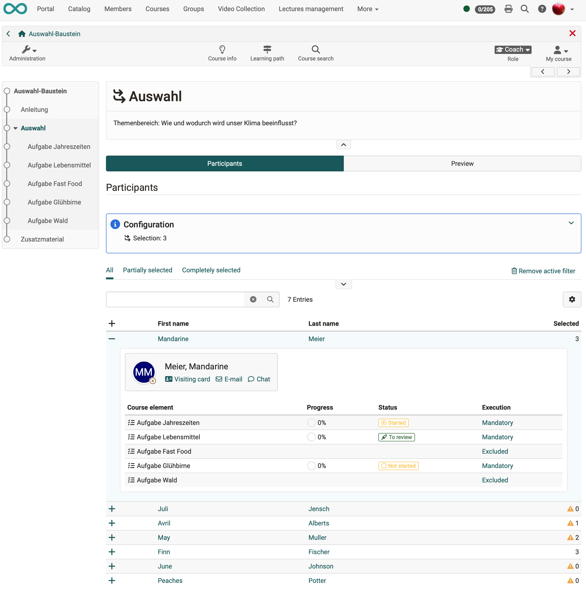
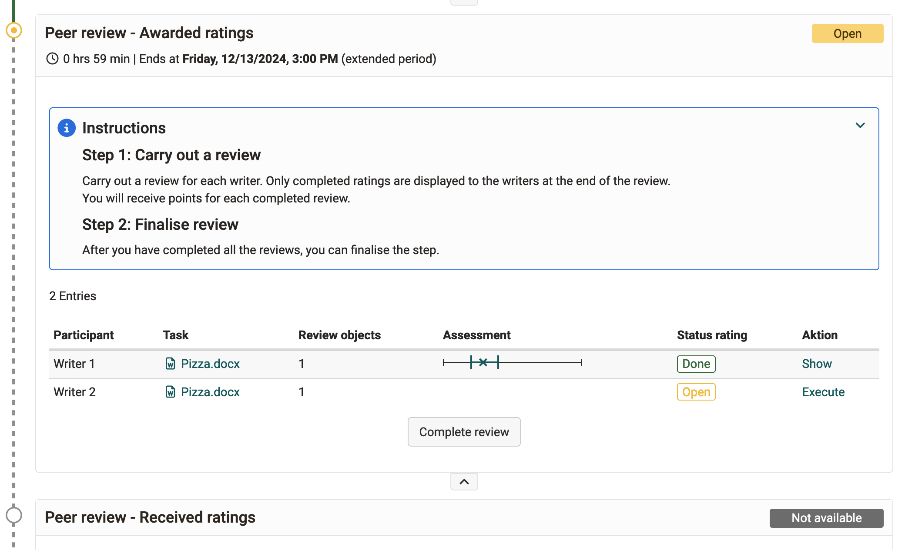
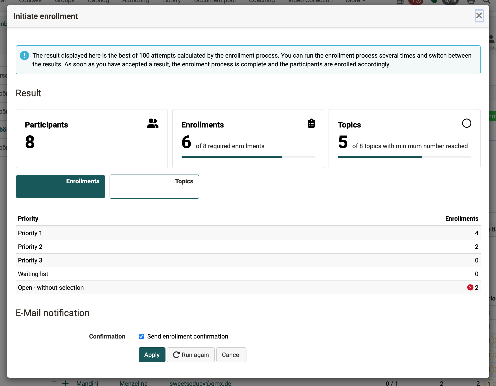
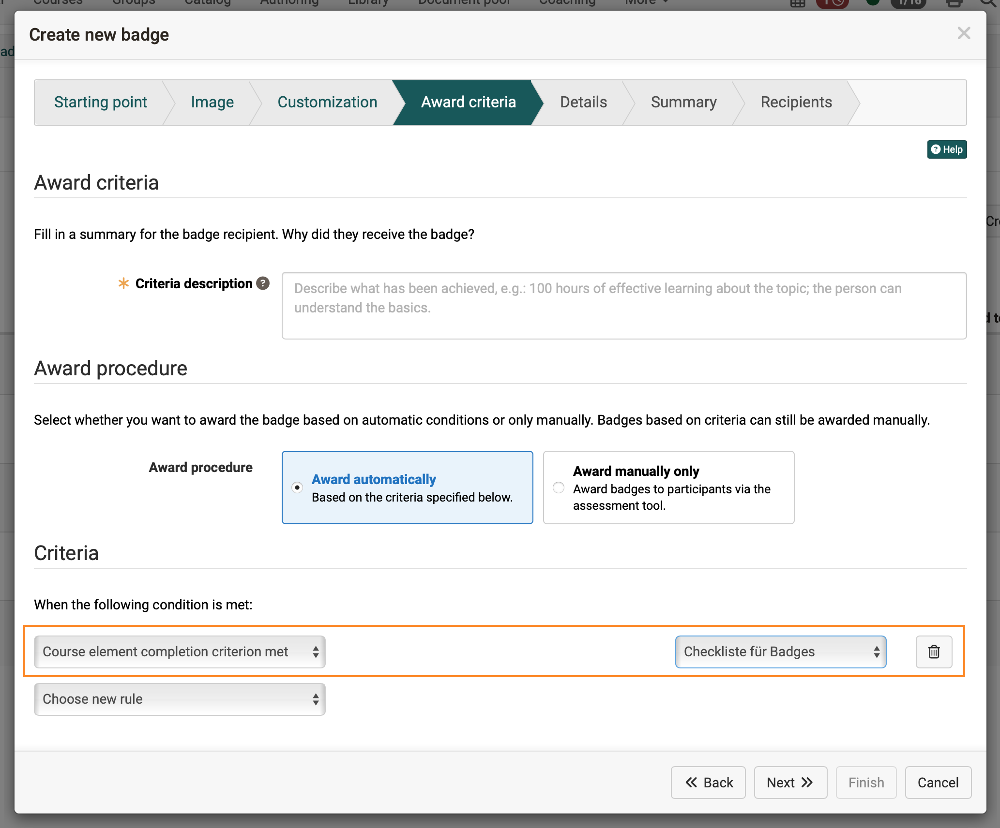
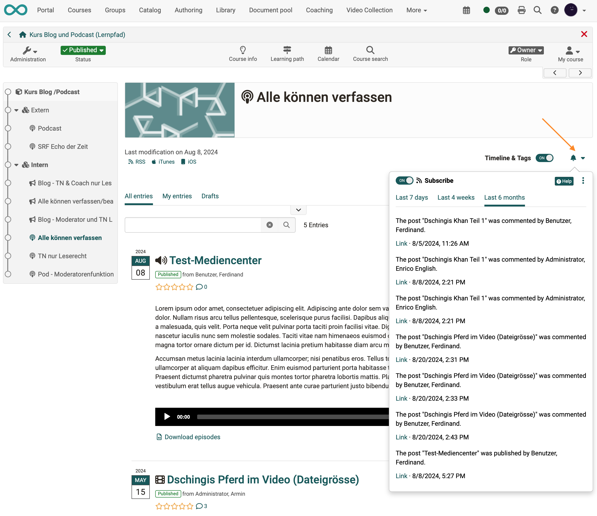

# Release notes 19.1

* * *

:material-calendar-month-outline: **Release date: 11/27/2024 • Last update: 12/10/2025**

* * *

With OpenOlat 19.1 we release our next major version.

The **new course element "Selection"** for the learning path enables the provision of several work assignments, of which participants must complete a certain number ("x out of y").

Various **extensions in the peer review process** in the "Task" course element support participants and coaches even better in conducting and administering reviews. For the course element **"Topic broker"**, among other things, the execution of **enrollments** has been optimized. The **redesign of the subscription function** on course elements and in the project tool provides a better overview.

From now on, the **completion criterion** of course elements can also be used as a condition for the allocation of **OpenBadges** in the learning path. The improved wizard guides authors conveniently from the creation to the final configuration of the badges.

Overall, a strong focus was placed on **security** and **improved accessibility**, numerous adjustments in the area of **"UX and usability"** and optimizations, such as for File Hub, Media Center and Project Tool, complete this release.

Since release 19.0, over 120 new features and improvements have been added to OpenOlat. Here you can find the most important new features and changes. In addition, more than 210 bugs have been fixed. The complete list of changes in 19.0.x can be found [here](Release_notes_19.0.md){:target="_blank”}.

* * *

## New course element "Selection"

!!! info "Note"

    This function is only available for learning path courses.

With the new selection course element, it is possible to offer several work assignments, of which the participants only have to complete a specified number ("x out of y").

Authors can use all course elements for the work assignments, subordinate them to the selection course element and define how many of them must be processed and completed by the participants.

Participants receive an overview of all available work assignments in the selection course element. For each topic, they can view further details such as description, learning objectives and processing instructions in the preview and then select the ones they want to work on.

Selected work assignments appear in the learning path navigation below the selected course element and are mandatory for participants. The results of the individual work assignments are included in the overall assessment of the course.

{ class="shadow lightbox" title="View for participants" }

The processing status of the participants can be seen by coaches in the overview on the selection course element.

{ class="shadow lightbox" title="View for coaches" }

* * *

## Course element "Task" - Peer review

To support participants and coaches in the peer review process, the "Awarded ratings" step in particular has been revised:

* Optimization of recording deadline extensions for "Peer Review"
* Optimized actions based on the assessment status
* Revised detailed view
* Extended and more detailed information
* More consistent color scheme

{ class="shadow lightbox" title="Participants' view - Awarded Ratings" }

* * *

## Course element "Topic broker"

Following the introduction of the topic exchange, initial feedback has already been incorporated into the further design and expansion of the course element:

* Execution of the enrollment process:
    * Automatic multiple executions (default: 100 runs; configurable)
    * Display of the best result with the most enrolments (weighting according to priority)
* Notifications: new action to trigger enrollment confirmation manually
* Text improvements

{ class="shadow lightbox" title="Optimized enrollment for Topic broker" }

* * *

## OpenBadges

A number of enhancements have also been implemented for awarding badges in OpenOlat:

* Learning path courses: New condition "Course Element completion criterion met"
* Optimization of the wizard for issuing badges:
    * Re-sorted step sequence
    * Revised detailed view
    * Addition of placeholder and hint texts
    * Help link
* Improved badge selection with search field, multi-checkbox list and additional information on available badges
* Improved course selection with search field and multi-checkbox list for global badges

{ class="shadow lightbox" title="Configuring a badge in the wizard" }

* * *

## New UX/UI for subscriptions

The section for activating "Modifications (On / Off)" for subscribable course elements and in the project tool has been completely revised. The redesigned icon with drop-down menu contains additional information:

* Modifications are available directly on the course element even without an active subscription
* Activation/deactivation of the subscription
* Subscription list with the latest entries
* Predefined filters to narrow down the entries
* Link to personal subscription overview
* Help link to the manual

{ class="shadow lightbox" title="Refactored subscription function" }

* * *

## UX and usability

* Learning path: Optimization of icon and signal color for optional course elements
* Optimizations for HTML dialog
* Optimized display of stacked dialogs
* Avoidance of double scrollbars in lightbox view
* Improvement of information texts and labels

* * *

## Accessibility

* Optimized navigation in the sidebar for screen readers
* Addition of text for screen readers to mark active elements
* Optimized hierarchy of sidebar navigation (personal menu) for better perception by screen readers
* Improved support of Label Aria for TinyMCE fields
* Addition of missing alt texts for actions with symbols and links
* Removal of aria-hidden for focusable elements
* Marking of mandatory fields as "aria-required"
* Optimization of various areas with low contrast

!!! info "Note"

    The contrast adjustments made may have an effect on your OpenOlat theme! Further information: [Youtrack OO-8090](https://track.frentix.com/issue/OO-8090){:target="_blank"}

* :octicons-tag-24: release 19.1.8:
    * Improved aria-current support
    * Correct titles in the personal menu
    * Improved readability of the link in the header and footer icon
* :octicons-tag-24: release 19.1.18
    * Addition of “aria-expanded” in open/close profile link in main navigation and menu tree
    * Decorative images that do not convey content are given an empty alternative text (alt=“”) instead of aria-hidden=“true”
    * Removal of redundant titles in menu trees
* :octicons-tag-24: release 19.1.19
    * Optimized support for Firefox keyboard navigation (cmd-Enter)
    * Conversion of column headings for sorting tables as buttons
    * Accessibility of the course menu on small screens via keyboard
    * Tests: Optimization for intuitive focus order
    * Avoidance of empty bookmark links in the menu (test and forum)

* * *

## FileHub and Media Center

* FileHub:
    * Support of write access for SharePoint Online integration
    * Improved single file selection
* Media Center:
    * New upload dialogue
    * Harmonization of the "Add" action for media selection
    * New single filter "Without author" in the media management (:octicons-tag-24: release 19.1.5)

* * *

## News about courses

* Content Creator (Course element "Page"): Improvements for "Image Comparison"
* Optimized validation in the enrolment course element
* Video task: Display of the respective participants per attempt (only for test mode)
* New "Download" class in the HTML editor to highlight downloadable content with a corresponding icon
* New ranking of the initial role for course visit (course roles are weighted higher than administrative system roles)
* Adjustment of the rights for the "Master coach" role
* Multiple use of the form in the form course element, e.g. for ordering books (:octicons-tag-24: release 19.1.5)
* Standard configuration for the course execution period and marking of the currently relevant semester in the semester data (:octicons-tag-24: release 19.1.6)
* Learning path: Exception rule for “Course run number”, e.g. to explicitly exclude or include certain course elements for recertification (:octicons-tag-24: release 19.1.7)
* E-mail for course invitation: Information about the course location via the variable $courseLocation (:octicons-tag-24: release 19.1.7)
* Course reminders: Addition of the variables “user name” and “e-mail” as well as optimization of further variables for affected users for reminders to substitute recipients (:octicons-tag-24: release 19.1.8)
* Notification course element: Automatic subscription for course members only (exception: open courses without membership) (:octicons-tag-24: as of release 19.1.15)

* * *

## eTesting and assessment

* Levels/Grading: Addition of a wizard for the bulk action "Apply grade" including display of existing and new results for participants
* Assessment mode not applied to course owners
* Redesign of the change log for assessable course elements (:octicons-tag-24: release 19.1.7)
* Course element "Test": Support for multiple test resources, so that an already used test can be replaced by a new one without losing existing execution data of participants (:octicons-tag-24: release 19.1.10)
* Optional activation of the Safe Exam Browser in simplified assessment mode (:octicons-tag-24: release 19.1.12)

* * *

## Question bank

:octicons-tag-24: release 19.1.3

* Implementation of current table and filter concept
* Display of the maximum score per question item
* Display of the total score for a test in the test creation wizard
* Sorting of the individual table columns in the test creation wizard

* * *

## Further, briefly noted

* Project tool:
    * New and extended upload dialog for files
    * User management: New "Projects" tab lists the projects per user
* "Library" module: direct release of documents after upload without approval (configurable) (:octicons-tag-24: release 19.1.4)
* QM reports: Access for master coaches (:octicons-tag-24: release 19.1.5)
* Consent for recording the BBB meeting is saved in the GUI settings (:octicons-tag-24: release 19.1.5)
* Opencast:
    * Support for version 16 (:octicons-tag-24: release 19.1.6)
    * Filter for private and public videos (:octicons-tag-24: release 19.1.6)
* Inactive accounts of external users are reactivated when they are invited again (:octicons-tag-24: release 19.1.11)

* * *

## Administrative / Technical

* Updating of third-party libraries
* Update TinyMCE (HTML editor) to version 6.8.4
* draw.io: "Collaboration mode" deactivated by default for new instances and labeled as an experimental feature
* Stricter minimum requirements for passwords according to common standards
* Activation of Cross-Site Request Forgery (CSRF) protection by default
* Bulk action for "Reset password" removed
* Improvement for Cookie management
* WebDAV: Support for BasicAuthentication removed
* Configuration for limiting domains of external media resources
* OnlyOffice:
    * In read-only mode, the content is not updated (= no Live-View)
    * Fully configurable in olat.properties including onlyoffice.jwt.secret (:octicons-tag-24: release 19.1.15)
* Checking the configuration key *and* browser exam key (BEK) - provided by the SEB's JavaScript API - for access to OpenOlat in assessment mode with SEB (:octicons-tag-24: release 19.1.3)
* Update paella player dependencies (:octicons-tag-24: releases 19.1.15 and 19.1.18)

* * *

## System administrators: Activate / configure new functions

!!! note "Checklist after update to 19.1"

    The following functions have to be activated / configured in the `Administration` after an update to release 19.1:

    * [x] Minimum standards for passwords: `Administration > Login > Password and Authentication > Password Syntax'`
    * [X] CSRF and Samesite cookie configuration: `Administration > Login > Security > Configuration'`
    * [X] draw.io: `Administration > External tools > draw.io > Collaboration mode`
    * [X] Configuration external Media resources: `Administration > Login > Security > Media server`
    * [X] Default for course execution period: `Administration > Modules > Course > Default setting > Execution period`
    * [X] Marking the relevant semester: `Administration > Modules > Semester terms > Edit > Set as default for courses`

* * *

## More information

* [YouTrack Release notes 19.1.28](https://track.frentix.com/releaseNotes/OO?q=fix%20version:%2019.1.28&title=Release%20Notes%2019.1.28){:target="_blank"}
* [YouTrack Release notes 19.1.27](https://track.frentix.com/releaseNotes/OO?q=fix%20version:%2019.1.27&title=Release%20Notes%2019.1.27){:target="_blank"}
* [YouTrack Release notes 19.1.26](https://track.frentix.com/releaseNotes/OO?q=fix%20version:%2019.1.26&title=Release%20Notes%2019.1.26){:target="_blank"}
* [YouTrack Release notes 19.1.25](https://track.frentix.com/releaseNotes/OO?q=fix%20version:%2019.1.25&title=Release%20Notes%2019.1.25){:target="_blank"}
* [YouTrack Release notes 19.1.24](https://track.frentix.com/releaseNotes/OO?q=fix%20version:%2019.1.24&title=Release%20Notes%2019.1.24){:target="_blank"}
* [YouTrack Release notes 19.1.23](https://track.frentix.com/releaseNotes/OO?q=fix%20version:%2019.1.23&title=Release%20Notes%2019.1.23){:target="_blank"}
* [YouTrack Release notes 19.1.22](https://track.frentix.com/releaseNotes/OO?q=fix%20version:%2019.1.22&title=Release%20Notes%2019.1.22){:target="_blank"}
* [YouTrack Release notes 19.1.21](https://track.frentix.com/releaseNotes/OO?q=fix%20version:%2019.1.21&title=Release%20Notes%2019.1.21){:target="_blank"}
* [YouTrack Release notes 19.1.20](https://track.frentix.com/releaseNotes/OO?q=fix%20version:%2019.1.20&title=Release%20Notes%2019.1.20){:target="_blank"}
* [YouTrack Release notes 19.1.19](https://track.frentix.com/releaseNotes/OO?q=fix%20version:%2019.1.19&title=Release%20Notes%2019.1.19){:target="_blank"}
* [YouTrack Release notes 19.1.18](https://track.frentix.com/releaseNotes/OO?q=fix%20version:%2019.1.18&title=Release%20Notes%2019.1.18){:target="_blank"}
* [YouTrack Release notes 19.1.17](https://track.frentix.com/releaseNotes/OO?q=fix%20version:%2019.1.17&title=Release%20Notes%2019.1.17){:target="_blank"}
* [YouTrack Release notes 19.1.16](https://track.frentix.com/releaseNotes/OO?q=fix%20version:%2019.1.16&title=Release%20Notes%2019.1.16){:target="_blank"}
* [YouTrack Release notes 19.1.15](https://track.frentix.com/releaseNotes/OO?q=fix%20version:%2019.1.15&title=Release%20Notes%2019.1.15){:target="_blank"}
* [YouTrack Release notes 19.1.14](https://track.frentix.com/releaseNotes/OO?q=fix%20version:%2019.1.14&title=Release%20Notes%2019.1.14){:target="_blank"}
* [YouTrack Release notes 19.1.13](https://track.frentix.com/releaseNotes/OO?q=fix%20version:%2019.1.13&title=Release%20Notes%2019.1.13){:target="_blank"}
* [YouTrack Release notes 19.1.12](https://track.frentix.com/releaseNotes/OO?q=fix%20version:%2019.1.12&title=Release%20Notes%2019.1.12){:target="_blank"}
* [YouTrack Release notes 19.1.11](https://track.frentix.com/releaseNotes/OO?q=fix%20version:%2019.1.11&title=Release%20Notes%2019.1.11){:target="_blank"}
* [YouTrack Release notes 19.1.10](https://track.frentix.com/releaseNotes/OO?q=fix%20version:%2019.1.10&title=Release%20Notes%2019.1.10){:target="_blank"}
* [YouTrack Release notes 19.1.9](https://track.frentix.com/releaseNotes/OO?q=fix%20version:%2019.1.9&title=Release%20Notes%2019.1.9){:target="_blank"}
* [YouTrack Release notes 19.1.8](https://track.frentix.com/releaseNotes/OO?q=fix%20version:%2019.1.8&title=Release%20Notes%2019.1.8){:target="_blank"}
* [YouTrack Release notes 19.1.7](https://track.frentix.com/releaseNotes/OO?q=fix%20version:%2019.1.7&title=Release%20Notes%2019.1.7){:target="_blank"}
* [YouTrack Release notes 19.1.6](https://track.frentix.com/releaseNotes/OO?q=fix%20version:%2019.1.6&title=Release%20Notes%2019.1.6){:target="_blank"}
* [YouTrack Release notes 19.1.5](https://track.frentix.com/releaseNotes/OO?q=fix%20version:%2019.1.5&title=Release%20Notes%2019.1.5){:target="_blank"}
* [YouTrack Release notes 19.1.4](https://track.frentix.com/releaseNotes/OO?q=fix%20version:%2019.1.4&title=Release%20Notes%2019.1.4){:target="_blank"}
* [YouTrack Release notes 19.1.3](https://track.frentix.com/releaseNotes/OO?q=fix%20version:%2019.1.3&title=Release%20Notes%2019.1.3){:target="_blank"}
* [YouTrack Release notes 19.1.2](https://track.frentix.com/releaseNotes/OO?q=fix%20version:%2019.1.2&title=Release%20Notes%2019.1.2){:target="_blank"}
* [YouTrack Release notes 19.1.1](https://track.frentix.com/releaseNotes/OO?q=fix%20version:%2019.1.1&title=Release%20Notes%2019.1.1){:target="_blank"}
* [YouTrack Release notes 19.1.0](https://track.frentix.com/releaseNotes/OO?q=fix%20version:%2019.1.0&title=Release%20Notes%2019.1.0){:target="_blank"}
