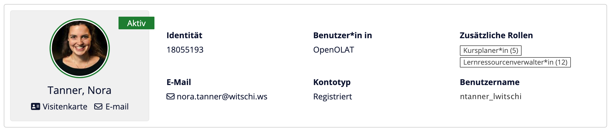

# Release Notes 20.0

* * *

:material-calendar-month-outline: **Releasedatum: 20.03.2025 • Letztes Update: 02.07.2025**

* * *

Mit OpenOlat 20.0 geben wir unseren nächsten Major Release frei.

Im Mittelpunkt dieses Releases steht der **brandneue Course Planner** – mit intuitiver **Cockpit-Ansicht**, vielseitigen Widgets zur einfachen Pflege und Verwaltung von Kursdurchführungen, einem **leistungsstarken Event- und Mitglieder-Management**, der Möglichkeit zur Nutzung von **Kurs-Templates**, einem neuen **Reporting-Bereich** sowie dem **externen Katalog** zur Veröffentlichung eures Kursangebots.

Darüber hinaus wurden mit dem neuen **Angebotstyp "Rechnung" inklusive Stornierungsprozess** und der Einführung der neuen Rolle **Ausbildungsverantwortliche:r** zwei wichtige Erweiterungen implementiert.

Auch in anderen Bereichen hat sich viel getan: So wurde zum Beispiel die **Navigation unter "Kurse"** neu gestaltet und das **Coaching Tool** bietet nun ein übersichtliches Cockpit mit allen relevanten Informationen auf einen Blick.

Ebenfalls neu ist die **Validierung der E-Mail-Adresse via Code** (z. B. bei Selbstregistrierungen) sowie die automatische Zuordnung eines Kontos zu einer Organisation anhand der E-Mail-Domäne.

Abgerundet wird der Release durch eine **modernisierte Darstellung der Benutzerinformationen**, ein **Redesign des Rollenmanagements** in der Benutzerverwaltung und viele weitere Optimierungen und Verbesserungen, die das Arbeiten mit dem LMS noch komfortabler machen.

Seit Release 19.1 wurden über 120 neue Funktionen und Verbesserungen zu OpenOlat hinzugefügt. Hier finden Sie die wichtigsten Neuerungen zusammengefasst. Zusätzlich wurden mehr als 85 Bugs behoben. Die komplette Liste der Änderungen in 19.1.x finden Sie [hier](Release_notes_19.1.de.md){:target="_blank”}.

* * *

## Course Planner

Planung - Buchung - Durchführung: Der neue Course Planner deckt alle Phasen der Kursorganisation ab! Er ersetzt das bisherige Curriculum-Modul und präsentiert sich mit frischem Layout, neuer Navigation und einer Cockpit-Ansicht, die mit Widgets ihren Planungsalltag unterstützt.

!!! abstract "Auf einen Blick"

    * Pflegen und strukturieren Sie ihr **Kursangebot** mitsamt Durchführungsterminen, Preisangaben und verfügbarem Platzkontingent.
    * Verwenden Sie **Kurs-Templates** für wiederkehrende Formate und eine automatisierte Instanzierung der Inhalte bei Kursstart.
    * Hinterlegen Sie die gewünschten **Angebotsarten** wie beispielsweise Rechnung, Zugangscode oder Paypal für verschiedene Buchungsmöglichkeiten.
    * Nutzen Sie bei der **Terminplanung** die direkte Integration von BigBlueButton & MS Teams für Online-Veranstaltungen.
    * Präsentieren Sie ihr Kursangebot im **öffentlichen Katalog** - es ist kein Login erforderlich.
    * Zeigen Sie Interessierten und Teilnehmenden auf der **neugestalteten Info-Seite**, was sie erwartet.
    * Setzen Sie auf den **integrierten Registrationsprozess**, um Interessenten eine bequeme und sichere Selbstregistrierung zu ermöglichen.
    * Administrieren Sie Teilnehmende und Dozierende, bestätigen oder stornieren Sie Buchungen und Mitgliedschaften, behalten Sie alle Änderungen in der **Mitglieder-Historie** im Blick.
    * Generieren Sie **Excel-Reports** über rechnungsbasierte Buchungen oder ausgestellte Zertifikate zur Weiterverarbeitung der Daten in externen Systemen oder für ihre Ablage.

### Cockpit-Ansicht

Zur Unterstützung der Kursplaner:innen werden die wichtigsten Daten auf der Übersichtsseite der Durchführung in entsprechenden Widgets zusammengefasst:

* **Widget "Mitglieder"**: Anzahl aktiver und ausstehender Teilnehmende, verbleibendes Platzkontingent sowie Anzeige der Personen mit anderen Rollen
* **Widget "Termine"**: Auflistung der aktuellen und bevorstehenden Termine
* **Widget "Kursinhalt"**: Anzeige des verknüpften Kurses und Kurs-Templates
* **Widget "Katalog"**: Hinterlegte Angebotstypen sowie Verfügbarkeit der Durchführung im internen und externen Katalog

{ class="shadow lightbox" title="Übersicht zu einer konkreten Durchführung" }

### Integrierte Terminverwaltung (Event Management)

Bisher konnten Lektionen/Termine nur im Rahmen von Kursen geführt werden. Der Course Planner ermöglicht nun die Verwaltung und Pflege von Terminen bereits in der Planungsphase direkt am Produkt bzw. auf der Durchführung - auch ohne bereits hinterlegte Kursinhalte.

In diesem Zuge wurde der Dialog zur Erfassung von Terminen überarbeitet und um die **BigBlueButton-/MS Teams-Integration** für Online-Veranstaltungen erweitert.

Die hinterlegten Termine werden später bei der Verknüpfung der Durchführung mit einem Kurs auf diesen appliziert und sind dann auch im Kurs verfügbar.

{ class="shadow lightbox" title="Dialog zur Termin-Erfassung" }

### Mitglieder- und Buchungsverwaltung mit Historie

Mit dem Course Planner findet die Verwaltung von Mitgliedern wie Teilnehmenden und Dozierenden sowie deren Buchungen direkt am Produkt/der Durchführung statt.

Bestätigung ausstehender Mitgliedschaften, Stornierung von Buchungen, Entfernen von Teilnehmenden oder die Kursbuchung für eine andere Personen - alles ist abgedeckt. Bei manuellen Anpassungen von Mitgliedschaften können die Gründe als **Kommentar** erfasst werden. Über die Mitglieder- und Buchungshistorie sind alle Änderungen transparant und nachvollziehbar.

Für jede Buchung, Buchungs- oder Mitgliedschaftsanpassung kann eine entsprechende E-Mail-Benachrichtigungen ausgelöst werden, um die Teilnehmenden über die Änderung zu informieren.

{ class="shadow lightbox" title="Mitglieder-Historie einer Durchführung" }

Dozierende und Lehrpersone können bequem per Sammelaktion verwaltet und direkt auf mehrere Termine gebucht bzw. wieder entfernt werden.

{ class="shadow lightbox" title="Sammelaktionen zur Verwaltung von Dozierenden" }

### Report-Bereich

Für jedes Produkt/jede Durchführung steht ein Bereich "Reports" zur Verfügung, um **Excel-Reports** zu rechnungsbasierten Buchungen zu generieren.

{ class="shadow lightbox" title="Report-Bereich zu Buchungsaufträgen" }

### Weitere Neuerungen

* Life cycle der Durchführungen mit verschiedenen Status
* Anzeige ergänzender Informationen zum Belegungsstatus von Durchführungen: ausgebucht/überbucht, freie Plätze, Mindestanzahl erreicht/nicht erreicht
* Erweiterter und optimierter Wizard für das Kopieren von Durchführungen bzw. deren untergeordneten Strukturen
* Erweiterte Konfiguration für die Elementtypen (Ebenen) der Produktstrukturen:
    * Ebene darf als Durchführung (Root-Element) verwendet werden
    * Ebene dient zur Strukturierung der Durchführung bzw. kann selbst Inhalt (= einen Kurs / mehrere Kurse ) enthalten

### Neue Bezeichnungen

Mit Release 20.0 wurden folgende Bezeichnungen angepasst:

Bisher | Neu
---------|----------
Curriculumverwaltung | Course Planner
Curriculumverwalter:in | Kursplaner:in
Buchung | Buchungsauftrag
Buchungsmethode | Angebotsart
Lektion oder Lektionenblock | Termin
Lektionenverwaltung | Absenzenverwaltung
Lektionenblockverwalter:in | Absenzverwalter:in

* * *

## Öffentlicher Katalog

Zusätzlich zum internen Katalog in OpenOlat können Kurse und ganze Durchführungen auch im öffentlichen (externen) Katalog publiziert werden. Damit haben Personen ohne OpenOlat-Login ebenfalls die Möglichkeit, das ausgeschriebene Kursangebot zu entdecken und gewünschte Kurse nach einer Registrierung zu buchen.

Über den neuen Katalog-Launcher für "Ausgewählte Durchführungen" lassen sich die Durchführungen gezielt und mühelos für die Katalog-Startseite zusammenstellen.

Die wichtigsten Informationen zur Durchführung wie verfügbare Plätze, Inhaltsbeschreibung, Angaben zu Dozierenden sowie Veranstaltungstermine werden für die Interessenten auf der jeweiligen Info-Seite übersichtlich zusammengefasst (analog zur Info-Seite eines Kurses).

{ class="shadow lightbox" title="Infoseite einer Durchführung im Katalog" }

* * *

## Neue Angebotsart "Rechnung"

Neben Paypal kann ab sofort "Rechnung" als weiteres Bezahlverfahren für Kursangebote hinterlegt werden.

Damit einhergehend wurden folgende Erweiterungen in OpenOlat umgesetzt:

* Prozess zur Erfassung bzw. Auswahl einer Rechnungsadresse, Kostenstellen-Handling und Kommentar-Funktion
* Stornierungsprozess für rechnungsbasierte Buchungen
    * Optionale Stornierungsfrist
    * Optionale Stornierungsgebühr
* Auswahl verschiedener Währungen
* Anzeige der Preise inklusive oder exklusive Mehrwertsteuer
* Wählbares Zahlenformat für Preise

{ class="shadow lightbox" title="Angebotsart 'Rechnung'" }

* * *

## Erweiterter Selbstregistierungsprozess

Entscheiden sich Personen ohne OpenOlat-Login für die Buchung eines Kurses aus dem externen Katalog, können sie sich per Selbstregistrierung direkt einen Account erstellen. Der erweiterte und optimiere Wizard führt dabei Schritt für Schritt durch die Registrierung.

Die **Validierung der E-Mail-Adresse per Code** gewährt einen sicheren Prozess beim Erstellen eines neuen Kontos, im Passwort-Vergessen-Prozess sowie beim Wechsel der E-Mailadresse.

{ class="shadow lightbox" title="Validierung der E-Mail-Adresse per Code" }

Wer Organisationseinheiten in OpenOlat verwendet, kann zudem ein **Mapping der E-Mail-Adressen-Domäne** auf die entsprechenden Organisationen einrichten. Wenn sich neue Benutzer selbst registrieren, werden diese nach der E-Mail-Validierung automatisch zu den entsprechenden Organisationen oder Unterorganisationen zugewiesen - das erspart den administrativen Verantwortlichen eine manuelle Zuordnung.

{ class="shadow lightbox" title="Zuordnung zur Organisation via E-Mail-Domäne" }

* * *

## Neue Rolle "Ausbildungsverantwortliche:r" / "Education Manager"

Ähnlich der vorhandenen Rolle "Linienverantwortliche:r" ist eine neue Organisationsrolle "Ausbildungsverantwortliche:r" verfügbar. Personen mit dieser Rolle betreuen die Teilnehmenden im Rahmen ihrer Ausbildung und nehmen beispielsweise Kursbuchungen in deren Namen vor, bestätigen reservierte Buchungen und behalten Lernstände, Termine und Absenzen der Teilnehmenden im Blick. Je nach konfigurierten Berechtigungen ist ihnen auch das Anlegen oder Deaktivieren von Benutzer:innen möglich.

* * *

## Coaching Tool: Cockpit & Reports

Das Coaching Tool ist für Personen mit Betreuungsfunktion ein zentraler Bereich in OpenOlat.

Ab Version 20.0 profitieren Kursleitende, Ausbildungsverantwortliche und Vorgesetzte von einer neugestalteten, aufgeräumten **Cockpit-Ansicht**. Kursbuchungen, Lernstände und Fortschritte der Teilnehmenden sind auf einen Blick erkennbar - für schnelle Entscheidungen und zielgerichtetes Coaching. Zudem sind offene Aufträge wie Korrekturen, Bewertungen oder Freigaben kursübergreifend verfügbar.

{ class="shadow lightbox" title="Cockpit Coaching Tool" }

Im Bereich "Personen" wurde das aktuelle Tabellen- und Filterkonzept umgesetzt sowie zusätzliche relevante Informationen, insbesondere für die Sicht der Rollen Ausbildungsverantwortliche:r und Linienvorgesetzte:r, ergänzt.

Betreuende mit verschiedenen Rollen wie "Klassenlehrer:in", "Ausbildungsverantwortliche:r" oder beispielsweise einer "Mentor"-Funkton können hier bequem zwischen den jeweiligen betreuten Personengruppen wechseln.

{ class="shadow lightbox" title="Funktionsbasierte Ansichten im Coaching Tool" }

Neu ist die Möglichkeit, direkt über das Coaching Tool **Excel-Reports** zu rechnungsbasierten Buchungen, Absenzen und ausgestellten Zertifikaten zu generieren.

* * *

## Organisationsspezifische Ablage

Werden Organisationsstrukturen verwendet, kann eine eigene Ablage für organisationsspezifische und rechtliche Dokumente (z. B. für zugrundeliegende Verträge, allgemeinene Geschäftsbedingungen) aktiviert werden. Diese steht pro Organisationsebene zur Verfügung.

Benutzer:innen mit administrativen Rollen und entsprechender Organisationszugehörigkeit können auf diese Dokumente via File Hub bzw. WebDav zugreifen.

* * *

## Neues rund um Kurse

### Kurs-Verwendungszweck

Bisher wurden Kurs-Lernressourcen vor allem als eigenständiges Gefäss genutzt oder in eine Curriculum-Struktur eingebunden. Mit dem Course Planner hat sich das Einsatzgebiet der Kurs-Lernressource erweitert. Für eine eindeutige Abgrenzung kann in den Kurs-Einstellungen > Freigabe der Verwendungszweck deklariert werden:

* Eigenständig
* Einbindung in Produkt
* Template

Wird der Course Planner umfassend eingesetzt, bietet es sich an, den Standard-Verwendungszweck für neue Kurse in der Systemadministration > Course Planner-Settings auf "Einbindung in Produkt" einzustellen.

{ class="shadow lightbox" title="Optionen für den Kurs-Verwendungszweck" }

#### Einbindung in Produkt

Kurse, die über den Course Planner verwaltet werden, sind mit dem Verwendungszweck "Einbindung in Produkt" explizit als solche gekennzeichnet.

#### Kurs-Template

Für wiederkehrende oder ähnlich strukturierte Kursformate können im Course Planner sogenannte Kurs-Templates hinterlegt und für mehrere Durchführungen genutzt werden.

Ein Template wird dabei wie ein normaler Kurs aufgebaut, die Pflege und Weiterentwicklung für zukünftige Durchführungen kann direkt im Template erfolgen - das spart Zeit.

Für einzelne Durchführungen wird das Kurs-Template - automatisch oder manuell - instanziert und steht dann als "richtiger" Kurs mitsamt Inhalten bei Kursstart zur Verfügung.

### Neue Navigation unter "Kurse"

Um insbesondere Teilnehmenden einen besseren Überlick und Einstieg zu ihren (gebuchten) Kursinhalten zu gewährleisten, wurde die Navigation im Bereich "Kurse" überarbeitet.

Bisher wurden unter "Meine Kurse" alle Kurse gelistet, in denen der/die Benutzer:in eine Mitgliedschaft besitzt. Unter "Curriculum/Lehrgänge" wurden die Kurse eingebettet in der Struktur des jeweiligen Curriculums angezeigt.

Neu gibt es folgende separate Einstiegspunkte:

  * "Meine Kurse" beinhaltet alle Kurse in flacher Ansicht, zu denen der/die Teilnehmende Zugang hat
  * "[Name der Durchführung]" bietet den direkten Zugang zu einer bestimmten Durchführung, die über den Course Planner verwaltet und gesteuert wird
  * "Bildungsprogramme" listet die aktiven Durchführungen der/des Teilnehmenden auf; als Favorit markierte Durchführungen erscheinen zusätzlich als eigener Navigationspunkt für einen schnellen Einstieg
  * "In Vorbereitung" zeigt alle Kurse und Durchführungen, zu denen der/die Teilnehmende noch keinen Zugang hat

{ class="shadow lightbox" title="Navigation im Menü Kurse" }

### Sonstiges

* Harmonisierung der angezeigten Informationen auf der Kurs-Infoseite
* Optimierte Platzhalterbilder für Kurse

* * *

## Neues Konzept für Rollenverwaltung

Die Administration der Benutzer:innen-Rollen in der Benutzerverwaltung wurde komplett überarbeitet.

Neu wird unterschieden, welcher Organisation ein:e Benutzer:in grundlegend angehört (Heimatorganisation) und welche zusätzlichen administrativen Rollen ein:e Benutzer:in per Organisationseinheit besitzt.

Die Hierarchie der Organisationsebenen sowie die Vererbung von Rollen auf Unterorganisationen wird explizit ausgewiesen. Werden globale Rollen (Systemadministrator:in, Gruppenverwalter:in, Poolverwalter:in) auf einer Unterorganisation vergeben, erscheint ein entsprechender Hinweis.

Ab (:octicons-tag-24:) Release 20.0.4 zeigt der Bereich "Rollenverlauf" die Änderungshistorie der Rollenzuordnung an.

{ class="shadow lightbox" title="Überarbeitete Rollenverwaltung mit Historie" }

* * *

## Weiteres, kurz notiert

* Gruppen: Optimierung der Angebots-Konfiguration für Gruppen analog zu Kursen
* Optimierte Informationen zum Login, wenn sich eine Person nicht einloggen kann, weil das Konto inaktiv, ausstehend oder der Login gesperrt ist
* Neue Rechte für die Rolle "Linienvorgesetzte:r" analog zur neuen Rolle "Ausbildungsverantworliche:r"
* Überarbeitete Komponente zur Anzeige von Benutzerinformationen
    * Optimierte Anzeige relevanter Daten
    * Neues Porträt für Benutzer ohne eigenes Bild
    * Direkter Absprung zur Benutzerverwaltung für administrative Personen mit entsprechenden Rechten

=== "Benutzerinformationen am Test-Kursbaustein"

    { class="shadow lightbox" title="Anzeige der Benutzerinformationen am Test-Kursbaustein" }

=== "Benutzerinformationen in der Benutzerverwaltung"

    { class="shadow lightbox" title="Anzeige der Benutzerinformationen in der Benutzerverwaltung" }

* Absenzenerfassung: Das Datum der Erstzulassung von Teilnehmenden wird initial analog zum Kursbeitrittsdatum der Teilnehmer gesetzt (:octicons-tag-24: ab Release 20.0.5)

* * *

## Administratives / Technisches

* Migration der globalen Rollen (Systemadministrator:in, Gruppenverwalter:in, Poolverwalter:in) in die Standardorganisation sowie Option zur Überführung bestehender Rollen-Konfigurationen
* Richtlinie zur Passwortänderung: Änderung der Gültigkeitsdauer von Stunden in Minuten; Default-Wert: 30 Minuten
* Aktualisierung der Bibliotheken von Drittanbietern
* Update ical4j to 4.1 (bessere Unterstützung von Zeitzonen - hauptsächlich für Outlook)
* Bereinigung der temporären Key-Konfguration sowie Refactoring der Option, um ein Passwort zu setzen, wenn keine OLAT-Authentifizierung existiert
* Support für "Remote login" wurde entfernt
* REST: Authentifizierung mit Klartextparametern wurde entfernt
* Properties vom Typ "Passwort/Secret" werden verborgen
* OAI-PMH Schnittstelle: Sprung zur Katalogseite für Google indizierte Lernressource mit Angebot für den externen Katalog

* * *

## Informationen für Systemadministrator:innen

### Migration Curriculum-Modul > Course Planner

!!! danger "Vorbereitung Upgrade auf 20.0"

    Mit der Migration auf Release 20.0 wird der **Curriculumtyp** zu einem Pflichtelement!

    Ist das Curriculum-Modul bereits im Einsatz, wird **vor dem Upgrade** empfohlen, **jedem** Curriculumelement einen Curriculumtyp zuzuweisen. Wenn kein Curriculumtyp gesetzt ist, weist der Upgrader automatisch einen Standard-Curriculumtyp zu.

    * [x] Curriculumtyp anlegen: `Administration > Module > Curriculum > Tab "Typen"`
    * [x] Curriculumtyp zuweisen: `Curriculumverwaltung > Auswahl eines Curriculums > Auswahl eines Curriculumelements > "Bearbeiten" > Typ`

{ class="shadow lightbox" title="Zuweisung Curriculumtyp vor Upgrade auf 20.0" }

### Neue Funktionen aktivieren / konfigurieren

!!! note "Checkliste nach Update auf 20.0"

    Folgende Funktionen müssen nach einem Update auf Release 20.0 in der `Administration` aktiviert bzw. konfiguriert werden:

    * [x] Regeln für "Passwort zurücksetzen": `Login > Passwort > Richtlinie zur Passwortänderung`
    * [x] Domain-Mapping via E-Mail-Adresse: `Module > Organisationen > Tab "Konfiguration" > E-Mail-Domänen-Zuordnungen`
    * [x] Organisationsspezifischer Ordner für rechtliche Dokumente: `Module > Organisationen > Tab "Konfiguration" > Rechtliche Dokumente`
    * [x] Globale Rollen in Standardorganisation verschieben: `Module > Organisationen > Tab "Konfiguration" > Status`

    **Konfigurationen bei Course Planner-Einsatz:**

    * [x] Standardmässiger Verwendungszweck für neue Kurse: `Module > Course Planner > Tab "Course Planner"`
    * [x] Katalog-Launcher für Durchführungen: `Module > Katalog > Tab "Startseite" > Launcher für "Ausgewählte Durchführungen` 
    * [x] Zahlenformat für Preise: `Core Konfiguration > Sprache und Region > Formate > Zahlenformat`
    * [x] Konfiguration Start Geschäftsjahr für Report zu rechnungsbasierten Buchungen von Durchführungen: `olat.local.properties > reports.accounting.fiscal.year.start.day / reports.accounting.fiscal.year.start.month`

* * *

## Weitere Informationen

* [YouTrack Release Notes 20.0.6](https://track.frentix.com/releaseNotes/OO?q=fix%20version:%2020.0.6&title=Release%20Notes%2020.0.6){:target="_blank"}
* [YouTrack Release Notes 20.0.5](https://track.frentix.com/releaseNotes/OO?q=fix%20version:%2020.0.5&title=Release%20Notes%2020.0.5){:target="_blank"}
* [YouTrack Release Notes 20.0.4](https://track.frentix.com/releaseNotes/OO?q=fix%20version:%2020.0.4&title=Release%20Notes%2020.0.4){:target="_blank"}
* [YouTrack Release Notes 20.0.3](https://track.frentix.com/releaseNotes/OO?q=fix%20version:%2020.0.3&title=Release%20Notes%2020.0.3){:target="_blank"}
* [YouTrack Release Notes 20.0.2](https://track.frentix.com/releaseNotes/OO?q=fix%20version:%2020.0.2&title=Release%20Notes%2020.0.2){:target="_blank"}
* [YouTrack Release Notes 20.0.1](https://track.frentix.com/releaseNotes/OO?q=fix%20version:%2020.0.1&title=Release%20Notes%2020.0.1){:target="_blank"}
* [YouTrack Release Notes 20.0.0](https://track.frentix.com/releaseNotes/OO?q=fix%20version:%2020.0.0&title=Release%20Notes%2020.0.0){:target="_blank"}
