# Release notes 20.0

* * *

:material-calendar-month-outline: **Release date: 03/20/2025 • Last update: 07/02/2025**

* * *

With OpenOlat 20.0 we release our next major version.

The focus of this release is the **brand new Course Planner** - with an intuitive **cockpit view**, versatile widgets for easy maintenance and management of courses, a **powerful event and member management**, the option to use **course templates**, a new **reporting area** and the **external catalog** for publishing your course offerings.

In addition, two important enhancements have been implemented with the new **offer type "Invoice" including the cancellation process** and the introduction of the new role **Education manager**.

Other areas have also seen a lot of changes: for example, the **navigation under "Courses"** has been redesigned and the **coaching tool** now offers a clear cockpit with all relevant information at a glance.

Also new is the **validation of the e-mail address via code** (e.g. for self-registrations) and the automatic assignment of an account to an organization based on the e-mail domain.

The release is rounded off by a **modernized display of user information**, a **redesign of role management** in the user administration and many other optimizations and improvements that make working with the LMS even more convenient.

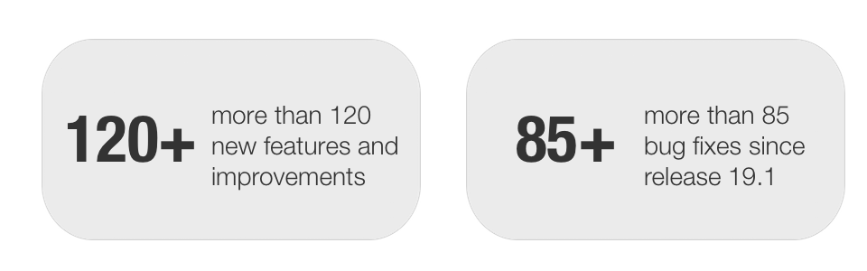

Since release 19.1, over 120 new features and improvements have been added to OpenOlat. Here you can find the most important new features and changes. In addition, more than 85 bugs have been fixed. The complete list of changes in 19.1.x can be found [here](Release_notes_19.1.md){:target="_blank”}.

* * *

## Course Planner

Planning - booking - implementation: the new Course Planner covers all phases of course organization! It replaces the previous curriculum module and presents itself with a fresh layout, new navigation and a cockpit view that supports your everyday planning with widgets.

!!! abstract "At a glance"

    * Maintain and structure your **course offer** including dates, prices and available space.
    * Use **course templates** for recurring formats and automated instantiation of content at the start of the course.
    * Store the desired **offer types** such as invoice, access code or Paypal for various booking options.
    * When **planning events**, use the direct integration of BigBlueButton & MS Teams for online appointments.
    * Present your course offerings in the **public catalog** - no login required.
    * Show interested parties and participants what they can expect on the **redesigned info page**.
    * Use the **integrated registration process** to enable interested parties to register themselves conveniently and securely.
    * Manage participants and lecturers, confirm or cancel bookings and memberships, keep track of all changes in the **member history**.
    * Generate **Excel reports** on invoice-based bookings or issued certificates for further processing of data in external systems or for filing.

### Cockpit view

To support course planners, the most important data is summarized in corresponding widgets on the overview page of the implementation:

* **Widget "Members"**: Number of active and pending participants, remaining space quota and display of people with other roles
**Widget "Dates"**: Listing of current and upcoming dates
**Widget "Course content"**: Display of the linked course and course template
**Widget "Catalog"**: Stored offer types and availability of implementation in the internal and external catalog

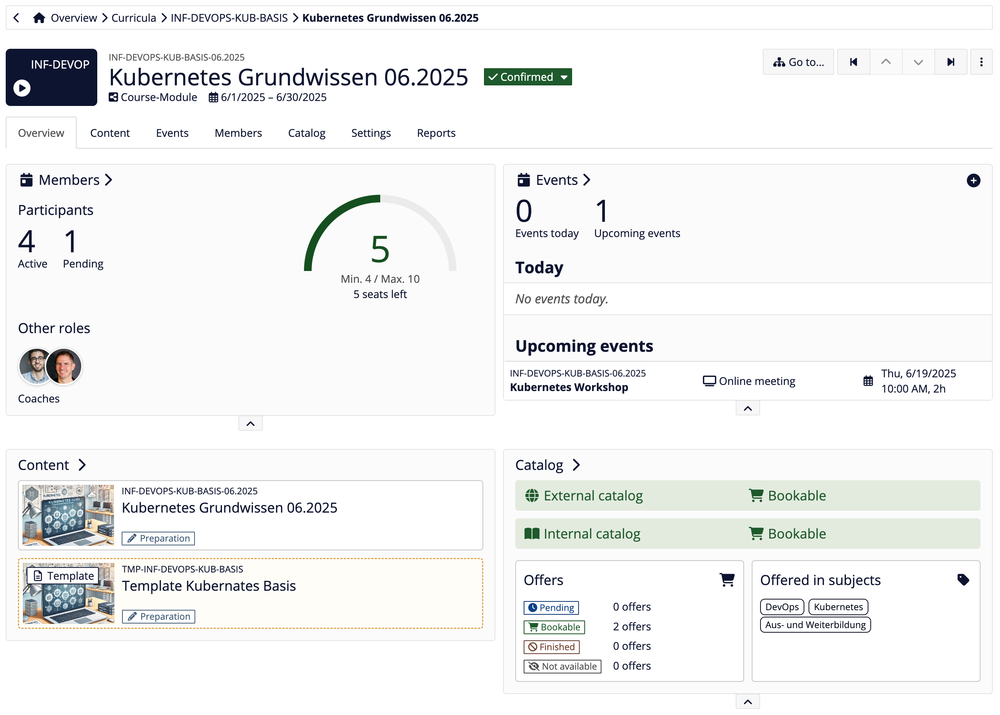{ class="shadow lightbox" title="Overview of a specific implementation" }

### Integrated event management

Previously, lectures/appointments could only be managed as part of courses. The Course Planner now makes it possible to manage and maintain events during the planning phase directly on the product or on the implementation - even without already stored course content.

As part of this, the dialog for entering events has been revised and expanded to include **BigBlueButton/MS Teams integration** for online appointments.

The stored events are later applied to a course when the implementation is linked to it and are then also available in the course.

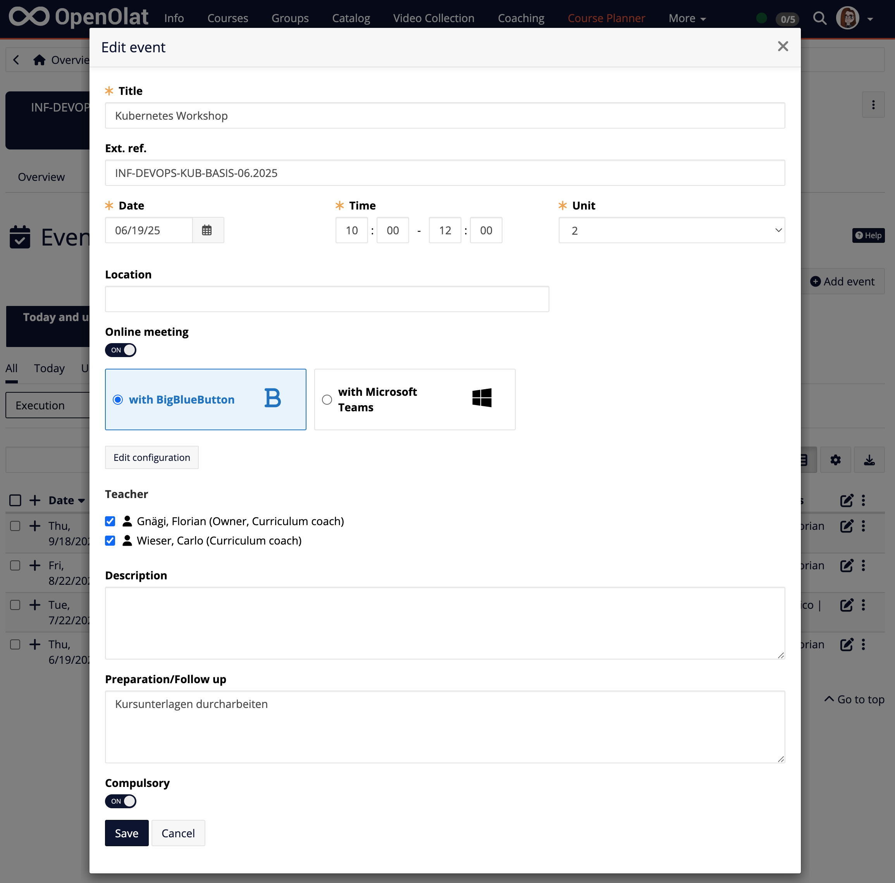{ class="shadow lightbox" title="Dialog for creating or editing events" }

### Member and booking management with history

With the Course Planner, the administration of members such as participants and lecturers as well as their bookings takes place directly in the product/the implementation.

Confirming outstanding memberships, canceling bookings, removing participants or booking a course on behalf of another person - everything is covered. In the case of manual adjustments to memberships, the reasons can be entered as **comments**. All changes are transparent and traceable via the member and booking history.

For each booking, modification to a booking or membership, a corresponding e-mail notification can be triggered to inform participants of the change.

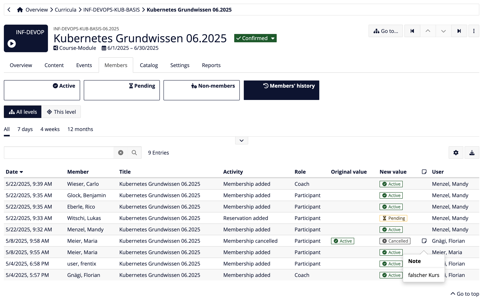{ class="shadow lightbox" title="Member history of an implementation" }

Lecturers and teachers can be conveniently managed via a bulk action and booked for several dates or removed again.

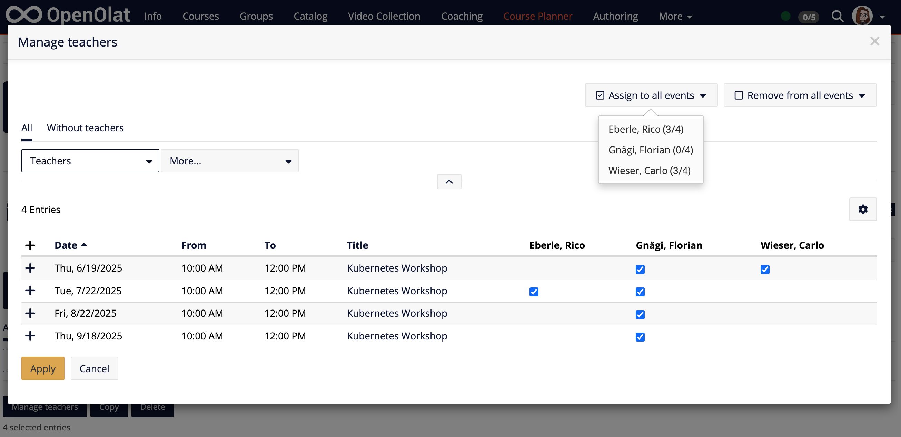{ class="shadow lightbox" title="Bulk actions for managing teachers" }

### Report area

A "Reports" area is available for each product/implementation to generate **Excel reports** for invoice-based bookings.

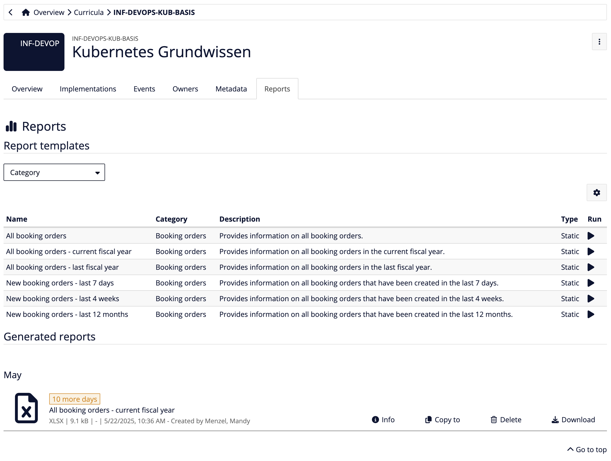{ class="shadow lightbox" title="Report area for booking orders" }

### Further new features

* Life cycle of the implementations with different states
* Display of additional information on the occupancy status of implementations: fully booked/overbooked, available places, minimum number reached/not reached
* Enhanced and optimized wizard for copying implementations or their subordinate structures
* Extended configuration for the element types (levels) of the product structures:
    * Level can be used as a implementation (root element)
    * Level is used to structure the implementation or can itself contain content (= one course / several courses)

### New labels  {: #new-labels}

With Release 20.0, the following labels/terms have been adjusted:

Previously | New
---------|----------
Curriculum management | Course Planner
Curriculum manager | Course planner
Booking | Booking order
Offer | Offer type
Lecture or lecture block | Event
Lectures management | Absence management
Lectures manager | Absence manager

* * *

## Public catalog

In addition to the internal catalog in OpenOlat, courses and entire implementations can also be published in the public (external) catalog. This allows people without an OpenOlat login to discover the advertised course offerings and book the desired courses after registering.

Using the new catalog launcher for "Selected implementations", the implementations can be put together specifically and effortlessly for the catalog start page.

The most important information about the implementation such as available places, content description, details on lecturers and event dates are clearly summarized for interested parties on the respective info page (similar to the info page of a course).

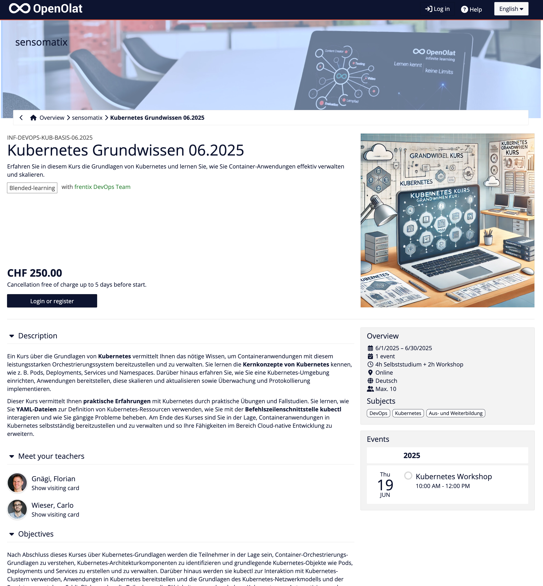{ class="shadow lightbox" title="Info page of an implementation" }

* * *

## New offer type "Invoice"

In addition to Paypal, "Invoice" can now be used as an additional payment method for course offers.

Along with this, the following enhancements have been implemented in OpenOlat:

* Process for entering or selecting an invoice address, cost center handling and comment function
* Cancellation process for invoice-based bookings
    * Optional cancellation deadline
    * Optional cancellation fee
* Selection of different currencies
* Display of prices including or excluding VAT
* Selectable number format for prices

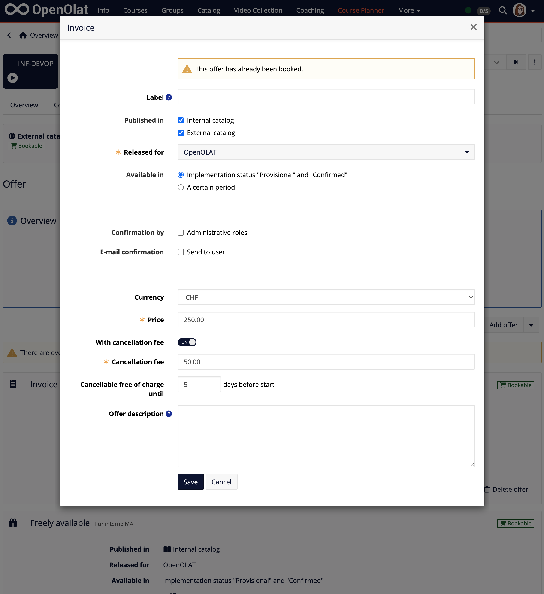{ class="shadow lightbox" title="Offer type 'Invoice'" }

* * *

## Enhanced self registration process

If people without an OpenOlat login decide to book a course from the external catalog, they can create an account directly by self-registration. The enhanced and optimized wizard guides them step by step through the registration process.

The **validation of the e-mail address by code** ensures a secure process when creating a new account, in the "Password reset" process and when changing the e-mail address.

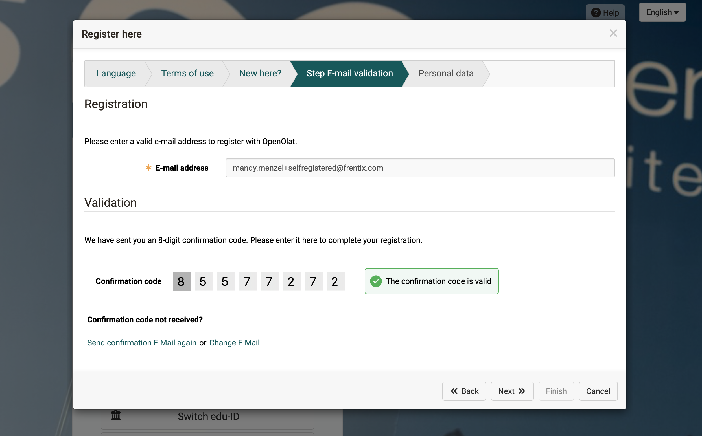{ class="shadow lightbox" title="E-mail address validation by code" }

Those who use organizational structures in OpenOlat can also set up a **mapping of the email address domain** to the corresponding organizations. When new users self-register, they are automatically assigned to the corresponding organizations or sub-organizations after email validation - this saves the administrators from having to assign them manually.

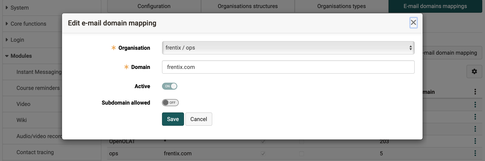{ class="shadow lightbox" title="Assignment to the organization via e-mail domain" }

* * *

## New role "Education Manager"

Similar to the existing role of "Line manager", a new organizational role of "Education manager" is available. People with this role take care of participants as part of their training and, for example, make course bookings on their behalf, confirm reserved bookings and keep an eye on participants' learning progress, deadlines and absences. Depending on the configured permissions, they may also be able to create or deactivate users.

* * *

## Coaching Tool: Cockpit & Reports

The Coaching Tool is a central area in OpenOlat for people with a supervisory function.

From version 20.0, course instructors, education managers and supervisors benefit from a redesigned, clean **Cockpit view**. Course bookings, learning statuses and participants' progress can be seen at a glance - for quick decisions and targeted coaching. In addition, open assignments such as corrections, assessments or approvals are available across all courses.

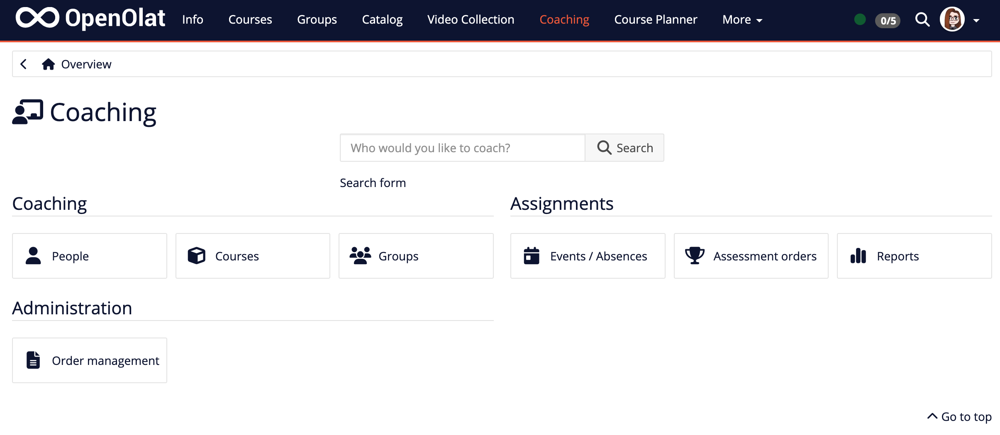{ class="shadow lightbox" title="Cockpit Coaching Tool" }

In the "People" section, the current table and filter concept has been implemented and additional relevant information has been added, particularly for the view of the roles of education manager and line manager.

Coaches with different roles such as "Master coach", "Education manager" or, for example, a "mentor" function can easily switch between the respective groups of people being supervised.

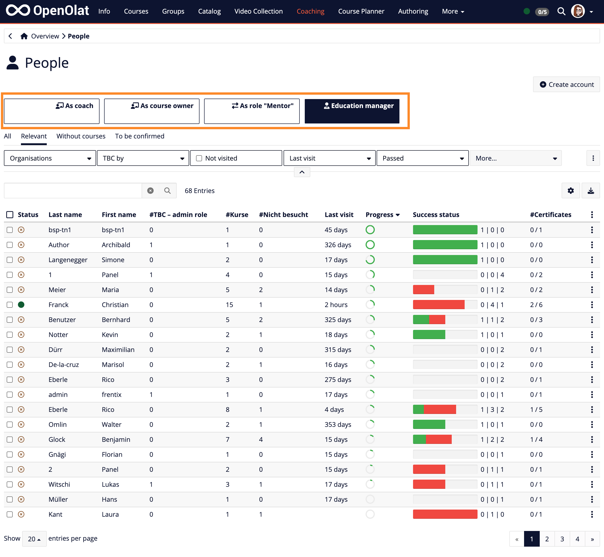{ class="shadow lightbox" title="Function-based views in the coaching tool" }

A new feature is the ability to generate **Excel reports** on invoice-based bookings, absences and certificates issued directly via the coaching tool.

* * *

## Organization-specific filing

If organizational structures are used, a separate storage area can be activated for organization-specific and legal documents (e.g. for fundamental contracts, general terms and conditions). It is available for each organizational level.

Users with administrative roles and corresponding organizational affiliation can access these documents via File Hub or WebDav.

* * *

## News about courses

### Course usage

Until now, course learning resources have mainly been used as a stand-alone vessel or integrated into a curriculum structure. With the Course Planner, the area of application of the course learning resource has expanded. The purpose of use can be declared in the Course settings > Share for a clear delimitation:

* Standalone
* Embedding in product
* Template

If the Course Planner is used extensively, it is advisable to set the default usage for new courses in the system administration > Course Planner settings to "Embedding in product".

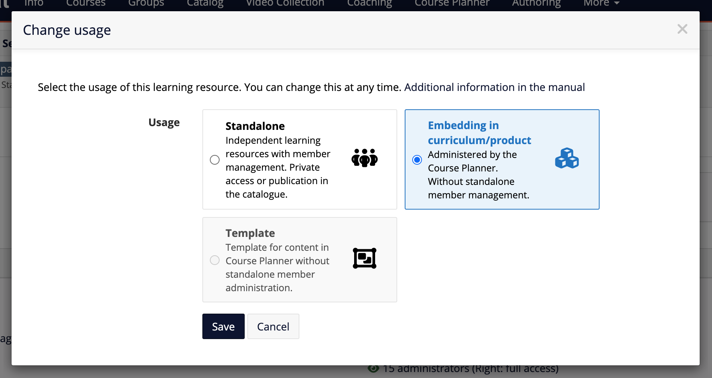{ class="shadow lightbox" title="Options for course usage" }

#### Embedding in product

Courses that are managed via the Course Planner are explicitly marked as such with the usage "Embedding in product".

#### Course template

For recurring or similarly structured course formats, so-called course templates can be stored in Course Planner and used for multiple runs.

A template is structured like a normal course, maintenance and further development for future runs can be carried out directly in the template - this saves time.

For each individual implementation, the course template is instantiated - automatically or manually - and is then available as a “real” course, including content, when the course starts.

### New navigation under "Courses"

In order to provide participants in particular with a better overview and access to their (booked) course content, the navigation in the “Courses” section has been revised.

Previously, all courses in which the user had a membership were listed under "My courses". Under "Curriculum", the courses were displayed embedded in the structure of the respective curriculum.

Now, there are the following separate entry points:

  * "My courses" contains all courses to which the participant has access in a flat view
  * "[Name of implementation]" provides direct access to a specific implementation that is managed and controlled via the Course Planner
  * "Education programs" lists the participant's active implementations; those marked as favorites also appear as a separate navigation point for quick access
  * "In preparation" shows all courses and implementations to which the participant does not yet have access

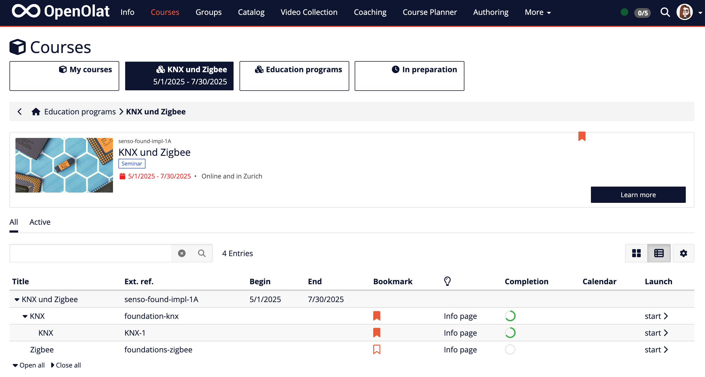{ class="shadow lightbox" title="Navigation in the menu 'Courses'" }

### Miscellaneous

* Harmonization of the information displayed on the course info page
* Optimized placeholder images for courses

* * *

## New concept for role management

The administration of user roles in user management has been completely revised.

A distinction is now made between the basic organization to which a user belongs (home organization) and which additional administrative roles a user has per organization.

The hierarchy of organizational levels and the inheritance of roles to sub-organizations is explicitly shown. If global roles (system administrator, group manager, pool manager) are assigned to a sub-organization, a corresponding note appears.

As of (:octicons-tag-24:) release 20.0.4, all changes to the role assignment are displayed in the "Role history" area.

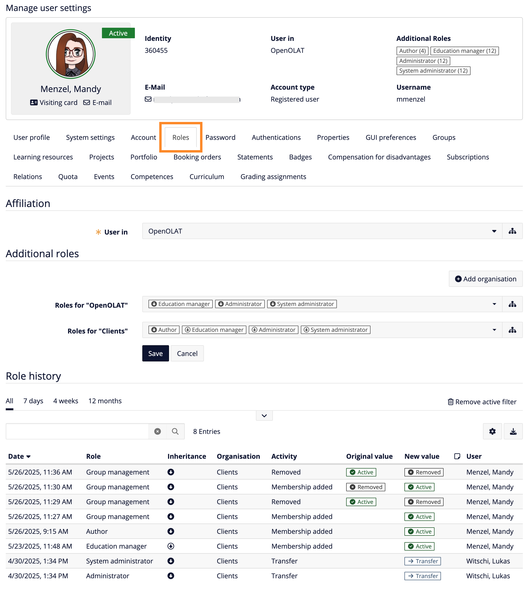{ class="shadow lightbox" title="Revised role management with history" }

* * *

## Further, briefly noted

* Groups: Optimization of the offer configuration for groups analogous to courses
* Optimized login information if a person cannot log in because the account is inactive, pending or the login is locked
* New rights for the "Line manager" role analogous to the new "Education manager" role
* Revised component for displaying user information
    * Optimized display of relevant data
    * New portrait for users without their own picture
    * Direct link to user administration for administrative persons with corresponding rights

=== "User information on the test course element"

    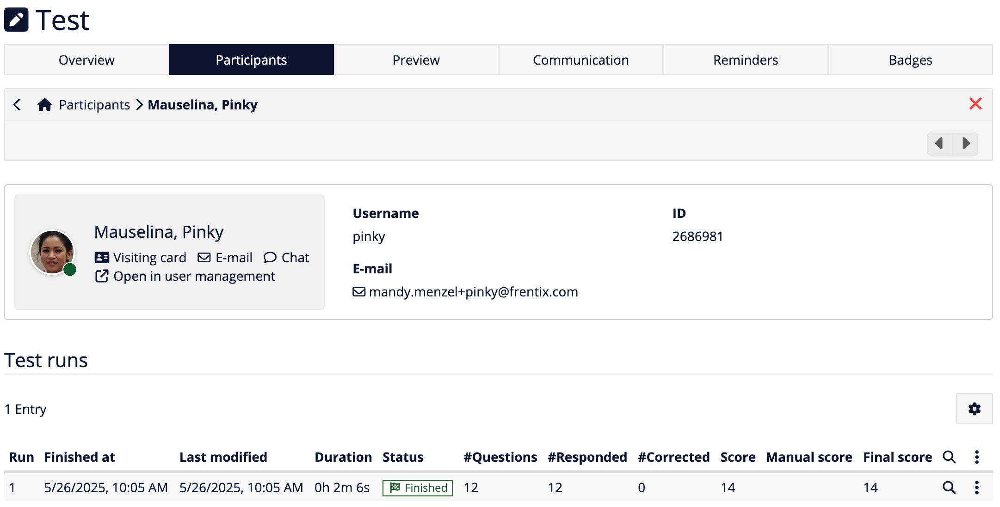{ class="shadow lightbox" title="Display of user information on test course element" }

=== "User information in the user administration"

    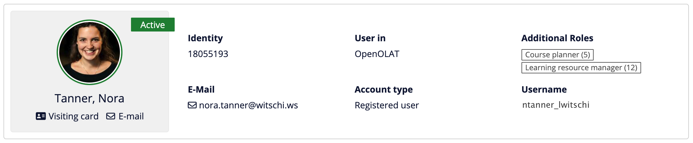{ class="shadow lightbox" title="Display of user information in the user administration" }

* Absence recording: The first admission date of participants is initially set analogous to the participants' course registration date (:octicons-tag-24: release 20.0.5)

* * *

## Administrative / Technical

* Migration of global roles (system administrator, group manager, pool manager) to the standard organization and option to transfer existing role configurations
* Password change policy: change the validity period from hours to minutes; default value: 30 minutes
* Update of third-party libraries
* Update ical4j to 4.1 (better support of time zones - mainly for Outlook)
* Cleanup of temporary key confguration and refactoring of the option to set a password if no OLAT authentication exists
* Support for “Remote login” has been removed
* REST: Authentication with plain text parameters has been removed
* Properties of type "Password/Secret" are hidden
* OAI-PMH interface: Jump to catalog page for Google indexed learning resource with offer for the external catalog

* * *

## Information for system administrators

### Migration curriculum module > Course planner

!!! danger "Preparation for upgrade to 20.0"

    With the migration to Release 20.0, the **curriculum type** becomes a mandatory element!

    If the curriculum module is already in use, it is recommended to assign a curriculum type to **each** curriculum element **before the upgrade**. If no curriculum type is set, the upgrader automatically assigns a standard curriculum type.

    * [x] Create curriculum type: `Administration > Modules > Curriculum > "Types" tab`.
    * [x] Assign curriculum type: `Curriculum administration > Select a curriculum > Select a curriculum element > "Edit" > Type`.

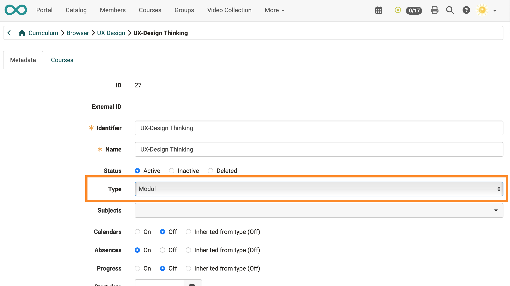{ class="shadow lightbox" title="Assignment of curriculum type before upgrade to 20.0" }

### Activate / configure new functions

!!! note "Checklist after update to 20.0"

    The following functions have to be activated / configured in the `Administration` after an update to release 20.0:

    * [x] Rules for "Reset password": `Login > Password > Password change policies`
    * [x] Domain mapping via e-mail address: `Modules > Organizations > "Configuration" tab > E-mail domain mappings`
    * [x] Organization-specific folder for legal documents: `Module > Organizations > "Configuration" tab > Legal documents`
    * [x] Move global roles to standard organization: `Modules > Organizations > "Configuration" tab > Status`

    **Configurations for Course Planner use:**

    * [x] Default usage for new courses: `Module > Course Planner > Tab "Course Planner"`
    * [x] Catalog launcher for courses: `Module > Catalog > "Launch page" tab > Launcher for "Selected implementations"
    * [x] Number format for prices: `Core configuration > Language and region > Formats > Number format`.
    * [x] Configuration start fiscal year for report on invoice-based bookings of transactions: `olat.local.properties > reports.accounting.fiscal.year.start.day / reports.accounting.fiscal.year.start.month`

* * *

## More information

* [YouTrack Release notes 20.0.6](https://track.frentix.com/releaseNotes/OO?q=fix%20version:%2020.0.6&title=Release%20Notes%2020.0.6){:target="_blank"}
* [YouTrack Release notes 20.0.5](https://track.frentix.com/releaseNotes/OO?q=fix%20version:%2020.0.5&title=Release%20Notes%2020.0.5){:target="_blank"}
* [YouTrack Release notes 20.0.4](https://track.frentix.com/releaseNotes/OO?q=fix%20version:%2020.0.4&title=Release%20Notes%2020.0.4){:target="_blank"}
* [YouTrack Release notes 20.0.3](https://track.frentix.com/releaseNotes/OO?q=fix%20version:%2020.0.3&title=Release%20Notes%2020.0.3){:target="_blank"}
* [YouTrack Release notes 20.0.2](https://track.frentix.com/releaseNotes/OO?q=fix%20version:%2020.0.2&title=Release%20Notes%2020.0.2){:target="_blank"}
* [YouTrack Release notes 20.0.1](https://track.frentix.com/releaseNotes/OO?q=fix%20version:%2020.0.1&title=Release%20Notes%2020.0.1){:target="_blank"}
* [YouTrack Release notes 20.0.0](https://track.frentix.com/releaseNotes/OO?q=fix%20version:%2020.0.0&title=Release%20Notes%2020.0.0){:target="_blank"}
