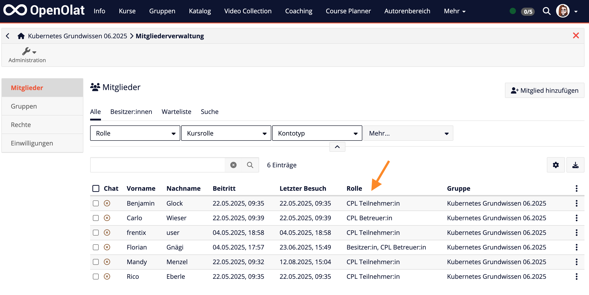
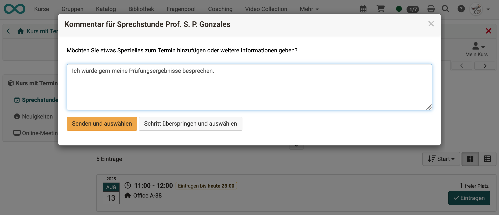

# Release Notes 20.1

* * *

:material-calendar-month-outline: **Releasedatum: 16.07.2025 • Letztes Update: 03.09.2025**

* * *

Mit OpenOlat 20.1 geben wir unseren nächsten Major Release frei.

Wichtige Neuerungen sind das **Rebranding** in Verbindung mit dem **Course Planner**, die überarbeitete Navigation im Kurs-Bereich und das **erweiterte Coaching Tool** für die angestrebte klare Trennung zwischen **Lern- und Betreuungsumgebung**.

Die **Themenbörse** punktet mit intelligenten Optimierungsstrategien für den Einschreibe-Algorithmus, die **Terminplanung** bietet mehr Flexibilität dank Buchungsfristen und zusätzlichen Informationen für Organisator:innen.

Die konsolidierten und optimierten **Bewertungseinstellungen** in Lernpfad-Kursen zeigen Änderungen transparent auf und die **lokale Katalogverwaltung** für Bereiche der Katalogtaxonomie vereinfacht die Pflege von Angeboten.

Die erste Fassung des brandneuen **Kreditpunkte-Moduls** bereitet den Weg für die Durchführung ganzer Zertifizierungsprogramme. **Umfragen per QR-Code oder Mail-Liste** für umfassendes Qualitätsmanagement, **Kommentar-Abos** für Blogs und Podcasts sowie **digitale OpenBadges-Signaturen** runden diesen Release ab.

Seit Release 20.0 wurden über 105 neue Funktionen und Verbesserungen zu OpenOlat hinzugefügt. Hier finden Sie die wichtigsten Neuerungen zusammengefasst. Zusätzlich wurden mehr als 70 Bugs behoben. Die komplette Liste der Änderungen in 20.0.x finden Sie [hier](Release_notes_20.0.de.md){:target="_blank”}.

* * *

## Course Planner

Mit :octicons-tag-24: Release 20.1 wurde das systemweite Rebranding fortgeführt und für die Bezeichnung "Curriculum", die Curriculumsrollen sowie für Kursrollen, welche durch den Course Planner (CPL) verwaltet werden, umgesetzt (siehe auch [Bezeichnungsänderungen Release 20.0](Release_notes_20.0.de.md#neue-bezeichnungen)).

Bisher | Neu
---------|----------
Curriculum | Produkte und Bildungsprodukte
Curriculumbesitzer:in | Produktbesitzer:in
Elementbesitzer:in | CPL Elementbesitzer:in
Teilnehmer:in | CPL Teilnehmer:in
Betreuer:in | CPL Betreuer:in
Kursbesitzer:in | CPL Kursbesitzer:in
Klassenlehrer:in | CPL Klassenlehrer:in

{ class="shadow lightbox" title="Kursrollen via Course Planner" }

* :octicons-tag-24: Release 20.1.2
    * Abbildung/Zuordnung von Beziehungen zwischen Fachbereichen (Taxonomie) und Terminen
    * Kennzeichnung des Standard-CPL-Elementes bei Modularisierung von Kursen

* * *

## Coaching Tool

### Redesign/Erweiterungen

Das Redesign des Coaching Tools wurde fortgesetzt und umfasst neben der Umsetzung des modernen Tabellen- und Filterkonzeptes auch die Ergänzung und optimierte Anzeige kontext-spezifischer Daten sowie die Realisierung der - aus dem Bereich "Kurse" bekannten - Listenansicht für Lernressourcen.

{ class="shadow lightbox" title="Kursübersicht im Coaching Tool" }

Ab :octicons-tag-24: Release 20.1.2 enthält der im Report-Bereich verfügbare Absenzen-Bericht für Ausbildungsverantwortliche noch mehr relevante Informationen.

### Abspaltung von "Kurse"

Aus historischen Gründen finden im Bereich "Kurse" nicht nur Teilnehmende ihre Kurse und Lerninhalte, sondern auch Betreuer:innen und Kursbesitzer:innen können dort auf ihre Kurse und Lernressourcen zugreifen. Lernen sowie Betreuen/Verwalten werden an dieser Stelle vermischt, was häufig zu Verwirrung führt, insbesondere wenn Personen mehrere Kursrollen besitzen.

Zukünftig wird sich der Bereich "Kurse" auf die Lernenden/Teilnehmenden konzentrieren. Personen mit Betreuungsfunktion (Betreuer:innen, Besitzer:innen, Ausbildungsverantwortliche, Linienvorgesetzte, 1:1-Zuordnung) finden ihre Kurse und Lernressourcen dann nur noch im Bereich "Coaching".

!!! Note "Roadmap für Zugang zu Lernressourcen"

    * Release 20.1: "Kurse" für Teilnehmende; "Kurse" und "Coaching" für Betreuer:innen/Besitzer:innen (optional konfigurierbar)
    * Release 20.2: "Kurse" für Teilnehmende; "Coaching" für Betreuer:innen/Besitzer:innen

Zusätzliche Optionen und Hinweise für eine schrittweise Umstellung des Zugangs von "Kurse" zu "Coaching" für Betreuende sind ab :octicons-tag-24: Release 20.1.1 verfügbar und unterstützten die Anwender:innen in der Übergangsphase.

{ class="shadow lightbox" title="Konfiguration des Lernressourcenzugangs" }

{ class="shadow lightbox" title="Hinweis zur Migration für Betreuende" }

!!! tip "Step by Step: Zugang Lernressourcen für Betreuende umstellen"

    * [x] Aktivierung Coaching Tool unter `Administration > e-Assessment > Coaching`
    * [x] Berechtigungen für Coaching Site setzen unter `Administration > Customizing > Sites`
    * [x] Schrittweise Konfiguration der Migration unter `Administration > Module > Reporsitory > Zugang`:
        * [Phase 1] Zugang Kursbesitzer:innen/Betreuer:innen: Aktivierung "Kurse & Coaching"
        * [Phase 2] Zusätzliche Aktivierung "Hinweis in Kurse" zur Information
        * [Phase 3] Umstellung Zugang Kursbesitzer:innen/Betreuer:innen: Aktivierung "Coaching"
        * [Phase 4] Deaktivierung "Hinweis in Kurse"

* * *

## Kursbaustein "Themenbörse"

Neue Optionen und Anpassungen für den Algorithmus der Themenbörse ermöglichen eine noch zielgerichtetere Verteilung von Themen.

So wurde die Anzahl der Durchläufe für den Einschreibeprozess massiv erhöht, um die Chancen auf noch bessere Varianten zu steigern.

Beim Einschreibevorgang kann der Algorithmus - und somit das Ergebnis - durch verschiedene vordefinierte Optimierungsstrategien wie "Maximale Anzahl Einschreibungen", "Maximale Prioritätsberücksichtigung" oder "Maximale Themenanzahl" zielorientiert beeinflusst werden. Eine dynamische Anpassung ist aber auch über eine individuelle Gewichtung der Parameter möglich.

{ class="shadow lightbox" title="Optimierungsstrategien für Einschreibevorgang" }

Für Themen, die beispielsweise als Teil eines Seminars oder Labors eine physische Durchführung erfordern, kann im Einschreibeprozess ausserdem der Durchführungszeitraum berücksichtigt werden, um zeitliche Überschneidungen zu verhindern.

Weitere Neuerungen sind:

* Export der Themen inklusive Mediendateien als Zip-Datei
* Erweiterter Import von Themen inklusive Mediendateien wie Teaser-Bild, Teaser-Video sowie Dateien benutzerdefinierter Felder
* Verlängerung des Auswahlzeitraumes inklusive Wiederöffnen bereits abgeschlossener Zuteilungen
* Bestätigung der Anzahl Einschreibungen durch Teilnehmende, wenn die vorgegebene Anzahl selbstständig reduziert werden kann
* Ergänzung der Themenbörse unter Kurs-Administration > Dateien > "Speicherverbrauch anzeigen"
* Aktivitätslog zur Nachvollziehbarkeit von Aktionen und Konfigurationsänderungen (:octicons-tag-24: Release 20.1.2)

{ class="shadow lightbox" title="Import von Themen inklusive Mediendateien" }

{ class="shadow lightbox" title="Aktivitätslog" }

* * *

## Kursbaustein "Terminplanung"

Das Setup zur Bereitstellung und Buchung von Terminen, z.B. für Sprechstunden oder Ausflüge, kann sehr unterschiedlich ausfallen. Oft benötigen Organisatoren rechtzeitig vor Terminbeginn zusätzliche Informationen für die Vorbereitung. Die neuen Optionen tragen zum flexiblen Einsatz des Terminplanungsbausteins bei.

So kann für Teilnehmende eine Frist zur Termin-Buchung/-Einschreibung konfiguriert werden, um dadurch "Last-Minute"-Anmeldungen zu vermeiden.

{ class="shadow lightbox" title="Einschreibefrist und Filter für ausgebuchte Termine" }

Zusätzlich lässt sich ein Kommentarfeld aktivieren, welches die Teilnehmenden bei der Auswahl eines Termins ausfüllen können. Darüber sind zum Beispiel Angaben zum gewünschten Inhalt der Besprechung oder Zusatzinformationen möglich.

{ class="shadow lightbox" title="Kommentar bei Terminbuchung" }

Teilnehmende sehen über einen neuen Filter auch ausgebuchte bzw. bestätigte Termine und - wenn aktiviert - wer diese Termine gebucht hat. So können sie andere Teilnehmende kontaktieren, um untereinander Termine/Gruppen zu tauschen.

Organisatoren können sich ausserdem optional per E-Mail benachrichtigen lassen, sobald jemand einen Termin auswählt/bucht.

* * *

## Neues rund um Kurse

### Bewertungseinstellungen Lernpfad

!!! info "Hinweis"

    Diese Anpassung betrifft nur Lernpfadkurse.

Bei Anpassungen der Bewertungseinstellungen im Lernpfadkurs oder beim Zurücksetzen einzelner Kursbausteine wird der bestehende Kurserfolgsstatus der Teilnehmenden basierend auf der aktuellen Konfiguration neu berechnet.

Kursbesitzer:innen können an der Stelle entscheiden, ob der vorhandene Kurserfolgsstatus entsprechend aktualisiert oder beibehalten wird (im Sinne von "Wenn der Kurs einmal bestanden ist, gilt er immer als bestanden."). Der Dialog für die Aktion "Neuberechnung der Daten" wurde dafür umgewandelt in "Bewertungseinstellungen speichern", komplett überarbeitet und um folgende Schritte erweitert:

* Überschriebenen Kurserfolgsstatus zurückzusetzen
* Kurserfolgsstatus "Bestanden" zurückzusetzen

{ class="shadow lightbox" title="Wizard: Änderungen übernehmen" }

{ class="shadow lightbox" title="Wizard: Überschriebenen Kurserfolgsstatus zurücksetzen" }

{ class="shadow lightbox" title="Wizard: Kurserfolgsstatus Bestanden zurücksetzen" }

In diesem Zuge wurde ausserdem die globale Aktion "Daten neu berechnen" entfernt und neu als Sammelaktion umgesetzt, die entweder im Bewertungswerkzeug oder direkt auf bewertbaren Kursbausteinen verfügbar ist.

### Weitere Neuerungen für Kurse

* Entfernung nachfolgender Kurs-Aktionen für Kursbesitzer:innen ohne eine globale Rolle "Autor:in", "Lernressourcenverwalter:in" oder "Administrator:in", damit der Autorenbereich nicht umgangen werden kann (z. B. relevant bei Verwaltung der Kurse und Rollen über den Course Planner):
    * Kopieren
    * Löschen
    * Wiederherstellen
    * In Lernpfad-Kurs konvertieren
* Optimierte Meldung auf Info-Seite, wenn Kurs/Lernressource nicht zugänglich
* Externe Referenz wird ab sofort in den Kopiervorgängen (1:1 oder Wizard) mit kopiert
* Kursbaustein "Externe Seite":
    * Bei neuen Systemen per Default deaktiviert, da Verwendung aus Sicherheitsgründen nicht mehr empfohlen (eingebundene Seiten müssen für den Zugriff bestimmte Bedingungen erfüllen, andernfalls funktionieren sie nicht)
    * Bei bestehenden Systemen optional deaktivierbar
* Kurseditor "Kursbausteine einfügen": Verschiebung der Kursbausteine "HTML-Seite" und "Externe Seite" in den Bereich "Andere" (Nutzung aus Sicherheitsgründen nicht mehr empfohlen)
* Beschränkung der Benutzersuche innerhalb des Kurses auf Kursmitglieder (:octicons-tag-24: Release 20.1.2)
* Lernpfad: Anzeige der vorläufigen Gesamtpunktzahl inklusive nicht freigegebener Punkte (:octicons-tag-24: Release 20.1.2)
* Konfiguration der Standardrolle bei Zugriff auf Kurse im Falle mehrerer Kursrollen (:octicons-tag-24: Release 20.1.3)

* * *

## Katalog

### Katalogverwaltung für Katalog V2

Administrator:innen können neu die Rolle "Katalogverwalter:in" vergeben und somit Personen berechtigen, Teilbereiche (inklusive Unterebenen) der Katalogtaxonomie zu bearbeiten und zu pflegen, auf deren Basis die ausgeschriebenen Angebote im Katalog angezeigt werden. Katalogverwalter:innen können diese Zugriffs- und Bearbeitungsrechte innerhalb ihrer Teilbereiche und deren Unterebenen ebenfalls vergeben.

Zusätzlich wurde das Navigationskonzept, die Anzeige des Taxonomie-Baumes sowie die Verwaltung und Pflege der Metadaten in der Taxonomie überarbeitet.

{ class="shadow lightbox" title="Katalogverwaltung" }

### Zugang zu Katalog V1

Mit dem Umbau der Navigation unter "Kurse" in :octicons-tag-24: Release 20.0 ist der Katalog V1 - analog zum Katalog V2 - nur noch als separate Site verfügbar. Die Konfiguration zur Anzeige "Katalog in Kurse" wurde entfernt.

Auf Systemen mit bisherigem Katalog-Zugang ausschliesslich über "Kurse" muss die Site noch aktiviert werden.

!!! info "Katalog-Site aktivieren"

    Konfiguration unter `Administration > Customizing > Sites > Katalog` inklusive Auswahl der berechtigten Rollen (Default: "Alle Konten inklusive Gäste und externer Benutzer:innen")

* * *

## eTesting

Beim Einsatz des Prüfungsmodus für Prüfungen oder bei der Prüfungseinsicht werden neu bestimmte Benutzer- und Systemaktivitäten im Kurslog eingetragen, um beispielsweise bei Supportfragen nach der Prüfung/Prüfungseinsicht die Vorgänge nachvollziehen zu können.

So werden Beginn und Ende des Prüfungsmodus / der Prüfungseinsicht, tatsächlicher Beginn und tatsächliches Ende (Sperren) der spezifischen Benutzer:innen sowie die Erteilung einer Verlängerung bzw. eines Nachteilsausgleichs erfasst.

* * *

## Blog/Podcast: Kommentar-Abo

Neben der bisherigen Abonnement-Funktion bei Blog und Podcast über neue bzw. geänderte Beiträge kann ab sofort auch ein zusätzliches Abo für Kommentare zu den Beiträgen - entweder für den gesamten Blog/Podcast oder für ganz bestimmte Beiträge - aktiviert werden. Dadurch werden Eigentümer:innen des Blogs/Podcasts sowie Verfasser:innen der einzelnen Posts aktiv bei Reaktionen anderer zu ihren Beiträgen informiert.

{ class="shadow lightbox" title="Kommentar-Abo für Blog und Podcast" }

* * *

## Neues Modul "Kreditpunkte"

Ab :octicons-tag-24: Release 20.1.1 steht die erste Fassung des Moduls "Kreditpunkte" zur Verfügung, welches in Zukunft auch in Verbindung mit Zertifizierungsprogrammen in OpenOlat relevant ist.

Über das Modul können eigene Kreditpunktesysteme global definiert werden. Diese ermöglichen später den Teilnehmenden für das Bestehen von Kursen Bildungspunkte/Credits, wie zum Beispiel ECTS oder LearnCoins, zu sammeln.

In der nächsten Ausbaustufe können die Credits dann wiederum als Währung verwendet werden, um weitere Kurse zu kaufen oder um im Rahmen einer Rezertifizierung die gesammelten Credits für die Erneuerung des Zertifikats einzulösen.

Ein reines Wiederholen des initialen Zertifikatskurses ist somit nicht mehr erforderlich.

{ class="shadow lightbox" title="Kreditpunkte-Modul" }

* * *

## Modul "Qualitätsmanagement"

### Umfragen per Mail-Einladung / QR-Code

Ergänzend bzw. alternativ zu automatisierten Datenerhebungen innerhalb von OpenOlat über das QM-Modul kann der Zugang zu einer Umfrage neu auch per E-Mail-Einladung oder über einen Link/QR-Code erfolgen. Somit werden auch Personen ohne OpenOlat-Login erreicht.

**Verteilung der Umfrage via E-Mail-Liste**: Zum Beispiel für Befragungen bekannter Adressaten wie Eltern, Trainer:innen oder Praxisanleitende, externe Partner oder Kunden

**Zugang zur Umfrage via Link/QR-Code**: Zum Beispiel bei Feedback-Umfragen nach Informationsveranstaltungen oder Vorträgen mit unbekanntem Publikum

{ class="shadow lightbox" title="Zugang QM-Umfrage via Link oder Mail" }

### Weitere Anpassungen

Im Report wird die Anzahl der Teilnehmer:innen, die via Link zur Umfrage gelangt sind, zusätzlich als "Eingeladen über Link" ausgewiesen.

Zudem wurden die Meldungen bei Abschluss einer Umfrage, bei erneutem Aufruf und bereits abgeschlossener Umfrage sowie bei einer nicht verfügbaren Umfrage aufgehübscht und optimiert.

* * *

## OpenBadges

### Digitale Signierung

Ergänzend zur bestehenden Verifizierungsmethode "Host-based" wurde die Variante "Signed-based" implementiert. Damit kann die Echtheit von Badges über den Public Key eines digitalen Zertifikats geprüft werden, um die Authentifizierung und Integrität des Badges zu gewährleisten. Die digitale Signatur ist Bestandteil des Badges, es ist keine manuelle Zertifikatverwaltung notwendig.

{ class="shadow lightbox" title="Badge Verifizierung mit Public Key" }

### Versionierung

Zur Korrektur von Tippfehlern oder Verknüpfung eines aktualisierten Bildes ist die Bearbeitung bereits verwendeter Badgeklassen zulässig. Dabei wird automatisch und transparent eine neue Version erstellt, so dass bereits ausgestellte Badges nicht von der Änderung betroffen sind.

{ class="shadow lightbox" title="Badge Versionierung" }

### Weitere Neuerungen

* Optimierte Empfängerauswahl für globale Badges (:octicons-tag-24: Release 20.1.2)
* Optimierung der Performance beim Ausstellen und Versenden von Badges (:octicons-tag-24: Release 20.1.4)

* * *

## UX, Usability

* Optimierte Filter-Komponente
* Konsistenteres Verhalten
* Vereinheitlichung und Optimierung der Listenansicht von Kursen/Lernressourcen in den Bereichen Kurse, Coaching und Katalog (:octicons-tag-24: Release 20.1.1)
* Neutrale Farbgebung für die Lernpfad-Fortschrittsanzeige (:octicons-tag-24: Release 20.1.2)
* Optimierte und funktional erweiterte Einbindung von Video-Lernressourcen in Video-Kursbaustein (:octicons-tag-24: Release 20.1.3)

{ class="shadow lightbox" title="Optimierte Listenansicht im Bereich Kurse" }

* * *

## Accessibility

* :octicons-tag-24: Release 20.1.2
    * Optimierte Kontrastbehandlung in Test-Navigation, für Icons und Fortschrittsanzeige
    * Ergänzung "aria-expanded" in open/close Profil-Link in Hauptnavigation und Menübaum
    * Dekorative Bilder, die keinen Inhalt vermitteln, erhalten einen leeren Alternativtext (alt=„“) anstelle von aria-hidden=„true“
    * Entfernung redundanter Titel in Menübäumen
* :octicons-tag-24: Release 20.1.3
    * Optimierte Unterstützung für Firefox-Tastaturnavigation (cmd-Enter)
    * Umsetzung von Spaltenüberschriften für Sortiertabellen als Buttons
    * Erreichbarkeit des Kursmenüs auf kleinen Bildschirmen per Tastatur
    * Tests: Optimierung für intuitive Fokus-Reihenfolge
    * Vermeidung leerer Bookmark-Links im Menü (Test und Forum)

* * *

## Weiteres, kurz notiert

* Content Creator: Duplizieren-Funktion für Layout-Block in Baustein "Seite", Formular und ePortfolio
* Termine:
    * Neue Option für Online-Termine, um manuell generische Meeting-Links (z. B. für Zoom) hinzuzufügen
    * Optimiertes Kopierverhalten für "Präsenz"-Flag
* Kurs-Erinnerungen:
    * Optimierte Deaktivierung des Moduls
    * Ergänzende Hinweise sowie Aufzeigen der konfigurierten Versandzeitpunkte
* Semesterzeiten:
    * Neue Bezeichnung "Zeitabschnitte" für generalistische Verwendung
    * Option zur Deaktivierung des Moduls
    * Aktion zum Löschen nicht verwendeter Zeitabschnitte
* Report: Export aktueller Kursmitgliedschaften von Benutzer:innen (z. B. für Archivierungs-, Buchhaltungs- oder Prüfungszwecke)
* Katalog Site: Zugang per Default für "Registrierte Benutzer und Gäste" (bisher: "Nur Gäste ohne registrierte Konten")

* * *

## Administratives / Technisches

* Aktualisierung der Bibliotheken von Drittanbietern
* ONLYOFFICE: Secret-Konfiguration über olat.properties
* Volltextsuche: Indexierung der Benutzerprofile entfernt
* Administration: Vorübergehende Entfernung der Aktion "Löschen" für Organisationen, da die Strukturen mit Release 20.0 erheblich erweitert wurden und der Löschvorgang in einem Folge-Release dahingehend überarbeitet werden muss
* Einschränkung des Rest API Zugriffs auf Benutzer:innen mit API Key zur Erhöhung der Sicherheit und Verfügbarkeit
* OAuth Erweiterungen für automatisierte Setups wie z. B. Kubernetes:
    * Konfigurationsunterstützung für generischen Provider in olat.properties
    * Weitere Konfigurationsoptionen für olat.local.properties
* SEO: Verhinderung der Indizierung dynamischer Links (:octicons-tag-24: Release 20.1.2)
* Aktualisierung der Abhängigkeiten des Paella-Players (:octicons-tag-24: Release 20.1.2)
* Option zur Deaktivierung von MathJax in den olat.properties: `mathjax.cdn=` und `mathlive.cdn=` (:octicons-tag-24: Release 20.1.3)
* Verhinderung des Systemstarts, wenn Dateisystem und Datenbank nicht übereinstimmen: `integrity.fs.db.enable=false` und `integrity.fs.db.enable.values=true,false` (:octicons-tag-24: Release 20.1.4)

* * *

## Systemadministratoren: Neue Funktionen aktivieren / konfigurieren

!!! note "Checkliste nach Update auf 20.1"

    Folgende Funktionen müssen nach einem Update auf Release 20.1 in der `Administration` aktiviert bzw. konfiguriert werden:

    * [x] Konfiguration der Kurs-Standardrolle: `Module > Repository > Standard-Rollenpriorität` (:octicons-tag-24: Release 20.1.3)
    * [x] Site für Zugang zum Katalog V1 aktivieren: `Customizing > Sites > Katalog`
    * [x] Zugang Bereich "Kurse" nur für Teilnehmende: `Module > Repository > Tab "Zugang"`
    * [x] (De-)Aktivierung Kursbaustein "Externe Seite": `Module > Externe Seite`
    * [x] Report über Kurs-Mitgliedschaften: `Reports > Kurs Mitgliedschaften` 
    * [x] OpenBadges - Verifizierungsmethode: `e-Assessment > OpenBadges > Konfiguration > Verifizierung`
    * [x] (De-)Aktivierung Modul "Kreditpunkte" und Verwaltung Kreditpunktesysteme: `Bezahlmodule > Kreditpunkte`
    * [x] RestAPI Einschränkung: `Core Konfiguration > REST API > API Zugriff`

    **Ergänzung der QM-Variablen in Sprachanpassungen:**

    * [x] Sprachanpassungen müssen in den neuen Variablen neu gesetzt werden. Die bisherigen bleiben als Referenz erhalten:

        bis 20.0 | ab 20.1
        ---------|----------
        reminder.invitation.body | reminder.invitation.body2
        reminder.reminder1.body | reminder.reminder1.body2
        reminder.reminder2.body | reminder.reminder2.body2
        report.access.email.body | report.access.email.body2

* * *

## Weitere Informationen

* [YouTrack Release Notes 20.1.4](https://track.frentix.com/releaseNotes/OO?q=fix%20version:%2020.1.4&title=Release%20Notes%2020.1.4){:target="_blank"}
* [YouTrack Release Notes 20.1.3](https://track.frentix.com/releaseNotes/OO?q=fix%20version:%2020.1.3&title=Release%20Notes%2020.1.3){:target="_blank"}
* [YouTrack Release Notes 20.1.2](https://track.frentix.com/releaseNotes/OO?q=fix%20version:%2020.1.2&title=Release%20Notes%2020.1.2){:target="_blank"}
* [YouTrack Release Notes 20.1.1](https://track.frentix.com/releaseNotes/OO?q=fix%20version:%2020.1.1&title=Release%20Notes%2020.1.1){:target="_blank"}
* [YouTrack Release Notes 20.1.0](https://track.frentix.com/releaseNotes/OO?q=fix%20version:%2020.1.0&title=Release%20Notes%2020.1.0){:target="_blank"}
