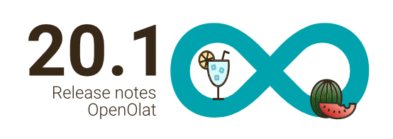

# Release notes 20.1

* * *

:material-calendar-month-outline: **Release date: 07/16/2025 • Last update: 10/12/2025**

* * *

With OpenOlat 20.1 we release our next major version.

Important new features include **rebranding** in conjunction with the **Course Planner**, the revised navigation in the course area and the **expanded coaching tool** for the desired clear separation between **learning and coaching environments**.

The **Topic broker** scores with intelligent optimization strategies for the enrolment algorithm, the **Appointment scheduling** offers more flexibility thanks to booking deadlines and additional information for organizers.

The consolidated and optimized **assessment settings** in learning path courses show changes transparently and the **local catalog management** for areas of the catalog taxonomy simplifies the maintenance of offers.

The first version of the brand new **credit points module** paves the way for the implementation of entire certification programs. **Surveys via QR code or mail list** for comprehensive quality management, **comment subscriptions** for blogs and podcasts and **digital OpenBadges signatures** round off this release.

Since release 20.1, over 105 new features and improvements have been added to OpenOlat. Here you can find the most important new features and changes. In addition, more than 70 bugs have been fixed. The complete list of changes in 20.0.x can be found [here](Release_notes_20.0.md){:target="_blank”}.

* * *

## Course Planner

With :octicons-tag-24: release 20.1, the system-wide rebranding was continued and implemented for the designation "Curriculum", the curriculum roles and for course roles managed by the Course Planner (CPL) (see also [Designation changes Release 20.0](Release_notes_20.0.md#new-labels)).

Previous | New
---------|----------
Curriculum | Products and Educational products
Curriculum owner | Product owner
Element owner | CPL Element owner
Participant | CPL Participant
Coach | CPL Coach
Course owner | CPL Course owner
Master coach | CPL Master coach

{ class="shadow lightbox" title="Course roles via Course Planner" }

* octicons-tag-24: release 20.1.2
    * Display/assignment of relationships between subjects (taxonomy) and events
    * Flagging of the standard CPL element for modularization of courses

* * *

## Coaching tool

### Redesign/Enhancements

The redesign of the Coaching tool was continued and includes the implementation of the modern table and filter concept as well as the addition and optimized display of context-specific data and the implementation of the list view for learning resources known from the “Courses" area.

{ class="shadow lightbox" title="Course overview in the Coaching tool" }

As of :octicons-tag-24: release 20.1.2, the absence report for education managers available in the report area contains even more relevant information.

### Separation from "Courses"

For historical reasons, not only participants can find their courses and learning content in the "Courses" area, but also coaches and course owners can access their courses and learning resources there. Learning and coaching/administration are mixed up here, which often leads to confusion, especially if people have multiple course roles.

In future, the "Courses" area will focus on learners/participants. People with a coaching role (coaches, owners, education managers, line managers, 1:1 assignment) will then only find their courses and learning resources in the "Coaching" area.

!!! Note "Roadmap to access learning resources"

    * Release 20.1: "Courses" for participants; "Courses" and "Coaching" for coaches/owners (optionally configurable)
    * Release 20.2: "Courses" for participants; "Coaching" for coaches/owners

Additional options and instructions for a gradual changeover of access from "Courses" to "Coaching" for coaches are available from :octicons-tag-24: release 20.1.1 and support users in the transition phase.

{ class="shadow lightbox" title="Configuration of learning resource access" }

{ class="shadow lightbox" title="Migration hint for coaches" }

!!! tip "Step by Step: Change access to learning resources for coaches"

    * [x] Activate coaching tool under `Administration > e-Assessment > Coaching`
    * [x] Set authorizations for coaching site under `Administration > Customizing > Sites`
    * [x] Systematically configure the migration under `Administration > Modules > Reporsitory > Access`:
        * [Phase 1] Access for course owners/coaches: Activation "Courses & Coaching"
        * [Phase 2] Additional activation of "Hint in courses" for information purposes
        * [Phase 3] Change of access for course owners/coaches: Activation "Coaching"
        * [Phase 4] Deactivation of "Hint in courses"

* * *

## "Topic broker" course element

New options and adjustments to the Topic broker algorithm enable an even more targeted distribution of topics.

The number of passes for the registration process has been massively increased in order to raise the chances of even better variants.

During the registration process, the algorithm - and therefore the result - can be influenced by various predefined optimization strategies such as "Maximum number of registrations", "Maximum priority consideration" or "Maximum number of topics". However, dynamic adjustment is also possible by weighting the parameters individually.

{ class="shadow lightbox" title="Optimization strategies for enrolment process" }

For topics that require physical implementation as part of a seminar or laboratory, for example, the implementation period can also be taken into account in the enrolment process to prevent time overlaps.

Further new features are:

* Export of topics including media files as a zip file
* Extended import of topics including media files such as teaser image, teaser video and files of user-defined fields
* Extension of the selection period including reopening of already completed assignments
* Confirmation of the number of registrations by participants if the specified number can be reduced independently
* Addition to the topic exchange under Course administration > Files > "Show memory usage"
* Activity log for traceability of actions and configuration changes (:octicons-tag-24: release 20.1.2)

{ class="shadow lightbox" title="Import of topics including media files" }

{ class="shadow lightbox" title="Activity log" }

* * *

## "Appointment scheduling" course element

The setup for providing and booking appointments, e.g. for consultation hours or excursions, can vary greatly. Organizers often need additional information for preparation in advance. The new options contribute to the flexible use of the appointment scheduling module.

For example, a deadline for participants to book/enrol can be configured to avoid last-minute registrations.

{ class="shadow lightbox" title="Enrolment deadline and filter for fully booked appointments" }

In addition, a comment field can be activated, which participants can fill in when selecting an appointment. For example, information on the desired content of the meeting or additional information can be entered.

{ class="shadow lightbox" title="Comment when booking an appointment" }

Participants can also use a new filter to see fully booked or confirmed appointments and - if activated - who has booked these appointments. This allows them to contact other participants to swap booked appointments/groups.

Organizers can also optionally be notified by e-mail as soon as someone selects/books an appointment.

* * *

## News about courses

### Assessment settings learning path

!!! info "Note"

    This adjustment only affects learning path courses.

When adjusting the assessment settings in the learning path course or when resetting individual course elements, the existing course success status of the participants is recalculated based on the current configuration.

Course owners can decide at this point whether the existing course success status is updated accordingly or retained (in the sense of "Once the course has been passed, it is always considered passed."). The dialog for the "Recalculate data" action has been converted to "Save assessment settings", completely revised and expanded to include the following steps:

* Reset overridden course success status
* Reset course success status "Passed

{ class="shadow lightbox" title="Wizard: Apply changes" }

{ class="shadow lightbox" title="Wizard: Reset overridden course success status" }

{ class="shadow lightbox" title="Wizard: Reset course success status Passed" }

As part of this process, the global action “Recalculate data” has also been removed and now implemented as a bulk action, which is available either in the assessment tool or directly on assessable course elements.

### Further innovations for courses

* Removal of subsequent course actions for course owners without a global role "Author", "Learning resource manager" or "Administrator" so that the author area cannot be bypassed (e.g. relevant when managing courses and roles via the Course Planner):
    * Copy
    * Delete
    * Restore
    * Convert to learning path course
* Optimized message on info page if course/learning resource is not accessible
* External reference is now also copied in the copy processes (1:1 or wizard)
* Course element "External page":
    * Deactivated by default for new systems, as use is no longer recommended for security reasons (integrated pages must fulfill certain conditions for access, otherwise they will not work)
    * Can be optionally deactivated for existing systems
* Course editor "Insert course elements": Moving the course elements "HTML page" and "External page" to the "Other" section (use no longer recommended for security reasons)
* Restriction of the user search within the course to course members (:octicons-tag-24: release 20.1.2)
* Learning path: Display of the provisional total score including points not released (:octicons-tag-24: release 20.1.2)
* Configuration of the default role when accessing courses in the case of multiple course roles (:octicons-tag-24: release 20.1.3)

* * *

## Catalog

### Catalog management for catalog V2

Administrators can now assign the role of "Catalog manager” and thus authorize persons to edit and maintain sub-areas (including sub-levels) of the catalog taxonomy, on the basis of which the advertised offers are displayed in the catalog. Catalog managers can also assign these access and editing rights within their sub-areas and their sub-levels.

In addition, the navigation concept, the display of the taxonomy tree and the management and maintenance of metadata in the taxonomy have been revised.

{ class="shadow lightbox" title="Catalog management" }

### Access to catalog V1

With the conversion of the navigation under "Courses" in :octicons-tag-24: release 20.0, catalog V1 - analogous to catalog V2 - is now only available as a separate site. The configuration for displaying "Catalog in courses" has been removed.

On systems with previous catalog access exclusively via "Courses", the site must be activated.

!!! info "Activate catalog site"

    Configuration under `Administration > Customizing > Sites > Catalog` including selection of authorized roles (default: "All accounts including guests and external users")

* * *

## eTesting

When using the assessment mode for exams or assessment inspection, certain user and system activities are now entered in the course log, for example to be able to track the processes in the event of support questions after the exam/assessment inspection.

The start and end of the examination mode / assessment inspection, the actual start and end (locking) of the specific users and the granting of an extension or compensation for disadvantages are recorded.

* * *

## Blog/Podcast: Comment subscription

In addition to the existing subscription function for blogs and podcasts about new or changed posts, you can now also activate an additional subscription for comments on the posts - either for the entire blog/podcast or for specific posts. This means that owners of the blog/podcast and authors of individual posts will be actively informed of other people's reactions to their posts.

{ class="shadow lightbox" title="Comment subscription for blog and podcast" }

* * *

## New module "Credit points"

As of :octicons-tag-24: release 20.1.1, the first version of the "Credit points" module is available, which will also be relevant in connection with certification programs in OpenOlat in the future.

The module can be used to globally define your own credit point systems. These will later enable participants to collect educational points/credits, such as ECTS or LearnCoins, for passing courses.

In the next expansion stage, the credits can then be used as currency to purchase further courses or to redeem the collected credits for the renewal of the certificate as part of a recertification.

It is therefore no longer necessary to just repeat the initial certificate course.

{ class="shadow lightbox" title="Credit points module" }

* * *

## "Quality management" module

### Surveys by e-mail invitation / QR code

In addition to or as an alternative to automated data collection within OpenOlat via the QM module, access to a survey can now also be provided by e-mail invitation or via a link/QR code. This means that people without an OpenOlat login can also be reached.

**Distribution of the survey via e-mail list**: For example, for surveys of known addressees such as parents, trainers or practice instructors, external partners or customers

**Access to the survey via link/QR code**: For example, for feedback surveys after information events or lectures with an unknown audience

{ class="shadow lightbox" title="Access QM survey via link or email" }

### Further adjustments

In the report, the number of participants who have accessed the survey via a link is also shown as "Invited via link".

In addition, the messages when a survey is completed, when a survey is called up again and has already been completed as well as when a survey is not available have been improved and optimized.

* * *

## OpenBadges

### Digital signing

In addition to the existing "Host-based" verification method, the "Signed-based" variant has been implemented. This allows the authenticity of badges to be verified using the public key of a digital certificate in order to guarantee the authentication and integrity of the badge. The digital signature is part of the badge, no manual certificate management is necessary.

{ class="shadow lightbox" title="Badge verification with public key" }

### Versioning

To correct typing errors or link an updated image, it is permitted to edit badge classes that have already been used. A new version is created automatically and transparently so that badges that have already been issued are not affected by the change.

{ class="shadow lightbox" title="Badge versioning" }

### Further new features

* Optimized recipient selection for global badges (:octicons-tag-24: release 20.1.2)
* Optimization of performance when issuing and sending badges (:octicons-tag-24: release 20.1.4)

* * *

## UX, Usability

* Optimized filter component
* More consistent behavior
* Standardization and optimization of the list view of courses/learning resources in the courses, coaching and catalog areas (:octicons-tag-24: release 20.1.1)
* Neutral color scheme for the learning path progress indicator (:octicons-tag-24: release 20.1.2)
* Optimized and functionally enhanced integration of video learning resources in video course elements (:octicons-tag-24: release 20.1.3)

{ class="shadow lightbox" title="Optimized list view in the courses area" }

* * *

## Accessibility

* :octicons-tag-24: Release 20.1.2
    * Optimized contrast handling in test navigation, for icons and progress display
    * Addition of “aria-expanded” in open/close profile link in main navigation and menu tree
    * Decorative images that do not convey content are given an empty alternative text (alt=“”) instead of aria-hidden=“true”
    * Removal of redundant titles in menu trees
* :octicons-tag-24: Release 20.1.3
    * Optimized support for Firefox keyboard navigation (cmd-Enter)
    * Conversion of column headings for sorting tables as buttons
    * Accessibility of the course menu on small screens via keyboard
    * Tests: Optimization for intuitive focus order
    * Avoidance of empty bookmark links in the menu (test and forum)

* * *

## Further, briefly noted

* Content Creator: Duplicate function for layout block in course element "Page", Form and ePortfolio
* Events:
    * New option for online events to manually add generic meeting links (e.g. for Zoom)
    * Optimized copy behavior for "Presence" flag
* Course reminders:
    * Optimized deactivation of the module
    * Additional notes and display of the configured dispatch times
* Semester periods:
    * New designation "Time periods" for generalist use
    * Option to deactivate the module
    * Action for deleting unused time periods
* Report: Export of current course memberships of users (e.g. for archiving, accounting or auditing purposes)
* Catalog Site: Access by default for "Registered users and guests" (previously: "Only guests without registered accounts")

* * *

## Administrative / Technical

* Updating third-party libraries
* ONLYOFFICE: Secret configuration via olat.properties
* Full text search: Indexing of user profiles removed
* Administration: Temporary removal of the "Delete" action for organizations, as the structures have been significantly expanded with release 20.0 and the deletion process must be revised accordingly in a subsequent release
* Restriction of Rest API access to users with API key to increase security and availability
* OAuth extensions for automated setups such as Kubernetes:
    * Configuration support for generic provider in olat.properties
    * Further configuration options for olat.local.properties
* SEO: prevent indexing dynamic links (:octicons-tag-24: release 20.1.2)
* Update paella player dependencies (:octicons-tag-24: release 20.1.2)
* Option to disable MathJax in the olat.properties: `mathjax.cdn=` and `mathlive.cdn=` (:octicons-tag-24: release 20.1.3)
* Prevention of system startup if file system and database do not match: `integrity.fs.db.enable=false` und `integrity.fs.db.enable.values=true,false` (:octicons-tag-24: release 20.1.4)

* * *

## System administrators: Activate / configure new functions

!!! note "Checklist after update to 20.1"

    The following functions have to be activated / configured in the `Administration` after an update to release 20.1:

    * [x] Configuration of course default role: `Modules > Repository > Default role priority` (:octicons-tag-24: release 20.1.3)
    * [x] Activate site for access to catalog V1: `Customizing > Sites > Catalogue`.
    * [x] Access area “Courses” only for participants: `Module > Repository > Tab “Access”`
    * [x] (De-)Activate course element “External page”: `Modules > External page`
    * [x] Report on course memberships: `Reports > Course memberships`
    * [x] OpenBadges - Verification method: `e-Assessment > OpenBadges > Configuration > Verification`
    * [x] (De-)Activation of "Credit points" module and management of credit point systems: `Payment modules > Credit points`.

    **Addition of the QM variables in language adaptations:**

    * [x] Language adaptations must be reset in the new variables. The previous ones remain as a reference:

        up to 20.0 | from 20.1
        ---------|----------
        reminder.invitation.body | reminder.invitation.body2
        reminder.reminder1.body | reminder.reminder1.body2
        reminder.reminder2.body | reminder.reminder2.body2
        report.access.email.body | report.access.email.body2

* * *

## More information

* [YouTrack Release notes 20.1.15](https://track.frentix.com/releaseNotes/OO?q=fix%20version:%2020.1.15&title=Release%20Notes%2020.1.15){:target="_blank"}
* [YouTrack Release notes 20.1.14](https://track.frentix.com/releaseNotes/OO?q=fix%20version:%2020.1.14&title=Release%20Notes%2020.1.14){:target="_blank"}
* [YouTrack Release notes 20.1.13](https://track.frentix.com/releaseNotes/OO?q=fix%20version:%2020.1.13&title=Release%20Notes%2020.1.13){:target="_blank"}
* [YouTrack Release notes 20.1.12](https://track.frentix.com/releaseNotes/OO?q=fix%20version:%2020.1.12&title=Release%20Notes%2020.1.12){:target="_blank"}
* [YouTrack Release notes 20.1.11](https://track.frentix.com/releaseNotes/OO?q=fix%20version:%2020.1.11&title=Release%20Notes%2020.1.11){:target="_blank"}
* [YouTrack Release notes 20.1.10](https://track.frentix.com/releaseNotes/OO?q=fix%20version:%2020.1.10&title=Release%20Notes%2020.1.10){:target="_blank"}
* [YouTrack Release notes 20.1.9](https://track.frentix.com/releaseNotes/OO?q=fix%20version:%2020.1.9&title=Release%20Notes%2020.1.9){:target="_blank"}
* [YouTrack Release notes 20.1.8](https://track.frentix.com/releaseNotes/OO?q=fix%20version:%2020.1.8&title=Release%20Notes%2020.1.8){:target="_blank"}
* [YouTrack Release notes 20.1.7](https://track.frentix.com/releaseNotes/OO?q=fix%20version:%2020.1.7&title=Release%20Notes%2020.1.7){:target="_blank"}
* [YouTrack Release notes 20.1.6](https://track.frentix.com/releaseNotes/OO?q=fix%20version:%2020.1.6&title=Release%20Notes%2020.1.6){:target="_blank"}
* [YouTrack Release notes 20.1.5](https://track.frentix.com/releaseNotes/OO?q=fix%20version:%2020.1.5&title=Release%20Notes%2020.1.5){:target="_blank"}
* [YouTrack Release notes 20.1.4](https://track.frentix.com/releaseNotes/OO?q=fix%20version:%2020.1.4&title=Release%20Notes%2020.1.4){:target="_blank"}
* [YouTrack Release notes 20.1.3](https://track.frentix.com/releaseNotes/OO?q=fix%20version:%2020.1.3&title=Release%20Notes%2020.1.3){:target="_blank"}
* [YouTrack Release notes 20.1.2](https://track.frentix.com/releaseNotes/OO?q=fix%20version:%2020.1.2&title=Release%20Notes%2020.1.2){:target="_blank"}
* [YouTrack Release notes 20.1.1](https://track.frentix.com/releaseNotes/OO?q=fix%20version:%2020.1.1&title=Release%20Notes%2020.1.1){:target="_blank"}
* [YouTrack Release notes 20.1.0](https://track.frentix.com/releaseNotes/OO?q=fix%20version:%2020.1.0&title=Release%20Notes%2020.1.0){:target="_blank"}