# Release Notes 20.2

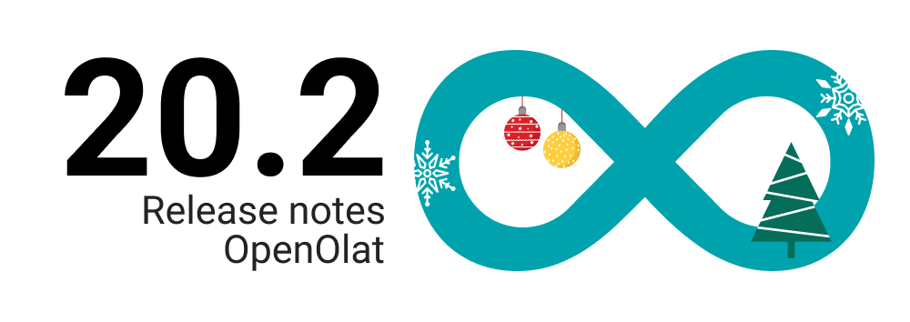

* * *

:material-calendar-month-outline: **Releasedatum: 11.12.2025 • Letztes Update: 11.12.2025**

* * *

Mit **OpenOlat 20.2** führen wir ein neues **Zertifikatsprogramm mit integrierter Rezertifizierung und Kreditpunkten** ein – eine flexible, automatisierte und transparente Lösung für professionelles **Zertifikatsmanagement**. 

Das **Zertifikatsprogramm** unterstützt Lernangebote in verschiedenen Varianten und Formaten – online oder vor Ort, zu unterschiedlichen Zeiten oder an unterschiedlichen Orten. Programme lassen sich anhand klar definierter Zertifikatsregeln konfigurieren, etwa bezüglich Gültigkeit, Rezertifizierung, der Verwendung von Kreditpunkten sowie der Auslösung von Zertifikaten. Darauf aufbauend bündelt das Programm Leistungen und erlaubt den Einsatz von Kreditpunkten für eine Rezertifizierung. Zertifikate werden nach klaren Regeln erneuert – automatisch oder manuell.

Die neue zentrale **Zertifikatsübersicht** verschafft der Zertifikatsstelle jederzeit einen klaren Überblick: Wer ist zertifiziert, wer befindet sich im Prozess, und wer gilt als Alumni. Das erweiterte Kreditpunkte-System im persönlichen Erfolgsbereich macht Anforderungen und Kontostände transparent und schafft damit die Grundlage für Modelle wie Zertifikate mit Ablaufdatum, Rezertifizierungen mit Übergangsfristen oder automatische Verlängerungen über Kreditpunkte. **Mittels konfigurierbarer Benachrichtigungen** werden zentrale Zertifikatsereignisse wie Erstellung, Ablauf oder Rezertifizierung automatisch kommuniziert. Zusätzlich lassen sich jederzeit neue, individuelle Erinnerungen konfigurieren.

## Weitere Highlights in OpenOlat 20.2

Der Release bringt zahlreiche Verbesserungen im gesamten System und sorgt für eine spürbar rundere Nutzererfahrung. Der **Course Planner** wurde kontinuierlich weiterentwickelt und gezielt optimiert, was die Übersicht verbessert und die tägliche Arbeit erleichtert. Auch das **Coaching Tool** wurde weiter ausgebaut und bietet nun präzisere Übersichten, ein erstes Widget sowie eine vereinfachte Verwaltung von Mitgliedschaften.

Der **Katalog** zeigt Kurse und Implementierungen übersichtlicher, erlaubt eine Prioritätensortierung und bietet klarere InfoPages für unterschiedliche Rollen. Das **persönliche Menu** wurde neu strukturiert. **Zertifikate und Kreditpunkte sind nun gut einsehbar** – gebündelt in einer neuen Übersicht im **persönlichen Erfolgsbereich**.

Das **Kreditpunkte-System** wird funktional erweitert, einschliesslich Organisations- und Rollenbeschränkungen sowie optimierter Logiken im Zusammenspiel mit Kursen und Zertifikatsprogrammen. Weitere Usability-Verbesserungen umfassen einen optimierten **Passwort-Reset**, überarbeitete **Seiten-Editor-Elemente**, neue Standardlayouts, harmonisierte Auswahlkomponenten, sichtbare Tabellenrahmen sowie ein aktualisiertes User-Info-Card-Design.

Im **Assessment-Bereich** wurden Excel-Exporte erweitert, Zeichenlimits angepasst und **Rubrikenkommentare** auf 2’000 Zeichen erhöht. **LTI** erhält zusätzliche Konfigurationsoptionen, und die **Administration von BigBlueButton wurde optimiert**. Zudem wurden veraltete Module wie «Legacy PayPal» entfernt, um die Plattform weiter zu modernisieren.

Das neue **Bento-Dashboard-Layout** sorgt für ein modernes, flexibles Erscheinungsbild in Coaching und Course Planner. Kurse können nun direkt aus Templates erstellt sowie sauber exportiert werden.

**OpenOlat 20.2** bietet damit eine erweiterte Grundlage für flexible Zertifizierungsprozesse, klare Steuerung in komplexen Bildungsstrukturen und eine rundum verbesserte Nutzererfahrung im gesamten System.

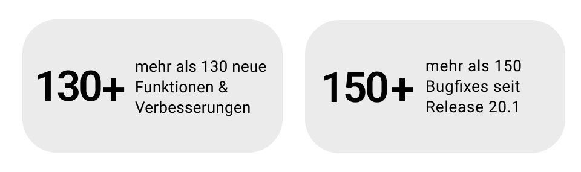

Seit Release 20.1 wurden über 130 neue Funktionen und Verbesserungen zu OpenOlat hinzugefügt. Hier finden Sie die wichtigsten Neuerungen zusammengefasst. Zusätzlich wurden mehr als 150 Bugs behoben. Die komplette Liste der Änderungen in 20.1.x finden Sie [hier](Release_notes_20.1.de.md){:target="_blank”}.

* * *

## Zertifikatsprogramm

Das Zertifikatsprogramm bildet den zentralen Rahmen für Ausstellung, Gültigkeit und Rezertifizierung von Zertifikaten. Es steuert, wie Zertifikate vergeben, verlängert oder über Kreditpunkte erneuert werden und bietet zertifikatsverantwortlichen Personen eine klare Übersicht über alle relevanten Prozesse. Die folgenden Screens zeigen, wie Programme konfiguriert werden, wie Mitglieder verwaltet sind und wie Kreditpunkte in die Zertifikatslogik integriert werden.

### Übersicht - Dashboard

Die Übersichtsseite zeigt zertifikatsverantwortlichen Personen alle wichtigen Kennzahlen eines Zertifikatsprogramms auf einen Blick. Sie sehen, wie viele Personen aktiv sind, wie viele bereits zertifiziert wurden, welche Zertifikate bald ablaufen und wie viele sich im Rezertifizierungsprozess befinden. Eine Liste der zertifizierten Mitglieder mit Punktesaldo und Gültigkeitsdatum bietet zusätzlich schnelle Orientierung und erleichtert die Planung weiterer Schritte.

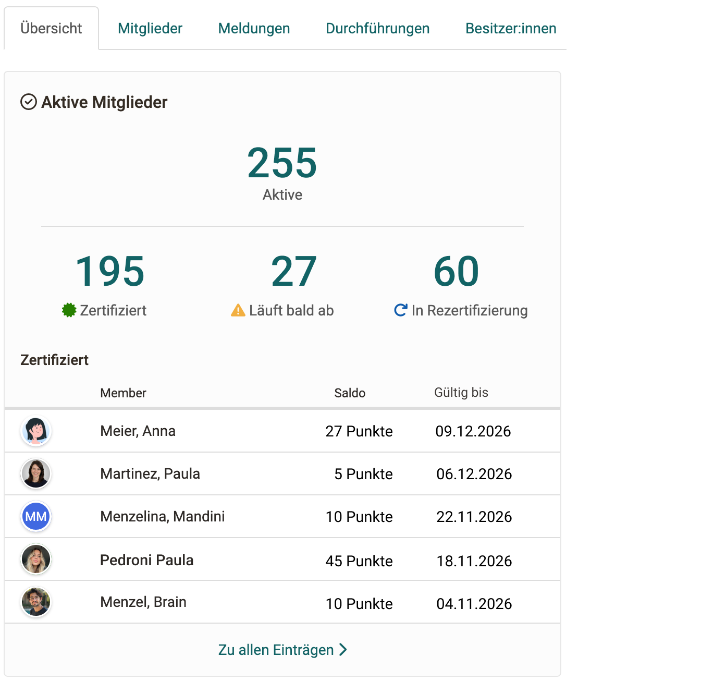{ class="shadow lightbox" title="Dashboard Zertifikatsprogramm" }

### Einblick in die Einstellungen

Die Konfiguration eines Zertifikatsprogramms ermöglicht es, zentrale Regeln für Gültigkeit, Rezertifizierung und Kreditpunkte festzulegen. Als Programmbesitzer bestimmen hier, wie lange Zertifikate gültig bleiben, ob Verlängerungen automatisch oder manuell erfolgen und welche Kreditpunkte für eine Rezertifizierung erforderlich sind.

Über zusätzliche Tabs erhalten zertifikatsverantwortliche Personen einen umfassenden Überblick über Mitglieder, Durchführungen, Meldungen und Zertifikatsbesitzer:innen. So bleibt jederzeit sichtbar, wer sich im Prozess befindet, wer bereits zertifiziert ist und welche Schritte anstehen.

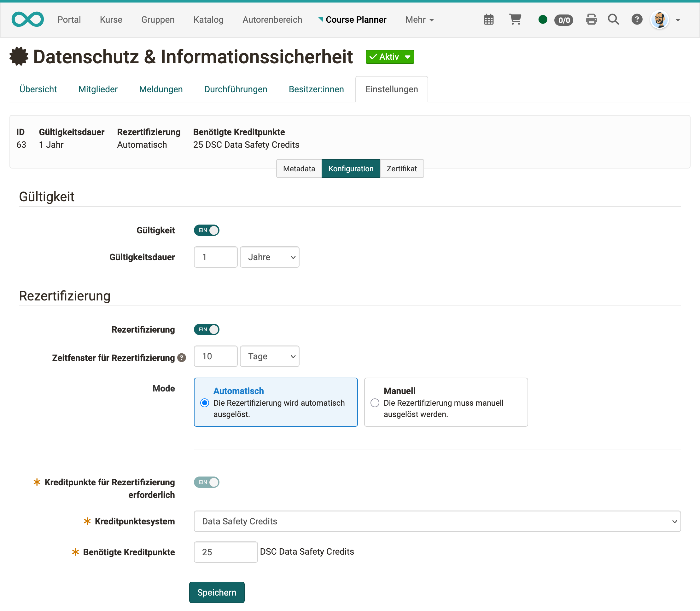{ class="shadow lightbox" title="Einstellungen Zertifikatsprogramm" }

### Mitgliederansicht
Die Mitgliederansicht zeigt alle Personen, die einem Zertifikatsprogramm zugeordnet sind. Zertifikatsverantwortliche sehen hier auf einen Blick, wie viele Mitglieder aktiv sind, wie viele sich im Kandidat:innen-Status befinden und wie viele bereits als Alumni gelten. Über Filter wie Zertifiziert, In Rezertifizierung, Läuft bald ab oder Unzureichende Kreditpunkte lassen sich Gruppen gezielt anzeigen.

Die Tabelle bietet detaillierte Informationen pro Person: aktueller Zertifikatsstatus, Anzahl ausgestellter Zertifikate, Gültigkeitsdatum, nächste Rezertifizierungsfrist und individueller Kreditpunktbestand. So erkennen Verantwortliche sofort, bei wem Handlungsbedarf besteht oder welche Zertifikate demnächst erneuert werden müssen. Neue Mitglieder lassen sich direkt über die Schaltfläche „Mitglied hinzufügen“ einladen oder zuweisen.

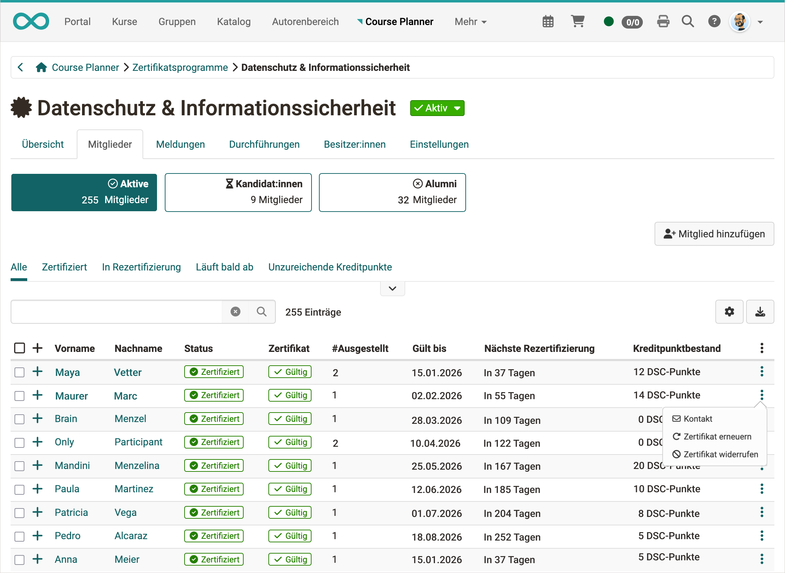{ class="shadow lightbox" title="Mitgliederansicht Zertifikatsprogramm" }

### Benachrichtigungen und Erinnerungen
Das **Zertifikatsprogramm** unterstützt **konfigurierbare Benachrichtigungen und individuelle Erinnerungen** für zentrale Ereignisse im Zertifikatsprozess. Benachrichtigungen informieren automatisch über Vorgänge wie die Erstellung, Erneuerung, den Ablauf oder den Widerruf von Zertifikaten.

Ergänzend dazu lassen sich **individuelle Erinnerungen** definieren, etwa vor Ablauf eines Zertifikats oder während einer Rezertifizierungsphase. Aktivierung, Inhalte und Zeitpunkte können flexibel angepasst werden und sorgen für klare Kommunikation sowie eine zuverlässige Einhaltung von Fristen.

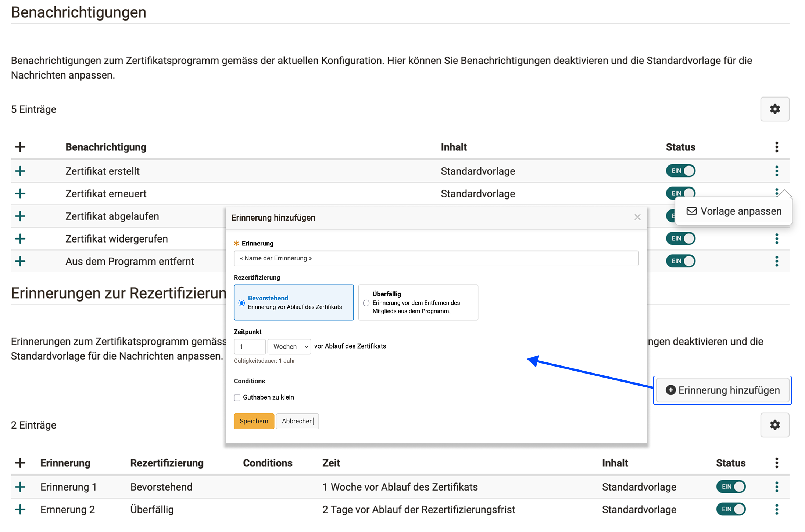{ class="shadow lightbox" title="Benachrichtigungen Zertifikatsprogramm" }

## Kreditpunktesystem
Das **Kreditpunktesystem** ermöglicht das **Sammeln und transparente Anzeigen von Kreditpunkten** über verschiedene Lernangebote hinweg. Diese Punkte können in **freigegebenen Zertifikatsprogrammen für Rezertifizierungen eingesetzt** werden.

Organisationen können **eigene Kreditpunktesysteme definieren und benennen** sowie bei Bedarf einschränken, etwa nach Rollen oder organisatorischen Bereichen. Nach dem erfolgreichen Abschluss eines Lernangebots lassen sich **Kreditpunkte gezielt zuweisen**, sodass eine langfristige Nutzung für Rezertifizierungen unterstützt wird.

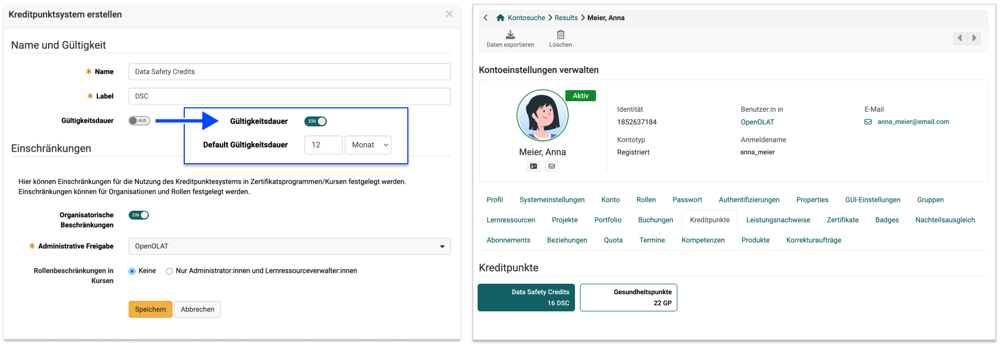{ class="shadow lightbox" title="Einstellungen Kreditpunktesystem" }

## Coaching Tool
Das Coaching Tool wurde umfassend erweitert: Linien- und Ausbildungsverantwortliche können nun ausstehende Mitgliedschaften zentral einsehen und direkt bestätigen oder ablehnen. Zudem bietet das neue Kurs-Widget eine klare Übersicht über relevante Kurse, Favoriten und Betreuungszugriffe. Verbesserte Tabellen, übersichtlichere Icons und optimierte mobile Ansichten sorgen für eine effizientere Betreuung und eine deutlich bessere Nutzererfahrung.

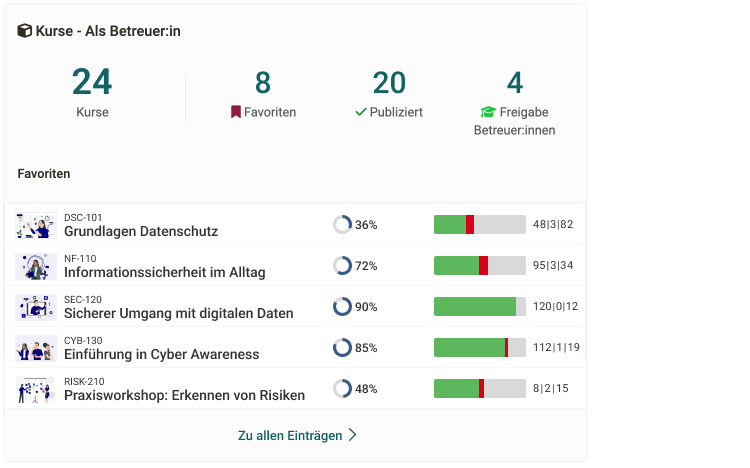{ class="shadow lightbox" title="Betreuer:innen-Widget CoachingTool" }

## Essay-Antworten als PDF herunterladen

Mit dem neuen Release können Freitext-Antworten aus Tests direkt als PDF exportiert werden. Das macht die Korrektur deutlich einfacher und sorgt für eine einheitliche, gut lesbare Darstellung – ideal für interne und externe Prüfer:innen.

Das PDF enthält die wichtigsten Informationen zum Kurs, zur Frage und zur abgegebenen Antwort. Bei anonymen Korrekturen werden personenbezogene Daten automatisch ausgeblendet.

Zusätzlich steht eine Funktion bereit, mit der alle Antworten einer Prüfung gesammelt als ZIP heruntergeladen werden können. Das erleichtert die Arbeit insbesondere bei umfangreichen Prüfungen oder wenn externe Bewertende eingebunden sind.

Die neue PDF-Funktion macht das Bewerten von Freitext-Antworten übersichtlicher, effizienter und administrativ leichter handhabbar.

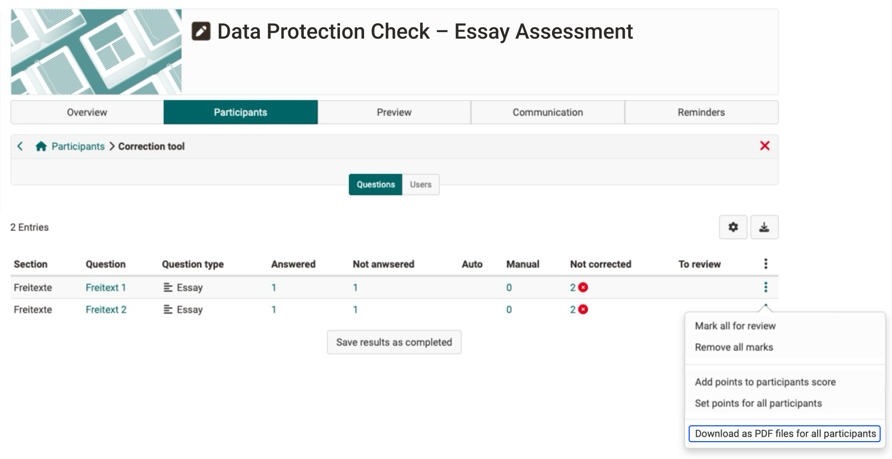{ class="shadow lightbox" title="Download pro Essay-Frage" }

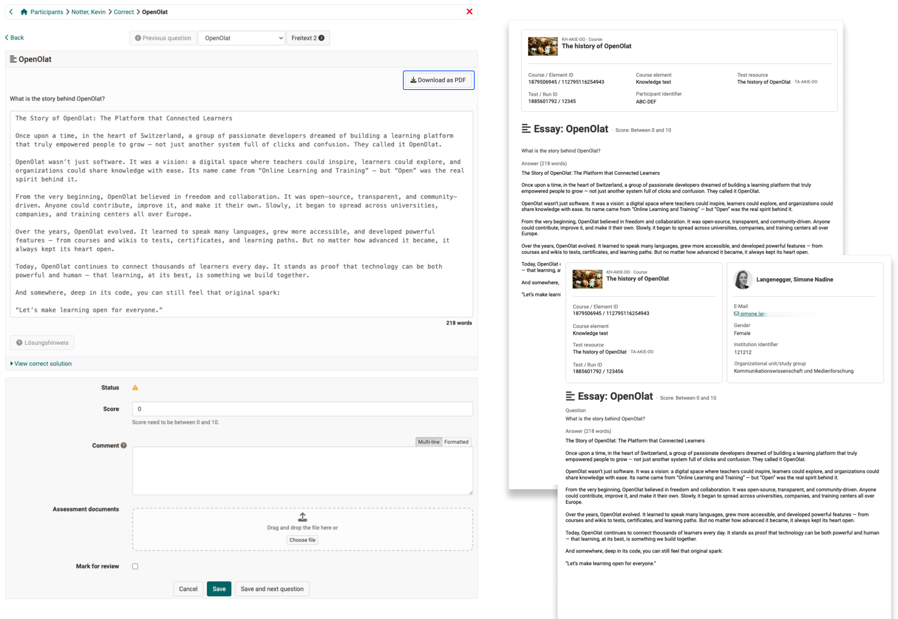{ class="shadow lightbox" title="Essay-Download mit PDF-Output" }

## Kurs-Templates & -verwaltung 

Kurse können neu als **Templates gespeichert, exportiert und erneut verwendet** werden. Auf Basis dieser Templates lassen sich Kurse **an verschiedenen Stellen gezielt instanziieren**, was ein flexibles und umfangreiches Templating ermöglicht. Das vereinfacht die Wiederverwendung bewährter Kurse, reduziert manuellen Aufwand und sorgt für konsistente Kursangebote über verschiedene Varianten hinweg.

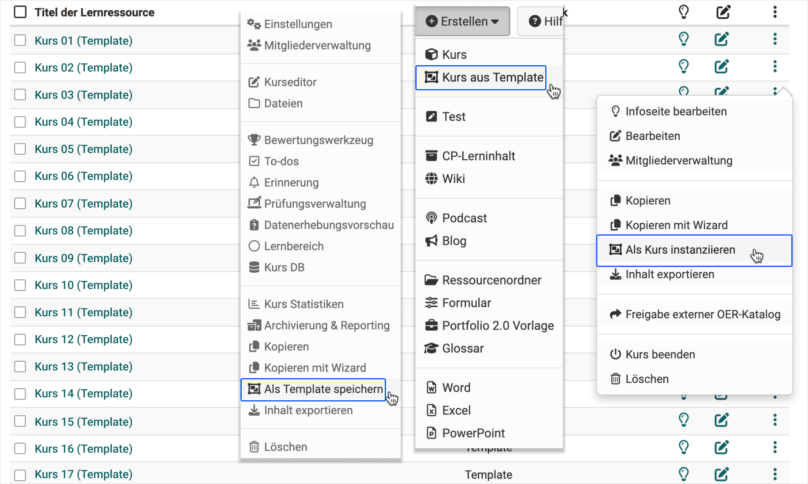{ class="shadow lightbox" title="Kurs-Template-Aktionen" }

* * *

## Weiteres, kurz notiert

- **Katalog & InfoPages:**  
    Der Katalog wurde visuell und strukturell überarbeitet, um Kurse und Durchführungen schneller auffindbar zu machen. Verbesserte Filter- und Sortiermöglichkeiten erleichtern die Orientierung, während optimierte InfoPages Informationen je nach Rolle gezielt und übersichtlich darstellen.
    
- **Usability & Interface:**  
    Zahlreiche Verbesserungen im Interface sorgen für ein ruhigeres und konsistenteres Erscheinungsbild. Modernisierte Auswahlkomponenten, neue Standardlayouts, sichtbare Tabellenrahmen und ein überarbeitetes User-Info-Design erleichtern die tägliche Arbeit und erhöhen die Bedienfreundlichkeit.
        
- **Assessment & E-Testing:**  
    Der Assessment-Bereich wurde gezielt erweitert. Excel-Exporte liefern nun präzisere Daten, Zeichenlimits werden korrekt berücksichtigt und Rubriken bieten mehr Raum für differenziertes Feedback. Das unterstützt transparente und nachvollziehbare Bewertungen.
        
- **LTI & BBB:**  
    LTI 1.3 bietet zusätzliche Konfigurationsmöglichkeiten und mehr Kontrolle über Berechtigungen. Gleichzeitig wurde die Administration von BigBlueButton optimiert, sodass Online-Meetings einfacher verwaltet und besser in bestehende Organisationsstrukturen eingebettet werden können.
      
- **Course Editor & Content Creation:**  
    Der Course Editor wurde modernisiert und vereinfacht. Überarbeitete Bausteine, klarere Layouts und verbesserte Bedienelemente unterstützen Content Creator:innen bei der Erstellung konsistenter, gut strukturierter Lerninhalte.
        
- **Dashboard & Bento Layout:**  
    Das neue Bento-Dashboard bringt ein modulares und modernes Layout in Coaching und Course Planner. Widgets sind klar strukturiert, flexibel anpassbar und ermöglichen einen schnellen Überblick über relevante Informationen und Aufgaben.
        
- **Administration & Module:**  
    Die Administration wurde aufgeräumt und modernisiert. Veraltete Module wurden entfernt, Einstellungen übersichtlicher gestaltet und zentrale Bereiche neu strukturiert, um Verwaltungsprozesse effizienter und transparenter zu machen.
    
* * *

## Administratives / Technisches

* Administration:
    * Verschiebung “Kreditpunkte” von “Bezahlmodule” nach “e-Assessment”
	* Neue Sortierung der Menüpunkte unter “e-Assessment”
	* Modul “Legacy PayPal” komplett entfernt
* LTI:
	* Rollen-Mapping zur globalen Konfiguration der LTI-Rollen sowie Definition der Rechte für Kurs-Besitzer:innen für die LTI-Konfiguration im Kurs (GUI + olat.local.properties)
* Update MathJax auf Version 4.0 (erlaubt u.a. mehrzeilige Formeln)
* BBB-Modulkonfiguration für Clients mit selbst gehosteten Servern erlauben: olat.local.properties > `vc.bigbluebutton.admin.fx.only=true` (Default: false)
* VFS Performance-Verbesserungen

* * *

## Systemadministratoren: Neue Funktionen aktivieren / konfigurieren

!!! note "Checkliste nach Update auf 20.2"

    Folgende Funktionen müssen nach einem Update auf Release 20.1 in der `Administration` aktiviert bzw. konfiguriert werden:

    * [x] (De-)Aktivierung Modul "Kreditpunkte" und Verwaltung Kreditpunktesysteme: `e-Assessment > Kreditpunkte`
    * [x] LTI Rollen-Mapping: `Externe Werkzeuge > LTI > Tab Rollen-Mapping`
    * [x] Katalog:
        * Sortierung von Katalog-Einträgen: `Module > Katalog > Einstellungen > Sortierung nach Priorität`
        * Anzeige von Metadaten bei Katalog-Einträgen: `Module > Katalog > Layout > Angezeigte Informationen in Karte`

* * *

## Weitere Informationen

* [YouTrack Release Notes 20.2.0](https://track.frentix.com/releaseNotes/OO?q=fix%20version:%2020.2.0&title=Release%20Notes%2020.2.0){:target="_blank"}
