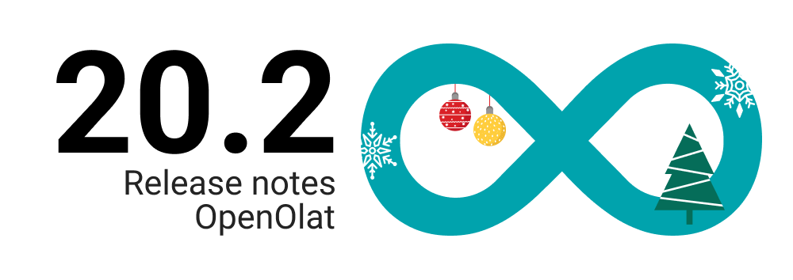
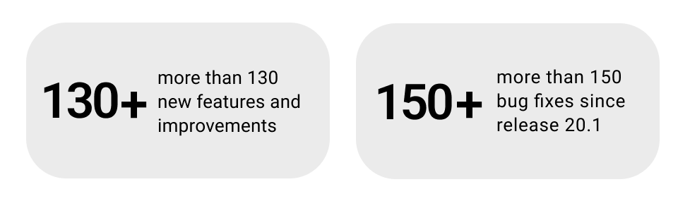
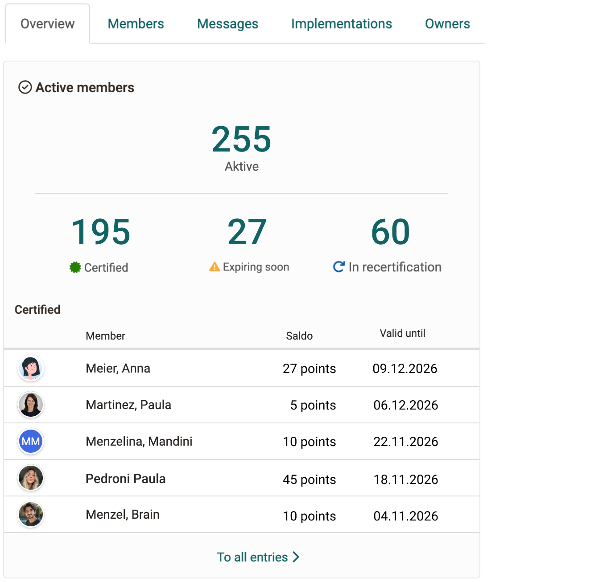
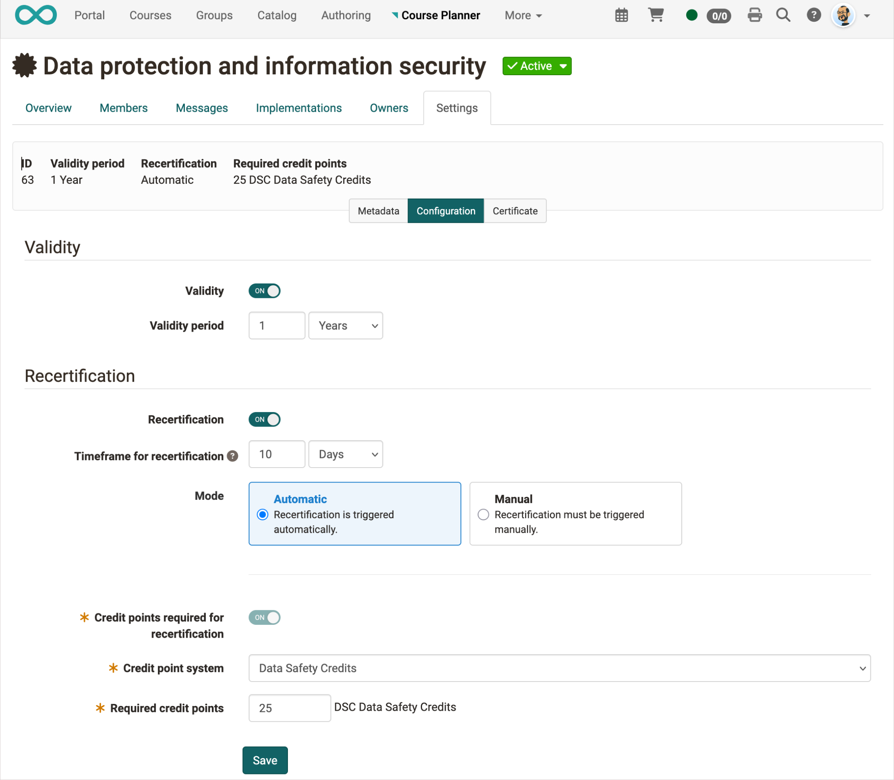
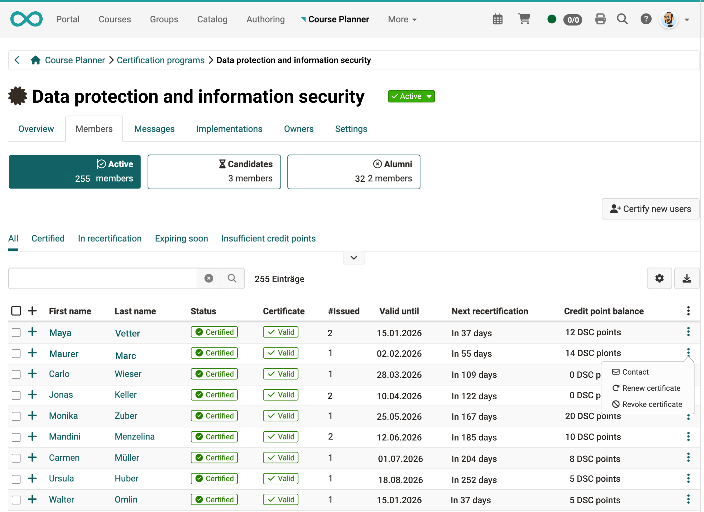
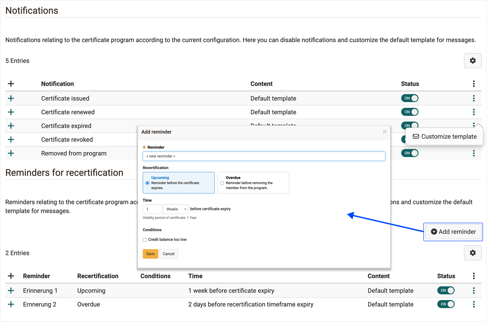
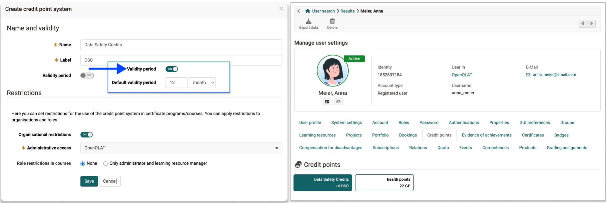
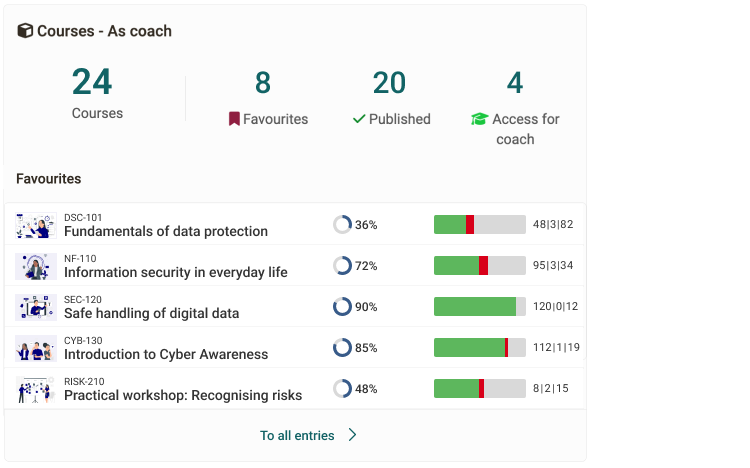
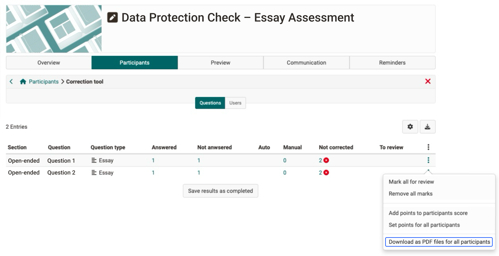
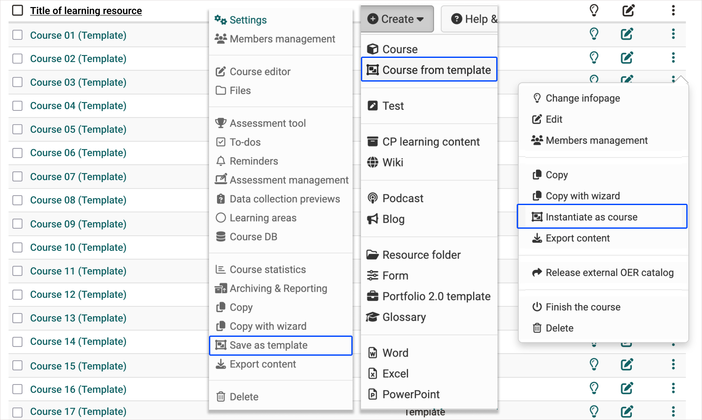

# Release Notes 20.2

* * *

:material-calendar-month-outline: **Releasedatum: 11.12.2025 • Letztes Update: 11.12.2025**

* * *

With **OpenOlat 20.2**, we are introducing a new **certificate program with integrated recertification and credit points** – a flexible, automated, and transparent solution for professional **certificate management**. 

The **certificate program** supports learning opportunities in various forms and formats—online or on-site, at different times or in different locations. Programs can be configured based on clearly defined certificate rules, for example, regarding validity, recertification, the use of credit points, and the triggering of certificates. Building on this, the program bundles services and allows credit points to be used for recertification. Certificates are renewed according to clear rules – automatically or manually.

The new central **certificate overview** provides the certification authority with a clear overview at all times: who is certified, who is in the process, and who is considered alumni. The expanded credit point system in the personal success area makes requirements and account balances transparent, thereby laying the foundation for models such as certificates with expiration dates, recertifications with transition periods, or automatic renewals via credit points. **Configurable notifications** automatically communicate key certificate events such as creation, expiration, or recertification. In addition, new, individual reminders can be configured at any time.

## Further Highlights in OpenOlat 20.2

The release brings numerous improvements throughout the system and ensures a noticeably smoother user experience. The **Course Planner** has been continuously developed and specifically optimized, which improves the overview and makes daily work easier. The **Coaching Tool** has also been further expanded and now offers more precise overviews, an initial widget, and simplified membership management.

The **catalog** displays courses and implementations more clearly, allows priority sorting, and offers clearer InfoPages for different roles. The **personal menu** has been restructured. **Certificates and credit points are now clearly visible** – bundled in a new overview in the **personal success area**.

The **credit point system** will be expanded in terms of functionality, including organizational and role restrictions as well as optimized logic in conjunction with courses and certificate programs. Further usability improvements include an optimized **password reset**, revised **page editor elements**, new standard layouts, harmonized selection components, visible table borders, and an updated user info card design.

In the **assessment area**, Excel exports have been expanded, character limits adjusted, and **category comments** increased to 2,000 characters. **LTI** has been given additional configuration options, and the **administration of BigBlueButton has been optimized**. In addition, outdated modules such as "Legacy PayPal" were removed to further modernize the platform.

The new **Bento dashboard layout** provides a modern, flexible look in Coaching and Course Planner. Courses can now be created directly from templates and exported cleanly.

**OpenOlat 20.2** thus offers an expanded basis for flexible certification processes, clear control in complex educational structures, and an all-around improved user experience throughout the entire system.

As of release 20.1, over 130 new features and improvements have been added to OpenOlat. Here you will find a summary of the most important new features. Additionally, more than 150 bugs have been fixed. The complete list of changes in 20.1.x can be found [here](Release_notes_20.1.de.md){:target="_blank”}.

* * *

## Certification program

The certificate program provides the central framework for issuing, validating, and recertifying certificates. It controls how certificates are awarded, extended, or renewed via credit points, and offers those responsible for certificates a clear overview of all relevant processes. The following screens show how programs are configured, how members are managed, and how credit points are integrated into the certificate logic.

### Overview - Dashboard

The overview page shows certificate managers all the key figures for a certificate program at a glance. You can see how many people are active, how many have already been certified, which certificates are about to expire, and how many are in the recertification process. A list of certified members with their point balances and validity dates also provides quick guidance and makes it easier to plan further steps.

{ class="shadow lightbox" title="Dashboard Zertifikatsprogramm" }

### Insight into the settings

Configuring a certification program allows you to set central rules for validity, recertification, and credit points. As the program owner, you can determine how long certificates remain valid, whether renewals are automatic or manual, and how many credit points are required for recertification.

Additional tabs provide those responsible for certificates with a comprehensive overview of members, implementations, notifications, and certificate holders. This means that it is always clear who is in the process, who is already certified, and what steps are pending.

{ class="shadow lightbox" title="Einstellungen Zertifikatsprogramm" }

### Member overview
The member view shows all persons assigned to a certification program. Certificate administrators can see at a glance how many members are active, how many are in candidate status, and how many are already considered alumni. Filters such as Certified, In Recertification, Expiring Soon, or Insufficient Credits can be used to display specific groups.

The table provides detailed information per person: current certificate status, number of certificates issued, validity date, next recertification deadline, and individual credit point balance. This allows those responsible to immediately see who needs to take action or which certificates need to be renewed soon. New members can be invited or assigned directly using the "Add member" button.

{ class="shadow lightbox" title="Mitgliederansicht Zertifikatsprogramm" }

### Notifications and reminders
The **certification program** supports **configurable notifications and individual reminders** for key events in the certificate process. Notifications automatically inform you about processes such as the creation, renewal, expiration, or revocation of certificates.

In addition, **individual reminders** can be defined, for example before a certificate expires or during a recertification phase. Activation, content, and timing can be flexibly adjusted, ensuring clear communication and reliable adherence to deadlines.

{ class="shadow lightbox" title="Benachrichtigungen Zertifikatsprogramm" }

## Credit point system
The **credit point system** enables **credit points to be collected and displayed transparently** across various learning opportunities. These points can be **used in approved certificate programs for recertification**.

Organizations can **define and name their own credit point systems** and restrict them as needed, for example, by role or organizational area. After successfully completing a learning program, **credit points can be assigned in a targeted manner** to support long-term use for recertification.

{ class="shadow lightbox" title="Einstellungen Kreditpunktesystem" }

## Coaching Tool
The coaching tool has been significantly expanded: line managers and training managers can now view pending memberships centrally and confirm or reject them directly. In addition, the new course widget provides a clear overview of relevant courses, favorites, and support access. Improved tables, clearer icons, and optimized mobile views ensure more efficient support and a significantly better user experience.

{ class="shadow lightbox" title="Betreuer:innen-Widget CoachingTool" }

## Download essay answers as a PDF file

With the new release, free-text answers from tests can be exported directly as PDF files. This makes correction much easier and ensures a consistent, easy-to-read presentation—ideal for internal and external examiners.

The PDF contains the most important information about the course, the question, and the answer submitted. In the case of anonymous corrections, personal data is automatically hidden.

In addition, there is a function that allows all exam answers to be downloaded collectively as a ZIP file. This makes work easier, especially for extensive exams or when external reviewers are involved.

The new PDF feature makes assessing free-text responses clearer, more efficient, and easier to manage administratively.

{ class="shadow lightbox" title="Download pro Essay-Frage" }

{ class="shadow lightbox" title="Essay-Download mit PDF-Output" }

## Course Templates & Management 

Courses can now be **saved as templates, exported, and reused**. Based on these templates, courses **can be instantiated in specific locations**, enabling flexible and comprehensive templating. This simplifies the reuse of proven courses, reduces manual effort, and ensures consistent course offerings across different variants.

{ class="shadow lightbox" title="Kurs-Template-Aktionen" }

* * *

## ## Further, briefly noted

- **Catalog & InfoPages:**  
    The catalog has been visually and structurally revised to make courses and implementations easier to find. Improved filter and sorting options make navigation easier, while optimized InfoPages display information in a targeted and clear manner depending on the role.
    
- **Usability & Interface:**  
    Numerous improvements to the interface ensure a calmer and more consistent appearance. Modernized selection components, new standard layouts, visible table frames, and a revised user info design make everyday work easier and increase user-friendliness.
        
- **Assessment & E-Testing:**  
    The assessment area has been specifically expanded. Excel exports now provide more accurate data, character limits are correctly taken into account, and categories offer more space for differentiated feedback. This supports transparent and comprehensible assessments.
        
- **LTI & BBB:**  
    LTI 1.3 offers additional configuration options and greater control over permissions. At the same time, the administration of BigBlueButton has been optimized so that online meetings can be managed more easily and better integrated into existing organizational structures.
      
- **Course Editor & Content Creation:**  
    The Course Editor has been modernized and simplified. Revised building blocks, clearer layouts, and improved controls support content creators in creating consistent, well-structured learning content.
        
- **Dashboard & Bento Layout:**  
    The new Bento dashboard brings a modular and modern layout to Coaching and Course Planner. Widgets are clearly structured, flexibly customizable, and provide a quick overview of relevant information and tasks.
        
- **Administration & Module:**  
    The administration has been streamlined and modernized. Outdated modules have been removed, settings have been made clearer, and central areas have been restructured to make administrative processes more efficient and transparent.
    
* * *

## Administrative / Technical

* Administration:
    * Transfer of "credit points" from "payment modules" to "e-assessment"
	* New sorting of menu items under "e-Assessment"
	* Legacy PayPal module completely removed
* LTI:
	* Role mapping for global configuration of LTI roles and definition of rights for course owners for LTI configuration in the course (GUI + olat.local.properties)
* Update MathJax to Version 4.0 (allows multi-line formulas, among other things)
* BBB module configuration for clients allowing self-hosted servers: olat.local.properties > `vc.bigbluebutton.admin.fx.only=true` (Default: false)
* VFS performance improvements

* * *

## System administrators: Activate / Configure new features

!!! note "Checklist after updating to 20.2"

    The following functions must be activated or configured in `Administration` after updating to Release 20.1:

    * [x] (De-)activation of the "Credit Points" module and administration of credit point systems: `e-Assessment > Kreditpunkte`
    * [x] LTI role mapping: `External tools > LTI > Tab role mapping`
    * [x] Catalog:
        * Sorting catalog entries: `Modules > Catalog > Settings > Sort by priority`
        * Display of metadata for catalog entries: `Modules > Catalog > Layout > Information displayed on map`

* * *

## Further informartion

* [YouTrack Release Notes 20.2.0](https://track.frentix.com/releaseNotes/OO?q=fix%20version:%2020.2.0&title=Release%20Notes%2020.2.0){:target="_blank"}
