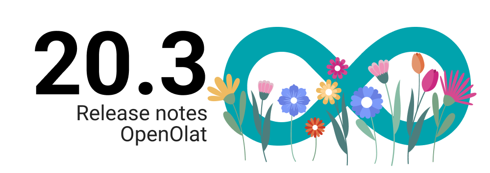
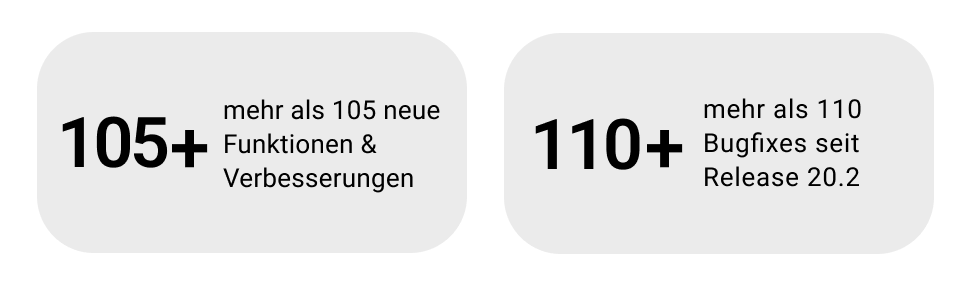
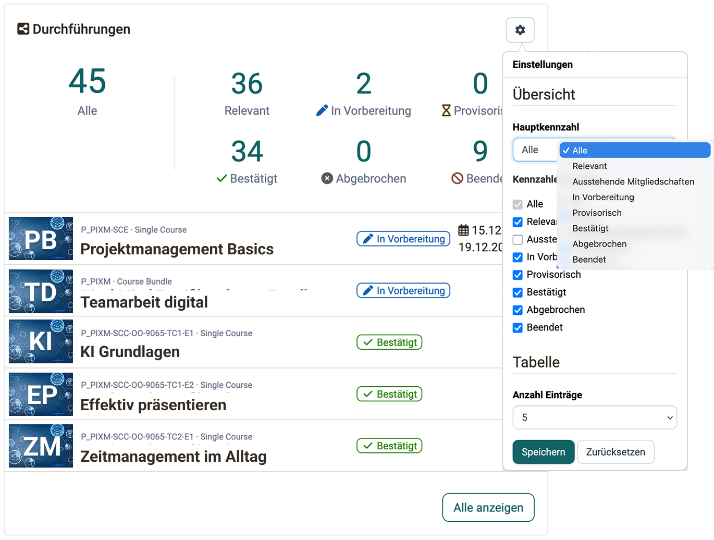
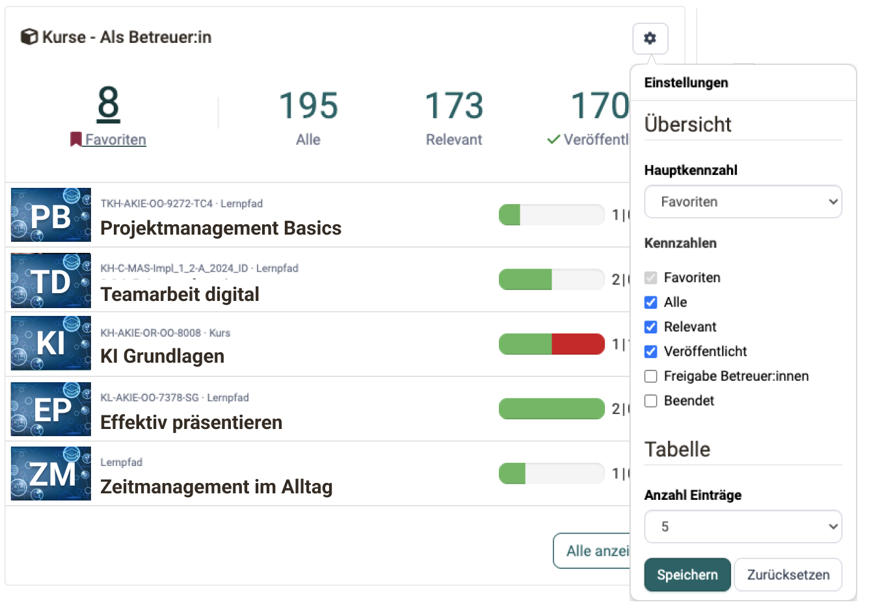
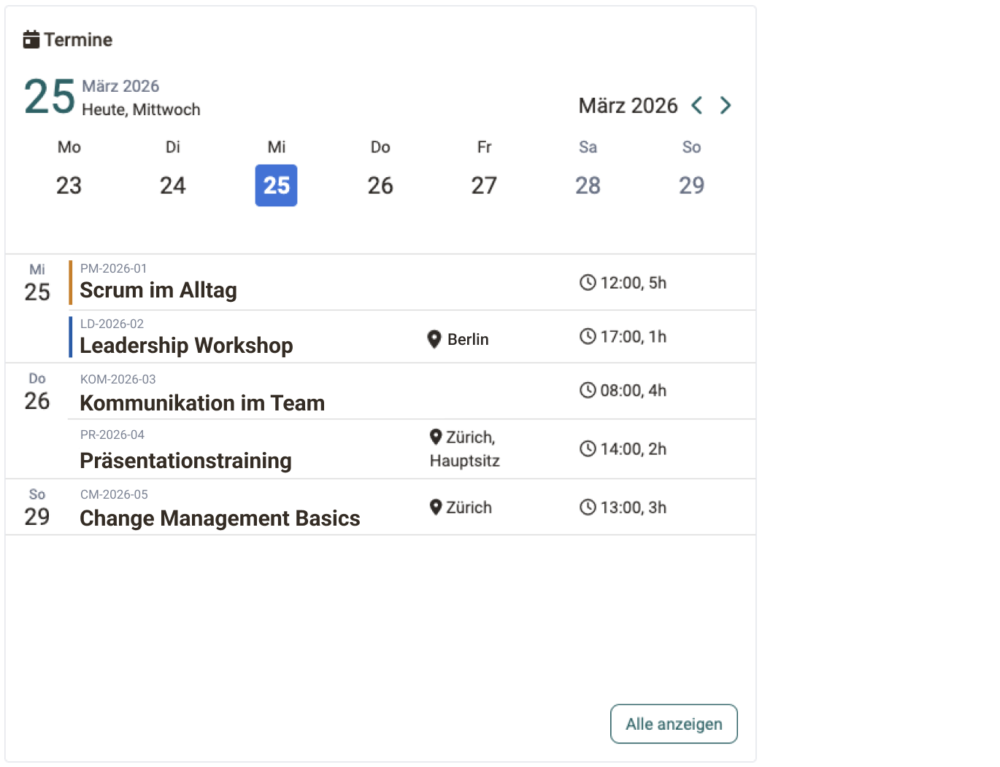
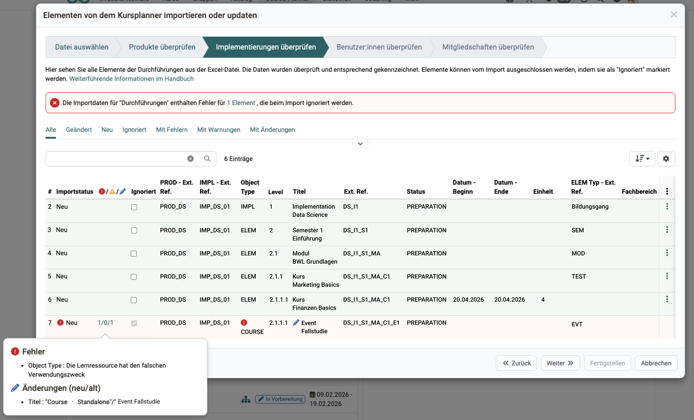
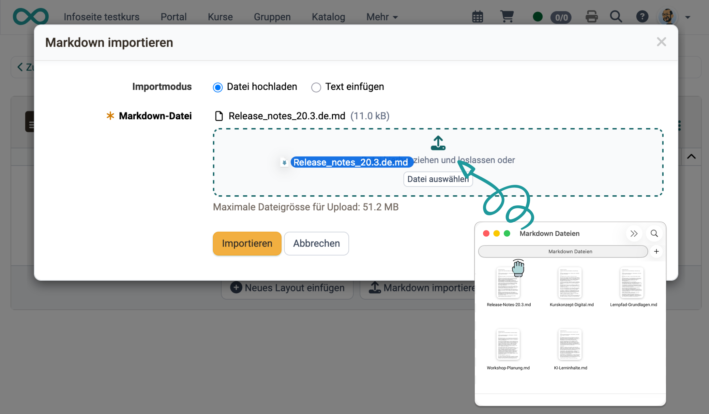
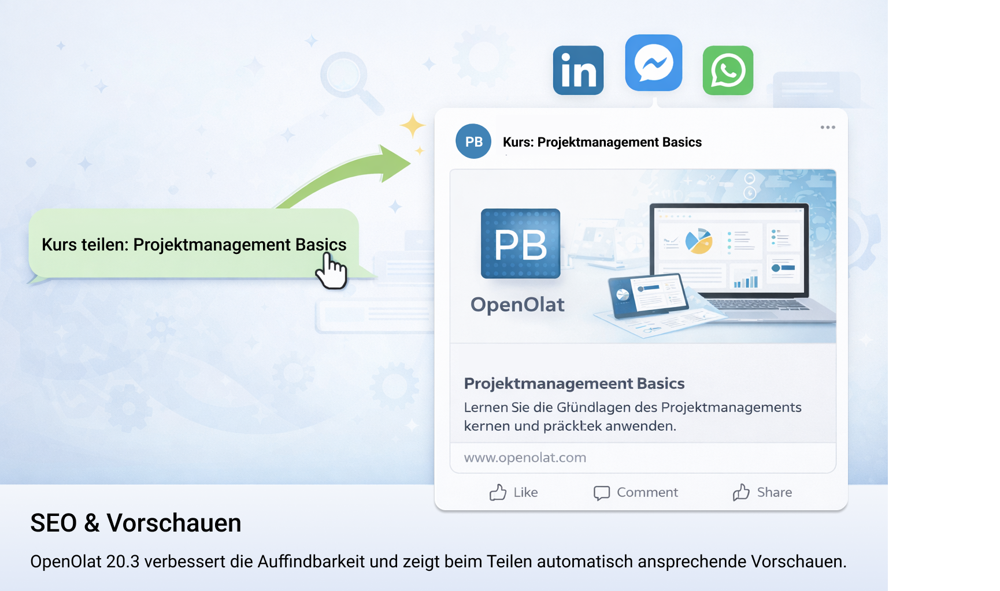

# Release Notes 20.3

* * *

:material-calendar-month-outline: **Releasedatum: 25.03.2026 • Letztes Update: 25.03.2026**

* * *

Mit **OpenOlat 20.3** wurden zentrale Bereiche der Plattform gezielt weiterentwickelt. Im Fokus standen die flexible Gestaltung des **persönlichen Dashboards**, der neue **Master-Import/Export** im Course Planner sowie zahlreiche Verbesserungen für eine effizientere Nutzung im Alltag.

Das persönliche Dashboard wurde neu individualisierbar gestaltet – Widgets können nun frei angeordnet, ein- oder ausgeblendet werden. Zudem wurde im Course Planner mit dem neuen Master-Import/Export erstmals der vollständige Austausch von Produktstrukturen, Durchführungen und Mitgliedschaften zwischen Instanzen ermöglicht und damit eine zentrale Grundlage für konsistente Daten und Prozesse geschaffen.

## Highlights

**Widgets** – Dashboard, Course Planner und Coaching Tool wurden um neue und erweiterte Widgets ergänzt. Das persönliche Dashboard kann individuell gestaltet werden, der Course Planner bietet eine kompakte Übersicht über laufende Durchführungen und das Coaching Tool zeigt relevante Termine direkt an.

**Course Planner – Master Import/Export** – Produktstrukturen, Durchführungen und Mitgliedschaften können vollständig exportiert und in andere OpenOlat-Instanzen übertragen werden. Ein integrierter Assistent prüft die Daten vor dem Import und unterstützt mit klaren Rückmeldungen.

**Seiten-Baustein – Markdown-Import** – In einer ersten Version können Seiten direkt aus Markdown-Dateien importiert werden. Inhalte aus externen Quellen lassen sich so schnell übernehmen und strukturiert darstellen – eine effiziente Grundlage für die Erstellung und Weiterentwicklung von Kursinhalten.

Seit Release 20.2 wurden über 105 neue Funktionen und Verbesserungen zu OpenOlat hinzugefügt. Hier finden Sie die wichtigsten Neuerungen zusammengefasst. Zusätzlich wurden zahlreiche Bugs behoben. Die komplette Liste der Änderungen in 20.2.x finden Sie [hier](Release_notes_20.2.de.md){:target="_blank"}.

* * *

## Widgets

### Dashboard & Course Planner

Widgets wurden funktional erweitert und vereinheitlicht: Das persönliche **Dashboard** kann individuell gestaltet werden, indem Widgets frei angeordnet sowie ein- oder ausgeblendet werden. Gleichzeitig bieten Widgets wie das Tabellen- und Mitglieder-Widget erweiterte Konfigurationsmöglichkeiten bei einheitlicher Bedienung.

Im **Course Planner** sorgen neue Übersichts-Widgets dafür, dass relevante Informationen – wie laufende Durchführungen – direkt auf der Startseite sichtbar sind. Über die Einstellungen lassen sich Kennzahlen, Status und die Anzahl der angezeigten Einträge flexibel anpassen.

{ class="shadow lightbox" title="Dashboard: Individuelle Widget-Konfiguration" }

### Coaching Tool: Ereignis-Widget

Das Coaching Tool wurde um ein neues **Ereignis-Widget** erweitert, das bevorstehende Termine übersichtlich anzeigt – mit direkten Links zu den jeweiligen Veranstaltungen. Kennzahlen und Standardeinstellungen im Kurs-Widget wurden überarbeitet.

{ class="shadow lightbox" title="Coaching Tool: Ereignis-Widget" }

### Coaching Tool: Kalender-Widget

Das **Kalender-Widget** im Coaching Tool bietet eine übersichtliche Darstellung aller anstehenden Termine und erleichtert die zeitliche Orientierung im Arbeitsalltag. Relevante Veranstaltungen werden direkt im Kontext des Kalenders angezeigt, inklusive Datum, Uhrzeit und – falls vorhanden – Ort.

Die Farbcodierung unterstützt die schnelle Einordnung: Orange markiert aktuell laufende Termine, während Blau den nächsten anstehenden Termin hervorhebt. So lassen sich Prioritäten auf einen Blick erkennen und Termine effizient planen.

{ class="shadow lightbox" title="Coaching Tool: Ereignis-Widget" }

* * *

## Course Planner: Master Import / Export

Der Course Planner erhält mit dem **Master Import/Export** eine zentrale Infrastrukturfunktion: Produktstrukturen, Durchführungen und Mitgliedschaften können nun vollständig exportiert und in eine andere OpenOlat-Instanz importiert werden.

**Was lässt sich importieren?** Produkte, Elemente, Kurse und Termine – sowie Teilnehmer:innen und Benutzer:innen. Neue Personen können direkt beim Import angelegt werden. Ein Assistent führt durch den Prozess und zeigt vor dem Import klar an, was neu angelegt, aktualisiert oder übersprungen wird.

**Was lässt sich exportieren?** Produkte, Durchführungen sowie Teilnehmer:innen und Benutzer:innen werden als strukturierte Excel-Dateien ausgegeben. So lassen sich bewährte Programmstrukturen von der Testinstanz in die Produktion übernehmen, Vorlagen für verschiedene Organisationseinheiten klonen oder Daten bei Systemwechseln portieren.

{ class="shadow lightbox" title="Course Planner: Master Import" }

## Course Planner: Weitere Verbesserungen

### Mitgliedschaften & Zugriffssteuerung

Neue Funktionen ermöglichen es, dass Teilnehmende Mitgliedschaften selbstständig bestätigen oder ablehnen. Angebote können zeitlich über Durchführungszeiträume gesteuert werden. Erweiterte Zugriffsberechtigungen sorgen für mehr Transparenz und Kontrolle beim Zugriff auf Programmdaten und öffnen den Berichtszugriff für zusätzliche Rollen.

### Aktivitäts-Log

Mit dem neuen **Aktivitäts-Log** werden alle relevanten Vorgänge im Course Planner zentral erfasst – darunter Mitgliedschaften, Benachrichtigungen, Zertifikate und Einstellungen. Die Einträge sind vollständig einsehbar und lassen sich gezielt filtern.

### Darstellung & Navigation

Das Dashboard des Course Planners wurde auf ein modernes Layout umgestellt. Jedem **Curriculum lässt sich eine individuelle Farbe** zuweisen, um verschiedene Programme visuell voneinander zu unterscheiden.

## Seiten-Baustein: Markdown-Import

Markdown-Dateien können nun in einer ersten Version direkt im Seiten-Baustein importiert werden, wodurch sich Inhalte aus externen Werkzeugen oder einfachen Textdateien ohne manuelles Nachformatieren übernehmen lassen. Der Inhalt wird automatisch in das strukturierte Seitenformat überführt und bildet so eine effiziente Grundlage, um Kursseiten schneller und einfacher mit Inhalten zu befüllen.

Info: Markdown ist ein weit verbreitetes Textformat, das in vielen Tools und KI-Anwendungen ausgegeben wird, und ermöglicht die nahtlose Übernahme und Weiterverwendung bestehender Inhalte ohne zusätzlichen Formatierungsaufwand. Gleichzeitig unterstützt es eine klare Struktur und erleichtert die kontinuierliche Weiterentwicklung von Lerninhalten.

{ class="shadow lightbox" title="Content Editor: Markdown-Import" }

## SEO & Seitenvorschau

Mit OpenOlat 20.3 wird die Auffindbarkeit öffentlicher Kursseiten und InfoPages gezielt verbessert. Beim Teilen von Links in sozialen Netzwerken und Messenger-Diensten werden automatisch ansprechende Vorschauen mit Titel, Beschreibung und Bild angezeigt. Gleichzeitig wurde die Darstellung für Suchmaschinen optimiert, und Keywords können individuell pro Seite oder Lernangebot definiert werden.

{ class="shadow lightbox" title="SEO: Open Graph und Metadaten-Konfiguration" }

* * *

## Weiteres, kurz notiert

- **Kurs:** Ein neuer Filter «Relevant» zeigt Kursmitgliedern direkt ihre aktiven Kurse an. Kurse können nach Zeitraum sortiert werden und der Dialog zum Verlassen eines Kurses wurde vereinheitlicht.

- **Tests, E-Assessment & Safe Exam Browser:** Die Statusanzeige in Tests wurde vereinfacht und die Anzahl der Versuche ist direkt bei der Frage sichtbar. Für den Safe Exam Browser können mehrere benannte Konfigurationsvorlagen erstellt und bei der Prüfung ausgewählt werden.

- **Video:** Die Videotranskodierung erfolgt neu standardmässig in 1080p.

- **Benutzerverwaltung:** Einladungslinks können deaktiviert werden. Der Prozess zum Zurücksetzen des Passworts wurde datenschutzrechtlich optimiert.

- **Filter & Suche:** Der Autor:innen- bzw. Besitzer:innen-Filter unterstützt neu die Suche über E-Mail-Adressen.

- **Projekt-Tool:** Neu können persönliche Filter gespeichert werden und Dateien lassen sich über einen externen Link direkt referenzieren.

- **Framework & Usability:** Der Login-Screen wurde visuell modernisiert und sorgt für einen zeitgemässen ersten Eindruck. Leere Ansichten wurden vereinheitlicht und bieten eine klarere Orientierung bei fehlenden Inhalten. Zudem wurde veralteter Code entfernt, um Stabilität und Wartbarkeit zu verbessern.

- **Barrierefreiheit:** Die Navigation per Tab in Dialogen mit Datumsauswahl sowie die Anzeige der Datepicker wurden verbessert.

- **Internes Sicherheitsaudit:** Im Rahmen der Qualitätssicherung für Release 20.3 wurde ein internes Sicherheitsaudit durchgeführt und gezielte Verbesserungen im Bereich Sicherheit umgesetzt.

* * *

## Administratives / Technisches
<mark style="background:#fff88f">@Mandy</mark>

* Dependency-Updates:
    * commons-collections von 3.x auf 4.x migriert
    * TinyMCE von 6.8.6 auf 7.x aktualisiert
    * Fabric.js von 4.4.0 auf 6.4.0+ aktualisiert (CVE-2024-23634 behoben)
    * Bootstrap-Migration von 3.x auf 5.x
    * Prototype.js 1.7 entfernt
    * Apache Lucene von 7.7.0 auf 9.x+ aktualisiert
    * Apache HttpClient von 4.x auf 5.x migriert
    * BeanShell in SCORM evaluiert und adressiert (CVE-2016-2510)
    * Allgemeines Bibliotheks-Update
* Sicherheits-Konfiguration:
    * Content Security Policy wurde verschärft – nach dem Update sollte geprüft werden, ob eigene Konfigurationen und integrierte externe Tools kompatibel sind
    * REST-API-Tokens werden neu gehasht gespeichert – bestehende Tokens behalten ihre Gültigkeit

* * *

## Systemadministratoren: Neue Funktionen aktivieren / konfigurieren
<mark style="background:#fff88f">@Mandy</mark>

!!! note "Checkliste nach Update auf 20.3"

    Folgende Funktionen müssen nach einem Update auf Release 20.3 in der `Administration` aktiviert bzw. konfiguriert werden:

    * [x] SEO & Seitenvorschau konfigurieren: `Module > Katalog / InfoPages > SEO`
    * [x] Dashboard-Widget-Konfiguration durch Nutzer:innen aktivieren/deaktivieren: `Module > Dashboard`
    * [x] SEB-Konfigurationsvorlagen erstellen und freigeben: `Administration > e-Assessment > Safe Exam Browser`
    * [x] Content Security Policy nach Update auf Kompatibilität prüfen

* * *

## Weitere Informationen
<mark style="background:#fff88f">@Mandy</mark>

* [YouTrack Release Notes 20.3.0](https://track.frentix.com/releaseNotes/OO?q=fix%20version:%2020.3.0&title=Release%20Notes%2020.3.0){:target="_blank"}
