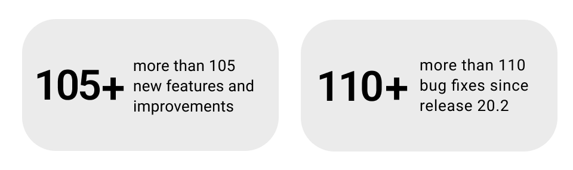
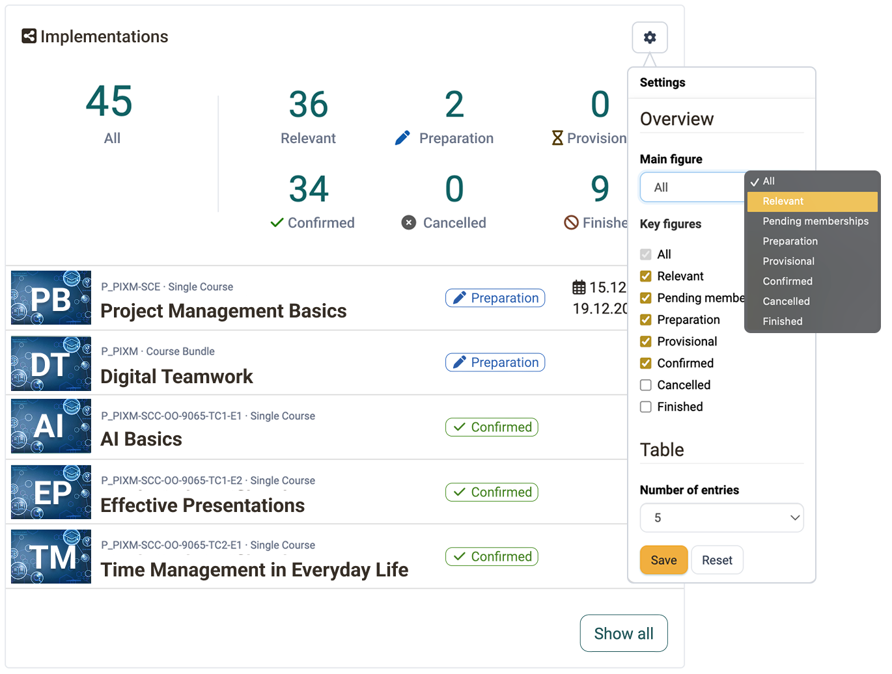
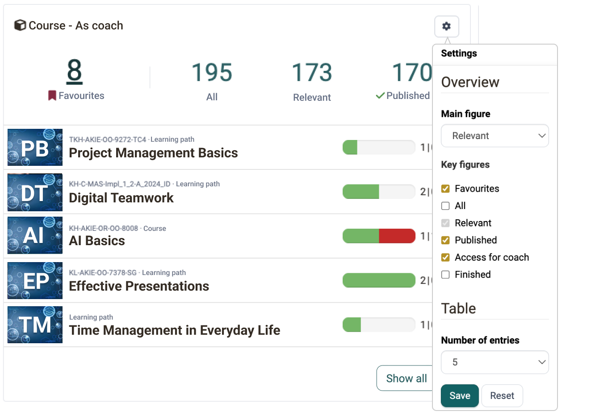
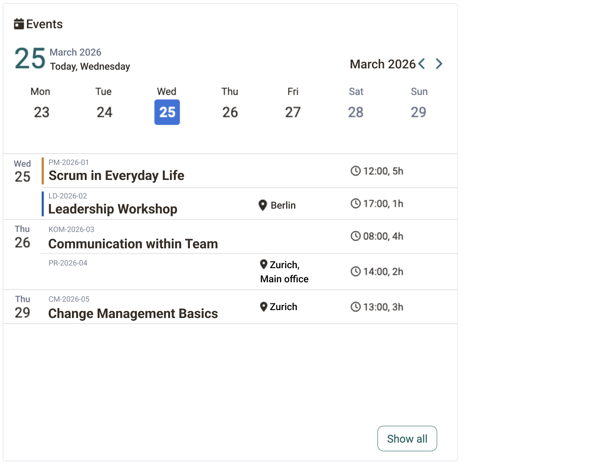
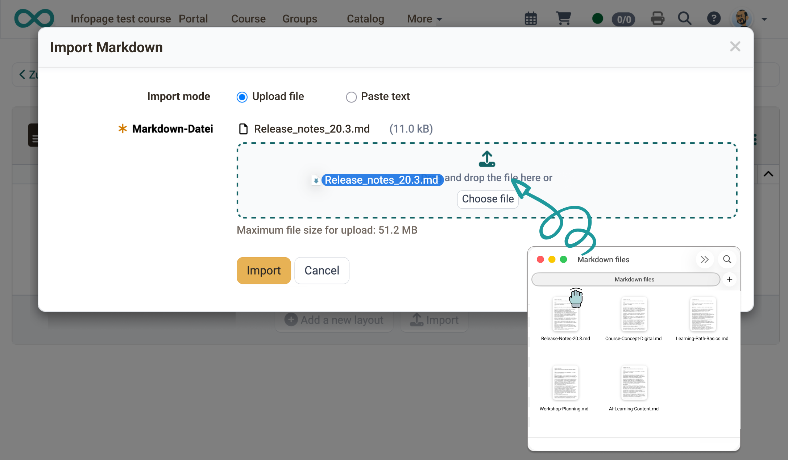
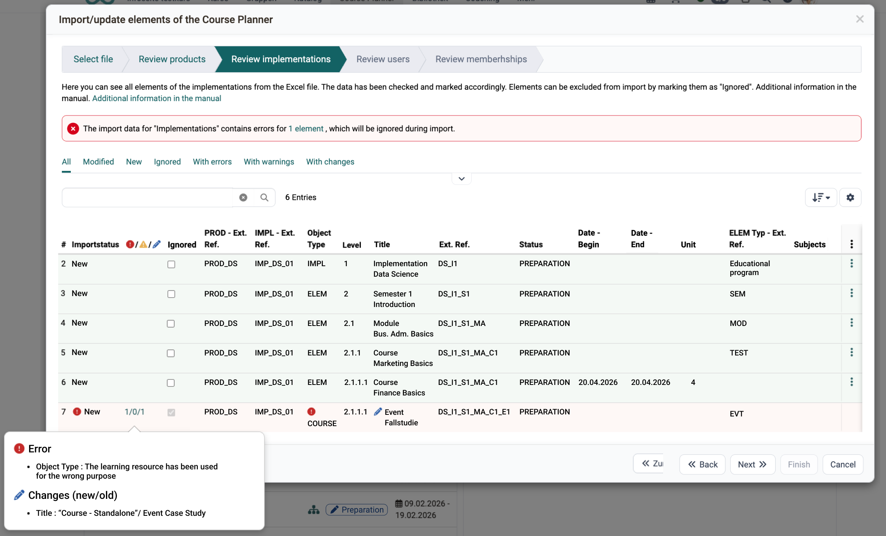
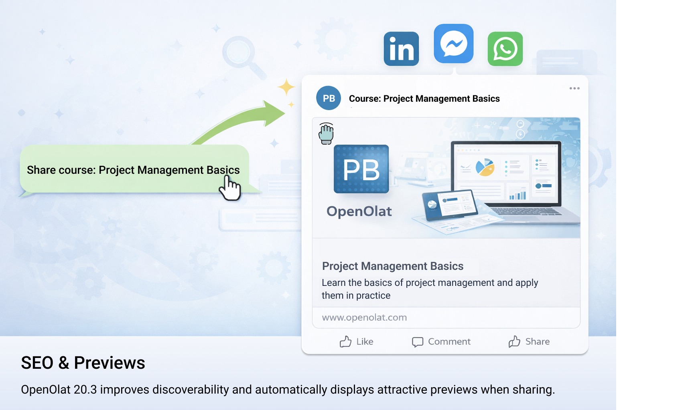

# Release Notes OpenOlat 20.3

* * *

:material-calendar-month-outline: **Release date: 03/25/2026 • Last update: 07/15/2026**

* * *

**OpenOlat 20.3** introduces further enhancements to key areas. The focus was on flexible **widget** design, the new **Master Import/Export** feature in the Course Planner, and numerous improvements for more efficient day-to-day use.

## Highlights

**Widgets** – Overview pages in the Course Planner and Coaching Tool have been enhanced with new and improved widgets. The personal dashboard can be customized, the Course Planner provides a concise overview of current sessions, and the Coaching Tool displays relevant dates directly.

**Page course element – Markdown Import** – In this initial version, pages can be imported directly from Markdown files. This allows content from external sources to be quickly imported and displayed in a structured format—providing an efficient foundation for creating and developing course content.

**AI Features** – The AI module now supports various AI providers (OpenAI, Anthropic, and general OpenAI-compatible services). When uploading images, metadata such as alt text, titles, and keywords are automatically generated. The creation of multiple-choice questions has been improved in terms of quality and now supports any language.

**Course Planner – Master Import/Export** – Course structures, implementations, and memberships can be fully exported and transferred to other OpenOlat instances. A built-in wizard checks the data before import and provides clear feedback.

Since release 20.2, over 105 new features and improvements have been added to OpenOlat. Here you will find a summary of the most important new features. In addition, numerous bugs have been fixed. The complete list of changes in 20.2.x can be found [here](Release_notes_20.2.md){:target="_blank”}.

* * *

## Announcement for Release 21.0

!!! warning "Separate Access for Learning and Coaching"
    
    From Release 21.0 onward, the Learning and Coaching sections will be separate: Participants will navigate to “Courses” as usual to access their learning content. Coaches, course owners, and other roles with supervisory functions (e.g., line managers, education managers) will now find their courses and learning resources in the “Coaching” section.

* * *

## Widgets

Widgets have been enhanced and standardized: They can be freely arranged and shown or hidden. At the same time, widgets such as the table and member widgets offer advanced configuration options while maintaining a consistent user interface.

### Overview Widget (Course Planner)

In the Course Planner, the new **Overview Widget** displays active implementations directly on the start page. Key metrics, status, and the number of entries displayed can be flexibly configured.

{ class="shadow lightbox" title="Dashboard: Custom Widget Configuration" }

### Event Widget (Coaching Tool)

The new **Event Widget** clearly displays upcoming dates—with direct links to the respective events. Key metrics and default settings in the Course Widget have been revised.

{ class="shadow lightbox" title="Coaching Tool: Event Widget" }

### Calendar Widget

The **Calendar Widget** in the Coaching Tool (new) and Course Planner provides a clear overview of all upcoming appointments and makes it easier to keep track of time in your daily work routine. Relevant events are displayed directly within the calendar, including the date, time, and—if available—location.

Color coding helps you quickly identify events: Orange marks currently ongoing appointments, while blue highlights the next upcoming appointment. This allows you to identify priorities at a glance and plan appointments efficiently.

{ class="shadow lightbox" title="Coaching Tool: Calendar Widget" }

* * *

## Content Editor

### Markdown Import

Markdown files can now be imported directly into the Content Editor in a preliminary version, allowing content from external tools or plain text files to be imported without manual reformatting. The content is automatically converted into the structured page format, providing an efficient foundation for populating course pages with content more quickly and easily. The content is automatically transferred into the Content Editor’s functional blocks, such as Title, Table, Info Box, etc.

Images are directly integrated into the Media Center, where a duplicate check prevents the same image from being stored multiple times. This saves space and automatically keeps things tidy without the author having to worry about it.

!!! note "About Markdown"
    
    Markdown is a widely used text format that is supported by many tools and AI applications, enabling the seamless import and reuse of existing content without the need for additional formatting. At the same time, it promotes a clear structure and facilitates the ongoing development of learning content.

{ class="shadow lightbox" title="Content Editor: Markdown Import" }

### Support for SVG Graphics

SVG graphics are now supported as an image format in Media Center and Content Editor, rather than being treated as files. SVG is frequently used as a format for charts and graphics, particularly in AI-powered content creation.

* * *

## AI Features

### AI Module: Multi-Provider Support

The **AI Module** has been completely redesigned and now supports various AI providers and models. In addition to OpenAI, you can now integrate **Anthropic** as well as any **OpenAI API-compatible services** (e.g., Ollama, vLLM). Configuration is done per function: For each AI-powered function, a provider and a model can be selected individually. Available models are loaded directly from the provider, and an integrated validation checks the API connection during setup.

### Automatic Image Metadata

When **uploading images** in the Media Center, metadata such as title, description, alt text, and keywords are now **automatically generated by AI**. This improves accessibility and makes it easier to find media. Metadata generation also works with **Markdown imports**: Images included in the import automatically receive their metadata in the background. If the generated metadata is insufficient or unsuitable, it can be adjusted as usual and changed at any time.

### Improved Multiple-Choice question generation

The automatic generation of **multiple-choice questions** has been enhanced, and the validation of answer options and distractors has been optimized. In addition, **any language** is now supported, not just German and English.

### Looking ahead

With the new multi-provider architecture and feature-specific configuration, the foundation has been laid to integrate numerous additional AI-powered features into OpenOlat in upcoming releases. From support for additional question types to AI-powered learning systems, many projects are currently in the planning and implementation stages.

* * *

## Course Planner: Master Import

With the **Master Import**, the Course Planner offers a central feature for efficiently managing implementations: Using structured Excel files, you can create implementations, dates, and memberships in a single step. You can also update existing structures later—for example, to add more dates or additional participants.

**What can be imported?** Products, implementations, courses, and dates—as well as participants and users. New users can be created directly during the import. A wizard guides you through the process and clearly indicates before the import what will be created, updated, or skipped.

**Typical use cases:** Efficiently create new implementations with dates and participants, add additional dates to existing implementations later, or add additional memberships.

{ class="shadow lightbox" title="Course Planner: Master Import" }

* * *

## Course Planner: Further Improvements

### Memberships & Access Control

New features allow participants to accept or decline memberships on their own. Offers can be scheduled to run during specific time periods. Enhanced access permissions provide greater transparency and control over access to product data and grant report access to additional roles.

### Activity Log in the Certificate Program

The new **Activity Log** centrally records all relevant activities in the Certificate Program—including memberships, notifications, certificates, and settings. Entries are fully viewable and can be filtered as needed.

!!! note "About the Activity Log"
    
    The Activity Log ensures traceability: Changes and processes in the Course Planner are fully documented and can be found at a glance—this simplifies troubleshooting, increases transparency, and strengthens quality assurance.

* * *

## SEO & Page Preview

OpenOlat 20.3 specifically improves the discoverability of public course pages and information pages. When sharing links on social media and messaging services, attractive previews with a title, description, and image are automatically displayed. At the same time, the presentation has been optimized for search engines, and keywords can be defined individually for each page or learning resource.

{ class="shadow lightbox" title="SEO: Open Graph and Metadata Configuration" }

* * *

## Layout Refresh

The OpenOlat layout has been optimized with minor adjustments in various areas. Subtle animations triggered by mouse interactions give the application a fresher, more appealing look.

The transition of background images on the login page has been completely redesigned and is now smoother and more seamless. An optional new zoom effect allows for further customization and enhances the user experience.

* * *

## Further, briefly noted

- **Courses:** A new “Relevant” filter shows course members their active courses directly. Courses can be sorted by time period, and the dialog for leaving a course has been standardized.

- **Tests, e-assessment & Safe Exam Browser:** The status display in tests has been simplified, and the number of attempts is now visible directly next to each question. For the Safe Exam Browser, custom configuration templates can be created and selected for an exam.

- **Blog/Podcast:** The table view has been improved for read-only mode.

- **Video:** Video transcoding now defaults to 1080p.

- **User Management:** Invitation links can be disabled. The password reset process has been optimized to comply with data protection regulations.

- **Filters & Search:** The author and owner filters now support searching by email address.

- **Project Tool:** Personal filters can now be saved, and files can be referenced directly via an external link.

- **Framework & Usability:** The login screen has been visually modernized to create a contemporary first impression. Additionally, outdated code has been removed to improve stability and maintainability. The interface has been refined throughout to provide a more consistent user experience.

- **Accessibility:** Tab navigation in dialogs with date pickers and the display of date pickers have been improved.

- **Internal Security Audit:** As part of the quality assurance process for Release 20.3, an internal security audit was conducted and targeted security improvements were implemented.

- **Events**: Input field for the URL of the meeting recording (:octicons-tag-24: Release 20.3.2)

* * *

## Administrative / Technical

- Modernization of theme.js and the OpenOlat theme login page
- Video transcoding:
    - Default resolution of 1080p for video transcoding
    - Support for an external transcoding service with different service queues for processing videos of various sizes
    - Automatic generation of video subtitles (*Part of the Frentix Cloud Service. Non-customers interested in this feature should contact Frentix Sales.*)
- General library updates
    - Hibernate 7.2.6, Jakarta persistence 3.2, Jakarta EE 11
    - Infinispan 16.0.5
    - Hibernate validator 9.1.0
    - Spring framework 7.0.2
    - Apache CXF 4.2.0
    - Java HTML sanitizer 20260102.1
    - Jackson and Jackson annotations 2.21.0
    - Apache Artemis 2.52.0
    - Undertow core 2.3.23
    - PDFBox 3.0.7
    - Webauthn4j 0.30.2
    - PostgreSQL JDBC 42.7.9
    - Nimbus Jose JWT 10.8
    - iCal4j 4.2.3
    - ical4j zone infos for Outlook 2.2.0
    - Azure Identity 1.18.2
    - Microsoft Graph API 6.59.0
    - JSON, SwaggerUI, Selenium, AssertJ
    - Fabric.js from 4.4.0 to 6.4.0+
    - Prototype.js 1.7 removed
- Rest API extension for Credit Point System (transactions, systems, balances) (:octicons-tag-24: Release 20.3.2)

* * *

## System administrators: Activate / Configure new features

!!! note "Checklist after updating to 20.3"

    The following functions must be activated or configured in `Administration` after updating to Release 20.2:

    * [x] Set default video resolution: `Modules > Video > Video configuration`
    * [x] Configure SEO metadata (organization, keywords): `Modules > SEO / OAI-PMH metadata > Search Engine`
    * [x] Create and share SEB configuration templates: `e-Assessment > Assessment management > Safe Exam Browser configuration`
    * [x] Check Content Security Policy for compatibility after an update: `Login > Security > Configuration`

* * *

## Further information

- [YouTrack Release notes 20.3.6](https://track.frentix.com/releaseNotes/OO?q=fix%20version:%2020.3.6&title=Release%20Notes%2020.3.6){:target="_blank"}
- [YouTrack Release notes 20.3.5](https://track.frentix.com/releaseNotes/OO?q=fix%20version:%2020.3.5&title=Release%20Notes%2020.3.5){:target="_blank"}
- [YouTrack Release notes 20.3.4](https://track.frentix.com/releaseNotes/OO?q=fix%20version:%2020.3.4&title=Release%20Notes%2020.3.4){:target="_blank"}
- [YouTrack Release notes 20.3.3](https://track.frentix.com/releaseNotes/OO?q=fix%20version:%2020.3.3&title=Release%20Notes%2020.3.3){:target="_blank"}
- [YouTrack Release notes 20.3.2](https://track.frentix.com/releaseNotes/OO?q=fix%20version:%2020.3.2&title=Release%20Notes%2020.3.2){:target="_blank"}
- [YouTrack Release notes 20.3.1](https://track.frentix.com/releaseNotes/OO?q=fix%20version:%2020.3.1&title=Release%20Notes%2020.3.1){:target="_blank"}
- [YouTrack Release notes 20.3.0](https://track.frentix.com/releaseNotes/OO?q=fix%20version:%2020.3.0&title=Release%20Notes%2020.3.0){:target="_blank"}
