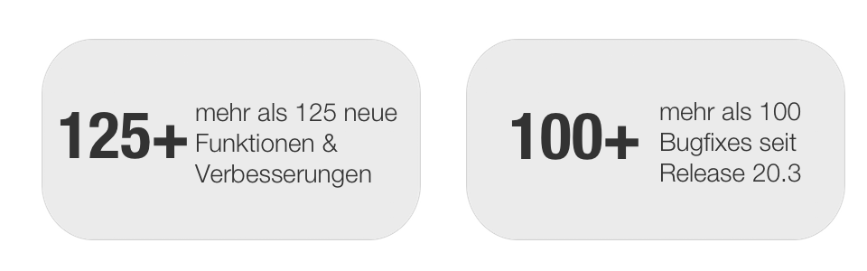
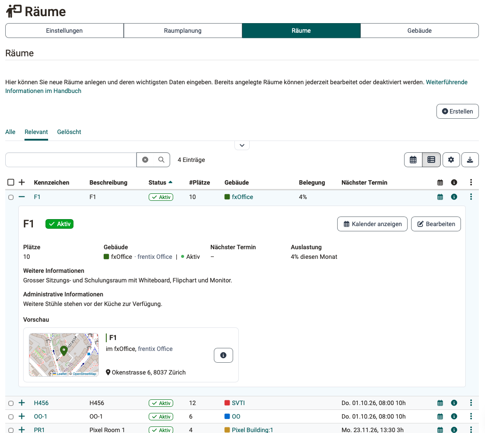
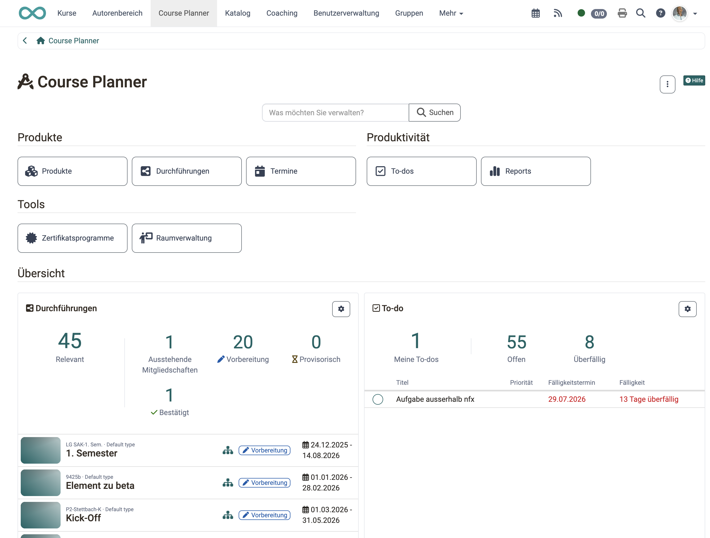
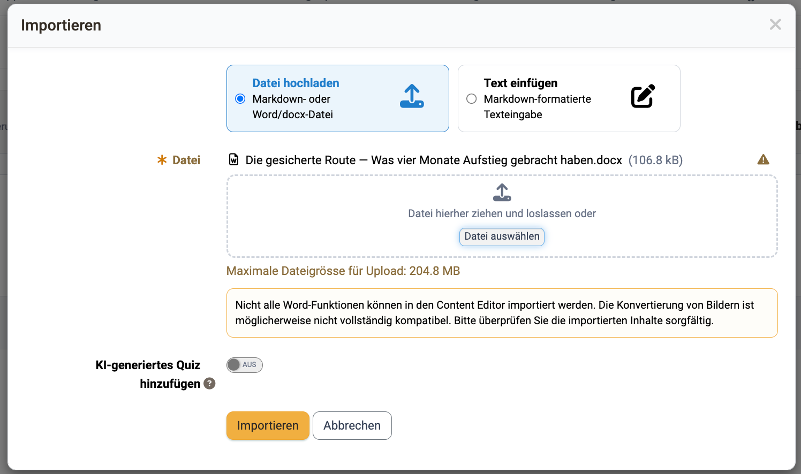
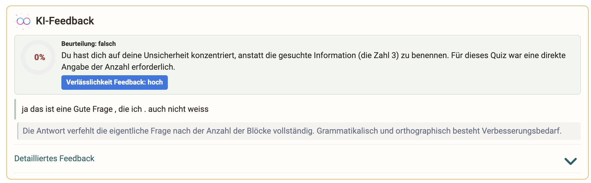
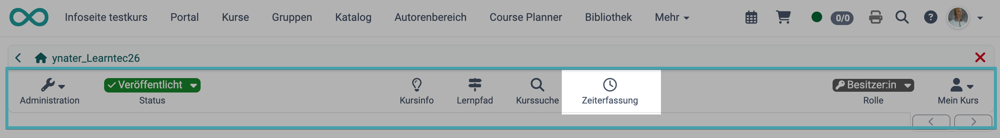
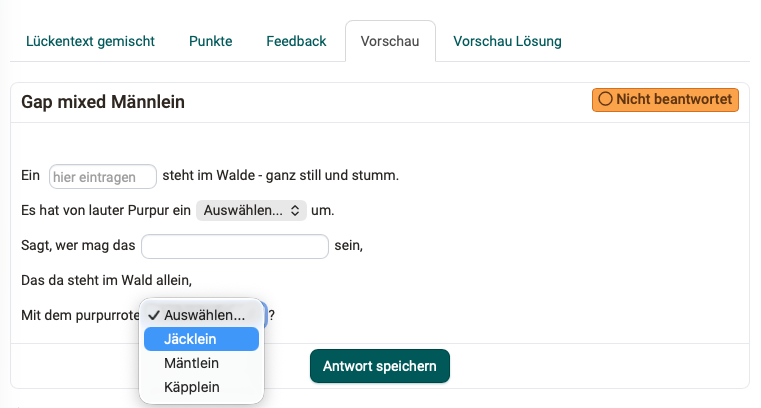
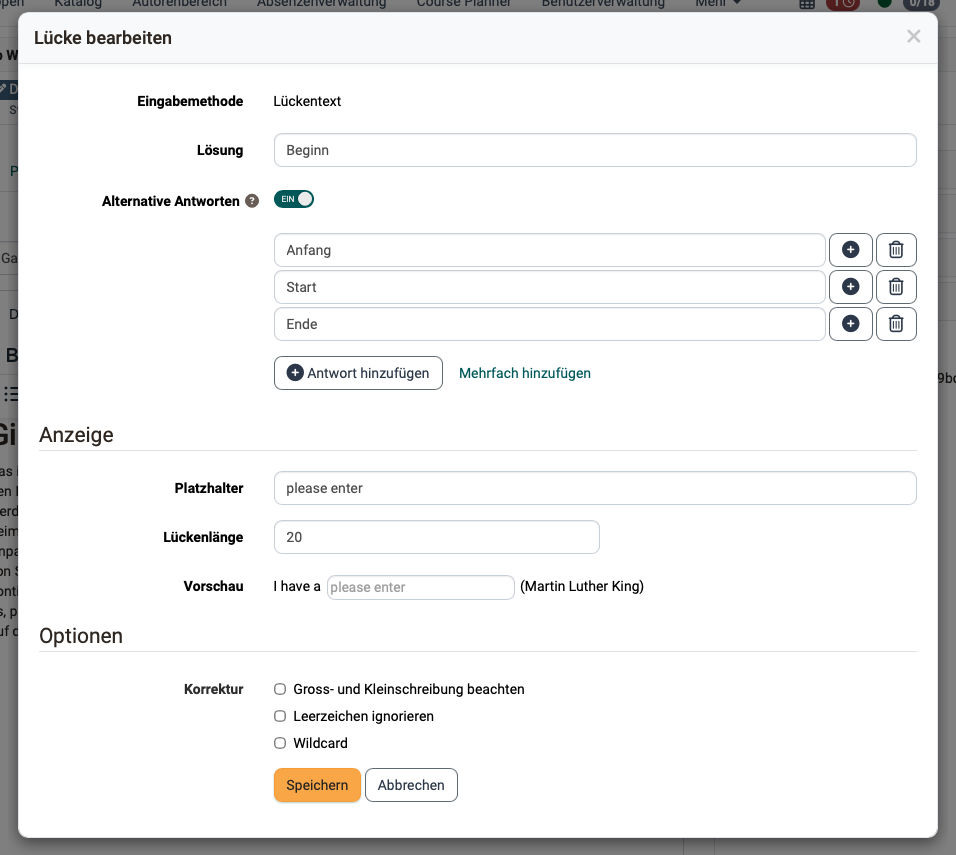

# Release Notes OpenOlat 21.0

* * *

:material-calendar-month-outline: **Releasedatum: 16.07.2026 • Letztes Update: 19.08.2026**

* * *

Mit OpenOlat 21.0 geben wir unseren nächsten Major Release frei.

Die konsequente **Trennung von Lernen und Coaching** räumt den Arbeitsalltag auf: Lernende bleiben unter "Kurse", Betreuende arbeiten im Bereich "Coaching".

Mit der neuen **Raumverwaltung** werden Räume an Terminen buchbar und Veranstaltungsorte klar ausgewiesen. **Automatisierung** und **To-dos** im **Course Planner** sowie die gezielte Steuerung von **Kurszugriff** und der **Verfügbarkeit von Buchungen** im Katalog unterstützen bei der Bereitstellung und Pflege des Kursangebotes. Über **Externe Kurstools** kann gezielt auf externe Systeme abgesprungen werden.

Bei den **KI-Funktionen** kommt die Erstellung von **Freitextfragen mit KI-Korrektur** für Autor:innen und **formatives KI-Feedback** für Lernende hinzu, der **Content Editor** importiert neu ganze **Word- und Markdown-Dateien** - dies erleichtert die Aufbereitung von Inhalten. Der **KI-Chatbot "Sophia"** steht im Handbuch für Fragen rund um OpenOlat zur Verfügung.

Im **e-Assessment** kombiniert der **Fragetyp "Lückentext gemischt"** Text-, Zahlen- und Dropdown-Lücken und **Safe Exam Browser Konfigurationsvorlagen** können für verschiedene Prüfungssetups hinterlegt werden.

Neben optionalen **Seriennummern** und einer **Druckvorlage** für **Zertifikate** wurden Prüfungsmodus, Korrekturaufträge-Report und Leistungsnachweise optimiert. Für lokale Logins kann eine **Zwei-Faktor-Authentifizierung** mit **One Time Code** aktiviert werden.

Seit Release 20.3 wurden über 125 neue Funktionen und Verbesserungen zu OpenOlat hinzugefügt. Hier finden Sie die wichtigsten Neuerungen zusammengefasst. Zusätzlich wurden mehr als 100 Bugs behoben. Die komplette Liste der Änderungen in 20.3.x finden Sie [hier](Release_notes_20.3.de.md){:target="_blank"}.

* * *

## Trennung von Lernen und Betreuen/Coaching

Historisch bedingt vermischten sich bisher unter **«Kurse»** zwei Perspektiven: Teilnehmende greifen dort auf ihre Lerninhalte zu – Betreuende und Besitzer:innen auf ihre Kurse/Lernressourcen.

Mit OpenOlat **Release 21.0** wird der Einstieg für Lernen und Betreuen/Coaching klar getrennt:

* **Teilnehmer:innen** bewegen sich wie gewohnt unter [**«Kurse»**](https://docs.openolat.org/de/manual_user/area_modules/Courses/), um auf ihre Lerninhalte zuzugreifen.
* **Betreuer:innen, Kursbesitzer:innen** und weitere Rollen mit Betreuungsfunktion (z.B. Linienvorgesetzte, Ausbildungsverantwortliche) finden ab sofort ihre Kurse, Lernressourcen und Bildungsprodukte sowie betreute Personen im Bereich [**«Coaching»**](https://docs.openolat.org/de/manual_user/area_modules/Coaching/)

### Schrittweiser Umstieg

!!! tip "Bis und mit Release 20.3.x"

    Anleitung ["Step by Step: Zugang Lernressourcen für Betreuende umstellen"](https://docs.openolat.org/de/release_notes/Release_notes_20.1/#abspaltung-von-kurse)

!!! tip "Ab Release 21.0.0"

    * [x] Coaching Tool automatisch aktiviert (- siehe `Administration > e-Assessment > Coaching`)
    * [x] Berechtigungen für Coaching Site setzen unter `Administration > Customizing > Sites`
    * [x] Aktivierung zusätzlicher Hinweis im Bereich "Kurse": `Administration > Module > Lernressource > Zugang`

* * *

## Neues Modul «Räume»

Mit dem Modul [**«Räume»**](https://docs.openolat.org/de/manual_admin/administration/Modules_Rooms/) steht in OpenOlat eine eigene zentrale **Gebäude- und Raumverwaltung** zur Verfügung.

Veranstaltungsorte werden mit Adresse und zusätzlichen Informationen wie Platzangebot gepflegt, der Standort lässt sich direkt in Google Maps / Apple Maps öffnen.

{ class="shadow lightbox" title="Raum in der Raumliste" }

Die Räume können im Course Planer sowie bei Terminen gebucht werden. Die automatische Überschneidungserkennung warnt vor Doppelbelegungen. Per Schnittstelle lassen sich die Termine und Rauminformationen auch auf externen Monitoren anzeigen (digital signage).

Alle Buchungen inklusive Raumauslastung werden in der **Raumplanung** übersichtlich zusammengefasst und verwaltet.

{ class="shadow lightbox" title="Raumplanung mit Konflikt-Markierung" }

* * *

## Course Planner

### Elementtypen mit Automatisierung

Mit **Elementtypen** werden die hierarchischen Ebenen von Produkten (z. B. Lehrgang > Semester > Modul > Kurs) definiert und für jeden Typ bestimmt, ob dieser Kursinhalt trägt, als reine Struktur dient oder selbst eine Durchführung mit eigenem Zeitraum bildet. Zusätzliche Funktionen wie Absenzenmanagement, Stundenplan oder Lernfortschritt werden ebenfalls pro Typ aktiviert.

Per **Automatisierung** können relativ zum Durchführungsbeginn/-ende oder bei Statuswechsel beispielsweise Kurse aus einer Vorlage instanziiert oder der Kursstatus gesetzt werden.

### To-dos im Course Planner

Rund um die Kursplanung fallen viele kleine Aufgaben an, die nun direkt im Course Planner als **To-dos** für Produkte, Durchführungen und auf jedem Element angelegt werden können.

Eine **zentrale Übersicht** fasst alle To-dos über sämtliche Produkte hinweg zusammen, und auf dem Dashboard zeigt das **To-do-Widget** die Aufgaben, die unmittelbare Aufmerksamkeit verlangen.

{ class="shadow lightbox" title="Course Planner Dashboard mit To-dos" }

### Weitere Verbesserungen

* **[Durchführungen](https://docs.openolat.org/de/manual_user/area_modules/Course_Planner_Implementations/#tab_settings_assessment):** Direkte Verknüpfung mit einem Zertifikatsprogramm
* **[Termine](https://docs.openolat.org/de/manual_user/area_modules/Course_Planner_Events/#event_elements):** Optimierte Anzeige bei modularisierten Kursen mit Teilnehmenden aus mehreren Durchführungen/Klassen
* **[Produktübersicht](https://docs.openolat.org/de/manual_user/area_modules/Course_Planner_Products/#product_overview):** Optimierte Sortierung und Filter
* **[Mitglieder-Widget](https://docs.openolat.org/de/manual_user/area_modules/Course_Planner_Dashboard/#widget_members):** Optimierte Anzeige und direkter Absprung zum Mitgliederbereich der Durchführung
* **[Angebot «Rechnung»](https://docs.openolat.org/de/manual_user/basic_concepts/Offer_Concepts/#offer_invoice_cancellation):** Optimierte Konfiguration der Stornierungsbedingungen

* * *

## Content Editor

### Import Markdown/Word

Vorbereitete Lerninhalte in Word- oder Markdown-Dateien mussten bisher in der **Seite** von Hand nachgebaut werden. Ab Release 21.0 steht eine [**Import-Funktion**](https://docs.openolat.org/de/manual_user/basic_concepts/Content_Editor/#markdown) zur Verfügung. Dabei können entweder die **Word- und Markdown-Dateien** komplett importiert, oder deren Inhalt als Text im Import-Dialog eingefügt werden. OpenOlat wandelt den Inhalt automatisch in die passenden Blöcke – Titel, Text, Tabellen, Code, Bilder und mehr – um. Referenzierte Bilder landen automatisch im Media Center.

{ class="shadow lightbox" title="Import Word-Datei im der Seite" }

### Inhaltsverzeichnis

Das Navigieren in langen Seiten wird durch das neue Inhaltselement [**«Inhaltsverzeichnis»**](https://docs.openolat.org/de/manual_user/basic_concepts/Content_Editor/#table_of_contents) erleichtert. Das Verzeichnis listet - entweder für die ganze Seite oder ein einzelnes Kapitel - die Titel als anklickbare Sprungmarken auf und führt mit einem Klick direkt zum jeweiligen Abschnitt.

Da neu **alle Titel-Elemente** [**automatisch mit Ankern**](https://docs.openolat.org/de/manual_user/basic_concepts/Content_Editor/#anchors) versehen werden, entstehen die Sprungziele innerhalb der Seite ganz ohne Zutun.

### Optimiertes Layout löschen

Es können neu alle [Layoutblöcke gelöscht](https://docs.openolat.org/de/manual_user/basic_concepts/Content_Editor/#delete_layout) werden, auch das oberste. Dabei kann entschieden werden, ob der Inhalt ebenfalls mit gelöscht oder in das angrenzende Layout verschoben wird.

Wird das letzte verbleibende Layout entfernt, erhält die Seite automatisch wieder ein leeres Standard-Layout.

* * *

## KI-Funktionen

### Freitextfragen mit KI-Korrektur

Neben Multiple-Choice-Fragen können ab Release 21.0 auch **Freitextfragen mit KI-Korrektur** über den Fragenpool generiert werden. Voraussetzung ist, dass im KI Modul die Funktionen «Essay Fragen Generator» und «Essay Bewertung» konfiguriert sind. Alle KI-generierten Fragen im Fragenpool erhalten automatisch den Status "Review", damit  sie vor dem Einsatz fachlich geprüft werden.

Zu jeder Freitextfrage liefert die KI ein **[«Bewertungskit»](https://docs.openolat.org/de/manual_user/area_modules/Question_Bank_Create_Questions/#ai_grading)** mit Kriterien zur Bewertung der Antwort aus. Neben einer Musterantwort sind gewichtete Schlüsselpunkte, typische Missverständnisse sowie Korrekturhinweise, Schwierigkeitsgrad und Bloom-Stufe erfasst. Es kann manuell nachjustiert und anhand einer Beispielantwort direkt getestet werden.

### Formatives KI-Feedback für Lernende

Freitextfragen mit KI-Bewertung lassen sich direkt in einem **Quiz im** [**Content Editor**](https://docs.openolat.org/de/manual_user/basic_concepts/Content_Editor/) einsetzen. Beantworten Lernende eine solche Frage, wird unter **KI-Feedback** eine formative Rückmeldung zu ihrer Antwort abgerufen: «Gesamteinschätzung», «Was gut gelungen ist», «Was fehlt noch» und «Nächster Schritt» – wahlweise als kurze Zusammenfassung oder als detailliertes Feedback.

Das Feedback vergibt bewusst keine Punkte, sondern unterstützt die Selbsteinschätzung und lädt zum Weiterarbeiten ein. Voraussetzung ist die konfigurierte KI Funktion «Essay Bewertung».

{ class="shadow lightbox" title="KI-Feedback für Lernende bei Quizfragen" }

### KI-Fragen beim Import erzeugen

Beim Aufbau einer **Seite** via Import einer Markdown- oder Word-Datei lassen sich gleichzeitig die passenden Übungsfragen mitliefern. Die Option **«KI-generiertes Quiz hinzufügen»** im Import-Dialog des **Content Editors** erzeugt dabei die Fragen im Hintergrund aus dem importierten Inhalt und hängt sie als Quiz-Element am Seitenende an. So entsteht aus einem Textdokument in einem Schritt eine Kursseite samt Lernkontrolle.

{ class="shadow lightbox" title="KI-Fragen für Seite beim Import generieren" }

### Weitere KI-Funktionen

* **Automatische Taxonomie-Zuordnung:** Bei der Generierung von Metadaten für Bilder ordnet neu ein Einbettungsmodell (Embeddings) Inhalte der passenden Taxonomie-Ebene zu – das erspart die manuelle Einordnung und hält die fachliche Systematik konsistent
* [**Nutzungsprotokoll des KI Moduls**](https://docs.openolat.org/de/manual_admin/administration/External_Tools_AI/#ai_usage_log):  zeichnet jeden KI-Aufruf der Instanz auf und liefert den Administrator:innen Informationen, welche Funktionen wie oft genutzt werden und wo Token-Kosten anfallen

### KI-Chatbot Sophia

[**Sophia**](https://docs.openolat.org/de/manual_user/help/?h=sophia#help_sophia) ist ein KI-Chatbot, der vor allem **Autor:innen und administrative Personen** unterstützt und Fragen zur OpenOlat Software im Dialog beantwortet. Als Wissensbasis dient das **OpenOlat Handbuch**.

Suche (RAG) und Sprachmodell laufen lokal in der fxCloud. Verfügbar ist Sophia aktuell auf **[docs.openolat.org](https://docs.openolat.org)**.

* * *

## Kurse und Katalog

### Lernpfad: Kursnote/Einstufung auf Kursebene

Die Umwandlung von Punkten auf Kursebene in eine andere Art [Einstufung/Note](https://docs.openolat.org/de/manual_user/learningresources/Course_Settings_Assessment/#evaluation_with_grades) existiert bereits im herkömmlichen Kurs. Für den Lernpfad-Kurs ist diese Möglichkeit ab Release 21.0 verfügbar.

Wird ein Lernpfad-Kurs mit Punkten bewertet, kann über die Option **«Mit Einstufung/Noten»** eine Gesamtnote auf Kursebene zugewiesen werden. Grundlage dafür ist die Summe der Punkte der bewertbaren Kursbausteine – als Summe, gewichtete Summe oder Durchschnitt gemäss der Punkteeinstellung. Das gewählte Bewertungssystem für die Umwandlung bestimmt auch den **Erfolgsstatus** des Lernpfad-Kurses.

### Zugriff nach Kursende

Kurse im Status «Beendet» lassen sich von Teilnehmenden noch im **«Nur-Lese-Modus»** öffnen - so können vergangene Inhalte beispielsweise zur späteren Prüfungsvorbereitung weiterhin nachgelesen werden.

Soll in bestimmten Setups - zum Beispiel kurzen, direkt abgeschlossenen oder bezahlten Kursen - nach Kursende gar kein Zugang mehr möglich sein, kann dies neu über die Option [**«Kein Zugriff»**](https://docs.openolat.org/de/manual_user/learningresources/Course_Settings_Options/) realisiert werden.

Der Standardwert wird [systemweit](https://docs.openolat.org/de/manual_admin/administration/Modules_Learning_Resource/) definiert und kann bei Bedarf im Kurs übersteuert werden.

### Verfügbarkeit von Angeboten

Ein [**Angebot im Katalog**](https://docs.openolat.org/de/manual_user/learningresources/Access_configuration/#verfugbarkeit-des-angebots-steuern) soll oft nicht dauerhaft buchbar sein, sondern ab einem bestimmten Datum öffnen bzw. rechtzeitig vor Kursbeginn schliessen.

OpenOlat 21.0 bietet die Möglichkeit über **benutzerdefinierte Bedingungen** festzulegen, in welchen Kurs- bzw. Durchführungsstatus und in welchem Zeitraum (festes Datum oder relativ zum Durchführungszeitraum) ein Angebot verfügbar ist.

### Externe Kurstools

OpenOlat 21.0 unterstützt aus dem Kurs heraus den **Abprung zu externen Diensten** wie z. B. ein Schulportal oder das Stundenplan-Werkzeug. Mit den [**externen Kurstools**](https://docs.openolat.org/de/manual_user/learningresources/Course_Settings_Toolbar/#external_tools) können bis zu vier eigene Ziele zentral in die Kurs-Toolbar eingebunden und rollenbasiert angezeigt werden. So ist für Lernende das Schulportal sichtbar, während das Verwaltungswerkzeug nur für Betreuende erscheint.

{ class="shadow lightbox" title="Absprung zu externem Tool aus Kurs-Toolbar" }

### Weitere Verbesserungen

* **Kurs-Lebenszyklus:** Gespeicherte Änderungen der Lebenszyklus-Einstellungen greifen sofort; per **«Prozess stoppen»** kann der aktuelle Durchlauf unmittelbar angehalten werden.
* **[Katalog-Launcher](https://docs.openolat.org/de/manual_admin/administration/Modules_Catalog_2.0/):** Für eine präzise Steuerung, welchen Ausschnitt des Katalogs ein Launcher zeigt, kann beim Launcher-Typ "Taxonomieebene" gezielt ausgewählt werden, ob sich dieser auf eine ganze Taxonomie oder auf eine bestimmte Taxonomieebene bezieht

* * *

## e-Assessment und Testing

### Fragentyp «Lückentext gemischt»

Bisher waren Lückentexte entweder vom Typ "Text", "Numerisch" oder "Dropdown". Im neuen Fragetyp **«Lückentext gemischt»** können Text, numerische und Dropdown-Lücken gemeinsam in denselben Fliesstext einer einzigen Frage eingebaut werden. Durch die Kombination aus strukturierter Auswahl (z.B. für Fachbegriffe) und freier Formulierung (z.B. für Begründungen) sind somit komplexere Aufgabenstellungen möglich.

{ class="shadow lightbox" title="Fragetyp Lückentext gemischt" }

Eine **Konvertierung** bestehender Lückentext-Fragen mit kombinierten Text- und Zahlenlücken können in den neuen Typ "Lückentext gemischt" konvertiert werden.

Damit einher geht die **Überarbeitung des Dialogs** für das Erstellen und Bearbeiten von Lückentexten mit integrierter Vorschau.

Zusätzlich sorgen zwei neue Korrektur-Optionen dafür, dass richtige Antworten nicht an Formalien scheitern:

* **Leerzeichen ignorieren**: Zusätzliche Leerzeichen, Tabulatoren und Zeilenumbrüche führen nicht mehr zur Abwertung
* **Wildcard**: Das Zeichen `*` steht in der Lösung für "etwas oder nichts" und lässt sich auch in Antwortvarianten nutzen; ein `'*'` wird hinegen als normales Zeichen gewertet.

{ class="shadow lightbox" title="Editor Lückentext" }

### Prüfungsmodus

Für eine bessere Nutzerführung wurden der Konfigurationsdialog sowie der Workflow beim Anlegen eines Prüfungsmodus überarbeitet.

### Safe Exam Browser

Neben der klassischen, in OpenOlat gepflegten **Formular**-Vorlage mit den grundlegenden Optionen lässt sich jetzt eine vollständige, unverschlüsselte **`.seb`-Konfigurationsdatei importieren**. OpenOlat liest die Konfiguration ein, zeigt sie schreibgeschützt an und berechnet den Config Key automatisch – so kann der volle Funktionsumfang des Safe Exam Browsers genutzt werden.

Zusätzlich kann die **Mindestversion des Safe Exam Browser** systemweit festgelegt werden – getrennt für Windows, Mac und iOS.

### Korrekturaufträge: Protokollierung und Report

Der exportierbare Bericht zu Korrekturaufträgen wurde um ein zusätzliches Sheet "Archiv" erweitert. Dieses führt **archivierte Korrekturaufträge**, deren Datensatz inzwischen entfernt wurde – etwa weil der/die Prüfungsteilnehmden, der/die Korrektor:in oder die Test-Lernressource gelöscht wurde – jeweils mit Korrekturzeit und Abschlussdatum. Relevante Daten für die Vergütung und Abrechnung der externen Korrektor:innen bleiben somit erhalten, wenn die ursprünglichen Aufträge nicht mehr existieren.

Der **Report zum Korrektur-Workflow** wurde optimiert und erweitert: Neu können auch **nur die erledigten Aufträge** exportiert werden und der Bericht enthält Informationen zu Status, Fälligkeitsdatum und versäumten Fristen.

### Leistungsnachweis

In der Übersicht der Leistungsnachweise – [persönliches Menü](https://docs.openolat.org/de/manual_user/personal_menu/) und [Benutzerverwaltung](https://docs.openolat.org/de/manual_admin/usermanagement/Configure_User/) – sind weitere Informationen verfügbar:

* **Bewertung:** Zeigt bei aktivem Einstufungs-/Notenmodul die erreichte Note
* **Kennzeichen:** Zeigt das Kennzeichen des jeweiligen Kurses

Zusätzlich lässt sich in der Benutzerverwaltung ein einzelner **Leistungsnachweis löschen**. Ist die Person noch Teilnehmer:in des Kurses, wird der Leistungsnachweis automatisch neu erstellt; ist sie nicht mehr im Kurs, wird er endgültig entfernt.

* * *

## Zertifikate

### Seriennummer und Druckversion

Revisionssichere und praxistaugliche Zertifikate lassen sich mit OpenOlat 21.0 ausstellen.

Mit der Option **«Mit [Seriennummer](https://docs.openolat.org/de/manual_user/area_modules/Course_Planner_Certification_Programs/)»** erhält jedes über das Zertifikatsprogamm generierte Zertifikat automatisch eine fortlaufende, menschenlesbare Seriennummer. Das Format wird über Variablen festgelegt.

Die Seriennummer wird bei jeder Ausstellung – auch bei einer Rezertifizierung – neu vergeben, erscheint auf dem Zertifikat und im PDF-Dateinamen und wird in der Zertifikatsübersicht angezeigt.

Die Option **«Mit [Druckversion](https://docs.openolat.org/de/manual_user/learningresources/Course_Settings_Assessment_Certificate/#print_template)»** aktiviert eine zusätzliche Vorlage für vorgedrucktes Papier – etwa mit bereits aufgedrucktem Hintergrund, Logo oder Prägung. Sie enthält nur die variablen Inhalte ohne grafische Elemente und kann von Kursbesitzer:innen und berechtigten Betreuer:innen ergänzend zum Standard-Zertifikat exportiert werden.

### Neue Zertifikatsvorlage

Die integrierte **Standard-[Zertifikatsvorlage](https://docs.openolat.org/de/manual_admin/administration/e-Assessment_Certificates/)** wurde komplett ersetzt, ist bewusst schlicht gehalten und neu **HTML-basiert**. HTML-[Vorlagen](https://docs.openolat.org/de/manual_user/learningresources/Course_Settings_Assessment_Certificate/#certificate_template) sind ab Release 21.0 die empfohlene Variante, da sie flexibler zu gestalten sind und mit den Zertifikatsvariablen mit `$`-Präfix arbeiten. Klassische PDF-Formulare funktionieren weiterhin, sollten aber nur noch eingesetzt werden, wenn der Gotenberg-PDF-Dienst nicht installiert ist.

* * *

## Zugriff und Sicherheit

### Zwei-Faktor-Authentifizierung mit One Time Code

Für lokale Logins kann die Anmeldung neu mit einem zweiten Faktor abgesichert werden. Bei aktivierter Option [**One Time Code**](https://docs.openolat.org/de/manual_user/login_registration/One_Time_Code/) erhalten Kontoinhaber:innen nach Eingabe von Benutzername und Passwort einen 8-stelligen Bestätigungscode per E-Mail und schliessen die Anmeldung auf einer Validierungsseite damit ab. Der Code gilt nur für den aktuellen Anmeldevorgang.

Das Verfahren ergänzt sich mit Passkey: Ist zusätzlich Passkey aktiviert, übernimmt ein hinterlegter Passkey den zweiten Faktor, während der One Time Code als Ausweichlösung für Konten ohne Passkey dient.

Voraussetzung ist eine gültige E-Mail-Adresse am Konto sowie ein funktionsfähig konfigurierter E-Mail-Versand.

* * *

## Weiteres, kurz notiert

* **UX, Usability, Accessibility**: Optimierungen von Checkbox-Buttons, Objekt-Selektor, Button-Styling sowie im Bereich Barrierefreiheit
* **MediaSite-Integration via LTI 1.3:** Das [MediaSite-Modul](https://docs.openolat.org/de/manual_user/learningresources/Course_Element_Mediasite/) lässt sich neu wahlweise über LTI 1.1 oder LTI 1.3 mit dem MediaSite-Server verbinden
* **JupyterHub** Bei der Konfiguration des [JupyterHub-Kursbausteins](https://docs.openolat.org/de/manual_user/learningresources/Course_Element_JupyterHub/) sind nur noch aktive Hubs verfügbar; bei einem bereits konfigurierten, aber inaktiven Hub weist eine Warnung darauf hin, dass dieser nicht mehr funktioniert – so laufen Kurse nicht unbemerkt ins Leere
* **Recruiting-Modul Selectus:** Die frentix Selectus Software wurde als eigenes OpenOlat Modul integriert und steht nach abgeschlossener Integrationsphase zukünftig für kommissionsbasierte Auswahlverfahren, Bewerbungen von Professuren/Stipendien, für Ausschreibungen und Wettbewerbe sowie Vergaben von Stiftungen zur Verfügung

* * *

## Administratives / Technisches

* **Zertifikate:** HTML-Vorlagen empfohlen
* **Katalog 2.0** ist bei Neuinstallationen standardmäßig aktiviert
* Sicheres Ausliefern von unsicheren Inhalten über zweite Domäne (`olat.properties key: server.content.domainname`) per **iFrame Sandboxing** für SCORM, HTML-Seite und alle Inhalte, die in iFrames ausgeliefert werden
* Aktualisierung der Bibliotheken von Drittanbietern

* * *

## Systemadministratoren: Neue Funktionen aktivieren / konfigurieren

!!! note "Checkliste nach Update auf 21.0"

    Folgende Funktionen müssen nach einem Update auf Release 21.0 in der `Administration` aktiviert bzw. konfiguriert werden:

    * [x] Modul Coaching obligatorisch: `e-Assessment > Coaching`
    * [x] Hinweis Bereich "Kurse" nur für Teilnehmende zugänglich: `Module > Lernressource > Tab "Zugang" > Zugang`
    * [x] Zugriff Teilnehmende auf beendete Lernressourcen: `Module > Lernressource > Tab "Zugang" > Status "Beendet"`
    * [x] (De-)Aktivierung [Modul "Räume"](https://docs.openolat.org/de/manual_admin/administration/Modules_Rooms/): `Module > Räume`
    * [x] Elementtypen und Automatisierung im [Course Planner](https://docs.openolat.org/de/manual_admin/administration/Modules_Course_Planner/) einrichten: `Module > Course Planner > Tab Elementtypen`
    * [x] [KI-Funktionen](https://docs.openolat.org/de/manual_admin/administration/External_Tools_AI/) konfigurieren: `Externe Werkzeuge > KI Modul`
    * [x] Mindestversion Safe Exam Browser: e-Assessment > [Prüfungsverwaltung](https://docs.openolat.org/de/manual_admin/administration/e-Assessment_AssessmentMgmt/#tab_seb_versions) > Safe Exam Browser Versionen
    * [x] [One Time Code](https://docs.openolat.org/de/manual_admin/administration/Login_Password_and_Authentication/) (2FA) aktivieren: `Login > Passwort und Authentifizierung > Tab Authentifizierung`
    * [x] Zweite Domäne einrichten für unsichere Inhalte: `olat.properties key > server.content.domainname`

* * *

## Weitere Informationen

* [YouTrack Release Notes 21.0.2](https://track.frentix.com/releaseNotes/OO?q=fix%20version:%2021.0.2&title=Release%20Notes%2021.0.2){:target="_blank"}
* [YouTrack Release Notes 21.0.1](https://track.frentix.com/releaseNotes/OO?q=fix%20version:%2021.0.1&title=Release%20Notes%2021.0.1){:target="_blank"}
* [YouTrack Release Notes 21.0.0](https://track.frentix.com/releaseNotes/OO?q=fix%20version:%2021.0.0&title=Release%20Notes%2021.0.0){:target="_blank"}
