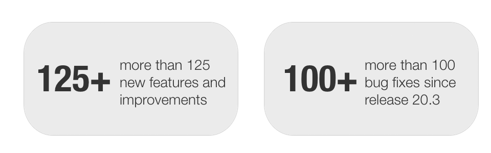
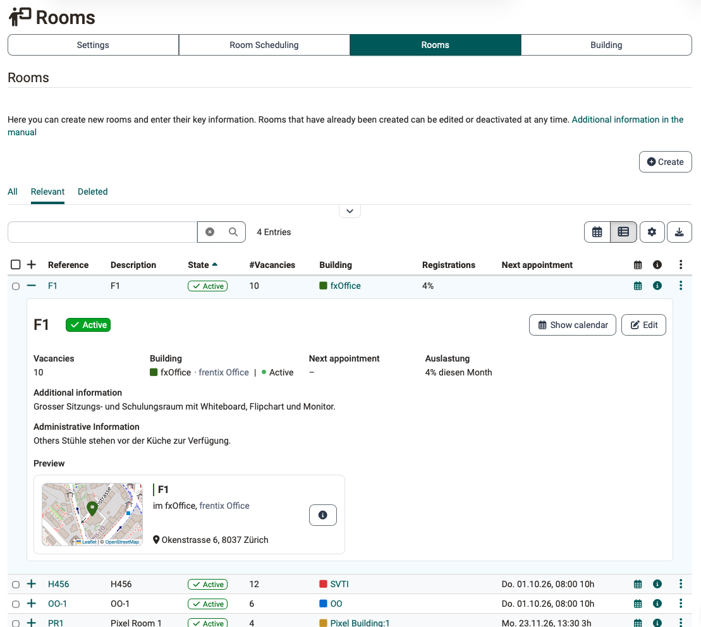
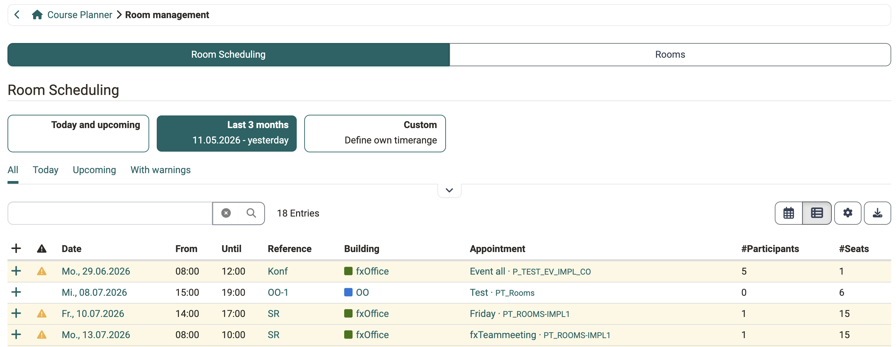
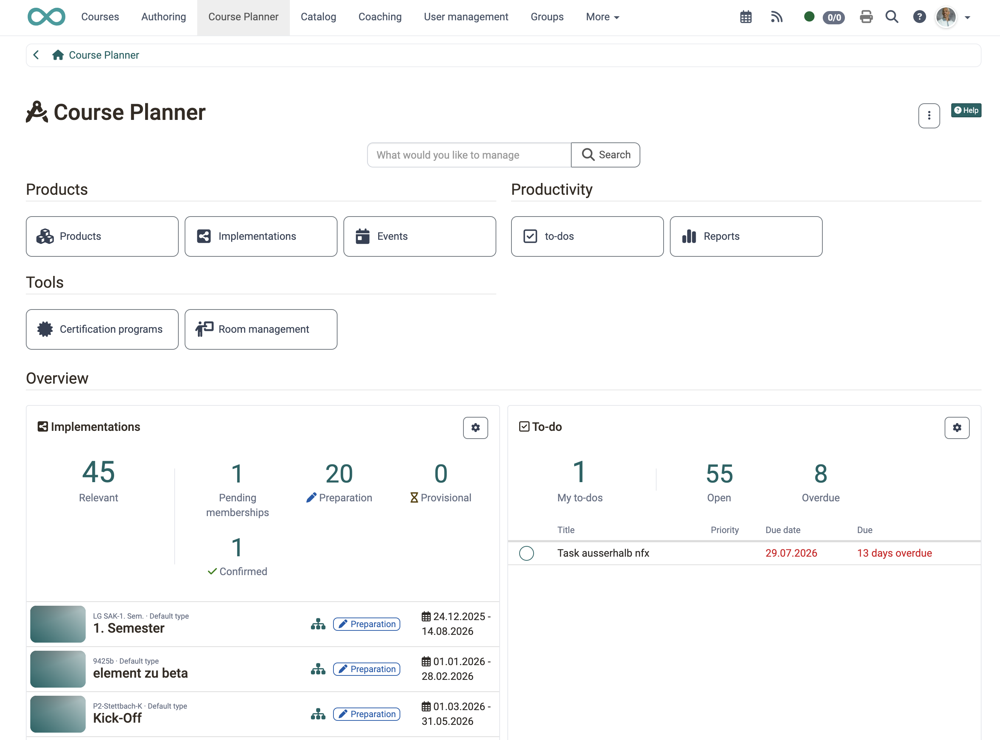
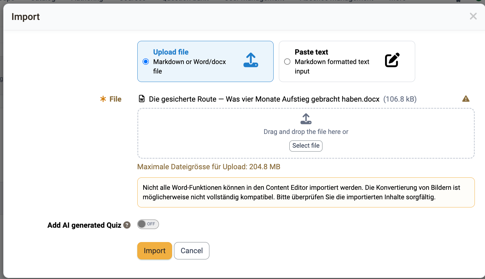
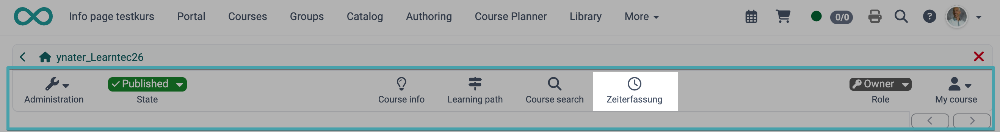
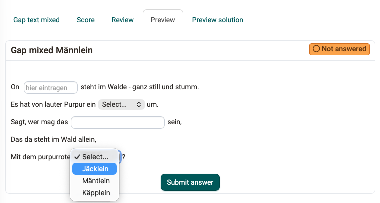
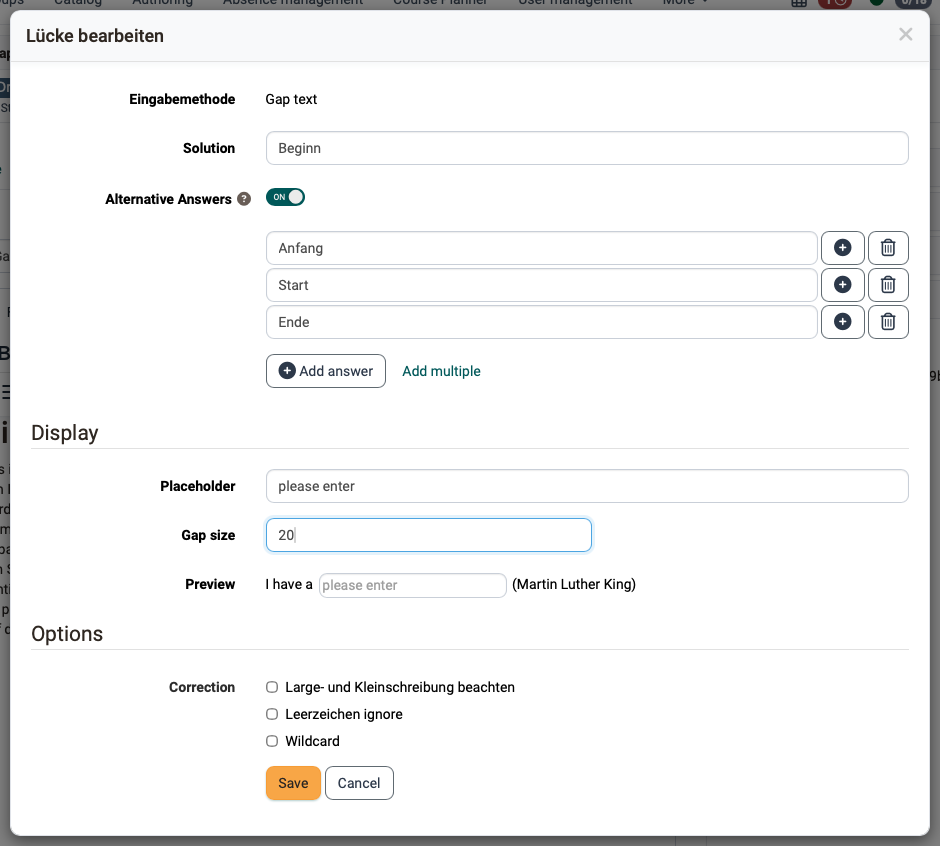

# Release Notes OpenOlat 21.0

* * *

:material-calendar-month-outline: **Release date: 07/16/2026 • Last update: 08/19/2026**

* * *

With OpenOlat 21.0 we are releasing our next major release.

The consistent **separation of learning and coaching** tidies up everyday work: learners stay under "Courses", while people with a coaching function work in the "Coaching" area.

With the new **room management**, rooms become bookable for events and venues are clearly indicated. **Automation** and **to-dos** in the **Course Planner**, as well as the targeted control of **course access** and the **availability of bookings** in the catalog, support the provision and maintenance of the course offering. **External course tools** allow targeted jumps to external systems.

For the **AI features**, the creation of **free-text questions with AI grading** for authors and **formative AI feedback** for learners are added, the **Content Editor** newly imports entire **Word and Markdown files** - this makes preparing content easier. The **AI chatbot "Sophia"** is available in the manual for questions about OpenOlat.

In **e-assessment**, the **"Gap mixed" question type** combines text, numerical and dropdown gaps, and **Safe Exam Browser configuration templates** can be stored for various exam setups.

Besides optional **serial numbers** and a **print version** for **certificates**, the assessment mode, grading assignments report and evidence of achievement have been optimized. For local logins, **two-factor authentication** with a **One Time Code** can be activated.

Since release 20.3, over 125 new features and improvements have been added to OpenOlat. Here you will find the most important innovations summarized. In addition, more than 100 bugs have been fixed. You can find the complete list of changes in 20.3.x [here](Release_notes_20.3.md){:target="_blank"}.

* * *

## Separation of learning and supervising/coaching

Historically, two perspectives were mixed under **«Courses»**: participants access their learning content there - coaches and owners access their courses/learning resources.

With OpenOlat **Release 21.0**, the entry point for learning and supervising/coaching is clearly separated:

* **Participants** move as usual under [**«Courses»**](https://docs.openolat.org/en/manual_user/area_modules/Courses/) to access their learning content.
* **Coaches, course owners** and other roles with a coaching function (e.g. line managers, education managers) now find their courses, learning resources and educational products as well as the people they coach in the [**«Coaching»**](https://docs.openolat.org/en/manual_user/area_modules/Coaching/) area.

### Step-by-step transition

!!! tip "Up to and including Release 20.3.x"

    Instructions ["Step by Step: Switching learning-resource access for coaches"](https://docs.openolat.org/en/release_notes/Release_notes_20.1/#abspaltung-von-kurse)

!!! tip "From Release 21.0.0"

    * [x] Coaching Tool activated automatically (- see `Administration > e-Assessment > Coaching`)
    * [x] Set permissions for the Coaching site under `Administration > Customizing > Sites`
    * [x] Activate additional note in the "Courses" area: `Administration > Modules > Learning resource > Access`

* * *

## New «Rooms» module

With the [**«Rooms»**](https://docs.openolat.org/en/manual_admin/administration/Modules_Rooms/) module, OpenOlat provides its own central **building and room management**.

Venues are maintained with address and additional information such as capacity, and the location can be opened directly in Google Maps / Apple Maps.

{ class="shadow lightbox" title="Room in the room list" }

The rooms can be booked in the Course Planner as well as for events. The automatic overlap detection warns of double bookings. Via an interface, the events and room information can also be shown on external monitors (digital signage).

All bookings including room utilization are clearly summarized and managed in the **Room Scheduling**.

{ class="shadow lightbox" title="Room Scheduling with conflict highlighting" }

* * *

## Course Planner

### Element types with automation

With **element types**, the hierarchical levels of products (e.g. programme > semester > module > course) are defined, and for each type it is determined whether it carries course content, serves as pure structure, or itself forms an implementation with its own period. Additional functions such as absence management, timetable or learning progress are also activated per type.

Via **automation**, courses can, for example, be instantiated from a template or the course status can be set, relative to the implementation start/end or on a status change.

### To-dos in the Course Planner

Around course planning many small tasks arise, which can now be created directly in the Course Planner as **to-dos** for products, implementations and on every element.

A **central overview** consolidates all to-dos across all products, and on the dashboard the **to-do widget** shows the tasks that demand immediate attention.

{ class="shadow lightbox" title="Course Planner dashboard with to-dos" }

### Further improvements

* **[Implementations](https://docs.openolat.org/en/manual_user/area_modules/Course_Planner_Implementations/#tab_settings_assessment):** Direct link to a certification program
* **[Events](https://docs.openolat.org/en/manual_user/area_modules/Course_Planner_Events/#event_elements):** Optimized display for modularized courses with participants from several implementations/classes
* **[Product overview](https://docs.openolat.org/en/manual_user/area_modules/Course_Planner_Products/#product_overview):** Optimized sorting and filters
* **[Member widget](https://docs.openolat.org/en/manual_user/area_modules/Course_Planner_Dashboard/#widget_members):** Optimized display and direct jump to the members area of the implementation
* **[Offer «Invoice»](https://docs.openolat.org/en/manual_user/basic_concepts/Offer_Concepts/#offer_invoice_cancellation):** Optimized configuration of the cancellation conditions

* * *

## Content Editor

### Import Markdown/Word

Prepared learning content in Word or Markdown files previously had to be rebuilt by hand in the **Page**. From Release 21.0, an [**import function**](https://docs.openolat.org/en/manual_user/basic_concepts/Content_Editor/#markdown) is available. Either the **Word and Markdown files** can be imported completely, or their content can be pasted as text in the import dialog. OpenOlat automatically converts the content into the matching blocks - title, text, tables, code, images and more. Referenced images automatically end up in the Media Center.

{ class="shadow lightbox" title="Import Word file in the Page" }

### Table of contents

Navigating in long pages is made easier by the new content element [**«Table of contents»**](https://docs.openolat.org/en/manual_user/basic_concepts/Content_Editor/#table_of_contents). The table lists - either for the whole page or a single chapter - the titles as clickable jump links and takes you directly to the respective section with one click.

Since all title elements are now [**automatically given anchors**](https://docs.openolat.org/en/manual_user/basic_concepts/Content_Editor/#anchors), the jump targets within the page arise entirely on their own.

### Optimized layout deletion

All [layout blocks can now be deleted](https://docs.openolat.org/en/manual_user/basic_concepts/Content_Editor/#delete_layout), including the topmost one. In doing so, you can decide whether the content is also deleted with it or moved into the adjacent layout.

If the last remaining layout is removed, the page automatically receives an empty default layout again.

* * *

## AI features

### Free-text questions with AI grading

In addition to multiple-choice questions, from Release 21.0 **free-text questions with AI grading** can also be generated via the question bank. The prerequisite is that the "Essay Question Generator" and "Essay Grading" features are configured in the AI module. All AI-generated questions in the question bank automatically receive the "Review" status so that they are reviewed for accuracy before use.

For each free-text question, the AI provides a **[«Grading kit»](https://docs.openolat.org/en/manual_user/area_modules/Question_Bank_Create_Questions/#ai_grading)** with criteria for assessing the answer. Besides a model answer, weighted key points, typical misconceptions as well as grading notes, difficulty level and Bloom's level are captured. It can be manually fine-tuned and tested directly against a sample answer.

### Formative AI feedback for learners

Free-text questions with AI grading can be used directly in a **quiz in the** [**Content Editor**](https://docs.openolat.org/en/manual_user/basic_concepts/Content_Editor/). When learners answer such a question, formative feedback on their answer is retrieved under **AI feedback**: "Overall assessment", "What went well", "What is missing" and "Next step" - either as a short summary or as detailed feedback.

The feedback deliberately awards no points but supports self-assessment and invites further work. The prerequisite is the configured "Essay Grading" AI feature.

{ class="shadow lightbox" title="AI feedback for learners on quiz questions" }

### Generate AI questions on import

When building a **Page** by importing a Markdown or Word file, the matching practice questions can be delivered at the same time. The option **«Add AI generated Quiz»** in the import dialog of the **Content Editor** generates the questions in the background from the imported content and appends them as a quiz element at the end of the page. In this way, a text document becomes a course page including a learning check in one step.

{ class="shadow lightbox" title="Generate AI questions for a Page on import" }

### Further AI features

* **Automatic taxonomy assignment:** When generating metadata for images, an embedding model (embeddings) now assigns content to the matching taxonomy level - this saves the manual classification and keeps the subject-matter systematics consistent
* [**AI module usage log**](https://docs.openolat.org/en/manual_admin/administration/External_Tools_AI/#ai_usage_log): records every AI call of the instance and provides administrators with information on which functions are used how often and where token costs arise

### AI chatbot Sophia

[**Sophia**](https://docs.openolat.org/en/manual_user/help/?h=sophia#help_sophia) is an AI chatbot that primarily supports **authors and administrative users** and answers questions about the OpenOlat software in dialog. The **OpenOlat manual** serves as its knowledge base.

Search (RAG) and language model run locally in the fxCloud. Sophia is currently available on **[docs.openolat.org](https://docs.openolat.org)**.

* * *

## Courses and catalog

### Learning path: course grade/level at course level

The conversion of points at course level into a different kind of [level/grade](https://docs.openolat.org/en/manual_user/learningresources/Course_Settings_Assessment/#evaluation_with_grades) already exists in the conventional course. For the learning path course, this option is available from Release 21.0.

If a learning path course is assessed with points, an overall grade at course level can be assigned via the option **«With levels/grading»**. The basis for this is the sum of the points of the assessable course elements - as a sum, weighted sum or average according to the points setting. The selected assessment system for the conversion also determines the **success status** of the learning path course.

### Access after course end

Courses with the status «Finished» can still be opened by participants in **read-only mode** - so past content can, for example, continue to be reviewed later for exam preparation.

If, in certain setups - for example short, directly completed or paid courses - no access at all should be possible after the course ends, this can now be realized via the option [**«No access»**](https://docs.openolat.org/en/manual_user/learningresources/Course_Settings_Options/).

The default value is defined [system-wide](https://docs.openolat.org/en/manual_admin/administration/Modules_Learning_Resource/) and can be overridden in the course if needed.

### Availability of offers

An [**offer in the catalog**](https://docs.openolat.org/en/manual_user/learningresources/Access_configuration/#verfugbarkeit-des-angebots-steuern) is often not meant to be bookable permanently, but to open from a certain date or close in good time before the course starts.

OpenOlat 21.0 offers the possibility, via **custom conditions**, to define in which course or implementation status and in which period (fixed date or relative to the implementation period) an offer is available.

### External course tools

OpenOlat 21.0 supports jumping from within the course **to external services** such as a school portal or the timetable tool. With the [**external course tools**](https://docs.openolat.org/en/manual_user/learningresources/Course_Settings_Toolbar/#external_tools), up to four custom targets can be integrated centrally into the course toolbar and displayed on a role basis. This way the school portal is visible to learners, while the administration tool only appears for coaches.

{ class="shadow lightbox" title="Jump to an external tool from the course toolbar" }

### Further improvements

* **Course lifecycle:** Saved changes to the lifecycle settings take effect immediately; via **«Stop process»** the current run can be halted immediately.
* **[Catalog launcher](https://docs.openolat.org/en/manual_admin/administration/Modules_Catalog_2.0/):** For precise control of which section of the catalog a launcher shows, the launcher type "Taxonomy level" lets you specifically choose whether it refers to an entire taxonomy or to a specific taxonomy level

* * *

## e-Assessment and testing

### «Gap mixed» question type

Previously, gap texts were either of type "Text", "Numerical" or "Dropdown". In the new **«Gap mixed»** question type, text, numerical and dropdown gaps can be built together into the same running text of a single question. Through the combination of structured selection (e.g. for technical terms) and free formulation (e.g. for justifications), more complex tasks are thus possible.

{ class="shadow lightbox" title="«Gap mixed» question type" }

A **conversion** of existing gap-text questions with combined text and number gaps into the new "Gap mixed" type is possible.

This goes along with the **revision of the dialog** for creating and editing gap texts with an integrated preview.

In addition, two new correction options ensure that correct answers do not fail on formalities:

* **Ignore spaces**: Additional spaces, tabs and line breaks no longer lead to a devaluation
* **Wildcard**: The character `*` stands in the solution for "something or nothing" and can also be used in answer variants; a `'*'`, on the other hand, is treated as a normal character.

{ class="shadow lightbox" title="Gap-text editor" }

### Assessment mode

For better user guidance, the configuration dialog as well as the workflow when creating an assessment mode have been revised.

### Safe Exam Browser

Besides the classic **form** template maintained in OpenOlat with the basic options, a complete, unencrypted **`.seb` configuration file** can now be **imported**. OpenOlat reads in the configuration, displays it read-only and calculates the config key automatically - so the full range of functions of the Safe Exam Browser can be used.

In addition, the **minimum version of the Safe Exam Browser** can be defined system-wide - separately for Windows, Mac and iOS.

### Grading assignments: logging and report

The exportable report on grading assignments has been extended by an additional "Archive" sheet. This lists **archived grading assignments** whose record has since been removed - for example because the exam participant, the corrector or the test learning resource was deleted - each with grading time and completion date. Relevant data for the remuneration and billing of the external correctors is thus retained when the original assignments no longer exist.

The **report on the correction workflow** has been optimized and extended: it is now also possible to export **only the completed assignments**, and the report contains information on status, due date and missed deadlines.

### Evidence of achievement

In the overview of the evidence of achievement - [personal menu](https://docs.openolat.org/en/manual_user/personal_menu/) and [user management](https://docs.openolat.org/en/manual_admin/usermanagement/Configure_User/) - further information is available:

* **Assessment:** Shows the grade achieved when the levels/grading module is active
* **Reference:** Shows the reference of the respective course

In addition, an individual **evidence of achievement can be deleted** in user management. If the person is still a participant of the course, the evidence of achievement is automatically recreated; if they are no longer in the course, it is permanently removed.

* * *

## Certificates

### Serial number and print version

Audit-proof and practical certificates can be issued with OpenOlat 21.0.

With the option **«With [serial number](https://docs.openolat.org/en/manual_user/area_modules/Course_Planner_Certification_Programs/)»**, every certificate generated via the certification program automatically receives a sequential, human-readable serial number. The format is defined via variables.

The serial number is assigned anew on each issuance - including a recertification - appears on the certificate and in the PDF file name, and is shown in the certificate overview.

The option **«With [print version](https://docs.openolat.org/en/manual_user/learningresources/Course_Settings_Assessment_Certificate/#print_template)»** activates an additional template for pre-printed paper - for example with an already printed background, logo or embossing. It contains only the variable content without graphic elements and can be exported by course owners and authorized coaches in addition to the standard certificate.

### New certificate template

The integrated standard **[certificate template](https://docs.openolat.org/en/manual_admin/administration/e-Assessment_Certificates/)** has been completely replaced, is deliberately kept simple and is now **HTML-based**. HTML [templates](https://docs.openolat.org/en/manual_user/learningresources/Course_Settings_Assessment_Certificate/#certificate_template) are the recommended variant from Release 21.0, as they are more flexible to design and work with the certificate variables with a `$` prefix. Classic PDF forms still work, but should only be used if the Gotenberg PDF service is not installed.

* * *

## Access and security

### Two-factor authentication with One Time Code

For local logins, sign-in can now be secured with a second factor. With the [**One Time Code**](https://docs.openolat.org/en/manual_user/login_registration/One_Time_Code/) option activated, account holders receive an 8-digit confirmation code by email after entering their username and password, and complete the sign-in on a validation page with it. The code is valid only for the current login.

The procedure complements Passkey: if Passkey is additionally activated, a stored passkey takes over the second factor, while the One Time Code serves as a fallback for accounts without a passkey.

The prerequisite is a valid email address on the account as well as a functionally configured email dispatch.

* * *

## Other, in brief

* **UX, usability, accessibility**: Optimizations of checkbox buttons, object selector, button styling as well as in the area of accessibility
* **Mediasite integration via LTI 1.3:** The [Mediasite module](https://docs.openolat.org/en/manual_user/learningresources/Course_Element_Mediasite/) can now be connected to the Mediasite server via either LTI 1.1 or LTI 1.3
* **JupyterHub** When configuring the [JupyterHub course element](https://docs.openolat.org/en/manual_user/learningresources/Course_Element_JupyterHub/), only active hubs are available; for an already configured but inactive hub, a warning points out that it no longer works - so courses do not unnoticeably run into nothing
* **Recruiting module Selectus:** The frentix Selectus software has been integrated as a separate OpenOlat module and, after the integration phase is complete, will in future be available for committee-based selection procedures, applications for professorships/scholarships, for calls and competitions as well as awards by foundations

* * *

## Administrative / Technical

* **Certificates:** HTML templates recommended
* **Catalog 2.0** is enabled by default for new installations
* Secure delivery of unsafe content via a second domain (`olat.properties key: server.content.domainname`) using **iFrame sandboxing** for SCORM, HTML page and all content delivered in iFrames
* Update of third-party libraries

* * *

## System administrators: Activate / configure new features

!!! note "Checklist after updating to 21.0"

    The following features have to be activated or configured in the `Administration` after an update to Release 21.0:

    * [x] Coaching module mandatory: `e-Assessment > Coaching`
    * [x] Note that the "Courses" area is accessible only to participants: `Modules > Learning resource > "Access" tab > Access`
    * [x] Participant access to finished learning resources: `Modules > Learning resource > "Access" tab > Status "Finished"`
    * [x] (De)activation of the [«Rooms» module](https://docs.openolat.org/en/manual_admin/administration/Modules_Rooms/): `Modules > Rooms`
    * [x] Set up element types and automation in the [Course Planner](https://docs.openolat.org/en/manual_admin/administration/Modules_Course_Planner/): `Modules > Course Planner > Element types tab`
    * [x] Configure [AI features](https://docs.openolat.org/en/manual_admin/administration/External_Tools_AI/): `External tools > AI module`
    * [x] Minimum version Safe Exam Browser: e-Assessment > [Assessment management](https://docs.openolat.org/en/manual_admin/administration/e-Assessment_AssessmentMgmt/#tab_seb_versions) > Safe Exam Browser versions
    * [x] Activate [One Time Code](https://docs.openolat.org/en/manual_admin/administration/Login_Password_and_Authentication/) (2FA): `Login > Password and authentication > Authentication tab`
    * [x] Set up a second domain for unsafe content: `olat.properties key > server.content.domainname`

* * *

## Further information

* [YouTrack Release notes 21.0.2](https://track.frentix.com/releaseNotes/OO?q=fix%20version:%2021.0.2&title=Release%20Notes%2021.0.2){:target="_blank"}
* [YouTrack Release notes 21.0.1](https://track.frentix.com/releaseNotes/OO?q=fix%20version:%2021.0.1&title=Release%20Notes%2021.0.1){:target="_blank"}
* [YouTrack Release notes 21.0.0](https://track.frentix.com/releaseNotes/OO?q=fix%20version:%2021.0.0&title=Release%20Notes%2021.0.0){:target="_blank"}
